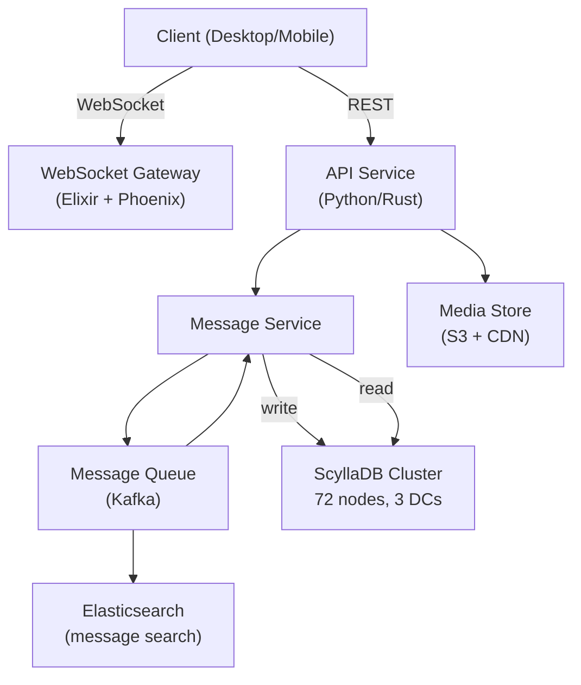

# Discord: Storing Billions of Messages

> **Source**: [How Discord Stores Billions of Messages](https://discord.com/blog/how-discord-stores-billions-of-messages) (2017) + [Cassandra to ScyllaDB migration](https://discord.com/blog/how-discord-stores-trillions-of-messages) (2023)  
> **Scale**: 4B messages/day → 1T+ total messages stored → 2.5M concurrent voice users

---

## Problem & Scale

Discord is a real-time messaging platform. Messages are the core product. By 2017:
- **100M messages/day** being stored and read
- **20M active daily users**
- **P99 read latency** spiking to 500ms on old infrastructure
- Message history viewed by users weeks or months after they were sent — **read pattern is not just recent messages**

By 2023:
- **1 trillion+ messages** stored
- **4 billion messages/day** arriving
- Per-channel message loads growing as Discord's largest servers hit millions of members

---

## Evolution

### Phase 1: MongoDB (2015–2017)
Discord started with a single MongoDB replica set. By mid-2015 they outgrew it.

**What broke**:
- MongoDB stored messages as documents; all data eventually hot in RAM — as message volume grew, the working set exceeded memory and performance fell off a cliff
- Index loading on startup caused availability blips
- Compaction (WiredTiger) caused latency spikes during writes

### Phase 2: Cassandra (2017–2022)

**Why Cassandra**:
- Leaderless: no single point of failure
- Writes are fast (append to commit log + memtable) — Discord is write-heavy
- Time-series reads by channel match Cassandra's clustering column design
- Linear horizontal scale: add nodes, increase throughput

**Schema design (the critical decision)**:

```sql
CREATE TABLE messages (
  channel_id   bigint,
  bucket       int,      -- time-bucket: floor(message_epoch_ms / 10_days_ms)
  message_id   bigint,   -- Snowflake ID: timestamp + worker + sequence
  author_id    bigint,
  content      text,
  PRIMARY KEY ((channel_id, bucket), message_id)
) WITH CLUSTERING ORDER BY (message_id DESC);
```

**Why buckets?**  
Without bucketing, a single channel partition could accumulate billions of rows over years, causing:
- Unbounded partition growth (Cassandra has a 2B rows/partition limit)
- Compaction pressure proportional to partition size
- Tombstone accumulation from deleted messages causing read amplification

Buckets cap each partition to ~10 days of messages per channel, bounding partition size to a predictable range.

**Snowflake ID anatomy** (64-bit):
```
[ 41 bits: millisecond timestamp ] [ 10 bits: worker ID ] [ 12 bits: sequence ]
```
- Monotonically increasing within a worker — naturally sorted by time
- Decentralized generation — no coordination between ID generators
- Timestamp embedded — bucket computation `floor(snowflake_to_ms(id) / BUCKET_MS)` is O(1)

### Phase 3: ScyllaDB (2022–present)

**Why migrate from Cassandra to ScyllaDB?**

| Dimension | Cassandra | ScyllaDB |
|-----------|-----------|---------|
| Runtime | JVM (Java) | C++ (no JVM) |
| GC pauses | Yes — unpredictable stop-the-world | No GC — uses Rust-style ownership internally |
| CPU utilization | ~20% on Discord's nodes | ~80% (shard-per-core model) |
| Nodes required | 177 | 72 (60% reduction) |
| P99 latency | Spiky during GC | Consistent |
| Compaction | Global compaction queue | Per-shard compaction — no shared state |

ScyllaDB uses a **shard-per-core** architecture. Each CPU core owns a subset of the token range and processes requests independently — no cross-core locking for most operations.

**Migration strategy** (zero-downtime):
1. Dual-write: write to both Cassandra and ScyllaDB
2. Backfill: migrate historical data in large range scans
3. Read shadow: route 1% of reads to ScyllaDB, compare results
4. Flip: route 100% of reads to ScyllaDB
5. Drain: stop writes to Cassandra, decommission

---

## Architecture Deep-Dive



**Read path** for loading channel history:
1. Client requests `GET /channels/{id}/messages?before={snowflake_id}&limit=50`
2. API computes `bucket = floor(snowflake_to_ms(before_id) / BUCKET_MS)`
3. Query: `SELECT * FROM messages WHERE channel_id=? AND bucket=? AND message_id < ? LIMIT 50 ORDER BY message_id DESC`
4. If result count < 50 and `bucket > min_bucket`, decrement bucket and repeat (pagination across buckets)

**Write path**:
1. Client sends message over WebSocket
2. Gateway validates, assigns Snowflake ID
3. Async write to Kafka → Message Service → ScyllaDB
4. Fanout: push to all connected WebSocket sessions in the channel (Elixir PubSub)

---

## Key Trade-offs

| Decision | Alternative Considered | Why Discord's Choice Won |
|----------|----------------------|--------------------------|
| Cassandra (leaderless) over MySQL sharding | MySQL + Vitess | MySQL: SPOF per shard, schema migrations are painful at 100+ shards |
| Snowflake IDs over UUID v4 | UUID v4 | UUID v4 is random → no time sort → full table scans for time-range queries |
| Bucket partitioning over single partition per channel | One partition per channel | Unbounded partition growth → compaction amplification → latency degradation |
| ScyllaDB over staying on Cassandra | Cassandra upgrade | JVM GC was root cause of P99 latency spikes; C++ eliminates this |
| Dual-write migration over big-bang | Big-bang cutover | Dual-write gives rollback option; shadow reads verify correctness before cutover |

---

## Failure Modes

| Failure | Impact | Mitigation |
|---------|--------|-----------|
| ScyllaDB node dies | Replication factor=3: 1 node loss has zero data loss | Gossip detects failure; hinted handoff queues writes; repair restores replica |
| Network partition between DCs | Writes to majority DC succeed; minority DC temporarily inconsistent | Quorum writes (LOCAL_QUORUM); reads from local DC |
| Bucket query spans 2+ buckets | 2× round trips for pagination | Client-side watermarking; most history loads are recent (1 bucket) |
| Tombstone accumulation from deletes | Read amplification: scanner must skip tombstones | TWCS (Time-Window Compaction Strategy) — evicts old SSTables wholesale; GC_GRACE set to 10 days |
| Hot channel (millions of members) | All writes go to same partition key | Bucket bounds the row count; ScyllaDB shard-per-core handles hot partition better than Cassandra |

---

## FAANG Interview Angle

**"Design a messaging system like Discord"** — apply these lessons:

1. **ID strategy is a schema decision**: Snowflake IDs let you derive bucket, shard, and time range without secondary indexes. State this explicitly.

2. **Partition design drives everything**: Before picking a database, define your access patterns. Discord's pattern is "load N messages in channel C before time T" — that maps directly to `(channel_id, bucket)` as partition key.

3. **Leaderless for write-heavy**: Discord doesn't need linearizable writes — message ordering is by timestamp, and they tolerate brief replication lag. Cassandra/ScyllaDB's eventual consistency is the right trade-off.

4. **Migration is a first-class concern**: Dual-write + shadow reads is the industry-standard pattern. Expect the interviewer to ask "how do you migrate without downtime?"

5. **CAP position**: Discord chose AP (Availability + Partition Tolerance). A message appearing slightly out of order or a brief read inconsistency is acceptable. Losing availability (can't send messages) is not.

### Follow-up questions an interviewer will ask:

- "How do you handle message deletion? Tombstones in Cassandra are expensive." → TWCS + GC grace period; soft deletes for user-visible delete
- "How do you implement message search?" → Elasticsearch, async-indexed from Kafka; not from Cassandra (no full-text index)
- "How do you handle the largest Discord servers (1M+ members) where a single hot channel gets millions of writes?" → Cassandra handles via consistent hashing; ScyllaDB shard-per-core reduces hot partition contention; rate limiting at gateway layer
- "What if a Snowflake ID worker goes down and restarts with the same worker ID?" → Sequence resets but timestamp advances; brief gap in IDs is acceptable; two workers don't share IDs because worker ID is in the machine config
