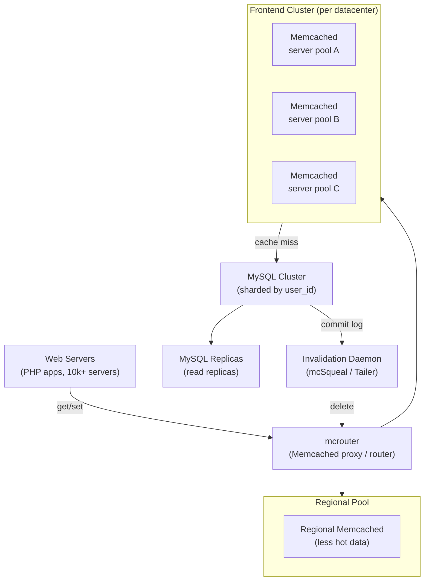

# Meta: Scaling Memcached for 2 Billion Users

> **Source**: [Scaling Memcache at Facebook (NSDI 2013)](https://www.usenix.org/system/files/conference/nsdi13/nsdi13-final170_update.pdf)  
> **Scale**: 2B+ users · billions of reads/day · single largest Memcached deployment in the world

---

## Problem & Scale

Facebook's core data model is a social graph: users, posts, likes, comments, friend relationships. The access pattern is:
- **Read-heavy**: 100:1 read-to-write ratio — users scroll the feed far more than they post
- **Fan-out reads**: rendering a news feed page requires 100–1000 independent data lookups (friend list, post data, reactions, ad data, etc.)
- **Heterogeneous data**: MySQL stores the authoritative record; Memcached serves as the read-through cache

By 2013, Facebook ran **thousands of Memcached servers** across multiple datacenters. The paper documents the engineering decisions that made this work.

---

## Architecture Overview

---

## Key Engineering Decisions

### 1. Look-Aside Caching (Not Write-Through)

Facebook uses **look-aside** (lazy loading), not write-through:
- On **read**: check cache → if miss, read from MySQL → populate cache → return
- On **write**: write to MySQL → **delete** (not update) cache key

**Why delete on write, not update?**

If you update the cache on write, you have a race condition:
1. Client A writes new value to MySQL → updates cache with v2
2. Client B (concurrent) reads stale v1 from MySQL (replication lag) → overwrites cache with v1
3. Cache now has stale v1, will persist until next write

Deleting forces the next read to go to MySQL, which by then has the committed write. The cost: one extra MySQL read per write per key. The benefit: no stale cache writes.

### 2. Thundering Herd: The Lease Mechanism

**Problem**: When a popular key expires (or is deleted), thousands of simultaneous requests all miss and simultaneously read from MySQL. This is the thundering herd.

**Naive solution**: read-through by every client — all 1000 concurrent requests hit MySQL simultaneously. MySQL's connection pool saturates.

**Facebook's solution: leases**

When a client encounters a cache miss, it requests a **lease** from Memcached:
- If no lease exists: Memcached grants the lease (a unique token) and returns a cache miss
- If a lease exists (another client is filling): Memcached returns "wait" — client polls with exponential backoff
- Lease holder fetches from MySQL, writes to cache with the lease token, releases lease
- Waiting clients get the populated value from cache

This serializes the MySQL read for a hot key to exactly one request per expiration.

**Lease also solves stale sets**: when a delete races with an in-flight read, the stale read's lease token is invalidated. The stale value is never written.

### 3. mcrouter: The Routing Proxy

Running thousands of Memcached servers means web servers must know which server to route each key to (consistent hashing). Originally, web servers ran the Memcached client library directly. This caused:
- Open connections from every web server to every Memcached server: 10,000 web × 1,000 Memcached = 10M connections
- Connection exhaustion on Memcached servers
- Fat client library that had to be updated across 10k web servers for routing changes

**mcrouter**: a Memcached proxy running on each web server host.
- Web server connects to **localhost:mcrouter** only (1 connection)
- mcrouter handles the fan-out, routing, failover, and load balancing
- Deployment: deploy mcrouter changes without touching web server code

mcrouter provides:
- **Routing**: consistent hashing to Memcached servers
- **Failover**: if a Memcached server is unreachable, route to a fallback pool
- **Cold cluster warmup**: when adding a new Memcached cluster, mcrouter routes cache misses to the "warm" cluster instead of MySQL
- **Shadowing**: duplicate traffic to a shadow cluster for capacity testing

### 4. Regional Pools and Replication

Facebook organizes servers into **frontend clusters** (fast, hot data) and a **regional pool** (larger, colder data).

Why two tiers?
- Not all data is equally hot. Popular posts are accessed by millions. Obscure user profile fields by 10 people.
- Hot data: replicate across frontend clusters for low latency
- Cold data: single regional pool — no replication needed; cache miss goes to regional pool, not MySQL

**Replication decision**: when to replicate a key across clusters vs. keep it in one pool?
- If expected request rate × replication cost < MySQL query cost → replicate
- Facebook found that keeping hot items in 2–3 frontend clusters vs. 1 regional pool saved significant MySQL load for viral content

### 5. Invalidation via MySQL Replication Stream

When a user updates a post, the old cache entry must be invalidated. Two approaches:

**Option A**: Application sends delete to Memcached after MySQL write
- Problem: race condition — delete can arrive before write is committed; read fills stale value back

**Option B**: Tail the MySQL binlog (replication stream), derive cache deletes
- Facebook's **mcSqueal** (later called the Invalidation Daemon) tails MySQL commit log
- For each committed write, derive which cache keys are affected → issue deletes to Memcached
- Guarantee: invalidation happens _after_ the MySQL write is durable

This is stronger than application-level invalidation: the cache is only invalidated after the write is committed and replicated.

---

## Multi-Datacenter Consistency

Facebook runs across **multiple geographically distributed datacenters**. Each has its own Memcached cluster. The challenge: after a write in DC-West, how does DC-East know to invalidate its cache?

**Problem**: cross-DC invalidation via mcSqueal tails the replication stream from the primary MySQL DC. There is replication lag (~50–100ms). During lag:
- DC-East may serve stale data from cache
- A user in DC-East who just wrote their profile might see the old version

**Solution**: **remote marker** mechanism
1. On write, application sets a special marker key in the local (DC-East) Memcached
2. Reads check for the marker — if present, skip cache and read from primary MySQL (DC-West)
3. When the replication lag resolves and DC-East's MySQL is updated, the marker expires
4. Reads can now use the local cache again

This provides a **read-your-own-writes** guarantee with minimal overhead: only the writing user's reads hit cross-DC MySQL during the lag window.

---

## Key Trade-offs

| Decision | Alternative | Reasoning |
|----------|-------------|-----------|
| Delete on write (invalidate) | Update cache on write | Update causes write-write races under replication lag; delete is idempotent and safe |
| Lease mechanism | TTL expiry only | TTL doesn't prevent thundering herd; leases serialize cold-start reads |
| mcrouter proxy | Fat client library | Fat client: 10M connections; client update requires web server deploy; proxy centralizes routing |
| Binlog-driven invalidation | App-driven invalidation | App invalidation races with MySQL commit; binlog invalidation is post-commit — stronger consistency |
| Two-tier (frontend + regional) | Single pool | Single pool: hot data competes with cold data; hot data evicts cold; two tiers let hot data replicate independently |

---

## Numbers to Know

| Metric | Value |
|--------|-------|
| Memcached servers | Thousands (exact number not published) |
| Cache hit rate | >99% (stated goal) |
| Lease wait timeout | ~10ms before retry |
| Read:write ratio | ~100:1 |
| Cold cluster warm-up time | Hours (mcrouter routes misses to warm cluster during warmup) |
| Cross-DC replication lag | ~50–100ms (MySQL async replication) |

---

## FAANG Interview Angle

**"Design a distributed caching system for Facebook's social graph"** — apply these lessons:

1. **Cache invalidation is harder than caching**: The three hardest problems in distributed systems. Know delete-on-write (invalidate) vs. update-on-write, and why invalidate wins when there is replication lag.

2. **Thundering herd is a real production problem**: Don't hand-wave it. Describe leases, or alternatively: probabilistic early expiration (compute TTL as `TTL * random(0.8, 1.0)` to stagger expiry), or single-flight (deduplicate in-flight requests in the application layer).

3. **Proxy as a multiplexer**: Connection count = web_servers × cache_servers without a proxy. With a proxy, it's web_servers + cache_servers. At scale, this is the difference between 10M connections and 11K.

4. **Multi-DC is a consistency challenge**: No claim of strong consistency across datacenters — that requires synchronous replication and prohibitive latency. Facebook chose eventual consistency with the remote marker trick for read-your-own-writes.

5. **Binlog as a reliable invalidation source**: If you're invalidating a cache from database writes, tail the commit log — not the application code. The commit log is the authoritative source of mutations.

### Follow-up questions an interviewer will ask:

- "What if a Memcached server goes down? Do users see database load spike?" → Hot failover: mcrouter has a failover pool. Memcached is stateless (data is derived from MySQL); any replacement server starts cold but warms up quickly via the lease mechanism.
- "How do you handle the celebrity problem — Barack Obama's profile update invalidating cache for 200M readers?" → Invalidation is cheap (one delete per affected key). The thundering herd on the next read is handled by leases. At extreme scale, replicate celebrity data to more frontend clusters.
- "Your cache stores user data — how do you handle GDPR delete requests?" → User deletion triggers explicit cache invalidation through the same mcSqueal pipeline; delete propagates to all clusters. Confirm via audit log that all cache entries for the user ID are evicted.
- "How do you size the Memcached fleet?" → Working set estimation: distinct objects accessed per day × average object size × safety factor (3×). Monitor hit rate; if hit rate drops below threshold, add capacity.
