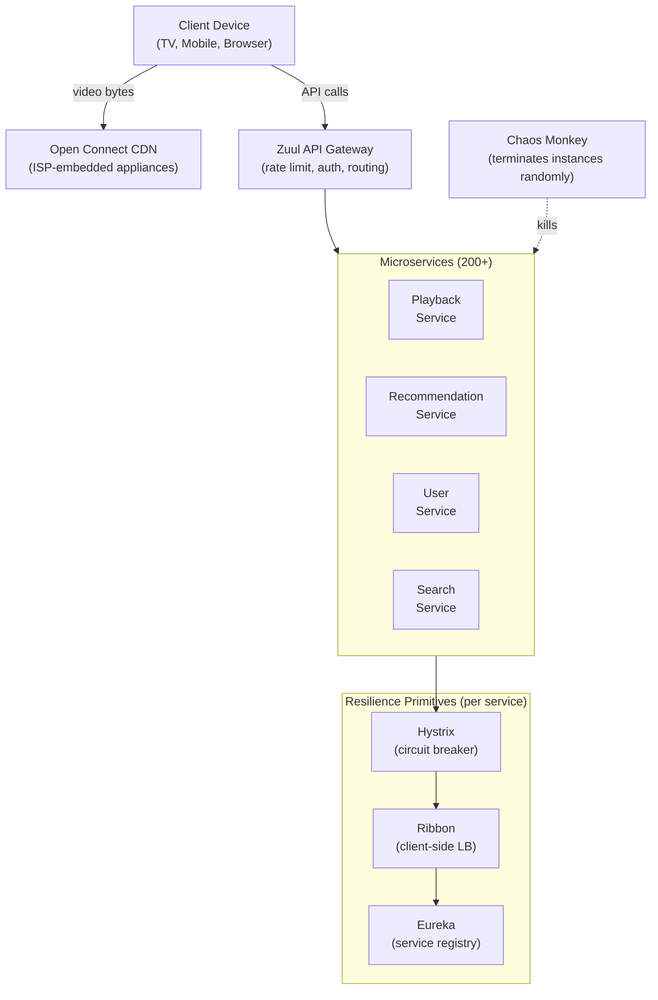

# Netflix: Chaos Engineering & Microservices Resilience

> **Source**: [Netflix Simian Army](https://netflixtechblog.com/the-netflix-simian-army-16e57fbab116) · [Hystrix](https://github.com/Netflix/Hystrix/wiki/How-it-Works) · [Chaos Engineering (O'Reilly book, Netflix authors)](https://www.oreilly.com/library/view/chaos-engineering/9781491988459/)  
> **Scale**: 250M+ subscribers · 200+ microservices · 40%+ of US internet traffic at peak

---

## Problem & Scale

In 2008, Netflix suffered a **3-day database corruption** that prevented DVD shipments. This event fundamentally changed how they thought about reliability. When they migrated to AWS microservices starting in 2009, they faced a harder problem: **how do you build confidence in a system with 200+ services, each a potential failure point, running on hardware that will fail?**

The naive answer — "write good code and test it" — is insufficient. At Netflix's scale:
- Any single EC2 instance has a ~0.1% probability of failing on any given day
- With 10,000 instances, that's ~10 failures per day — reliability must be systemic, not accidental
- Load tests don't capture cascading failures between services
- The behavior of the system under failure is only observable in production

**Their insight**: _if you want your system to be resilient to random failures, you must introduce random failures deliberately and continuously, forcing engineers to build systems that survive them._

---

## The Simian Army

Netflix built a family of tools they called the **Simian Army** — automated processes that inject faults into their production environment.

| Tool | What It Does | What It Tests |
|------|-------------|---------------|
| **Chaos Monkey** | Randomly terminates EC2 instances in production during business hours | Service restarts gracefully; clients retry and fail over |
| **Chaos Gorilla** | Simulates an entire AWS Availability Zone going down | Services degrade gracefully; traffic reroutes to other AZs |
| **Chaos Kong** | Simulates an entire AWS Region going down | Regional failover; cross-region replication correctness |
| **Latency Monkey** | Artificially delays service responses | Downstream services have timeouts; don't wait forever |
| **Doctor Monkey** | Checks instance health metrics; removes unhealthy instances | Self-healing: unhealthy instances removed before they cascade |
| **Janitor Monkey** | Finds unused cloud resources and removes them | Cost and operational hygiene; stale services don't accumulate |
| **Security Monkey** | Finds security policy violations (open S3 buckets, bad IAM) | Continuous security posture |
| **Conformity Monkey** | Ensures instances conform to deployment standards | Config drift detection |

**Business hours only (initially)**: Chaos Monkey ran only between 9am–3pm Pacific so engineers were online when something broke. The discipline: engineers must be home before Chaos Monkey stops running.

---

## Hystrix: Circuit Breaker at Scale

Chaos testing reveals that services must handle dependency failures. Netflix built **Hystrix**, a library implementing the circuit breaker pattern for inter-service calls.

### Circuit Breaker States

```
         [closed: requests pass through]
              |              ↑
    failures exceed threshold | success rate recovers
              ↓              |
         [open: requests fail fast]
              |
    half-open probe after timeout
              ↓
    [half-open: 1 probe request]
         /        \
    success      failure
       ↓             ↓
   [closed]       [open again]
```

### Hystrix Execution Flow

```
Request arrives
    │
    ▼
Is circuit open? ──YES──→ execute fallback (cached response, default, empty)
    │
    NO
    ▼
Execute in thread pool (isolated per dependency)
    │
    ├─ Timeout? → fallback + record failure
    ├─ Exception? → fallback + record failure  
    └─ Success → record success
    │
    ▼
Update rolling window stats (sliding window over 10s)
    │
    ▼
Error rate > 50% in window? → open circuit
```

### Key Design Decisions

**Thread pool isolation** (bulkhead pattern): Each downstream dependency gets its own thread pool. If the `RecommendationService` thread pool is saturated, it does not starve threads that call `PlaybackService`. Without this, a slow dependency cascades to block all requests.

```
[API Handler Thread] → Hystrix Command → [Recommendations thread pool: 10 threads]
                                       → [Playback thread pool: 20 threads]
                                       → [UserService thread pool: 15 threads]
```

**Fallback hierarchy**:
1. Cache: return last-known-good response from Redis
2. Stub: return a default (empty recommendations → top 10 globally popular)
3. Fail-fast: return error to client (last resort)

**Metrics visibility**: All Hystrix commands publish metrics to a rolling window. Netflix built the **Hystrix Dashboard** — a real-time view of every circuit across all services. Color: green = closed, yellow = degraded, red = open.

---

## Architecture: Resilience Layers



**Key**: Resilience is not in the gateway — it is **inside every service**. Each service calls dependencies through Hystrix. Zuul provides edge-level rate limiting and auth, not cascading failure protection.

---

## The Playback Start Experiment

Netflix ran an experiment: what happens if the `BookmarkService` (tracks where you were in a video) returns errors?

**Without Hystrix**: the `PlaybackService` threads pile up waiting for `BookmarkService`; thread pool exhaustion causes `PlaybackService` to fail; clients can't start any video.

**With Hystrix**: `BookmarkService` circuit opens; `PlaybackService` falls back to "start from beginning" for all users; playback continues. 80% of users don't notice (they're starting a new video). 20% have to re-seek — annoying but acceptable vs. complete outage.

This is the **principal engineer mindset**: not "how do I prevent all failures" but "what is the graceful degradation when each component fails?"

---

## Key Trade-offs

| Decision | Alternative | Netflix's Reasoning |
|----------|-------------|---------------------|
| Chaos in production | Chaos only in staging | Staging doesn't replicate production traffic patterns, service interactions, or data volumes. Failures in production are the only ground truth. |
| Thread pool per dependency | Shared thread pool | Shared pool: one slow dependency starves all others (cascading). Per-pool: each dependency has bounded blast radius. |
| Fail-fast (circuit breaker) over retry | Unlimited retries | Retries amplify load on a failing service ("retry storm"). Circuit breaker gives the downstream service recovery time. |
| Business hours Chaos Monkey | 24/7 chaos | Engineers must be present to learn from failures. Running chaos overnight without response turns incidents into outages. |
| Client-side load balancing (Ribbon) | Server-side LB | Eliminates LB as a single point of failure; each service knows the health of its dependencies via Eureka heartbeats. |

---

## Failure Modes and Handling

| Failure | Without Resilience | With Resilience |
|---------|-------------------|-----------------|
| One EC2 instance dies | Traffic drops by 1/N; client sees errors until LB health check removes it | Ribbon detects via Eureka; routes around; Chaos Monkey has proven this works |
| Recommendation service slow | API handler threads pile up waiting; entire API becomes slow | Hystrix timeout kicks in at 200ms; fallback returns popular titles; API stays responsive |
| AZ failure (Chaos Gorilla) | All instances in AZ go away simultaneously; if multi-AZ not tested, cascades | Pre-tested by Gorilla; Route 53 health checks reroute; stateless services come back; stateful caches warm from DB |
| Region failure (Chaos Kong) | Complete regional outage | Active-active multi-region (US-East, EU-West, AP-Southeast); DNS failover; data replicated cross-region |
| Database corruption (original 2008 incident) | 3-day outage, manual recovery | Cassandra (no single master to corrupt); continuous backups; point-in-time restore |

---

## FAANG Interview Angle

**"How do you design a resilient microservices system at Netflix scale?"** — apply these lessons:

1. **Name the failure modes explicitly**: For every component, ask "what happens when this dies?" Don't just say "we have circuit breakers" — describe the fallback behavior and acceptable degradation.

2. **Bulkhead pattern is mandatory**: Thread pool or connection pool isolation per downstream dependency. One leaky service should not sink the ship.

3. **Chaos engineering as organizational discipline**: At principal engineer scope, this is a cultural and process answer, not just a technical one. You must build the testing infrastructure, the runbooks, and the on-call culture.

4. **Timeouts everywhere**: Every network call must have a timeout. Without it, a single slow dependency can deadlock every thread in your service.

5. **Fallback gracefully, degrade predictably**: Define the acceptable degradation for every critical path. "What is the Netflix experience without recommendations?" → show top 10 popular titles. That answer must be designed in advance, not improvised.

### Follow-up questions an interviewer will ask:

- "Doesn't Chaos Monkey in production violate SLAs?" → Netflix accepts that chaos-induced incidents are offset by the resilience built. The alternative (no chaos) means real incidents have worse MTTR because the system was never battle-tested.
- "How do you prevent teams from disabling Chaos Monkey for their services?" → Engineering culture + leadership mandate + error budget (SRE-style): if your error budget is consumed, you lose feature velocity until reliability is restored.
- "Circuit breakers help with flapping services. What about correlated failures — when 5 services fail at once?" → Cell-based architecture: partition your system into independent cells; failures in one cell don't affect another; each cell is independently small enough to be chaos-tested.
- "Hystrix is deprecated — what replaced it?" → Resilience4j (Java), Envoy/Istio service mesh (infrastructure-level circuit breaking). Netflix moved to service mesh for cross-cutting concerns like circuit breaking and retries, reducing per-service library overhead.
