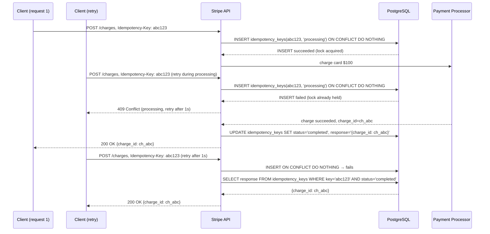

# Stripe: Idempotency Keys for Payment APIs

> **Source**: [Idempotency (Stripe Blog)](https://stripe.com/blog/idempotency) · [Designing robust and predictable APIs with idempotency](https://stripe.com/blog/designing-apis-with-idempotency)  
> **Scale**: Hundreds of billions of dollars processed annually · millions of API requests/day · payments to 195+ countries

---

## Problem & Scale

Payments are the most unforgiving domain in distributed systems: **money must not be created or destroyed by a bug.** The core problem:

A client calls `POST /v1/charges` to charge a customer $100. The request travels over the network. The server processes the payment, charges the card, but then the **connection drops before returning a response**. From the client's perspective: the request failed. What do they do?

- **If they don't retry**: the charge went through, but the client thinks it failed → the customer was charged but the merchant didn't record the sale
- **If they retry**: they might charge the customer **twice**

This is the **at-least-once vs. exactly-once delivery** problem, made catastrophic because each delivery = a charge to someone's credit card.

At Stripe's scale, network failures, timeouts, and client crashes happen thousands of times per day. Without idempotency, each failure is a potential double-charge.

---

## The Idempotency Key Pattern

Stripe's solution: the client generates a **unique key** that identifies this specific logical request. The key is sent as a request header:

```http
POST /v1/charges
Idempotency-Key: a8098c1a-f86e-11da-bd1a-00112444be1e
Content-Type: application/json

{"amount": 10000, "currency": "usd", "source": "tok_visa"}
```

**Server behavior**:
1. On first receipt: process the charge, persist `{idempotency_key → response}`, return response
2. On retry with same key: **do not process again**, return the persisted response

The key insight: **idempotency converts a potentially dangerous retry into a safe, deterministic cache lookup**.

---

## Implementation Deep-Dive

### Atomic Lock + Process + Persist

The naive implementation fails:

```
# WRONG: Race condition
1. Check if idempotency_key exists in DB
2. If not: process charge
3. Write idempotency_key → response to DB
```

If two concurrent retries arrive simultaneously (e.g., client timeout triggers two parallel retries):
- Both check DB: key not found
- Both process the charge → double charge

**Correct implementation** uses an atomic database operation:

```sql
-- Atomic INSERT ... ON CONFLICT (Postgres)
INSERT INTO idempotency_keys (key, locked_at, status)
VALUES ($key, NOW(), 'processing')
ON CONFLICT (key) DO NOTHING
RETURNING *;
```

If the INSERT succeeds → this request "won" the lock, proceed to charge.  
If the INSERT returns nothing → another request is processing or has completed. Wait and poll for the result.



### State Machine for Each Idempotency Key

Each idempotency key record tracks a state machine:

```
NONE → (first request arrives) → LOCKED (processing in progress)
LOCKED → (charge succeeds) → COMPLETED (response stored)
LOCKED → (charge fails) → FAILED (error stored)
LOCKED → (server crashes) → LOCKED (stale, needs recovery)
COMPLETED → (retry arrives) → COMPLETED (return cached response)
FAILED → (retry arrives) → FAILED (return cached error — do not retry the charge)
```

**Important**: a payment failure (card declined) is stored as FAILED. A retry with the same idempotency key returns the same error — it does not retry the charge. The client must generate a new idempotency key to attempt a fresh charge (presumably with a different card).

### Idempotency Key Scope: Request Body Must Match

If a client sends the same idempotency key with a **different request body** (different amount, different card), Stripe rejects it:

```
POST /v1/charges
Idempotency-Key: abc123
{"amount": 20000, ...}  ← different amount than original $100 request

→ HTTP 400: Idempotency-Key abc123 was used with a different request body
```

The stored key includes a hash of the original request body. Mismatch = reject. This prevents bugs where a key is accidentally reused across different operations.

### TTL: Keys Expire After 24 Hours

Idempotency keys are retained for 24 hours, then expire. After expiry, the same key can be used for a new charge. This bounds the storage requirement: at Stripe's scale, keys are a fixed daily volume, not unbounded accumulation.

**Why 24 hours?** A reasonable bound for legitimate retries. Network failures that aren't resolved in 24 hours indicate a fundamental problem; clients should abort and create a new request.

---

## Client-Side: How to Generate Idempotency Keys

Clients should generate the key before making the request and persist it until the response is definitively received:

```python
import uuid
import requests

# Generate key ONCE per logical operation, not per HTTP attempt
idempotency_key = str(uuid.uuid4())

# Persist the key (e.g., in your database) before sending
save_pending_charge(order_id, idempotency_key)

# Retry loop with exponential backoff
for attempt in range(5):
    try:
        response = requests.post(
            "https://api.stripe.com/v1/charges",
            headers={"Idempotency-Key": idempotency_key},
            data={"amount": 10000, "currency": "usd", "source": "tok_visa"},
            timeout=30
        )
        response.raise_for_status()
        return response.json()
    except requests.Timeout:
        wait = 2 ** attempt  # exponential backoff
        time.sleep(wait)

raise Exception("Payment failed after 5 attempts")
```

**Critical**: the idempotency key must be generated **before** the first attempt and reused for all retries of the same logical charge. If you generate a new key per retry, you get no protection.

---

## Retry Semantics: When to Retry vs. Abort

| HTTP Status | Meaning | Retry? |
|-------------|---------|--------|
| `200 OK` | Success — charge completed | No (already succeeded) |
| `400 Bad Request` | Invalid request (wrong parameters) | No — fix the request |
| `402 Payment Required` | Card declined | No — get a different card; new idempotency key |
| `409 Conflict` | Another request processing the same key | Yes — retry after backoff |
| `429 Too Many Requests` | Rate limited | Yes — respect Retry-After header |
| `500 Internal Server Error` | Stripe-side error | Yes — retry with same key |
| `503 Service Unavailable` | Stripe down | Yes — retry with same key |
| Connection timeout | No response received | Yes — retry with same key |

The rule: **retry on network errors and 5xx. Never retry on 4xx (except 409 and 429).**

---

## Beyond Payments: The Idempotency Pattern in Distributed Systems

The same pattern applies wherever you need exactly-once semantics across a network boundary:

| System | Operation | Idempotency Key |
|--------|-----------|----------------|
| Stripe | Charge card | Client-generated UUID per charge attempt |
| AWS SQS | Process message | `message_id` (deduplicated for 5 minutes) |
| Kafka | Produce message | Producer ID + sequence number (exactly-once) |
| Database write | INSERT | `ON CONFLICT DO NOTHING` or `INSERT OR IGNORE` |
| Email sending | Send confirmation | `order_id` as dedup key; store `email_sent_at` |
| Job queue | Enqueue job | Job ID persisted before enqueueing |

---

## Key Trade-offs

| Decision | Alternative | Reasoning |
|----------|-------------|-----------|
| Atomic INSERT to acquire lock | Distributed lock (Redis) | Redis lock: two failure points (DB + Redis); atomicity requires careful Redis scripting. Single DB atomic INSERT: simpler, same ACID guarantees as the charge record itself. |
| Return cached response (not re-execute) | Re-execute with idempotency check | Re-execution: what if the downstream state changed? (Different price, card expired.) Cached response: exactly what the original call returned — deterministic. |
| Reject key reuse with different body | Silently ignore body mismatch | Silent ignore: dangerous — client thinks they're modifying behavior but they're not. Explicit reject: fail loud rather than fail silent. |
| 24-hour TTL | Permanent storage | Permanent: unbounded storage growth. 24 hours: covers all legitimate retry scenarios; old keys are recycled naturally. |
| Client generates key | Server generates key (no key required) | Server-generated: client can't retry safely (no key to include in retry). Client-generated: client controls the idempotency domain and can persist the key before sending. |

---

## FAANG Interview Angle

**"Design a payment API that prevents double charges"** — apply these lessons:

1. **The problem is not just retries**: it's the impossibility of distinguishing "did the server process my request?" from "did the request even arrive?" over a network. Idempotency keys are the solution to this fundamental distributed systems problem.

2. **Atomicity is the implementation**: the check-then-act pattern fails under concurrency. `INSERT ... ON CONFLICT DO NOTHING` in a single atomic statement is how you acquire the lock. Say this explicitly — interviewers test whether you know the race condition.

3. **The stored response is the answer**: you are not re-executing the business logic. You are returning the saved outcome. This means even if the downstream state has changed (price went up, card expired), the original idempotency key returns the original result.

4. **Idempotency is a contract, not just an implementation**: the client must generate the key before the first attempt. This changes your API design — you must document this requirement clearly, enforce body-match validation, and communicate TTLs.

5. **Scope the pattern**: idempotency keys apply to non-idempotent operations (POST, charge, send email). GET is already idempotent by definition. PUT is idempotent if overwriting a resource. POST is inherently non-idempotent — that's where this pattern matters.

### Follow-up questions an interviewer will ask:

- "What if the server crashes after charging the card but before writing the idempotency key record?" → This is the hardest case. The charge went through but the key wasn't saved. On retry: the key doesn't exist → the server tries to charge again → double charge. Mitigation: write the key (status=LOCKED) **before** calling the payment processor, not after. If the server crashes during processing, the stale LOCKED key triggers a recovery job to check the payment processor for the outcome.
- "How do you handle idempotency across multiple services in a microservices architecture?" → Each service maintains its own idempotency key store. The payment service's idempotency key is scoped to payment API calls. The order service has its own idempotency for order creation. These are independent — the client includes the same key to all services involved in the same logical operation.
- "How do you implement idempotency for an email send?" → Before calling the email service, write `{email_type, recipient_id, template_version} → sent_at` to a DB. On send attempt: check if sent_at is populated → skip. Deduplicate on a natural key (not a UUID) so that application restarts don't generate new "never sent" state.
- "Stripe has a 24-hour TTL on idempotency keys. What if a client needs to retry after 25 hours?" → Generate a new idempotency key. The original charge's outcome is recorded in the application's own database (order table, charge record). The idempotency key is a retry mechanism, not a record of truth — your database is.
