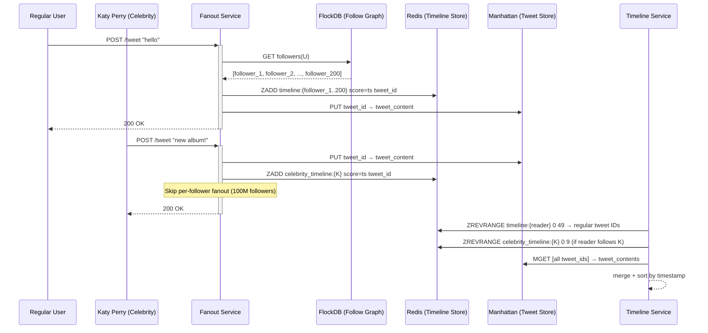

# Twitter: Timeline Fanout at Scale

> **Source**: [Timeline scalability (InfoQ presentation)](https://www.infoq.com/presentations/Twitter-Timeline-Scalability/) · [Twitter engineering blog](https://blog.twitter.com/engineering) · [Rebuilding Timeline (2012)](https://blog.twitter.com/engineering/en_us/a/2012/building-a-scalable-timeline-with-redis)  
> **Scale**: 200M+ daily active users · 500M tweets/day · 300K QPS at peak read

---

## Problem & Scale

Twitter's core product is the **home timeline**: a reverse-chronological feed of tweets from accounts you follow. The fundamental challenge is the **fanout problem**:

- A user with 1M followers posts a tweet
- That tweet must appear in 1M followers' timelines
- At Twitter scale: 500M tweets/day = 5,800 tweets/second
- Average follower count: ~200
- Average fanout: 5,800 × 200 = **1.16M timeline insertions/second**
- For Katy Perry (100M+ followers): one tweet = 100M insertions

Two approaches exist, each with catastrophic failure modes:

| Approach | Read complexity | Write complexity | Problem |
|----------|----------------|-----------------|---------|
| **Fanout on write** (push model) | O(1) — just read your timeline list | O(F) — write to all F followers | Katy Perry (100M followers) tweets: 100M writes in seconds |
| **Fanout on read** (pull model) | O(F) — query all F followees' recent tweets | O(1) — just write your tweet | Loading timeline = 200 DB queries, merge, sort; at 300K QPS this is 60M DB queries/second |

Twitter's solution: **neither extreme, but a hybrid**.

---

## Timeline Architecture: Three Systems

### System 1: The Social Graph Store

Twitter stores the follower graph separately from tweets:
- `user_id → [follower_id_1, follower_id_2, ...]`
- Stored in **FlockDB** (a distributed graph database) then later Gizzard (sharded MySQL)
- Used during fanout to look up who to notify

### System 2: Timeline Service (Redis)

Each user's home timeline is a **Redis sorted set** (zset):
- Key: `timeline:{user_id}`
- Members: tweet IDs (not tweet content)
- Score: timestamp (for ordering)
- Capped at most recent 800 entries (older tweets are dropped from the timeline cache)

Redis is the heart of Twitter's timeline architecture. A timeline read is:
```
ZREVRANGE timeline:{user_id} 0 49  → tweet_ids[]
```

Then batch-fetch tweet content by ID from a separate tweet store.

### System 3: Tweet Store

Tweets are stored in **Manhattan** (Twitter's custom distributed key-value store):
- Key: `tweet_id` (Snowflake ID)
- Value: serialized tweet (author, text, media refs, metadata)
- Optimized for random-access reads by ID

---

## The Hybrid Fanout Model

### Write Path (fanout on write for normal users)

```
User posts tweet
    │
    ▼
Fanout Service receives event (Kafka)
    │
    ▼
Look up followers from FlockDB/Gizzard
    │
    ▼
For each follower_id:
  ZADD timeline:{follower_id} {tweet_timestamp} {tweet_id}
  ZREMRANGEBYRANK timeline:{follower_id} 0 -801  (cap at 800)
    │
    ▼
Also write tweet to Manhattan (tweet content store)
```

**Performance**: fan-out is asynchronous. The tweet is immediately visible to the author but propagates to followers over seconds (typically <5 seconds for users with <10K followers).

### Read Path (pure cache read for normal users)

```
User loads home timeline
    │
    ▼
ZREVRANGE timeline:{user_id} 0 49  → [tweet_id_1, tweet_id_2, ..., tweet_id_50]
    │
    ▼
Batch GET tweet content from Manhattan for all IDs
    │
    ▼
Merge + render
```

**No database queries.** Just Redis + Manhattan. Sub-10ms for the Redis lookup; Manhattan batch reads in parallel.

### The Celebrity Exception: Fanout on Read

For accounts with **>1M followers** (celebrities, news accounts), fanout-on-write is infeasible:
- Lady Gaga tweets → 100M Redis insertions → complete this in < 5s? Impossible.
- 100M writes saturates all Fanout Service workers and all Redis nodes

**Celebrity handling**:
1. Celebrities are flagged as "high-fan-out" in the social graph
2. When user loads timeline, Redis is read for non-celebrity tweets (as above)
3. **Additionally**: the system queries which celebrities the user follows, fetches their recent tweet IDs from a celebrity tweet cache, and merges them in at read time

```
Read timeline for user U:
    ├─ ZREVRANGE timeline:{U} → regular tweet IDs (from push fanout)
    ├─ For each celebrity C that U follows:
    │     ZREVRANGE celebrity_timeline:{C} 0 N → C's recent tweet IDs
    └─ Merge by timestamp → final timeline
```

This merge happens in the Timeline Service, not the client. The cost: one extra Redis lookup per celebrity the user follows. Most users follow < 5 celebrities — acceptable overhead.

---

## Data Flow Diagram



---

## Edge Cases and Solutions

### Cold Start: New User with No Timeline

User signs up and follows 20 accounts. Their timeline Redis key doesn't exist. On first load:
- Fanout-on-read all 20 followees' recent tweets (fetch from Manhattan)
- Merge, populate timeline:{new_user}, serve

Cost: 20 Manhattan reads (fast, in parallel). This path is rare — only new accounts or accounts inactive long enough for their Redis key to expire.

### Timeline Gap: User Inactive for > 7 Days

Twitter TTLs timeline keys in Redis after 7 days of inactivity. When the user returns:
- Same cold start process: reconstruct timeline from Manhattan

### Retweets and Quote Tweets

Retweets are treated as tweets in the fanout: retweeter's followers receive the retweet ID in their timeline. The tweet content (stored in Manhattan) points to the original tweet.

### Deleted Tweets

Tweet deleted → remove from Manhattan. On timeline read, if a tweet ID resolves to "not found" → skip it. Redis timelines may briefly show a now-deleted tweet; next load it disappears. The 800-tweet cap means stale references age out quickly.

---

## Key Trade-offs

| Decision | Alternative | Reasoning |
|----------|-------------|-----------|
| Push fanout for most users | Pull fanout for all | Pull = O(followees) per read at 300K QPS; too expensive. Push = O(followers) per write, amortized and async. |
| Pull fanout for celebrities | Push fanout for all | Push for 100M followers = billions of Redis writes per celebrity tweet; infeasible in seconds. |
| Store tweet IDs in Redis, content in Manhattan | Store full tweet in Redis | Full tweet in Redis: memory cost scales with content size. IDs: fixed 8 bytes per timeline entry regardless of tweet length. |
| Cap timeline at 800 tweets | Unlimited timeline | Unlimited = unbounded Redis memory; 800 covers > 1 week for most users; older tweets reachable via tweet search |
| Async fanout via Kafka | Synchronous fanout | Sync: POST /tweet doesn't return until all followers' timelines are updated (seconds for high-follower users). Async: tweet returns immediately; eventual consistency acceptable for social feed. |

---

## Numbers to Know

| Metric | Value |
|--------|-------|
| Timeline cache depth | 800 tweet IDs per user |
| Timeline key TTL | 7 days of inactivity |
| Celebrity threshold | ~1M followers (not publicly confirmed) |
| Redis sorted set overhead | ~16 bytes per entry (ID + score) |
| Fanout latency for regular users | < 5 seconds to all followers |
| Peak write QPS (fanout insertions) | ~1.16M/second globally |
| Peak read QPS (timeline loads) | ~300K/second |

---

## FAANG Interview Angle

**"Design Twitter's home timeline"** — apply these lessons:

1. **Lead with the fanout dilemma**: the interviewer expects you to identify push vs. pull, articulate why each breaks at scale, and then propose the hybrid. Don't propose one and wait to be asked about the other.

2. **Store IDs, not content, in the timeline cache**: content is in a separate store. This separates the concerns of "who should see what" (timeline) from "what does it say" (tweet store). Also allows edits/deletes without touching timelines.

3. **The celebrity threshold is an architectural boundary**: explicitly define it. The system behaves differently on each side. In an interview, defining this boundary demonstrates principal-engineer-level thinking.

4. **Async fanout is non-negotiable**: synchronous fanout blocks the user's POST until all timelines are updated. This is a correctness non-goal for a social feed. State that explicitly.

5. **Redis sorted sets are the right data structure**: score = timestamp, member = tweet_id. `ZREVRANGE` gives you the most recent N tweets in O(log N + K). Know this.

### Follow-up questions an interviewer will ask:

- "How do you handle a user who follows 10,000 accounts? That's 10,000 lookups at read time." → Most of the 10K are not celebrities (push-fanned). Only the celebrity subset is merged at read time. The real answer: the system differentiates fanout-on-write vs. fanout-on-read per *followee*, not per *follower*.
- "Twitter has 200M DAU. How large is the Redis fleet?" → Each user: 800 tweet IDs × 8 bytes = 6.4 KB. 200M users = 1.28 TB raw. With replication (3×): ~4 TB. ~40 × 100GB Redis instances. This is manageable.
- "How do you implement 'list' timelines (Twitter lists)?" → Same mechanism: list has its own fanout when members tweet; list timeline is a separate Redis zset keyed by list_id.
- "Algorithmic timeline (not chronological)?" → The tweet IDs in the Redis timeline are still fetched, but ranking is applied after content is fetched from Manhattan. A ranking service scores tweets by engagement, recency, user affinity, and returns them in scored order rather than pure timestamp order.
