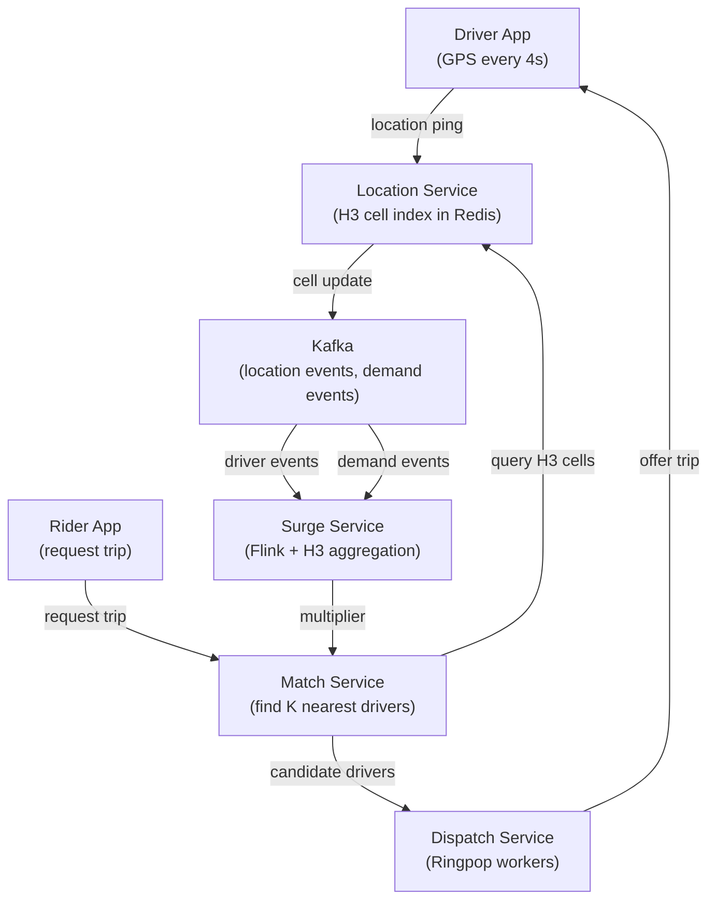

# Uber: H3 Geospatial Indexing for Ride Matching

> **Source**: [H3: Uber's Hexagonal Hierarchical Spatial Index](https://www.uber.com/blog/h3/) · [Ringpop: Consistent Hash Ring for Dispatch](https://www.uber.com/blog/introducing-ringpop-consistent-hash-ring/)  
> **Scale**: 5M+ trips/day · 3M+ active drivers · global coverage across 70+ countries

---

## Problem & Scale

Uber's core operation — matching a rider to the nearest available driver — is a geospatial nearest-neighbor problem running at:
- **Rider request**: find the K closest available drivers within radius R
- **Pricing**: aggregate supply and demand within an area to compute surge multiplier
- **ETA**: estimate travel time from driver location to pickup

Naive approach (scan all drivers, compute Haversine distance): O(N) per request with N = 3M drivers globally. At 5M trips/day (~58 requests/second at peak much higher), this is infeasible.

**The core question**: how do you efficiently index 3M moving points on a sphere, and query all points within a geographic region in sub-millisecond time?

---

## Why Hexagons?

Uber evaluated three spatial indexing approaches:

| Approach | Description | Problem |
|----------|-------------|---------|
| **Bounding box (lat/lon grid)** | Divide world into rectangular lat/lon cells | Cells have different areas at different latitudes (Mercator distortion); equatorial cell ≠ polar cell in area |
| **Geohash** | Base-32 encoding of lat/lon recursive subdivisions | Rectangular cells; edge-adjacency issue: two nearby points can have very different geohashes at cell boundaries |
| **S2 Geometry (Google)** | Project sphere to cube; subdivide cube faces | Good properties but complex; cell shapes are irregular across levels |
| **H3 (hexagons)** | Project sphere to icosahedron; hexagonal tessellation at each resolution | Near-uniform area cells; hexagons have only one type of neighbor (vs rectangles which have edge and corner neighbors) |

**Why hexagons win for Uber's use case**:

1. **Uniform distance**: in a hexagonal grid, all 6 neighbors are equidistant from the center (rectangles have 4 edge neighbors at distance d and 4 corner neighbors at distance d√2)
2. **Smooth movement**: as a driver moves across a cell boundary, they enter exactly one new cell — no ambiguity about which "ring" they're in
3. **Hierarchical**: H3 has 16 resolution levels (res 0 = world, res 15 = 0.9 m² cells). A res-9 cell (≈0.1 km²) contains ≈7 res-10 cells — clean containment relationships

**H3 resolution guide for Uber**:

| Resolution | Cell Area | Use Case |
|------------|-----------|---------|
| res 7 | ~5.2 km² | City-level surge pricing |
| res 9 | ~0.1 km² | Driver matching radius |
| res 11 | ~0.003 km² | Precise pickup zone |
| res 13 | ~0.0001 km² | Street-level accuracy |

---

## Driver Location Indexing

### Data Structure: H3 Cell → Driver Set

Each active driver publishes GPS updates every 4 seconds. The dispatch system maintains:

```
h3_cell[res_9] → Set<driver_id>
driver_id → { lat, lon, h3_cell, status, vehicle_type, last_seen }
```

**Write path** (driver location update):
1. Driver app sends GPS ping → Location Service
2. Compute `new_cell = H3.geoToH3(lat, lon, resolution=9)`
3. If `new_cell != old_cell`:
   - Remove driver from `h3_cells[old_cell]`
   - Add driver to `h3_cells[new_cell]`
4. Update `drivers[driver_id]` with new coordinates

**Read path** (find drivers for a rider):
1. Compute rider's cell: `rider_cell = H3.geoToH3(rider_lat, rider_lon, 9)`
2. Get k-ring of radius 1 (7 cells): `cells = H3.kRing(rider_cell, k=1)`
3. For each cell: `drivers = h3_cells[cell]` — O(1) hash lookup
4. Compute precise distance to each candidate driver: `haversine(rider, driver)`
5. Return top-K closest by distance

**K-ring** at radius 1 covers ~0.7 km² — close enough for most markets. If < K drivers found, expand to radius 2 (19 cells), then 3 (37 cells). This caps the search space: even at radius 3, you scan at most 37 cells and typically only a few hundred drivers.

---

## Dispatch Architecture: Ringpop

Finding nearby drivers is only step 1. The actual dispatch (offer trip to driver → driver accepts → lock assignment) requires coordination across stateful dispatch workers.

**Problem**: A driver can receive at most one offer at a time. If two riders simultaneously match the same driver, only one should win. This requires **mutual exclusion** on driver state.

**Naive solution**: central lock service → single point of failure, latency bottleneck.

**Uber's solution: Ringpop** — consistent hash ring of dispatch workers.

```
                  ┌─────────────────────────────────────┐
                  │         Consistent Hash Ring         │
                  │                                      │
                  │  Worker A    Worker B    Worker C     │
                  │  owns        owns        owns         │
                  │  drivers     drivers     drivers      │
                  │  000–2FF     300–5FF     600–FFF      │
                  └─────────────────────────────────────┘
```

Each driver is deterministically mapped to exactly one worker via `hash(driver_id) mod ring_size`. That worker owns all dispatch state for that driver.

**Dispatch flow**:
1. Rider request arrives at any API node
2. API node queries location index → gets candidate driver IDs
3. For each candidate, route to owning worker: `worker = ring.lookup(driver_id)`
4. Worker holds the driver lock; sends offer; awaits response (15-second window)
5. First rider to get an acceptance wins; others receive "no driver" response

**Fault tolerance**: Ringpop uses the **SWIM protocol** (gossip + failure detection) to maintain membership. When a worker dies:
- Gossip propagates failure within seconds
- Ring rebalances: the dead node's token range is absorbed by neighbors
- Drivers whose owners changed re-register state on the new owner
- In-flight offers may be lost → rider gets re-queued immediately

**Why not ZooKeeper/Etcd for membership?**: External coordination service adds a dependency that can fail and adds round-trip latency to membership queries. SWIM is self-contained within the worker cluster.

---

## Surge Pricing: Aggregation with H3

Surge multiplier = f(demand/supply) per geographic zone. Uber computes this in real-time using H3 cells.

**Demand signal**: rider request event → stream into Kafka → Flink aggregator → count requests per H3 cell over sliding 5-minute window.

**Supply signal**: active driver location updates → count drivers per H3 cell with status = AVAILABLE.

**Surge computation**:
```
surge_multiplier = max(1.0, demand_rate / (supply_rate * baseline_conversion))
```

**Why H3 is critical here**: surge zones must be:
- **Smooth**: a driver 10m outside a surge zone shouldn't get a dramatically different fare than one 10m inside. Hexagonal adjacency makes zone boundaries smoother.
- **Hierarchical**: compute surge at res-7 for pricing display (large zones), drill to res-9 for dispatch decisions (fine-grained)

---

## Full System Architecture



---

## Key Trade-offs

| Decision | Alternative | Reasoning |
|----------|-------------|-----------|
| H3 hexagonal grid | Geohash rectangles | Uniform neighbor distance; no edge/corner ambiguity; works better for circular search radius |
| Client-side H3 computation | Server computes cell from raw GPS | Drivers compute their own H3 cell → saves server CPU for 3M continuous GPS updates |
| Consistent hash ring (Ringpop) | Distributed lock service (Redis, ZK) | Lock service is SPOF + latency; Ringpop is self-contained, gossip-based membership |
| 4-second GPS update interval | 1-second updates | 1s: 3× bandwidth and indexing load; driver moves ~50m in 4s at city speeds — sufficient precision |
| SWIM gossip for membership | Heartbeat to coordinator | Coordinator is SPOF; SWIM has O(log N) convergence, no central node |
| Expand k-ring on miss | Large fixed k-ring always | Fixed large ring scans unnecessary drivers; expanding ring is O(k²) in cells, not O(N) in drivers |

---

## Failure Modes

| Failure | Impact | Mitigation |
|---------|--------|-----------|
| Location service Redis node fails | Cell lookups fail → no nearby drivers found | Redis Cluster: 6 nodes (3 primary + 3 replica); automatic failover in <30s; in-flight requests retry |
| Ringpop worker dies with in-flight offers | Offers lost; drivers don't get re-offered | Ring rebalance completes in seconds; Rider request re-queued by Match service with timeout |
| GPS spoofing (driver reports fake location) | Driver appears where they are not | Plausibility check: max speed ~200 km/h; GPS accuracy filter; report from multiple sources |
| Surge computation lag | Surge price stale | Flink checkpoint every 30s; last-computed value served; stale by at most 30s — acceptable for pricing display |
| H3 resolution boundary: driver straddles cells | Driver momentarily in neither cell | Atomic cell swap: write to new cell before removing from old (brief double-presence is OK) |

---

## FAANG Interview Angle

**"Design Uber's ride-matching system"** — apply these lessons:

1. **Name the geospatial index**: don't just say "use a geospatial database." Describe H3 cells (or S2, or geohash), the resolution you'd choose, and how you'd update it on driver movement.

2. **K-ring expansion is the query**: nearest-neighbor search on H3 = set lookups in a hash map, not a database scan. The interviewers want to see you understand why spatial indexing reduces complexity from O(N) to O(K).

3. **Consistent hashing for dispatch coordination**: the mutual exclusion problem (one driver, one offer) is solved by ownership, not by locks. Know the distinction.

4. **Separate read path from write path**: location updates (writes) and match queries (reads) are independent paths. Scale them independently.

5. **Numbers to know**:
   - H3 res-9 cell area: ~0.1 km²
   - GPS update frequency: 4s (Uber), 1s (more precise alternatives)
   - k-ring radius 1 = 7 cells; radius 2 = 19 cells; radius 3 = 37 cells
   - Driver match latency target: <500ms end-to-end

### Follow-up questions an interviewer will ask:

- "How do you handle a rider at the exact boundary between two H3 cells?" → k-ring includes both neighboring cells; boundary drivers are in both. The precise haversine distance resolves the tie.
- "How do you scale the location service if 3M drivers update every 4 seconds?" → That's 750K writes/second. Redis cluster with cell-level sharding. Each H3 cell maps to a shard via consistent hashing. Hot cells (dense cities) get dedicated shards.
- "How does surge pricing propagate to the rider's app in real time?" → Surge multiplier is computed in Flink, written to Redis, and served by the Match service at request time. Client polls surge on the app landing screen every 30s.
- "How does Uber handle a sudden demand spike (New Year's Eve) that overwhelms dispatch workers?" → Ringpop scales horizontally; adding workers rebalances the ring. Pre-scaling: capacity planning based on historical demand curves. Shed load: if no driver available, return "no cars available" immediately rather than queue indefinitely.
