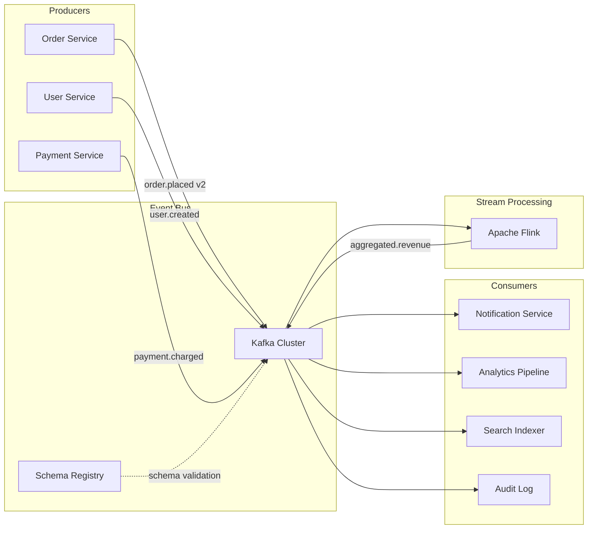

# Event-Driven Architecture

## TL;DR

Event-driven architecture (EDA) decouples producers from consumers by routing communication through an event bus. The core trade-off is **loose coupling and scalability** at the cost of **operational complexity and consistency reasoning**. The hardest interview question is not "what is it" — it's "how do you handle exactly-once delivery and ordering at scale."

---

## 1. Core Concepts

### Event vs Message vs Command

| Type | Intent | Example | Routing |
|------|--------|---------|---------|
| **Event** | "Something happened" (past tense) | `order.placed`, `user.created` | Broadcast — any consumer can react |
| **Message** | Data to be processed | Raw payload for a pipeline | Point-to-point or broadcast |
| **Command** | "Do this" (imperative) | `send-email`, `charge-payment` | Point-to-point — one consumer acts |

Principal engineer framing: prefer events over commands between bounded contexts. Commands create temporal coupling; events do not.

### Topology Patterns

**Choreography** — services react to events independently, no central coordinator
```
OrderService --[order.placed]--> PaymentService
                             --> InventoryService
                             --> NotificationService
```
- ✅ Loose coupling, each service owns its reaction
- ❌ Distributed workflow is hard to trace, debug, and change
- Use for: simple fan-out, independent reactions

**Orchestration** — a central process manager controls the workflow
```
OrderOrchestrator --> PaymentService (command)
                  --> InventoryService (command)
                  --> NotificationService (command)
```
- ✅ Workflow visible in one place, easy to change sequence
- ❌ The orchestrator is a coupling point and single point of failure
- Use for: long-running sagas, complex business logic, compensation flows

**Hybrid** — orchestration within a bounded context, choreography across contexts. This is what mature systems (Uber, Netflix) use.

---

## 2. Delivery Guarantees

| Guarantee | Meaning | How | Cost |
|-----------|---------|-----|------|
| At-most-once | Fire and forget | No retries | Data loss possible |
| At-least-once | Retry until ACK | Producer retries + idempotent consumers | Duplicates possible |
| Exactly-once | No duplicates, no loss | Idempotent producer + transactional consumer | Highest overhead |

**At-least-once is the practical standard** for most systems. You accept that consumers may see the same event twice and make them idempotent (deduplication by event ID).

**Exactly-once in Kafka** (since 0.11):
- Producer: idempotent producer (PID + sequence number per partition)
- Broker: deduplication within a single session
- Consumer + sink: transactional API — read → process → write in a single transaction
- Caveat: exactly-once is within the Kafka cluster; end-to-end exactly-once requires your downstream sink to also support transactions (e.g., a database that you write to in the same transaction as the consumer offset commit)

---

## 3. Ordering

Kafka guarantees ordering **within a partition**, not across partitions.

**Design pattern**: partition by the entity that must be ordered. For order events, partition by `order_id`. This ensures all events for the same order land in the same partition and are processed in order.

**Problem**: you partition by `user_id` for fairness. But one user submits 1M events (noisy neighbor). Their partition becomes a bottleneck.

**Solutions**:
- Two-tier partitioning: first partition by tenant, then sub-partition by entity within consumer
- Virtual partitions: reassign hot partitions to dedicated consumers
- Cell-based isolation: move hot users to isolated infrastructure

---

## 4. The Saga Pattern (Distributed Transactions)

Use when a business transaction spans multiple services and must be atomic.

```
PlaceOrder Saga:
1. Reserve inventory     → success → 2
2. Charge payment        → success → 3 | failure → compensate step 1
3. Schedule shipping     → success → done | failure → compensate steps 1,2
```

**Choreography-based saga**: each service publishes success/failure events, downstream services compensate on failure.

**Orchestration-based saga**: the saga orchestrator drives each step, rolls back on failure.

**Key principle**: sagas do not provide isolation (concurrent sagas can see each other's partial state). They provide eventual atomicity through compensating transactions.

**Real-world example**: Uber's trip booking — reserving a driver, charging payment, and confirming the trip is a distributed saga. If payment fails, the driver reservation is released via a compensating transaction.

---

## 5. Schema Evolution

Events are contracts. Schema changes break consumers.

**Problem**: `order.placed` v1 has `{orderId, userId, amount}`. You add `currency` in v2. Consumers built for v1 don't know how to handle v2.

**Solution**: Confluent Schema Registry + Avro/Protobuf

```
Producer → serialize with Avro (schema ID embedded in message header)
Consumer → deserialize using schema registry lookup
Schema registry enforces compatibility rules:
  - BACKWARD: new schema can read old data (add fields with defaults)
  - FORWARD: old schema can read new data (remove fields consumers don't need)
  - FULL: both directions
```

**Best practice at FAANG**: all events must be registered in a schema registry before production. Producers must declare the schema version. Consumers must handle unknown fields gracefully (ignore unknown fields by default in Avro/Protobuf).

---

## 6. Event Sourcing

Store state as a sequence of events, not as current state. Current state is derived by replaying the event log.

```
UserAccount events:
  [AccountOpened, MoneyDeposited(100), MoneyWithdrawn(30), MoneyDeposited(50)]
  Current balance = 0 + 100 - 30 + 50 = 120
```

**Benefits**:
- Complete audit trail (regulatory compliance)
- Time-travel: replay to any point in time
- Event stream is the source of truth for downstream projections

**Costs**:
- Read performance degrades as event log grows → mitigated by snapshots
- Schema evolution is critical and irreversible (you can't delete old events)
- Eventual consistency between the event store and read models (projections)

**When to use**: financial ledgers, audit-critical systems, systems where "what happened" matters as much as "what is the current state." Stripe uses event sourcing for payment processing.

---

## 7. Architecture Blueprint



---

## 8. Failure Modes

| Failure | Impact | Mitigation |
|---------|--------|------------|
| Consumer lag grows | Events processed hours late | Scale consumers; partition hot topics; set lag SLOs |
| Producer failure before publish | Event never produced | Outbox pattern: write event to DB + Kafka transactionally |
| Broker partition leader failure | Brief unavailability | Kafka auto re-elects; min.insync.replicas=2 |
| Consumer crashes mid-processing | Duplicate processing on restart | Idempotent consumers with deduplication table |
| Schema incompatibility deployed | Consumer crashes on deserialization | Schema registry with BACKWARD compatibility enforced in CI |
| Event store corruption | Loss of event history | Cross-region replication; periodic snapshot backups |

### Outbox Pattern (Critical)

Prevents the dual-write problem: writing to DB succeeds but Kafka publish fails.

```
Transaction:
  INSERT INTO orders (...) -- business write
  INSERT INTO outbox (event_type, payload) -- event write (same DB tx)

Outbox poller (separate process):
  SELECT * FROM outbox WHERE published = false
  FOR EACH event: publish to Kafka
  UPDATE outbox SET published = true
```

This ensures atomicity between state and event publication. Used by Debezium (CDC-based), Transactional Outbox libraries.

---

## 9. Kafka vs Alternatives

| Dimension | Kafka | RabbitMQ | AWS SQS/SNS | Google Pub/Sub | Pulsar |
|-----------|-------|----------|-------------|----------------|--------|
| Throughput | ✅ Millions/sec | ⚠️ Hundreds of thousands | ⚠️ ~3000/sec per queue | ✅ High | ✅ High |
| Ordering | ✅ Per partition | ⚠️ Per queue | ❌ No ordering | ⚠️ Per key | ✅ Per key |
| Replay | ✅ Configurable retention | ❌ ACK = delete | ❌ Consumed = gone | ⚠️ Limited | ✅ Tiered storage |
| Exactly-once | ✅ Transactional API | ❌ | ❌ | ⚠️ Best-effort | ✅ |
| Ops burden | ❌ High (Zookeeper/KRaft) | ⚠️ Medium | ✅ Managed | ✅ Managed | ⚠️ Medium |

**Decision rule**: Kafka for high-throughput, ordered, replayable event streams (analytics, audit, ML feature pipelines). SQS for simple task queues on AWS. RabbitMQ for complex routing with lower volume. Pub/Sub for GCP-native fan-out.

---

## 10. FAANG Interview Callout

**Common follow-ups**:
1. "How do you prevent duplicate processing?" → Idempotent consumers with a deduplication table keyed on event ID
2. "How do you handle a transaction that spans three services?" → Saga pattern with compensating transactions; name the trade-off (no isolation guarantee)
3. "How do you change an event schema without breaking consumers?" → Schema registry with backward compatibility; version the event type (`order.placed.v2`)
4. "How do you ensure an event is published if the producer crashes?" → Outbox pattern — write event to DB in the same transaction as the business state change
5. "Choreography or orchestration?" → Choreography for independent reactions across bounded contexts; orchestration for workflows within a bounded context that need compensation logic

**Distinguishing answer**: Bring up the **dual-write problem** and outbox pattern without being asked. Most candidates describe the happy path. A principal engineer describes what happens when the producer crashes between the DB write and the Kafka publish.
