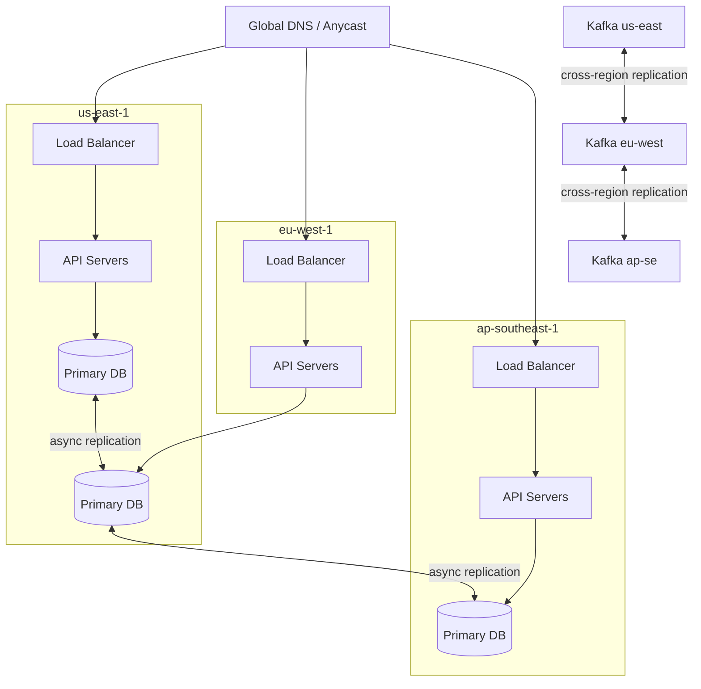

# Multi-Region Active-Active Architecture

## TL;DR

Active-active runs the full production stack in ≥2 regions simultaneously, with traffic served from all regions. The fundamental challenge is **conflict resolution**: when two regions accept concurrent writes to the same data, you need a deterministic strategy to converge.

---

## 1. Active-Active vs Active-Passive

| Dimension | Active-Active | Active-Passive |
|-----------|--------------|----------------|
| Availability | ✅ No failover delay (seconds) | ❌ Failover adds 30s–5min |
| Write latency | ✅ Writes go to local region | ❌ All writes go to primary region |
| Read latency | ✅ Reads served locally | ✅ Reads can be local |
| Conflict risk | ❌ Yes — must resolve | ✅ No — single writer |
| Cost | ❌ 2× infra, full replication | ✅ Standby can be smaller |
| Complexity | ❌ High | ✅ Low |
| RPO | Near-zero (seconds lag) | Minutes (depends on replication lag) |
| RTO | Near-zero (traffic shift) | Minutes (failover scripts, DNS TTL) |

**When to pick active-active**: RTO < 60 seconds required, global user base, writes distributed by geography.  
**When to pick active-passive**: single-region writes OK, budget constrained, conflict resolution too complex for the data model.

---

## 2. Key Challenges

### 2.1 Conflict Resolution

When Region A and Region B accept writes to the same record concurrently:

**Last Write Wins (LWW)**
- Winner determined by timestamp (wall clock or logical clock)
- Problem: clock skew between regions can be 100s of ms
- Fix: use Hybrid Logical Clocks (HLC) or TrueTime (Spanner)
- Adopted by: Cassandra (default), DynamoDB

**CRDTs (Conflict-free Replicated Data Types)**
- Data structures mathematically guaranteed to merge without conflicts
- Counter CRDT: each region increments its own slot, total = sum of all slots
- OR-Set CRDT: add/remove operations always converge
- Adopted by: Riak, Redis (some types), Figma's multiplayer

**Application-level merge**
- Application defines custom merge logic per entity type
- Example: shopping cart — union of items from both regions
- Highest fidelity, highest complexity
- Adopted by: Amazon Dynamo (original paper)

**Avoid conflicts by design**
- Partition writes by user ID to a single region (user's "home region")
- Reads are globally replicated, writes are region-pinned
- Adopted by: WhatsApp (user is pinned to a region)

### 2.2 Data Gravity

Large datasets replicated across regions create "data gravity": the cost (latency + bandwidth) of keeping data in sync grows with data size.

Mitigation strategies:
- Replicate only hot data globally; archive cold data to a single region
- Use tiered replication: sync critical tables, async replicate analytics
- Global indices with regional shards (Meta's TAO model)

### 2.3 Cross-Region Latency Budget

Replication lag = network RTT between regions + write propagation time

| Region Pair | RTT |
|-------------|-----|
| us-east-1 → us-west-2 | ~65ms |
| us-east-1 → eu-west-1 | ~80ms |
| us-east-1 → ap-southeast-1 | ~180ms |

Implication: asynchronous replication means a failure between write and replication creates data loss (RPO > 0). For zero RPO, you need synchronous multi-region commit — at the cost of write latency = RTT.

### 2.4 Split-Brain

If inter-region connectivity fails, both regions continue accepting writes independently. When connectivity restores, you have diverged histories.

Mitigations:
- Designate a "tiebreaker" region that must be reachable for writes to proceed (reduces availability)
- Accept divergence + run reconciliation job post-recovery (eventual consistency)
- Use CRDTs or LWW to auto-merge on reconnect

---

## 3. Architecture Blueprint

### Traffic Routing Options

**Anycast / GeoDNS**
- Route user to nearest region by IP geolocation
- TTL of 30–60s, failover is DNS-based (slow)
- Used for: static content CDN, global entry points

**Global Load Balancer**
- AWS Global Accelerator, GCP Global LB, Cloudflare Load Balancing
- Routes to nearest healthy region at the anycast layer
- Failover in <30s without DNS TTL dependency
- Used for: API traffic at FAANG scale

**User home-region pinning**
- Each user is assigned a home region stored in a global routing table
- All their writes go to that region; reads are served locally (with replication lag)
- Conflict-free writes, but cross-region reads may be stale
- Used by: WhatsApp, some Meta services

---

## 4. Database Choices for Active-Active

| Database | Active-Active Support | Conflict Strategy | Gotcha |
|----------|----------------------|-------------------|--------|
| CockroachDB | ✅ Native multi-region | Serializable (Raft across regions) | Write latency = RTT (consensus) |
| YugabyteDB | ✅ Native multi-region | Raft-based | Similar to CockroachDB |
| Cassandra | ✅ Multi-datacenter | LWW or custom | Tunable consistency per operation |
| DynamoDB Global Tables | ✅ Managed | LWW | Limited to AWS, LWW only |
| Spanner | ✅ Global SQL | TrueTime (external consistency) | Google Cloud only |
| PostgreSQL + pglogical | ⚠️ Manual | Conflict triggers or LWW | Operational complexity high |
| MySQL Group Replication | ⚠️ Limited | Single primary per group | Not truly active-active for writes |

---

## 5. Failure Modes

| Failure | Impact | Mitigation |
|---------|--------|------------|
| Region network partition | Split-brain, diverged writes | CRDTs or LWW; reconciliation job |
| Replication lag spike | Stale reads in far region | Read-your-writes routing; hedged reads |
| Clock skew > threshold | LWW picks wrong winner | HLC; TrueTime; monotonic logical clocks |
| Cross-region bandwidth saturation | Replication falls behind | Prioritize critical tables; compression; batching |
| DNS failover too slow | Users stuck on dead region | Anycast + global LB (not just GeoDNS) |

---

## 6. Real-World: Netflix Active-Active

Netflix runs active-active across 3 AWS regions (us-east-1, us-west-2, eu-west-1).

**Design decisions**:
- Cassandra as the primary datastore — built for multi-datacenter replication
- Zuul handles global traffic routing; Eureka provides regional service discovery
- They accept eventual consistency: your "continue watching" list may lag by seconds
- Chaos Engineering (Chaos Monkey, Chaos Kong) validates that a full region failure is survivable without operator intervention

**Key insight**: Netflix optimized for **RTO = 0** over **RPO = 0**. They accept a few seconds of stale data but will not tolerate service unavailability.

---

## 7. Capacity Estimation for Multi-Region

Starting point: 100M DAU, 1000 req/s per region (3 regions)

**Bandwidth (replication)**:
- 1000 writes/s × 1KB average payload = 1MB/s per region pair
- 3 region pairs × 1MB/s = 3MB/s cross-region replication bandwidth
- At $0.02/GB inter-region, this is ~$5,000/month in egress costs alone

**Latency targets**:
- P99 read latency: <20ms (served locally)
- P99 write latency: <50ms (local commit) + async replication
- P99 replication lag: <500ms under normal conditions

---

## 8. FAANG Interview Callout

**Common follow-ups after you say "active-active"**:
1. "How do you handle conflicting writes?" → Name your strategy (LWW, CRDT, app-level merge) and explain the trade-off
2. "What's your RPO and RTO?" → Active-active gives RTO ~0, RPO depends on sync vs async replication
3. "How do you test this?" → Chaos engineering: kill a region in staging, measure impact on the other regions
4. "What's the cost?" → Roughly 2× infra + inter-region egress; quantify for the interviewer
5. "When would you NOT use active-active?" → When writes can be region-pinned (simpler), when budget is constrained, when conflict resolution is too complex for the domain (financial ledgers with strong consistency requirements)

**Distinguishing answer**: Bring up the **conflict resolution strategy choice** unprompted. Most candidates say "active-active with database replication" and stop. The principal engineer follow-up is: "What happens when both regions accept a write to the same row simultaneously?"
