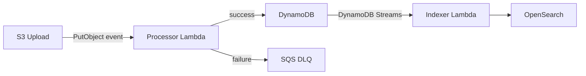
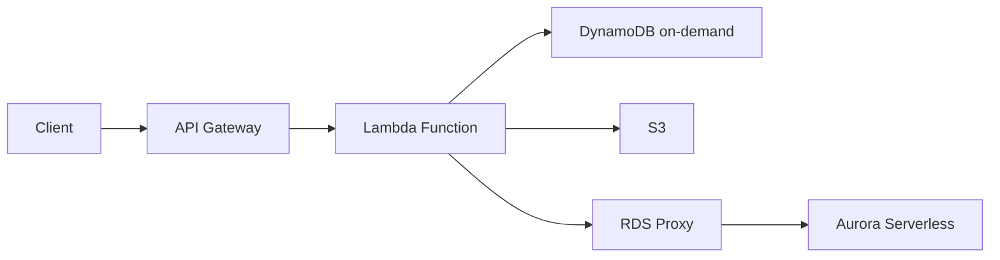

# Serverless Architecture

## TL;DR

Serverless (FaaS) trades infrastructure control for operational simplicity and pay-per-invocation pricing. The decisive trade-off is **cold start latency vs cost efficiency**. At FAANG scale, raw Lambda/Functions is usually not the answer — but serverless patterns (event-driven compute, auto-scaling workers, managed services) are everywhere.

---

## 1. What Serverless Actually Means

"Serverless" conflates two distinct things:

1. **FaaS (Function-as-a-Service)**: AWS Lambda, GCP Cloud Functions, Azure Functions — stateless functions invoked on demand, billed per invocation + duration
2. **Serverless services**: Managed services with no capacity management — S3, DynamoDB on-demand, Aurora Serverless, Firestore, Pub/Sub — "serverless" means you don't pick instance counts

The second category is often more relevant at FAANG scale than raw FaaS. A principal engineer should distinguish between them.

---

## 2. FaaS Execution Model

```
Invocation → Cold start (if no warm instance) → Execution → Response
                ↓
           Download code + dependencies
           Initialize runtime (JVM, Node, Python)
           Initialize global state (DB connections, SDK clients)
           Execute handler
```

**Cold start latencies** (p50, no VPC):

| Runtime | Cold Start |
|---------|-----------|
| Node.js | ~100–200ms |
| Python | ~100–250ms |
| Go | ~50–100ms |
| JVM (Java/Kotlin) | 500ms–3s |
| .NET | 200–500ms |

**VPC cold start** adds ~500ms–1s for ENI provisioning (reduced with VPC Lambda improvements, but still non-zero).

**Mitigation strategies**:
- Provisioned Concurrency (AWS Lambda): keep N warm instances pre-initialized — eliminates cold starts, billed at a lower rate even when idle
- Minimize deployment package size (smaller = faster initialization)
- Move initialization to global scope (DB connection pools, SDK clients) — reused across invocations in the same container
- Choose runtimes with fast starts (Node, Go, Python > JVM)
- SnapStart (Java on Lambda): snapshot + restore the initialized JVM state

---

## 3. Stateless Constraints

Lambda functions are stateless. Between invocations, no in-memory state is guaranteed to persist.

**What you can rely on**:
- `/tmp` directory (512MB–10GB depending on config) persists within a container's lifetime but not across containers
- Global variables persist within a container's lifetime (same container may handle consecutive invocations)
- No guarantee your next invocation hits the same container

**Architectural implications**:
- All state must live outside the function: DynamoDB, S3, ElastiCache, Aurora
- Connection pooling is complex — Lambda creates N × concurrent executions connections to RDS, exhausting connection limits at scale → use RDS Proxy
- Session data must be in a shared store, not in-memory

---

## 4. Cost Model

Lambda billing: duration × memory × invocations

```
Cost = (invocations / 1M × $0.20) + (GB-seconds × $0.0000166667)
```

**Break-even vs EC2**:
- A t3.micro runs 24/7 = ~$8/month = 500M GB-seconds of Lambda
- Lambda is cheaper when utilization is low (< ~20% for comparable capacity)
- Lambda is more expensive at consistently high concurrency (always-warm load)

**Cost optimization**:
- Set memory to minimum needed — but note: Lambda CPU scales proportionally with memory. A function that's CPU-bound at 128MB may complete 4× faster at 512MB, costing the same in GB-seconds
- Use AWS Lambda Power Tuning tool to find optimal memory setting
- Batch invocations (SQS batch size up to 10,000 for FIFO) to amortize invocation overhead

---

## 5. Concurrency and Throttling

Lambda concurrency = number of simultaneous executions.

**Account limit**: 1,000 concurrent executions per region (soft limit, can increase to 100,000+)

**Reserved concurrency**: Set a max for a function — protects other functions from being starved, and protects a downstream DB from connection exhaustion

**Provisioned concurrency**: Pre-warm N instances — eliminates cold starts for latency-sensitive paths

**Throttling behavior**: When concurrency limit is hit, Lambda returns a 429. Upstream must handle retries with backoff. SQS triggers will automatically retry; API Gateway will return 502 to the client.

---

## 6. Serverless Architecture Patterns

### 6.1 Event-Driven Pipeline



Use case: image processing, ETL pipelines, log processing. Best fit for serverless because work is inherently bursty and stateless.

### 6.2 API Backend



Caveats: cold starts are visible to users; use provisioned concurrency for P99 SLA-bound endpoints. At high steady-state traffic (> 1000 RPS consistently), container-based compute is often cheaper.

### 6.3 Scheduled Batch Jobs

Replace cron jobs with EventBridge Scheduler → Lambda. No always-on compute for periodic tasks.

### 6.4 Fan-Out / Scatter-Gather

```
Orchestrator Lambda
  → invokes N child Lambdas in parallel (async invoke or Step Functions Map state)
  → waits for all to complete (Step Functions or polling DynamoDB)
  → aggregates results
```

Used by: large-scale data validation, parallel API calls to third-party services.

---

## 7. AWS Step Functions (Serverless Orchestration)

Step Functions manages workflow state across Lambda invocations — solving the "how do you coordinate a multi-step serverless workflow" problem.

| Feature | Express Workflows | Standard Workflows |
|---------|------------------|-------------------|
| Duration | Up to 5 min | Up to 1 year |
| Execution model | At-least-once | Exactly-once |
| Cost | Per invocation + duration | Per state transition |
| Use case | High-volume, short pipelines | Long-running business workflows |

Standard Workflows persist state durably, enabling long-running sagas (order fulfillment, KYC approval).

---

## 8. When NOT to Use FaaS

| Scenario | Why FaaS Fails | Better Alternative |
|----------|---------------|-------------------|
| Long-running tasks (>15 min) | Lambda max timeout | ECS Fargate, EC2, EMR |
| WebSockets / persistent connections | Stateless model | API Gateway WebSocket + DynamoDB for state, or a container |
| High steady-state traffic | Always-warm cost exceeds container cost | ECS, EKS |
| Complex in-memory state (caches, graphs) | Stateless — no persistence | Container with Redis |
| GPU workloads (ML inference) | No GPU support | EC2 P3/P4, SageMaker Endpoints |
| Predictable latency P99 < 10ms | Cold starts are non-deterministic | Pre-warmed containers |

---

## 9. Failure Modes

| Failure | Impact | Mitigation |
|---------|--------|------------|
| Concurrent execution limit hit | 429s, dropped requests | Reserve concurrency; request limit increase |
| Downstream DB connection exhaustion | Function timeouts | RDS Proxy; DynamoDB (no connection limits) |
| Function timeout | Partial processing | Idempotent design; DLQ for retries |
| Cold start spike on burst | Latency P99 jumps | Provisioned concurrency for traffic-sensitive paths |
| VPC ENI exhaustion | Function fails to start | Monitor ENI utilization; avoid VPC unless needed |
| Package size too large | Slow cold starts | Lambda layers; minimize dependencies |

---

## 10. Serverless at FAANG Scale

**Amazon**: Lambda is used internally for event-driven processing, not for core service APIs. S3, DynamoDB, SQS are the real "serverless" building blocks at Amazon scale.

**Netflix**: Primarily container-based (Titus on EC2). Uses Lambda for ops automation, not the streaming data path.

**Airbnb**: Uses Lambda for image resizing, async job processing, webhooks. Core APIs run on ECS/Kubernetes.

**Meta**: Primarily runs on bare metal and containers; FaaS is not a primary pattern.

**Key insight**: FaaS is a pattern for **operational simplicity and event-driven workloads**, not a replacement for all compute. The principal engineer framing is knowing when the trade-offs favor it.

---

## 11. FAANG Interview Callout

**Common follow-ups**:
1. "What are the limitations of Lambda?" → Cold starts, 15-min timeout, statelessness, connection pool exhaustion at scale with RDS
2. "How do you handle a Lambda that needs to write to RDS at high concurrency?" → RDS Proxy — pools and multiplexes connections; Lambda can have thousands of concurrent executions, each wanting a DB connection
3. "When would you not use serverless?" → Steady-state high traffic (cost), sub-10ms P99 requirements (cold starts), long-running tasks, GPU workloads
4. "How do you orchestrate a multi-step workflow across Lambda functions?" → AWS Step Functions; describe Express vs Standard trade-off
5. "How do you ensure a Lambda processes an SQS message exactly once?" → SQS delivers at-least-once; Lambda must be idempotent; use deduplication table in DynamoDB keyed on message ID

**Distinguishing answer**: When asked "how would you build X on serverless," immediately identify whether the workload has **bursty/spiky** vs **steady-state** characteristics. Then quantify: at what RPS does Lambda become more expensive than a container? This concreteness — rather than just listing pros and cons — is what separates principal-level answers.
