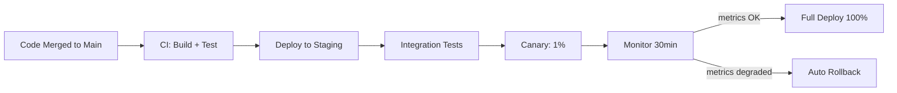

# Zero-Downtime Deployments

## TL;DR

Zero-downtime deployment is the operational discipline of shipping code to production without users experiencing errors or unavailability. The hard part is not the traffic routing — it's **database schema migrations** and **backward compatibility** across the deployment window. A principal engineer should own both.

---

## 1. Deployment Strategies Overview

| Strategy | Description | Risk | Rollback | Infra Cost |
|----------|-------------|------|----------|------------|
| **Rolling** | Replace instances one-by-one | Medium — both versions live briefly | Slow (re-roll forward) | Low — no extra capacity |
| **Blue-Green** | Spin up identical environment, cut traffic | Low — instant cutover | Instant (flip traffic back) | High — 2× infra during deploy |
| **Canary** | Route small % of traffic to new version | Low — blast radius limited | Fast (drain canary) | Medium — canary instances only |
| **Feature Flags** | Ship code off, enable by flag | Very low — decouple deploy from release | Instant (flip flag off) | None — same infra |
| **Shadow / Dark Launch** | Mirror production traffic to new version | None for users | N/A | Medium — parallel stack |

---

## 2. Rolling Deployments

```
Start: [v1][v1][v1][v1][v1]

Step 1: [v2][v1][v1][v1][v1]
Step 2: [v2][v2][v1][v1][v1]
Step 3: [v2][v2][v2][v1][v1]
...
Done:  [v2][v2][v2][v2][v2]
```

**Requirements for correctness**:
- v1 and v2 APIs must be backward-compatible (both versions running simultaneously)
- v1 and v2 must read/write the same database schema without errors
- Load balancer health checks must detect failing instances and route around them

**Kubernetes**: default `RollingUpdate` strategy. Configure `maxUnavailable=0` + `maxSurge=1` for zero downtime (always have full capacity, add one new pod at a time).

---

## 3. Blue-Green Deployments

```
Blue (current production):  [v1][v1][v1] ← 100% traffic
Green (new version):        [v2][v2][v2] ← 0% traffic (warm but idle)

After validation:
Blue:   [v1][v1][v1] ← 0% traffic (standby)
Green:  [v2][v2][v2] ← 100% traffic
```

**Cutover mechanism**: DNS switch, load balancer target group swap (AWS ALB), or Nginx upstream change.

**Rollback**: Flip traffic back to Blue in seconds. Blue remains available for a defined window (typically 1–24 hours) before decommissioning.

**Cost**: Full production capacity must be provisioned in both environments during the deploy window.

**Database challenge**: Both Blue and Green point to the **same database**. Schema must be backward-compatible with both v1 and v2 simultaneously.

---

## 4. Canary Deployments

```
Phase 1: 99% → v1, 1% → v2   (internal users / beta testers)
Phase 2: 90% → v1, 10% → v2  (monitor for 1h)
Phase 3: 50% → v1, 50% → v2  (monitor for 1h)
Phase 4:  0% → v1, 100% → v2 (complete)
```

**Traffic splitting mechanisms**:
- **Weighted target groups** (AWS ALB, GCP Load Balancer): split by request percentage
- **Istio / Service Mesh**: fine-grained traffic control including header-based routing
- **Feature flags**: user-ID-based canary (same user always gets same version)
- **DNS weighted routing**: Route 53 weighted records

**Metrics to watch during canary**:
- Error rate (HTTP 5xx rate)
- P99 latency
- Business metrics (conversion rate, order success rate)
- Infrastructure metrics (CPU, memory, DB connection pool)

**Automated rollback**: When error rate exceeds a threshold (e.g., 1% increase), automatically drain the canary. Implemented with: Argo Rollouts, AWS CodeDeploy, Spinnaker.

---

## 5. Feature Flags

Feature flags decouple **code deployment** from **feature release**. The new code ships dark (disabled for all users), then the flag is enabled gradually.

```
// Deployed in v2 but disabled
if featureFlags.isEnabled("new_checkout_flow", userId) {
    return newCheckoutFlow(request)
}
return legacyCheckoutFlow(request)
```

**Flag targeting strategies**:
- Percentage rollout: 1% → 10% → 50% → 100%
- User segment: internal users → beta users → all users
- Account ID: enable per specific customer (B2B)
- Geography: US only → EU → global

**Feature flag services**: LaunchDarkly, AWS AppConfig, Statsig, GrowthBook (open source), Unleash.

**Pitfalls**:
- **Flag debt**: old flags left in code long after full rollout. Set expiry dates; treat removal as a ticket.
- **Flag explosion**: hundreds of flags with complex interactions. Establish a flag lifecycle policy.
- **Testing all flag combinations**: 10 binary flags = 1,024 combinations. Use flag contracts to limit combinations.
- **Flag evaluation latency**: evaluating 50 flags per request adds latency. Cache flag state; use async refresh.

---

## 6. The Hard Part: Database Schema Migrations

**The problem**: You need to add a column. During a rolling deployment, v1 and v2 of your code run simultaneously. v2 reads the new column; v1 doesn't know it exists.

**The unsafe (wrong) approach**:
1. Run migration (ADD COLUMN)
2. Deploy new code
→ v1 code running alongside fails if migration changes the schema incompatibly

**The safe approach: Expand/Contract (3-phase migration)**

### Phase 1: Expand — add backward-compatible schema change
```sql
-- Migration: add nullable column, no NOT NULL constraint yet
ALTER TABLE orders ADD COLUMN payment_method VARCHAR(50) NULL;
```
Deploy v1 code that ignores `payment_method`. v1 and expanded schema are compatible.

### Phase 2: Migrate — deploy new code that writes to new column
Deploy v2 code:
- Reads from `payment_method` if present, falls back to old field
- Writes to both old field and `payment_method`
Run backfill job to populate `payment_method` for existing rows.

### Phase 3: Contract — clean up the old schema
After 100% of code is on v2 (no v1 instances):
```sql
-- Safe to drop old column now
ALTER TABLE orders DROP COLUMN old_payment_field;
-- Add NOT NULL if desired
ALTER TABLE orders ALTER COLUMN payment_method SET NOT NULL;
```

This process takes **3 separate deployments** and can span days to weeks for large tables.

---

## 7. Zero-Downtime Migration Techniques

### Online Schema Changes

`ALTER TABLE` on large tables (billions of rows) can lock the table for minutes/hours.

**Tools**:
- **gh-ost** (GitHub): uses MySQL binlog replication; creates a ghost table, copies data in background, cuts over with minimal lock (~1 second)
- **pt-online-schema-change** (Percona): trigger-based copy; works with MySQL
- **pglogical / pg_repack**: PostgreSQL equivalent

**AWS RDS**: Multi-AZ modifications can be applied during a maintenance window. For critical paths, use gh-ost even on RDS.

### No-Downtime Index Creation

PostgreSQL: `CREATE INDEX CONCURRENTLY` builds the index without locking reads/writes (slower, but safe for production).

MySQL: `ALTER TABLE ... ALGORITHM=INPLACE, LOCK=NONE` for supported operations.

---

## 8. API Backward Compatibility

During rolling deployments, multiple API versions are live. Rules:

| Change | Backward Compatible? | Strategy |
|--------|---------------------|----------|
| Add optional field to response | ✅ Yes | Ship freely |
| Add required field to request | ❌ No | Make it optional first |
| Remove field from response | ❌ No | Version the API (`/v2/`); deprecate v1 |
| Change field type | ❌ No | Additive field + migration period |
| Change enum values (add new) | ✅ Yes | Ship freely; clients ignore unknown |
| Remove enum value | ❌ No | API version required |

**Consumer-driven contract testing**: Pact framework. Each consumer publishes its expected API contract; CI validates that the producer never breaks a contract. Catches backward-incompatible changes before deployment.

---

## 9. Deployment Pipeline Architecture



**Key principle**: the deployment pipeline must be fully automated. A human should not be required to press "proceed" at each stage unless there's an anomaly. Automated progression + automated rollback = zero-downtime at scale.

---

## 10. Rollback Strategy

**Rollback ≠ roll forward**: rolling back means reverting to the previous version. Some teams prefer "roll forward" (fix forward with a hotfix), especially when DB migrations have already run.

| Scenario | Rollback Possible? | Strategy |
|----------|-------------------|----------|
| Pure code change | ✅ Yes | Revert container image tag |
| Code + additive schema change | ✅ Yes | Code rollback; leave schema as-is (it's backward-compatible) |
| Code + destructive schema change | ❌ Risky | Requires schema rollback migration; may lose data |
| Feature flag release | ✅ Yes, instant | Flip flag off |

**Best practice**: Never run destructive schema changes (DROP COLUMN, NOT NULL constraint) until 100% of traffic has been on the new code version for at least 24 hours and rollback window is closed.

---

## 11. FAANG Interview Callout

**When this comes up**:
- "How do you deploy to 1 billion users without downtime?"
- "What's your release process for a major API change?"
- "How do you run a database migration on a table with 10 billion rows?"

**Common follow-ups**:
1. "What happens if your v2 code has a bug after full rollout?" → Feature flag rollback (instant) or redeploy of previous image (2–5 min pipeline)
2. "How do you migrate a NOT NULL column to a 5B row table?" → gh-ost for the online copy; Expand/Contract for the code rollout; backfill job + cutover
3. "How do you validate a canary before expanding?" → Automated statistical comparison of error rate and P99 latency vs the control group; business metric monitoring (conversion, revenue)
4. "What's the difference between canary and feature flags?" → Canary splits traffic at the infrastructure level (different server versions); feature flags split at the application level (same server, different code paths) — flags are more flexible but add code complexity

**Distinguishing answer**: Go beyond "we use blue-green" to describe the **schema migration strategy** unprompted. Every senior engineer knows blue-green. Only principal engineers think through the database layer: "During the transition, both v1 and v2 must be able to read and write the same schema. Here's how we use Expand/Contract..."
