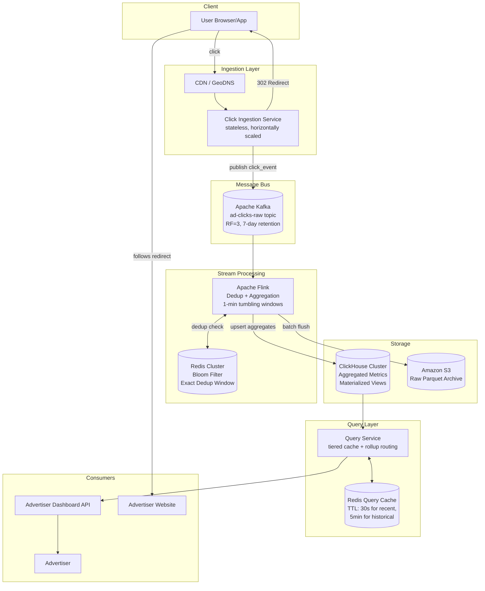

# HLD: Ad Click Aggregator

**Design Target:** Principal Engineer bar — Google / Meta / Amazon  
**Scale:** 10M active ads, 10k clicks/second peak, 100M clicks/day  
**Framework:** RESHADED

---

## Table of Contents

1. [Requirements](#1-requirements)
2. [Estimation](#2-estimation)
3. [Storage Strategy](#3-storage-strategy)
4. [High-Level Design](#4-high-level-design)
5. [API Contracts](#5-api-contracts)
6. [Detail Deep Dives](#6-detail-deep-dives)
7. [Evaluate — Bottlenecks & Failure Modes](#7-evaluate--bottlenecks--failure-modes)
8. [Distinctive Features](#8-distinctive-features)
9. [Follow-Up Interviewer Questions](#9-follow-up-interviewer-questions)

---

## 1. Requirements

### Functional
| # | Requirement |
|---|-------------|
| F1 | User clicks an ad and is redirected to the advertiser's website |
| F2 | Advertisers can query ad click metrics over time with minimum 1-minute granularity |

### Non-Functional
| # | Requirement | Target |
|---|-------------|--------|
| NF1 | Peak throughput | 10,000 clicks/second |
| NF2 | Analytics query latency | < 1 second P99 |
| NF3 | Click data durability | Zero data loss — fault tolerant pipeline |
| NF4 | Data freshness | Clicks queryable within 1–2 minutes of occurring |
| NF5 | Idempotency | No double-counting of the same click event |

### Out of Scope
- Ad targeting / serving
- Fraud / spam detection
- Cross-device tracking, geo/demographic profiling
- Conversion tracking

---

## 2. Estimation

### Traffic
```
Peak writes:   10,000 clicks/second
Average writes: ~1,000 clicks/second  (peak ≈ 10× average heuristic)
Daily clicks:   1,000 × 86,400 ≈ 100M clicks/day
```

### Click Event Payload
```
Fields: click_id (16B), ad_id (8B), user_id (8B), timestamp (8B),
        ip (16B), user_agent (100B), referrer_url (100B), page_url (100B)
Payload size ≈ 360 bytes (compressed ~180 bytes)
```

### Raw Storage
```
Daily raw:    100M × 360B  ≈  36 GB/day
Annual raw:   36 × 365     ≈  13 TB/year
Kafka (7-day retention):    ≈  252 GB
S3 (cold archive, compressed): ≈ 2.3 TB/year
```

### Aggregated Storage
```
Active ads:       10M
Average clicks/ad/day: 10  →  most ads sparse at minute level
Aggregated rows at 1-min granularity (non-zero buckets):  ~100M rows/day
Row size (ad_id, minute_ts, click_count, unique_users_hll): 100 bytes
Daily aggregated: 100M × 100B = 10 GB/day
Annual:           ~3.6 TB/year
```

### Read Traffic (analytics queries)
```
Assume 100K advertisers, each issuing ~10 queries/day:
  → 1M queries/day  ≈  12 QPS average
Peak query load:    ~120 QPS  (well within ClickHouse/Druid range)
```

---

## 3. Storage Strategy

### The Core Trade-off: OLTP vs OLAP

Ad click data has two fundamentally different access patterns:

| Access Pattern | Characteristics | Best Fit |
|----------------|-----------------|----------|
| Click ingestion (writes) | High-volume, sequential, time-ordered | Kafka → append-only |
| Analytics queries (reads) | Aggregations over time ranges, group-by ad_id | Columnar OLAP store |

Trying to serve both from a single RDBMS fails at this scale (10k writes/s + sub-second analytics across billions of rows). The architecture separates these concerns explicitly.

### Storage Layer Decision Matrix

| Layer | Technology | Why |
|-------|-----------|-----|
| Event stream (ingestion buffer) | Apache Kafka | Durable, ordered, replayable, decouples writers from consumers |
| Aggregated analytics store | ClickHouse | Columnar OLAP, sub-second queries at 100B+ row scale, native time-series aggregation |
| Raw event archive | Amazon S3 + Parquet | Cheap cold storage, replayable for re-aggregation, auditing |
| Deduplication index | Redis (Bloom Filter + exact set) | Sub-millisecond lookup, TTL-based expiry, memory-efficient |
| Ad metadata | PostgreSQL | Low cardinality (10M ads), relational, ACID for ad CRUD |

### Data Model

**Kafka Topic: `ad-clicks-raw`**
```json
{
  "click_id":   "01HX3K...",   // UUIDv7 — time-sortable
  "ad_id":      "ad_9023871",
  "user_id":    "usr_4028234",
  "timestamp":  1717804823441, // epoch ms
  "ip":         "203.0.113.42",
  "user_agent": "Mozilla/5.0...",
  "referrer":   "https://news.example.com/article/123",
  "page_url":   "https://app.example.com/home"
}
```
- Partitioned by `ad_id` hash — ensures all events for an ad land on the same partition, enabling ordered per-ad dedup within a window.

**ClickHouse: `ad_click_metrics` (aggregated)**
```sql
CREATE TABLE ad_click_metrics (
    ad_id         UInt64,
    minute_bucket DateTime,           -- truncated to 1-minute floor
    click_count   UInt64,
    unique_users  AggregateFunction(uniq, UInt64),  -- HyperLogLog sketch
    date          Date MATERIALIZED toDate(minute_bucket)
)
ENGINE = AggregatingMergeTree()
PARTITION BY date
ORDER BY (ad_id, minute_bucket);
```

**ClickHouse: Materialized rollup views**
```sql
-- Hourly rollup (auto-updated by ClickHouse)
CREATE MATERIALIZED VIEW ad_click_metrics_hourly ...
-- Daily rollup
CREATE MATERIALIZED VIEW ad_click_metrics_daily ...
```

Rollup views are the key to sub-second queries over multi-month time ranges — avoid full scans of the minute-level table.

---

## 4. High-Level Design

### Architecture Diagram



### Request Flows

#### Click Flow (Write Path)
```
1. User clicks ad on publisher page
2. Browser sends GET /click?ad_id=X&user_id=Y&click_id=<client-generated-uuid>
   to nearest CDN PoP → routes to Click Ingestion Service
3. Click Ingestion Service:
   a. Validates required fields (ad_id, click_id)
   b. Enriches event (server timestamp, IP, geohash)
   c. Publishes to Kafka topic `ad-clicks-raw` [async, fire-and-forget after ACK]
   d. Returns HTTP 302 → advertiser URL  [P99 < 20ms — user UX is the SLA here]
4. Kafka persists event with replication factor 3 (durable)
5. Flink consumer group reads from Kafka:
   a. Deduplication check (see §6)
   b. Aggregates into 1-minute tumbling windows by ad_id
   c. On window close: upserts to ClickHouse, archives to S3
6. ClickHouse merges AggregatingMergeTree parts in background
```

#### Query Flow (Read Path)
```
1. Advertiser calls GET /metrics?ad_id=X&from=T1&to=T2&granularity=1h
2. Query Service:
   a. Check Redis query cache (key = hash of params, TTL: 30s if T2 < now-2min)
   b. Cache miss → route to appropriate rollup table based on time range:
      - ≤ 3 hours: minute-level table
      - ≤ 7 days:  hourly rollup
      - > 7 days:  daily rollup
   c. Execute ClickHouse query, return response
   d. Populate cache
3. Return JSON metrics response
```

---

## 5. API Contracts

### Click Endpoint

```
GET /v1/click

Query Parameters:
  ad_id     (required) string   — the ad identifier
  click_id  (required) string   — UUIDv7, client-generated for idempotency
  user_id   (optional) string   — hashed/anonymized user identifier
  redirect  (required) string   — advertiser destination URL (validated allowlist)

Response:
  HTTP 302  Location: <redirect>
  X-Click-ID: <server_confirmed_click_id>

Error responses:
  400  Missing required parameters
  422  Redirect URL not in allowlist for this ad_id
```

**Design note:** The redirect URL is not a free parameter — it is looked up from the ad record (stored in PostgreSQL) using `ad_id` to prevent open redirect abuse.

### Analytics Query Endpoint

```
GET /v1/ads/{ad_id}/metrics

Path Parameters:
  ad_id   string  — advertiser's ad identifier

Query Parameters:
  from          (required) ISO8601 timestamp
  to            (required) ISO8601 timestamp
  granularity   (optional) enum: 1m | 1h | 1d  (default: auto based on range)

Response 200:
{
  "ad_id": "ad_9023871",
  "from": "2024-06-01T00:00:00Z",
  "to":   "2024-06-01T01:00:00Z",
  "granularity": "1m",
  "data_freshness_seconds": 45,
  "buckets": [
    {
      "timestamp": "2024-06-01T00:00:00Z",
      "click_count": 1420,
      "unique_users_approx": 1389
    },
    ...
  ]
}

Error responses:
  400  Invalid time range (to < from, range > 1 year)
  403  Ad does not belong to authenticated advertiser
  404  Ad not found
  429  Rate limit exceeded
```

### Batch Metrics Endpoint

```
POST /v1/ads/metrics/batch

Body:
{
  "ad_ids": ["ad_1", "ad_2", ...],  // max 100
  "from": "...",
  "to": "...",
  "granularity": "1h"
}

Response: same structure as single, keyed by ad_id
```

---

## 6. Detail Deep Dives

### 6.1 Idempotency — The Hard Problem

Double-counting clicks is a correctness bug that erodes advertiser trust. Three deduplication layers:

#### Layer 1: Client-Side Click ID
- The ad creative (JS pixel or server-side tag) generates a `click_id = UUIDv7()` before the redirect request.
- UUIDv7 is time-sortable, which matters for Kafka partition ordering.
- Retried requests carry the same `click_id`.

#### Layer 2: Redis Bloom Filter (Click Ingestion Service)
- Before publishing to Kafka, the Click Ingestion Service checks a Redis Bloom Filter.
- **False positive rate:** 0.01% → acceptable (drops a tiny fraction of real clicks, but prevents clear duplicate storms).
- **Memory:** 100M clicks/day at 0.01% FPR ≈ 240 MB — fits in a single Redis node.
- **TTL:** 1-hour sliding window (sufficient for retry dedup; most bot retries are within seconds).

```
click_id → BF.ADD clicks:window:<current_minute> <click_id>
             if already exists → drop (duplicate)
```

#### Layer 3: Flink Exactly-Once with State Backend (Stream Processor)

The Bloom Filter has false positives. Flink provides the backstop:
- **Exactly-once semantics** via Kafka transactional producer + Flink checkpointing to S3.
- Flink maintains a keyed state: `(click_id → bool)` in RocksDB state backend with a 1-hour TTL.
- Window closes trigger a transactional write to ClickHouse.
- If Flink restarts, it replays from the last checkpoint — Kafka's `at-least-once` delivery + Flink state dedup = `exactly-once` downstream.

```
trade-off: State backend size grows with dedup window.
1-hour window at 10k clicks/s = 36M entries × ~50 bytes = 1.8 GB per Flink TaskManager.
Manageable with RocksDB (disk-backed) or by reducing dedup window to 10 minutes.
```

### 6.2 Stream Aggregation — Flink Window Design

```
Flink Job Topology:
  Kafka Source
    → keyBy(ad_id)
    → TumblingEventTimeWindow(1 minute)
    → Aggregate(count, HyperLogLog for unique users)
    → Sink: ClickHouse (JDBC or HTTP bulk insert)
    → Sink: S3 (Parquet, partitioned by date/hour)
```

**Event Time vs Processing Time:**
- Use **event time** (timestamp in the click event), not processing time.
- Reason: network delays and Kafka consumer lag can cause late arrivals. Processing time would misattribute clicks to wrong minute buckets.
- **Watermark strategy:** Allow up to 30-second lateness. Events arriving after watermark are emitted to a side output for correction (late data merge).

**Late Data Handling:**
```
If event arrives 30–300 seconds late:
  → Side output "late-arrivals" topic
  → Separate Flink job processes late-arrivals
  → Issues compensating upsert to ClickHouse (AggregatingMergeTree handles this)
If event arrives > 300 seconds late:
  → Dropped (acceptable: this is network anomaly / attack)
  → Logged to S3 dead-letter bucket for audit
```

### 6.3 ClickHouse Query Optimization

**Why ClickHouse over Druid / BigQuery for this use case:**

| Criterion | ClickHouse | Apache Druid | BigQuery |
|-----------|-----------|-------------|---------|
| Ingestion latency | ~1s (streaming via Kafka engine) | ~1s (Kafka indexing) | ~60s (streaming) |
| Query latency (10B rows) | Sub-second | Sub-second | 2–10s |
| Operational complexity | Medium | High (many components) | Low (managed) |
| Cost model | Self-hosted, predictable | Self-hosted, high memory | Per-query, expensive at scale |
| Materialized views | Native, auto-updated | Native | Requires scheduling |
| **Verdict** | **Best fit** | Second choice | Poor fit for freshness SLA |

**Query Routing Logic in Query Service:**
```python
def route_query(from_ts, to_ts, granularity):
    range_hours = (to_ts - from_ts).hours
    if granularity == "1m" or range_hours <= 3:
        return "ad_click_metrics"           # minute table
    elif granularity == "1h" or range_hours <= 168:  # 7 days
        return "ad_click_metrics_hourly"    # hourly MV
    else:
        return "ad_click_metrics_daily"     # daily MV
```

**Pre-computed materialized views eliminate full table scans for all common query patterns.** An advertiser querying "last 30 days" hits the daily rollup table: 10M ads × 30 days = 300M rows, but indexed by `(ad_id, date)` so a single ad query scans 30 rows — microseconds.

### 6.4 Data Freshness — Meeting the "As Realtime As Possible" SLA

The pipeline latency budget:
```
Click event generated:          T+0
Kafka publish (CIS → Kafka):    T+50ms
Flink watermark delay:          T+30s   (allows late arrivals)
Flink window tumble period:     T+60s   (1-minute windows close every 60s)
ClickHouse write + merge:       T+5s    (async background merge)
─────────────────────────────────────────
Data queryable by advertiser:   T+95s   ≈ 1.5 minutes
```

This meets a practical "near real-time" SLA. To go lower (sub-minute), you would need:
- Reduce watermark lateness to 5s (risk: lose 10–15% late events)
- Use session windows instead of tumbling windows
- Stream directly into ClickHouse via Kafka table engine (bypass Flink window close delay)

The 1.5-minute delay is the right default trade-off: it captures virtually all late events while giving advertisers actionable data well within a 5-minute threshold.

### 6.5 Scaling the Click Ingestion Service

The Click Ingestion Service is the entry point for 10k clicks/second. It must be:
- **Stateless** — all dedup state is in Redis, not in-process
- **Horizontally scalable** — add instances behind a load balancer
- **Fast** — the dominant latency cost is the 302 redirect, not the Kafka publish

**Sizing:**
```
10,000 clicks/second
Each request: ~5ms to validate + enrich + publish to Kafka (async ACK)
Per-instance throughput (200 goroutines/instance): ~2,000 req/s
Instances needed at peak: 5
With 2× headroom: 10 instances
```

The Kafka publish is async (fire-and-forget after Kafka ACK). The 302 redirect does not wait for downstream processing — this is what gives us < 20ms P99 redirect latency.

**What happens if Kafka is slow?**
- The Click Ingestion Service uses a local in-memory buffer (bounded queue, size 50k) as a back-pressure mechanism.
- If the buffer fills, we return 202 Accepted and drop the Kafka publish (graceful degradation — we choose redirect latency over guaranteed delivery for the < 0.01% overflow case).
- Alert fires when buffer utilization > 60%.

---

## 7. Evaluate — Bottlenecks & Failure Modes

### Bottleneck Analysis

| Component | Bottleneck | Mitigation |
|-----------|-----------|-----------|
| Click Ingestion Service | CPU-bound at 10k/s per instance | Stateless — scale horizontally; Go/Rust for high throughput |
| Kafka | Partition count limits parallelism | Partition by `ad_id % N` (N=200 partitions); scale brokers |
| Flink dedup state | RocksDB state grows unbounded | TTL on dedup state (1h); compact RocksDB regularly |
| ClickHouse writes | MergeTree part merges cause write amplification | Use `Buffer` table engine as ingestion buffer; batch inserts |
| Redis Bloom Filter | Memory grows with click volume | Per-minute bloom filters with 10-min expiry window |
| Query Service | Hot ads generate repeated identical queries | Redis query cache with short TTL (30s for recent data) |

### Failure Mode Analysis

| Failure | Impact | Detection | Recovery |
|---------|--------|-----------|---------|
| Click Ingestion Service instance dies | Partial traffic loss during LB failover (~1s) | Health check, ALB 504 rate | LB routes to healthy instances in < 1s |
| Kafka broker dies | No data loss (RF=3); consumers pause | Consumer lag alert | Kafka leader election < 30s; consumers auto-resume |
| Flink job crashes | Aggregation pauses; no data loss | Job health metric, lag grows | Flink restarts from last checkpoint (< 2min); replays from Kafka |
| ClickHouse node dies | Read queries degrade | Replica health alert | Queries route to replica; dead node replaced |
| Redis dies | Bloom filter dedup disabled | Redis connection errors | Fall back to Flink state-only dedup; accept brief dedup gap |
| S3 unavailable | Raw archive pauses | S3 error rate | Flink buffers to local disk (bounded); retries with backoff |

### Data Loss Scenario: Worst Case

**Scenario:** Flink job crashes with no checkpoint, Kafka retention is 7 days.  
**Recovery:** Flink restarts from Kafka offset 0 (beginning), replays all 7 days of events, rebuilds all aggregates. This is a recovery operation (hours), but **zero data loss**. This is why Kafka retention > checkpoint interval is the critical invariant to maintain.

---

## 8. Distinctive Features

### Why This Design Stands Out at Principal Engineer Bar

**1. Lambda-less Pipeline (no dual write complexity)**  
Many click aggregator designs propose a Lambda architecture: a real-time stream layer (Flink) + a batch layer (Spark on S3) that periodically corrects the stream layer. This doubles operational complexity.

This design avoids Lambda by using:
- Event-time processing with generous watermarks (captures late arrivals)
- Late-data side outputs with compensating upserts to ClickHouse
- `AggregatingMergeTree` in ClickHouse handles out-of-order upserts natively

The S3 archive is a pure audit/replay mechanism, not a batch correction layer.

**2. Three-Layer Deduplication**  
Most designs address idempotency with a single mechanism. This design uses three layers with different trade-off profiles: client-side (prevents most retries), Bloom Filter (fast probabilistic gate), Flink exactly-once state (guaranteed correctness). Each layer has a defined failure mode — the system degrades gracefully rather than catastrophically.

**3. Tiered Query Routing**  
Rather than querying the raw minute table for all time ranges (a common design mistake), the Query Service routes to pre-aggregated rollup tables based on the query range. This is the difference between 10ms and 30s for a "last 90 days" query.

**4. Back-of-Envelope Validates Architecture**  
The 1.5-minute data freshness latency is derived from the pipeline components, not asserted. This lets us reason about trade-offs: want 30-second freshness? Here is what breaks and what it costs.

---

## 9. Follow-Up Interviewer Questions

These are the questions a principal engineer interviewer will ask. Know the answers.

### Q1: How would you handle a "thundering herd" when a viral ad gets 1000× normal click rate?

**Answer:**  
The Kafka partition for that `ad_id` becomes a hot partition. Solutions:
- **Short-term:** Add a random salt suffix to `click_id` for partitioning (still dedup by `click_id` in Flink state), distributing the hot ad across multiple partitions.
- **Flink backpressure:** Flink auto-throttles from the source when downstream is slow. The Kafka consumer group simply pauses on that partition — click data is buffered in Kafka, not lost.
- **ClickHouse:** The `AggregatingMergeTree` handles high write rates via its async merge tree — no hot-spot issue at query time since queries are indexed by `(ad_id, minute_bucket)`.

### Q2: An advertiser says their click counts are wrong. How do you debug it?

**Answer:** 3-layer audit trail:
1. **Kafka raw topic** — pull raw events for the time window and ad_id. Count raw events.
2. **Flink dedup log** — check how many events were dropped by each dedup layer (Bloom Filter drops vs Flink state drops).
3. **ClickHouse minute table** — compare aggregated count against raw Kafka count.

If Kafka count > ClickHouse count: deduplication over-dropped (Bloom Filter false positives or Flink state incorrect). Replay from Kafka raw events, bypassing dedup, to recompute the correct aggregate. ClickHouse upsert corrects the stored value.

### Q3: How would you extend this for real-time bidding (RTB) budget pacing?

**Answer:** Budget pacing requires knowing spend in near-real-time to prevent overspend. The current pipeline's 1.5-minute latency is too slow for a $100/day budget that could exhaust in 2 minutes.

Extension:
- Add a dedicated **Pacing Flink job** that reads the same Kafka topic but maintains per-ad running counters in memory (not just 1-min windows) — sub-second updates.
- Expose a **Budget Check Service** backed by Redis counters (Flink increments via Lua scripts, atomically).
- Click Ingestion Service checks budget before accepting the click: if remaining budget = 0, return 204 No Content (click dropped, no redirect).

This is a separate subsystem with its own consistency requirements (eventual is okay — slight overspend is acceptable in most RTB contracts).

---

## Architecture Summary Card

```
┌─────────────────────────────────────────────────────────────┐
│                    AD CLICK AGGREGATOR                       │
│                                                             │
│  WRITE PATH                                                 │
│  Browser → CDN → Click Ingestion (10 instances)             │
│         → Kafka (200 partitions, RF=3)                      │
│         → Flink (dedup + 1-min tumbling windows)            │
│         → ClickHouse (AggregatingMergeTree)                 │
│         → S3 (raw Parquet archive)                          │
│                                                             │
│  READ PATH                                                  │
│  Advertiser → Query Service → Redis Cache (30s TTL)         │
│                             → ClickHouse rollup tables      │
│                                                             │
│  DEDUP LAYERS                                               │
│  1. Client-generated UUIDv7 click_id                        │
│  2. Redis Bloom Filter (1-hour window, 0.01% FPR)           │
│  3. Flink exactly-once (RocksDB state, 1-hour TTL)          │
│                                                             │
│  KEY NUMBERS                                                │
│  Redirect latency:    < 20ms P99                            │
│  Data freshness:      ~90 seconds                           │
│  Query latency:       < 1s P99 (via rollup routing)         │
│  Durability:          Zero loss (Kafka RF=3 + replay)       │
└─────────────────────────────────────────────────────────────┘
```

---

*Calibrated to: Principal Engineer interview at Google / Meta / Amazon — handles 100M+ users, references real failure modes, no single point of failure.*
