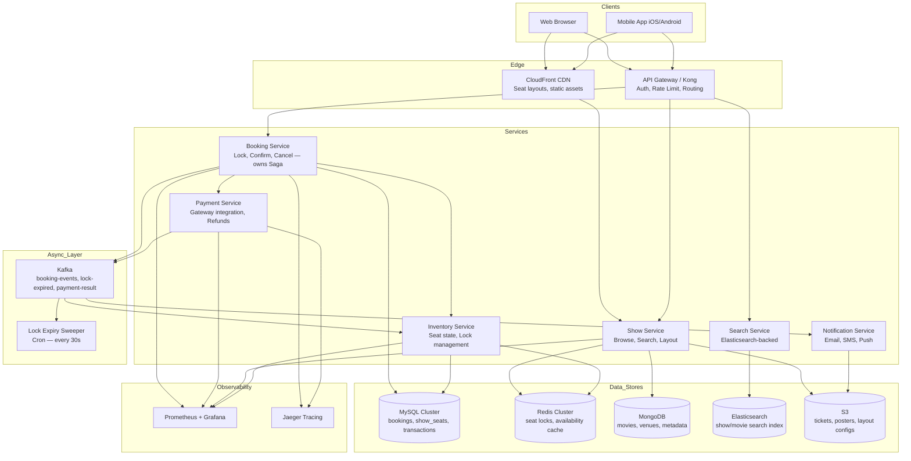
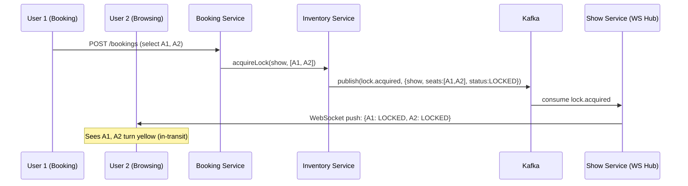

# System Architecture — Movie Booking Platform

---

## High-Level Component Diagram



---

## Service Responsibilities

### 1. Show Service

**Owns**: Movie browse, show listing, seat layout view

**Tech**: Go (high read throughput, low latency)

**Critical path**:
```
Client → CDN (cache hit) → done
Client → CDN (miss) → Show Service → Redis Hash (layout) → response
Client → CDN (miss) → Show Service → MySQL (fallback) → response
```

**SLA**: p99 < 200ms for seat layout

### 2. Booking Service

**Owns**: The entire booking Saga — seat lock acquisition, booking record creation, Saga orchestration

**Tech**: Java Spring Boot (ACID transactions, mature ecosystem)

**This is the most critical service.** It coordinates:
1. Seat lock via Inventory Service
2. Booking record creation in MySQL
3. Payment initiation
4. Confirmation or rollback

See [04-booking-flow.md](04-booking-flow.md) for the full Saga.

### 3. Inventory Service

**Owns**: Seat state transitions, lock lifecycle, real-time seat availability

**Tech**: Go

**State machine enforced here**. No other service changes seat status directly.

```
AVAILABLE → LOCKED    (lock acquired)
LOCKED → AVAILABLE    (TTL expired or payment failed)
LOCKED → BOOKED       (payment confirmed)
BOOKED → AVAILABLE    (cancellation within policy)
```

### 4. Payment Service

**Owns**: Payment gateway integration (Razorpay, Stripe, UPI), refund processing

**Tech**: Java (compliance, audit logging, database transactions)

**Publishes events**:
- `payment.success` → Booking Service confirms seats
- `payment.failed` → Booking Service rolls back locks
- `payment.refunded` → Booking Service cancels, seats released

### 5. Notification Service

**Owns**: Email/SMS/push delivery — all async via Kafka

**Tech**: Go + SendGrid/Twilio/Firebase

**Idempotency**: Deduplicates on `booking_id` — retries are safe.

### 6. Lock Expiry Sweeper

**Owns**: Cleaning up expired locks that Redis TTL missed (edge cases: Redis node failover)

**Pattern**: Cron job every 30 seconds
```sql
UPDATE show_seats
SET status = 'AVAILABLE', lock_expires_at = NULL, locked_by = NULL
WHERE status = 'LOCKED' AND lock_expires_at < NOW();
```
Publishes `lock.expired` Kafka event → Inventory Service syncs Redis.

---

## Data Flow: Seat Selection to Confirmed Booking

```
1. User opens seat map
   GET /shows/{id}/seats
   └─ CDN hit → layout JSON with seat states
   └─ CDN miss → Show Service → Redis HGETALL layout:{show_id}
                → if Redis miss → MySQL show_seats → cache in Redis

2. User selects 2 seats
   POST /bookings  {show_id, seat_ids: [A1, A2], user_id}
   └─ Booking Service creates booking record (PENDING)
   └─ Calls Inventory Service: acquire locks
      └─ Redis: SET seat:{show}:A1 {user_id} EX 600 NX  → OK
      └─ Redis: SET seat:{show}:A2 {user_id} EX 600 NX  → OK
      └─ MySQL: UPDATE show_seats SET status=LOCKED WHERE ...
      └─ Redis: HSET layout:{show_id} A1 LOCKED A2 LOCKED  [invalidate cache]
   └─ Returns booking_id + payment_url + expires_at

3. Seat map updates (WebSocket push to other users)
   Inventory Service → Kafka lock.acquired → Show Service → WebSocket → clients

4. User completes payment
   POST /bookings/{id}/pay  {payment_method, ...}
   └─ Payment Service charges gateway
   └─ On SUCCESS: publishes payment.success
      └─ Booking Service: UPDATE booking status=CONFIRMED
      └─ Inventory Service: UPDATE show_seats status=BOOKED
      └─ Redis: DEL seat:{show}:A1, seat:{show}:A2  [remove locks]
      └─ Redis: HSET layout:{show_id} A1 BOOKED A2 BOOKED
      └─ Notification Service: send e-ticket
   └─ On FAILURE: publishes payment.failed
      └─ Inventory Service: UPDATE show_seats status=AVAILABLE
      └─ Redis: DEL seat:{show}:A1, seat:{show}:A2
      └─ Redis: HSET layout:{show_id} A1 AVAILABLE A2 AVAILABLE
      └─ Booking Service: UPDATE booking status=FAILED
```

---

## Real-Time Seat Availability (WebSocket / SSE)



**Tech choice**: SSE (Server-Sent Events) for seat map updates — simpler than WebSocket for one-directional server→client pushes. Falls back to 5-second polling if SSE connection drops.

---

## Tech Stack Summary

| Layer | Technology | Why |
|-------|-----------|-----|
| API Gateway | Kong | Rate limiting per show_id, plugin ecosystem |
| Show Service | Go | High concurrency, low GC pause for reads |
| Booking Service | Java Spring Boot | ACID transactions, mature Saga libraries |
| Inventory Service | Go | Speed, lightweight for Redis-heavy ops |
| Payment Service | Java | Compliance, transaction support, audit |
| Notification Service | Go + Kafka | Async, idempotent, fan-out |
| Primary DB | MySQL 8.0 InnoDB | ACID, row-level locking, battle-tested |
| Content DB | MongoDB | Flexible schema for movie/venue metadata |
| Cache | Redis 7 Cluster | Atomic ops (NX, Lua scripts), TTL, Pub/Sub |
| Search | Elasticsearch 8 | Full-text, geo-filter (city), facets |
| Queue | Kafka | Event sourcing, replay, consumer groups |
| CDN | CloudFront | Global edge, S3 origin integration |
| Object Store | S3 | Tickets, posters, layout configs |
| Container | Kubernetes (EKS) | Pod autoscaling, service mesh (Istio) |
| Observability | Prometheus + Grafana + Jaeger | Metrics, tracing, alerting |
| CI/CD | GitHub Actions + ArgoCD | GitOps, blue-green deployments |

---

## Deployment Architecture

```
Region: ap-south-1 (Mumbai) — primary
Region: ap-southeast-1 (Singapore) — hot standby (active-active reads)

Within each region:
  3 AZs — each with:
    - Booking Service pods (3 min, autoscale to 50)
    - Show Service pods (5 min, autoscale to 100)
    - Redis Cluster (3 primary + 3 replica, one per AZ)
    - MySQL (1 writer, 2 read replicas, 1 per AZ)

Cross-region:
  - MySQL: async replication to Singapore (RPO ~5s)
  - Redis: no cross-region sync (booking locks are region-local)
  - Bookings always served from primary region (write consistency)
```

> **Why not multi-region writes for booking?** The seat locking guarantee requires a single authoritative Redis + MySQL pair. Cross-region distributed locking (Redlock) adds complexity and latency. For a booking system, users accept Mumbai-region latency over risk of double-booking.
