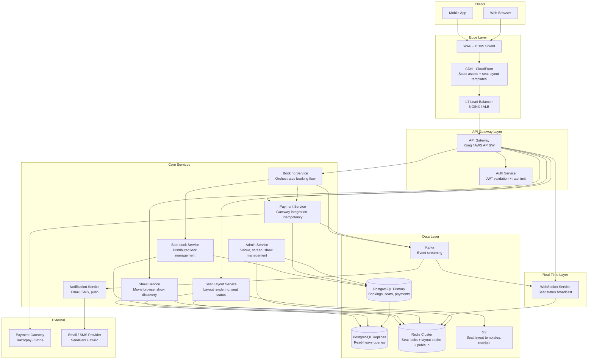

# 02 — High-Level Architecture

---

## System Architecture Diagram



---

## Service Responsibilities

### Show Service
- Movie catalog: search by city, date, genre, language
- Show schedule management
- Pricing tier lookup
- **Data source**: PostgreSQL read replica + Redis cache (show metadata TTL: 5 min)

### Seat Layout Service
- Returns physical seat grid (row/column/type) — rarely changes
- Returns per-seat availability status — changes every second during peak
- Serves layout template from S3/CDN (static)
- Overlays dynamic status from Redis Hash
- **Critical path**: must return in < 200ms; always cache-first

### Booking Service
- Orchestrates the booking state machine
- Calls Seat Lock Service to acquire/release locks
- Calls Payment Service to initiate payment
- Publishes events to Kafka on state transitions
- Owns the `bookings` table

### Seat Lock Service
- Single responsibility: acquire and release seat locks
- Dual write: Redis SETNX (fast path) + DB UPDATE (authoritative)
- Owns lock TTL enforcement via Redis keyspace notifications
- Exposes: `AcquireLocks`, `ReleaseLocks`, `ExtendLock`, `ExpireLocks`

### Payment Service
- Integrates with Razorpay / Stripe
- Idempotent payment initiation (idempotency key per booking attempt)
- On success: writes outbox event for Booking Service to confirm
- On failure: triggers compensating lock release via Kafka event
- Handles webhook callbacks from payment gateway

### WebSocket Service
- Maintains WebSocket connections for seat layout viewers
- Subscribes to Redis pub/sub channel `seat-updates:{show_id}`
- Pushes seat status delta events to connected clients
- Stateless per connection; backed by Redis for fan-out

### Notification Service
- Consumes `booking.confirmed` and `booking.failed` Kafka events
- Sends email confirmation (PDF receipt from S3) and SMS
- Idempotent: deduplicates by booking_id

---

## Tech Stack

### Application Services

| Component | Choice | Justification |
|-----------|--------|---------------|
| Primary language | Go | Low latency, high concurrency, small memory footprint for 2,000 lock TPS |
| REST framework | Go net/http + chi | Lightweight, stdlib-compatible |
| WebSocket | Gorilla WebSocket | Battle-tested, full-duplex |
| Service-to-service | gRPC | Type-safe contracts, bi-directional streaming for lock service |

### Data

| Component | Choice | Justification |
|-----------|--------|---------------|
| Primary DB | PostgreSQL 15 | ACID, optimistic locking, row-level locks, JSONB |
| Read replicas | PostgreSQL streaming replication | Horizontal read scale; show browse is read-heavy |
| Cache + locks | Redis 7 Cluster | Atomic SETNX, sub-ms latency, pub/sub, data structures |
| Event streaming | Apache Kafka | Exactly-once, replay, multi-consumer, high throughput |
| Object storage | AWS S3 | Seat layout templates, booking PDFs, audit logs |
| Search | Elasticsearch | Movie/show discovery, fuzzy search (separate from booking path) |

### Infrastructure

| Component | Choice | Justification |
|-----------|--------|---------------|
| Container orchestration | AWS EKS (Kubernetes) | Auto-scaling for peak load |
| Load balancer | AWS ALB | Path-based routing, WebSocket support |
| CDN | CloudFront | Global edge for seat layout templates |
| Redis cluster | AWS ElastiCache (Redis 7) | Managed, multi-AZ, cluster mode |
| PostgreSQL | AWS RDS Multi-AZ | Managed failover, automated backups |
| Kafka | AWS MSK | Managed Kafka, exactly-once semantics |
| API Gateway | Kong | Rate limiting, JWT validation, circuit breaking |

### Observability

| Component | Choice | Notes |
|-----------|--------|-------|
| Metrics | Prometheus + Grafana | QPS, lock acquisition latency, payment success rate |
| Tracing | Jaeger (OpenTelemetry) | End-to-end booking trace across services |
| Logging | ELK Stack | Structured JSON logs, booking audit trail |
| Alerting | PagerDuty | Double-booking detection alert (< 1 min MTTA) |

---

## Deployment Architecture

```
Region: ap-south-1 (Mumbai primary)
  AZ-a: Booking Service pods, PostgreSQL Primary, Redis Primary
  AZ-b: Booking Service pods, PostgreSQL Standby, Redis Replica
  AZ-c: Booking Service pods, WebSocket pods

Cross-region DR: ap-southeast-1 (Singapore)
  PostgreSQL read replica (async)
  Redis replica (passive)
  Booking Service in warm-standby mode
```

**RPO**: 30 seconds (async replication lag)  
**RTO**: 5 minutes (automated failover via Route 53 health checks)

---

## API Gateway Rate Limits

| Endpoint | Limit | Why |
|----------|-------|-----|
| GET /shows/{id}/seats | 60 req/min per user | Prevents polling abuse |
| POST /bookings/initiate | 5 req/min per user | Prevents lock hoarding |
| POST /bookings/{id}/pay | 3 req/min per user | Prevents payment retry spam |
| GET /movies | 200 req/min per user | Read-heavy, cache-backed |

Flash sale mode: user-level limits stay, global circuit breaker activates at 80% capacity.
