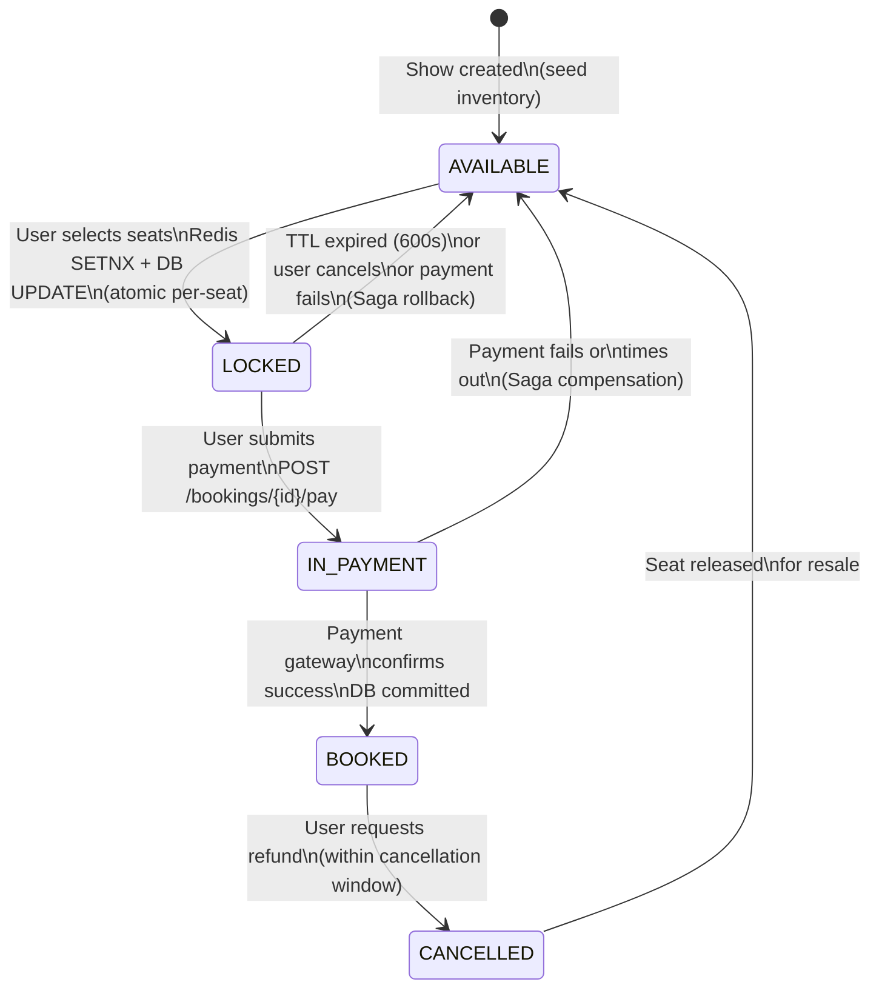

# 03 — Seat Locking Design

> This is the most critical component. The hard invariant is: **a seat confirmed by user A can never be confirmed by user B.** Every design choice in this file flows from that invariant.

---

## Seat State Machine



### State Definitions

| State | Meaning | Visible to Others |
|-------|---------|-------------------|
| `AVAILABLE` | Seat can be selected | Shown as empty |
| `LOCKED` | Held by a user for up to 10 min | Shown as "being selected" (amber) |
| `IN_PAYMENT` | Payment submitted, awaiting gateway | Shown as "being booked" (amber) |
| `BOOKED` | Confirmed, seat taken | Shown as booked (red) |
| `CANCELLED` | Booking cancelled, seat returned | Transitions back to AVAILABLE |
| `BLOCKED` | Admin-blocked (tech issue, VIP hold) | Shown as unavailable |

---

## Lock Acquisition Algorithm

### Why Dual Write (Redis + DB)?

| Redis Only | DB Only | Redis + DB |
|-----------|---------|------------|
| Fast (<1ms) | Slow (5–10ms) | Fast path + authoritative |
| Not durable | Durable, ACID | Best of both |
| Lost on crash | High lock contention | Redis fails → fallback to DB |
| No audit trail | Full audit trail | Full audit trail |

**Decision**: Redis as the fast gate (prevents most conflicts at microsecond speed), DB as the source of truth (guarantees correctness if Redis and reality diverge).

### Step-by-Step Lock Acquisition

```
Input: show_id, seat_ids[], user_id, booking_id

Phase 1 — Redis fast lock (all-or-nothing):
  For each seat_id:
    key = "seat_lock:{show_id}:{seat_id}"
    value = JSON{user_id, booking_id, expires_at=now+600}
    result = SETNX key value EX 600

  If ANY SETNX returns 0 (already locked):
    → Release all locks acquired so far (DEL each key)
    → Return SeatConflictError{conflicting_seats}

Phase 2 — DB authoritative lock (conditional UPDATE):
  BEGIN TRANSACTION;
    UPDATE show_seat_inventory
    SET
      status = 'LOCKED',
      locked_by_user = :user_id,
      lock_id = :booking_id,
      lock_expires_at = now() + interval '10 minutes',
      version = version + 1
    WHERE
      show_id = :show_id
      AND seat_id = ANY(:seat_ids)
      AND status = 'AVAILABLE';      ← only AVAILABLE rows

    updated_count = rows_affected;

  IF updated_count != len(seat_ids):
    → ROLLBACK
    → Release Redis locks acquired in Phase 1
    → Return SeatConflictError (DB says seat was taken)

  COMMIT;

Phase 3 — Broadcast (fire-and-forget):
  PUBLISH seat-updates:{show_id} {seats: [{seat_id, status:'L'},...]}
  → WebSocket service pushes to all viewers of this show
```

### Why Conditional UPDATE (not SELECT + UPDATE)?

A `SELECT ... FOR UPDATE` followed by a separate `UPDATE` creates a window between the select and update where another transaction can slip in. The conditional `UPDATE WHERE status='AVAILABLE'` is a single atomic statement — the database evaluates the predicate and executes the update in one operation with row-level locking.

```sql
-- This is WRONG — race condition between SELECT and UPDATE
SELECT * FROM show_seat_inventory WHERE seat_id = ? FOR UPDATE;
-- another transaction can slip in here if you check-then-act in app code
UPDATE show_seat_inventory SET status = 'LOCKED' WHERE seat_id = ?;

-- This is CORRECT — atomic predicate check + update
UPDATE show_seat_inventory
SET status = 'LOCKED', locked_by_user = ?, version = version + 1
WHERE seat_id = ? AND status = 'AVAILABLE';
-- rows_affected = 0 means someone else got it first
```

---

## Lock Expiry and Cleanup

### TTL Enforcement (Two Mechanisms)

**Mechanism 1: Redis keyspace expiry (primary)**
```
Redis keyspace notifications enabled: notify-keyspace-events "Ex"
LockService subscribes to: __keyevent@0__:expired

On event received for key "seat_lock:{show_id}:{seat_id}":
  → Extract show_id, seat_id from key name
  → UPDATE show_seat_inventory SET status='AVAILABLE' WHERE seat_id=? AND status='LOCKED' AND lock_expires_at < now()
  → PUBLISH seat-updates:{show_id} {seats: [{seat_id, status:'A'}]}
```

**Mechanism 2: Background cleanup sweep (safety net)**
```sql
-- Runs every 60 seconds via scheduled job
UPDATE show_seat_inventory
SET
  status = 'AVAILABLE',
  locked_by_user = NULL,
  lock_id = NULL,
  lock_expires_at = NULL,
  version = version + 1
WHERE
  status IN ('LOCKED', 'IN_PAYMENT')
  AND lock_expires_at < now() - interval '30 seconds';
-- Returns freed seat_ids → publish to Redis pub/sub
```

The 30-second grace period prevents a race where the Redis expiry fires but the DB cleanup sweep runs concurrently.

---

## Redis Failure Fallback

If the Redis cluster is unavailable or unreachable:

```
Fallback mode (auto-engaged by circuit breaker):
  1. Skip Redis SETNX step entirely
  2. Use DB-only locking with SELECT ... FOR UPDATE NOWAIT

  BEGIN;
    SELECT id FROM show_seat_inventory
    WHERE show_id = ? AND seat_id = ANY(?)
    FOR UPDATE NOWAIT;    ← fails immediately if locked, no waiting

    UPDATE show_seat_inventory
    SET status = 'LOCKED', ...
    WHERE ...;
  COMMIT;

Degraded behavior:
  - Lock acquisition latency: 5–10ms (vs <1ms with Redis)
  - Max concurrent lock transactions bounded by DB connection pool (~500)
  - Seat layout display: served stale (from Redis cache, if available)
    or directly from DB read replica (slower, higher load)
  - WebSocket seat updates: disabled; clients fall back to 5-sec polling

Recovery:
  - Circuit breaker half-opens every 30 seconds
  - On Redis recovery: replay DB seat states into Redis cache (warm-up)
```

**Acceptable degradation**: booking continues, slower and less real-time. No data loss.

---

## Flash Sale Contention

**Scenario**: 50,000 users simultaneously try to book seat A15 for the midnight show of a blockbuster.

**Without protection**: 50,000 DB writes/sec on the same row → serialization failures, connection exhaustion.

**Design to handle it**:

### 1. Redis as the First Gate (fast reject)
Only one `SETNX` wins per seat — all others fail in microseconds without touching the DB. DB only sees 1 write per seat, not 50,000.

### 2. Virtual Queue for High-Demand Shows
For shows flagged as "high demand" (configurable by admin):
```
On seat selection request:
  1. Check Redis: seat already locked? → 409 immediately
  2. Enqueue lock request: RPUSH seat-lock-queue:{show_id}:{seat_id} {user_id, booking_id, timestamp}
  3. Return 202 Accepted + polling token
  4. Lock queue worker dequeues one at a time, acquires lock
  5. Client polls GET /bookings/{booking_id}/status or WebSocket notifies
```

This prevents thundering herd on the DB while maintaining fairness.

### 3. Pre-warmed Seat Inventory Cache
Before show goes on sale:
- Pre-load all seats into Redis: `HSET show:{show_id}:seat_layout {seat_id} "A"` for all 300 seats
- First check Redis availability status before even attempting lock
- Immediate client rejection if Redis shows seat as `L` or `B`

### 4. Rate Limiting at API Gateway
- Per-user: 5 lock attempts/minute (prevents bots acquiring all seats)
- Per-IP: 20 lock attempts/minute
- Global circuit breaker: if lock contention rate > 80%, queue all requests

---

## Idempotency of Lock Operations

The `booking_id` (UUID) doubles as the idempotency key for lock operations:

```
If user retries POST /bookings/initiate with same seat selection:
  - Generate deterministic booking_id from (user_id + show_id + seat_ids + timestamp_bucket)
  - Or: client sends idempotency-key header, server caches result for 5 min in Redis
  - Repeated call with same key returns same result without re-acquiring locks

If client retries after timeout but lock was already acquired:
  - Redis key exists with their user_id → return 200 (already locked, same user)
  - DB row shows LOCKED with their user_id → confirm and return success
```

---

## Optimistic Lock Version Counter

The `version` column in `show_seat_inventory` enables optimistic locking for read-modify-write cycles:

```sql
-- Read
SELECT id, status, version FROM show_seat_inventory WHERE ...;

-- Conditional write (fails if another writer changed version since our read)
UPDATE show_seat_inventory
SET status = 'BOOKED', version = version + 1
WHERE id = ? AND version = :read_version;

-- 0 rows updated = conflict → retry or surface error
```

This is used for the payment confirmation step (LOCKED → BOOKED), ensuring the seat's state hasn't changed between the payment initiation and confirmation.

---

## Lock Metrics to Monitor

| Metric | Alert Threshold | Action |
|--------|----------------|--------|
| Redis SETNX conflict rate | > 20% per show | Enable virtual queue mode |
| DB lock timeout rate | > 5% | Increase connection pool, check slow queries |
| Expired lock count | > 100/min | Investigate payment gateway latency |
| Lock-to-booking conversion | < 30% | Investigate UX friction or payment failures |
| Seat double-booking incidents | > 0 | P0 incident — page on-call immediately |
