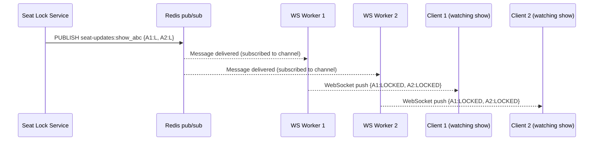

# 06 — Caching Strategy

---

## Caching Layers Overview

```
User Request
     │
     ▼
[CDN Cache]          ← Static seat layout templates, movie posters, static assets
     │ miss
     ▼
[Redis Cache]        ← Seat availability (per show), show metadata, session tokens
     │ miss
     ▼
[Read Replica DB]    ← Historical data, show schedule (not seat availability)
     │
     ▼
[Primary DB]         ← Writes only — seat lock/book transitions
```

---

## Cache 1: Seat Layout Template (CDN + Redis)

**What**: The physical arrangement of seats in a screen — rows, columns, seat types, positions. This is the "skeleton" of the layout, independent of availability.

**How often it changes**: Almost never. Only when a theater physically reconfigures (major renovation).

```
Storage:
  S3: screen-layouts/{screen_id}.json (canonical source)
  CDN: CloudFront distribution over S3
  Redis: screen_layout:{screen_id} (optional warm-up for API servers)

TTL:
  CDN: max-age=86400 (24 hours), s-maxage=604800 (7 days)
  Browser: Cache-Control: immutable (never expires for same URL)

Cache key includes version hash:
  /api/screen-layouts/{screen_id}?v={content_hash}
  → URL changes on reconfiguration → CDN auto-invalidates old entries

Invalidation:
  Admin updates screen layout →
  1. Write new layout to DB
  2. Upload to S3 with new content hash
  3. New URL → CDN serves fresh version; old URL expires naturally
  4. DEL screen_layout:{screen_id} from Redis
```

---

## Cache 2: Seat Availability (Redis Hash — per show)

**This is the most critical and most volatile cache.**

**What**: The current status of every seat for a given show. Updated on every lock, unlock, book, and cancel.

```
Redis data structure: Hash
Key:    show:{show_id}:seat_layout
Fields: {seat_id → status_code}
  "A1" → "A"    (AVAILABLE)
  "A2" → "L"    (LOCKED)
  "B5" → "B"    (BOOKED)
  ...

TTL: None (perpetual while show is active)
     Set via: PERSIST show:{show_id}:seat_layout
     Deleted: after show completes + 1 hour buffer
```

### Why Redis Hash (not String or JSON)?

| Structure | Pros | Cons |
|-----------|------|------|
| Single JSON string | One round-trip fetch | Atomic update requires read-modify-write (expensive) |
| Redis Hash | HSET per seat is atomic; HGETALL fetches all | Slightly more memory overhead |
| Individual keys per seat | Atomic per seat | 300 round-trips to fetch full layout |

**Decision**: Redis Hash. `HSET show:{id}:seat_layout A1 L` updates exactly one seat atomically without reading the rest of the hash. `HGETALL show:{id}:seat_layout` fetches all 300 seats in one command.

### Write-Through Strategy

Every seat state transition in the DB is immediately mirrored to Redis:

```
Lock acquired:
  DB: UPDATE show_seat_inventory SET status='LOCKED' WHERE seat_id=?
  Redis: HSET show:{show_id}:seat_layout {seat_id} "L"
  Pub/Sub: PUBLISH seat-updates:{show_id} {...}

Booking confirmed:
  DB: UPDATE show_seat_inventory SET status='BOOKED' WHERE seat_id IN (?)
  Redis: HSET show:{show_id}:seat_layout {A1} "B" {A2} "B"
  Pub/Sub: PUBLISH seat-updates:{show_id} {...}

Lock expired:
  Redis keyspace notification → DEL Redis lock key (automatic via TTL)
  Background job: UPDATE DB status='AVAILABLE' WHERE lock_expires_at < now()
  Redis: HSET show:{show_id}:seat_layout {seat_id} "A"
  Pub/Sub: PUBLISH seat-updates:{show_id} {...}
```

### Cache Miss Handling

```
GET /shows/{show_id}/seats → Redis HGETALL → empty result (cache miss)

Seat Layout Service:
  1. SELECT * FROM show_seat_inventory WHERE show_id = ? (read replica)
  2. Build hash: {seat_id → status_code} for all seats
  3. HSET show:{show_id}:seat_layout {all seats}
  4. Return to client

Stampede prevention (cache miss under high load):
  Problem: 1,000 requests hit simultaneously when cache is cold
  Solution: Redis SETNX "loading_lock:show:{show_id}" 1 EX 5
    → Only one request builds cache; others wait and retry
    → After 5 seconds, lock auto-expires (prevents infinite block)
    → Or use Redis WAIT + short sleep + retry pattern
```

---

## Cache 3: Show Metadata (Redis String)

**What**: Show details (movie title, time, screen, price tiers, language). Read-heavy, infrequently updated.

```
Key:    show:{show_id}:meta
Value:  JSON blob
TTL:    300 seconds (5 minutes)

Invalidated:
  - When admin updates show details (schedule change, price update)
  - Admin API calls DEL show:{show_id}:meta → next read rebuilds

Pattern: Cache-Aside (lazy population)
  Request → Redis miss → DB read → set Redis → return response
  Not write-through because show metadata updates are rare admin actions
```

---

## Cache 4: Movie Discovery / Search (CDN + Elasticsearch)

```
Movie listings (browse page):
  CDN cached: GET /movies?city=mumbai&date=2026-06-07
  Cache-Control: max-age=60 (1 min) — shows availability changes frequently
  Edge cache hit rate: ~80% during normal browsing

Search queries:
  Elasticsearch handles full-text, fuzzy, multi-filter queries
  Not Redis-cached (too many unique query combinations)
  Cache-aside for popular searches: top-100 cached in Redis, TTL 60s
```

---

## Pub/Sub for Real-Time Seat Updates

**Problem**: 200,000 users are watching the same seat layout for a hot show. A seat gets locked by user A. All other 199,999 users need to see it go amber within 2 seconds.

**Solution**: Redis pub/sub + WebSocket service as the fan-out layer.



**WebSocket service design**:
```
- Stateless pods (no in-memory session state)
- Each pod subscribes to Redis channel for each show it has active connections for
- Redis pub/sub scales to millions of subscribers per channel
- Horizontal scaling: add more WS pods → more connections handled
- Connection affinity: sticky sessions at LB (WebSocket must stay on same pod)
  OR use Redis pub/sub directly per connection (more Redis connections, simpler pods)

Capacity:
  200,000 concurrent connections × 10 pods = 20,000 connections/pod
  Go goroutine per connection: ~20KB × 20,000 = 400MB RAM per pod (well within limits)
```

**Fallback for clients without WebSocket**:
```
Client polls: GET /shows/{show_id}/seats/changes?since={timestamp}
  Server returns delta since last timestamp (from Redis sorted set or DB change log)
  Poll interval: 5 seconds
  This is the degraded mode when WebSocket service is down
```

---

## Cache Invalidation Cheat Sheet

| Cache | Strategy | Trigger | TTL |
|-------|----------|---------|-----|
| Seat layout template | URL versioning + CDN | Screen reconfiguration | 7 days (CDN), immutable (browser) |
| Seat availability (Redis Hash) | Write-through | Every lock/book/cancel | None (perpetual) |
| Show metadata | Cache-aside + explicit invalidation | Admin update | 5 minutes |
| Movie listings | TTL | Automatic refresh | 1 minute |
| Booking status | Not cached | Always DB | — |
| Payment status | Not cached | Always DB | — |

---

## Cache Consistency Guarantees

| Scenario | Guarantee |
|----------|-----------|
| Seat layout consistency | Eventually consistent (< 2s via pub/sub) |
| Seat booking (BOOKED state) | Strong consistency via DB (Redis is informational) |
| Double booking prevention | DB-authoritative (Redis is fast gate, not guarantee) |
| Cache-DB divergence | Background reconciliation every 60s compares Redis vs DB |

**The key insight**: We use Redis for display purposes (show users near-real-time status) and DB for transactional purposes (guarantee correctness). A user might see a seat as available in Redis when it was just locked milliseconds ago — this is acceptable. What is NOT acceptable is two users both seeing "BOOKED" confirmation for the same seat.

---

## Cache Warming Strategy

**For high-demand shows** (flagged by admin, e.g., midnight release):
```
T-30 min before sale open:
  1. Pre-load all show_seat_inventory rows into Redis Hash
  2. Pre-generate seat layout response and cache in Redis (show:{id}:layout_response)
  3. CDN pre-warm: synthetic requests from edge nodes
  4. WebSocket service: pre-allocate worker capacity

At sale open:
  - First request: 100% cache hit (no DB reads needed for layout)
  - Lock attempts: Redis SETNX fast path → DB writes only for winners
```

This reduces DB pressure by ~95% at flash sale start.
