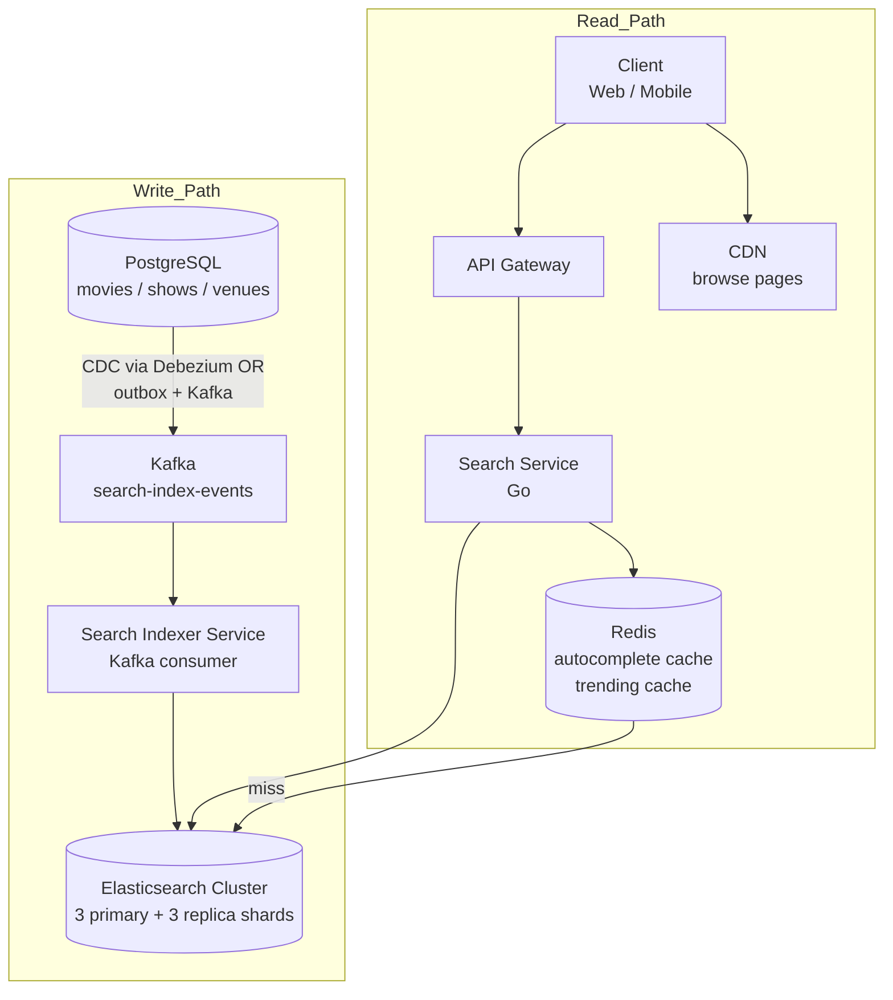

# 11 — Search Architecture & Flow

> Search is a read-heavy, latency-sensitive, tolerance-for-stale subsystem. It must never block the booking critical path and should never touch the transactional DB.

---

## Search Use Cases

| Use Case | Example Query | Requirements |
|----------|--------------|--------------|
| Movie title search | "Aveng" → Avengers | Fuzzy, typo-tolerant, prefix |
| Show discovery | IMAX shows in Mumbai tonight | Multi-filter: city + format + date |
| Venue search | "PVR near Andheri" | Geo-proximity, name match |
| Autocomplete | "ava" → "Avatar", "Avengers", "Avantika" | < 50ms, prefix-optimized |
| Faceted browse | Genre: Action + Language: Hindi + Rating: 9+ | Aggregations + filters |
| Trending / featured | Home page recommendations | Pre-computed, not text search |

---

## Search Architecture



**Key invariant**: Elasticsearch is a derived store — it is rebuilt from PostgreSQL. It is never the source of truth for booking decisions.

---

## Elasticsearch Index Design

### movies index

```json
PUT /movies
{
  "settings": {
    "number_of_shards": 3,
    "number_of_replicas": 1,
    "analysis": {
      "analyzer": {
        "autocomplete_analyzer": {
          "type": "custom",
          "tokenizer": "standard",
          "filter": ["lowercase", "autocomplete_filter"]
        },
        "search_analyzer": {
          "type": "custom",
          "tokenizer": "standard",
          "filter": ["lowercase"]
        }
      },
      "filter": {
        "autocomplete_filter": {
          "type": "edge_ngram",
          "min_gram": 2,
          "max_gram": 20
        }
      }
    }
  },
  "mappings": {
    "properties": {
      "id":            { "type": "keyword" },
      "title":         {
        "type": "text",
        "analyzer": "autocomplete_analyzer",
        "search_analyzer": "search_analyzer",
        "fields": {
          "keyword": { "type": "keyword" }
        }
      },
      "title_suggest": { "type": "completion" },
      "language":      { "type": "keyword" },
      "genres":        { "type": "keyword" },
      "rating":        { "type": "keyword" },
      "duration_mins": { "type": "integer" },
      "release_date":  { "type": "date" },
      "imdb_score":    { "type": "float" },
      "bms_score":     { "type": "float" },
      "is_now_showing":{ "type": "boolean" },
      "city_show_count":{
        "type": "nested",
        "properties": {
          "city":       { "type": "keyword" },
          "show_count": { "type": "integer" },
          "next_show":  { "type": "date" }
        }
      }
    }
  }
}
```

### shows index

```json
PUT /shows
{
  "mappings": {
    "properties": {
      "id":             { "type": "keyword" },
      "movie_id":       { "type": "keyword" },
      "movie_title":    { "type": "text", "fields": { "keyword": { "type": "keyword" } } },
      "venue_id":       { "type": "keyword" },
      "venue_name":     { "type": "keyword" },
      "city":           { "type": "keyword" },
      "locality":       { "type": "keyword" },
      "location":       { "type": "geo_point" },
      "screen_type":    { "type": "keyword" },
      "format":         { "type": "keyword" },
      "language":       { "type": "keyword" },
      "start_time":     { "type": "date" },
      "available_seats":{ "type": "integer" },
      "status":         { "type": "keyword" },
      "base_price":     { "type": "float" },
      "price_min":      { "type": "float" }
    }
  }
}
```

> **Why denormalize movie_title into shows index?** Avoids a join at query time. Elasticsearch is a document store — denormalization is the pattern, not the exception.

---

## Search Query Flows

### Flow 1: Movie Title Search + Autocomplete

```
GET /search/movies?q=aveng&city=mumbai

Search Service:
  1. Check Redis: GET autocomplete:aveng:mumbai → MISS
  2. Query Elasticsearch:
     GET /movies/_search
     {
       "query": {
         "bool": {
           "must": {
             "multi_match": {
               "query": "aveng",
               "fields": ["title^3", "title.keyword^5"],
               "type": "best_fields",
               "fuzziness": "AUTO"
             }
           },
           "filter": [
             { "term": { "is_now_showing": true } },
             { "nested": {
                 "path": "city_show_count",
                 "query": { "term": { "city_show_count.city": "mumbai" } }
             }}
           ]
         }
       },
       "suggest": {
         "movie_suggest": {
           "prefix": "aveng",
           "completion": { "field": "title_suggest", "size": 5 }
         }
       },
       "size": 10
     }
  3. Cache result: SET autocomplete:aveng:mumbai {result} EX 60
  4. Return to client in < 50ms
```

**Fuzzy matching**: `fuzziness: AUTO` → 0 edits for 1-2 char, 1 edit for 3-5 char, 2 edits for 6+ char. Catches "Avngers" → "Avengers".

**Boosting**: `title.keyword^5` gives exact matches higher score than partial matches.

### Flow 2: Show Discovery (Multi-Filter)

```
GET /shows?city=mumbai&date=2026-06-07&format=IMAX&language=hindi&sort=price_asc

Query Elasticsearch /shows/_search:
{
  "query": {
    "bool": {
      "filter": [
        { "term":  { "city": "mumbai" } },
        { "term":  { "format": "IMAX" } },
        { "term":  { "language": "hindi" } },
        { "term":  { "status": "OPEN_FOR_BOOKING" } },
        { "range": {
            "start_time": {
              "gte": "2026-06-07T00:00:00+05:30",
              "lt":  "2026-06-08T00:00:00+05:30"
            }
        }},
        { "range": { "available_seats": { "gt": 0 } } }
      ]
    }
  },
  "sort": [{ "base_price": "asc" }, { "start_time": "asc" }],
  "size": 50,
  "aggs": {
    "by_venue":  { "terms": { "field": "venue_name", "size": 20 } },
    "by_format": { "terms": { "field": "format", "size": 5 } },
    "price_range": { "stats": { "field": "base_price" } }
  }
}
```

Aggregations power the sidebar filters (venue list, format list, price range) — all in one query.

### Flow 3: Geo Search ("Shows near me")

```
GET /shows?lat=19.1354&lng=72.8347&radius_km=10&date=2026-06-07

{
  "query": {
    "bool": {
      "filter": [
        { "geo_distance": {
            "distance": "10km",
            "location": { "lat": 19.1354, "lon": 72.8347 }
        }},
        { "range": { "start_time": { "gte": "now/d", "lt": "now/d+1d" } } },
        { "range": { "available_seats": { "gt": 0 } } }
      ]
    }
  },
  "sort": [
    { "_geo_distance": {
        "location": { "lat": 19.1354, "lon": 72.8347 },
        "order": "asc", "unit": "km"
    }}
  ]
}
```

Results sorted by distance. No venue near? Expand radius and return nearest 5 with distance shown.

### Flow 4: Autocomplete Only (< 50ms target)

```
GET /search/suggest?q=pv&type=venue

Two-tier:
  Tier 1: Redis ZRANGE suggest:venue:pv 0 4 (pre-built sorted set of popular completions)
    → "PVR Juhu", "PVR Andheri", "PVR Lower Parel" — served in < 2ms

  Tier 2 (if Redis miss or low result count):
    ES completion suggester query → edge n-gram match
    Cache result in Redis with TTL 300s

Build Redis sorted sets offline:
  Nightly job: top 500 venue/movie names → pre-index all prefixes (min len 2)
  ZADD suggest:venue:pv {score} "PVR Juhu"
  score = search_volume × recency_weight
```

---

## Index Sync Strategy: PostgreSQL → Elasticsearch

### Option A: Application-Level Dual Write (rejected)

```
On movie update → write to Postgres AND Elasticsearch atomically
Problem: No atomicity guarantee — if ES write fails, indices diverge.
Worse: Adds latency to the write path; couples booking service to search infra.
```

### Option B: Kafka + Outbox (chosen)

```
1. Any service that mutates movies/shows/venues writes to booking_outbox table
   in the same DB transaction:
   INSERT INTO search_outbox (entity_type, entity_id, operation, payload)
   VALUES ('SHOW', 'show_abc', 'UPDATE', '{available_seats: 187}')

2. Search Outbox Relay reads PENDING rows → publishes to Kafka topic 'search-index-events'

3. Search Indexer Service (Kafka consumer):
   - Consumes search-index-events
   - Enriches if needed (join movie data for shows index)
   - Upserts into Elasticsearch:
     PUT /shows/_doc/{show_id}
     {... full document ...}

4. Elasticsearch refresh interval: 1 second (near real-time)
   Documents searchable within 1–2 seconds of the source DB write.
```

**Why this approach?**
- Decoupled: search indexing never blocks the booking critical path
- Durable: Kafka retains events; reindex is possible by replaying from earliest offset
- Consistent: outbox ensures the event is published if and only if the DB transaction committed

### Option C: Debezium CDC (alternative at higher scale)

```
PostgreSQL WAL → Debezium (change data capture) → Kafka → Search Indexer

Advantages over outbox:
  - No application code changes needed for new tables
  - Captures ALL changes including bulk updates
  - Lower latency (WAL is the change stream, no relay process needed)

Disadvantages:
  - Debezium is operationally complex (Kafka Connect cluster, schema registry)
  - WAL retention policy must accommodate processing lag
  - Harder to enrich data (raw CDC events don't have denormalized fields)

Decision: Start with Outbox (simpler). Migrate to Debezium when:
  - Table count > 20 (outbox becomes verbose)
  - Index lag requirements drop below 500ms
```

---

## Handling available_seats in Search Index

This is a subtle design problem. `available_seats` changes on every booking — updating Elasticsearch on every seat lock would generate massive write pressure.

**Solution: Coarse-grained updates only**

```
Don't sync available_seats on every lock acquisition.
Sync on meaningful thresholds:
  - When a show transitions OPEN → HOUSEFULL (available_seats drops to 0)
  - Every 60 seconds: batch update for active shows with changed counts
  - Immediately when: show opens for booking, show is cancelled

Implication: The search index may show "187 seats available" when the real
number is 183. This is acceptable — search is for discovery, not for reservation.
The accurate count is shown on the seat layout page (served from Redis).
```

---

## Search Service Caching Strategy

```
L1 — Redis (TTL 60s):
  Key: search:{query_hash}:{city}:{date}:{filters_hash}
  Value: serialized Elasticsearch response
  Eviction: TTL + LRU

L2 — Elasticsearch (always fresh for cache misses)

Cache hit rates (empirical from BookMyShow-scale):
  Movie browse (top cities): 85% cache hit
  Show listing (specific movie): 70% cache hit
  Autocomplete: 90%+ (very few unique prefixes)
  Geo search: 40% (coordinates are high-cardinality → poor cache fit)

For geo search: quantize coordinates to 500m grid squares before hashing:
  lat = round(lat × 200) / 200   # 0.005 degree ≈ 500m precision
  lng = round(lng × 200) / 200
  cache_key = search:geo:{lat}:{lng}:{date}
```

---

## Elasticsearch Operations

### Cluster Sizing

```
Documents:
  shows: 50K/day × 30 days = 1.5M docs × 1KB avg = 1.5GB raw
  movies: 100K total × 3KB avg = 300MB raw
  Total index size (with shards + replicas): ~15GB

Cluster:
  3 data nodes (r6g.xlarge: 32GB RAM each)
  1 master node (m6g.medium)
  Hot-warm architecture:
    Hot tier (SSD): last 30 days of shows
    Warm tier (HDD): older shows (historical queries only)

Shard strategy:
  /shows: 3 primary × 300MB each (< 50GB per shard limit)
  /movies: 2 primary (smaller index)
  Replica: 1 per primary (HA; read scaling)
```

### Index Lifecycle Management (ILM)

```
shows index policy:
  HOT (0–30 days): 3 replicas, SSD, all operations
  WARM (30–90 days): 1 replica, HDD, read-only, force-merge to 1 segment
  DELETE (>90 days): purge (old shows are irrelevant for discovery)

Shows don't need a long retention in search — nobody searches for a show
that ran 3 months ago.
```

---

## Latency Budget for Search

| Operation | Target p99 | Mechanism |
|-----------|-----------|-----------|
| Autocomplete | 50ms | Redis L1 (2ms) or ES completion suggester |
| Movie search | 100ms | Redis L1 (5ms) or ES multi-match |
| Show listing | 150ms | Redis L1 (5ms) or ES bool filter |
| Geo search | 200ms | ES geo_distance (no Redis cache for high-cardinality) |
| Index sync lag | < 2s | Kafka + ES 1s refresh interval |
