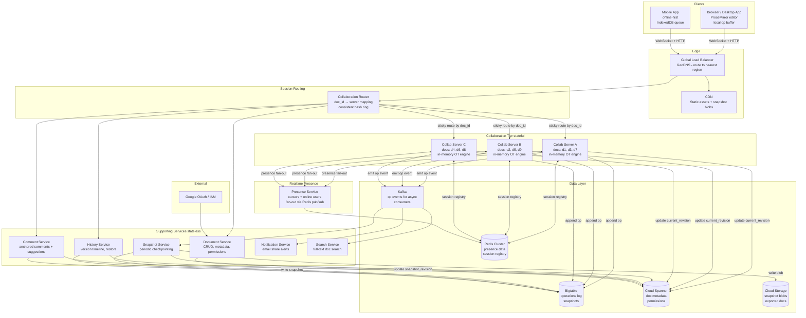

# HLD: Collaborative Document Editing (Google Docs Scale)

**Design Target:** Principal Engineer bar — Google / Meta / Amazon  
**Scale:** 1B+ registered users, 100M DAU, ~50M peak concurrent editors  
**Framework:** RESHADED

---

## Table of Contents

1. [Requirements](#1-requirements)
2. [Estimation](#2-estimation)
3. [Storage Strategy](#3-storage-strategy)
4. [High-Level Design](#4-high-level-design)
5. [API Contracts](#5-api-contracts)
6. [Detail Deep Dives](#6-detail-deep-dives)
   - 6.1 [The Core Algorithm: OT vs CRDT](#61-the-core-algorithm-ot-vs-crdt)
   - 6.2 [Operational Transformation — Jupiter Protocol](#62-operational-transformation--jupiter-protocol)
   - 6.3 [Rich Text Delta Model](#63-rich-text-delta-model)
   - 6.4 [Collaboration Server — Session Routing & Failover](#64-collaboration-server--session-routing--failover)
   - 6.5 [Presence Protocol](#65-presence-protocol)
   - 6.6 [Snapshot & Version History](#66-snapshot--version-history)
   - 6.7 [Offline Editing & Reconnection](#67-offline-editing--reconnection)
   - 6.8 [Permissions & Access Control](#68-permissions--access-control)
7. [Evaluate — Bottlenecks & Failure Modes](#7-evaluate--bottlenecks--failure-modes)
8. [Distinctive Features](#8-distinctive-features)
9. [Follow-Up Interviewer Questions](#9-follow-up-interviewer-questions)

---

## 1. Requirements

### Functional
| # | Requirement |
|---|-------------|
| F1 | Multiple users can edit the same document simultaneously and see each other's changes in real-time |
| F2 | Users see the cursor position and selection of other collaborators |
| F3 | Documents support rich text: bold, italic, headers, lists, tables, images |
| F4 | Full version history — users can view and restore any prior state |
| F5 | Users can leave inline comments anchored to document ranges |
| F6 | Offline editing — changes sync when connectivity is restored |
| F7 | Conflict-free convergence — all clients always reach the same document state |
| F8 | Permissions — Owner / Editor / Commenter / Viewer |

### Non-Functional
| # | Requirement | Target |
|---|-------------|--------|
| NF1 | Collaboration latency (op round-trip) | < 100ms P99 within region |
| NF2 | Concurrent editors per document | Up to 1,000 simultaneous |
| NF3 | Document load time | < 2 seconds |
| NF4 | Consistency model | **Strong eventual consistency** — all clients converge to same state |
| NF5 | Durability | Zero data loss — every committed keystroke survives failures |
| NF6 | Availability | 99.99% (< 52 min downtime/year) |
| NF7 | Offline support | Edits survive up to 72 hours offline and sync correctly |

### Out of Scope
- AI-assisted writing (Gemini integration)
- Voice/video comments
- Third-party plugin execution
- Real-time co-watching (Slides presenter mode)

---

## 2. Estimation

### User & Traffic Scale
```
Registered users:          1 billion
Daily active users:        100 million
Peak concurrent sessions:  50 million
Avg collaborators/doc:     2.5 (most docs have 1 active editor, some have 50+)
Active collaboration sessions at peak: 5 million (10% of DAU)
```

### Operation Throughput
```
Avg typing speed:          40 WPM = ~200 chars/min = ~3.3 ops/second per active user
Active typing users (peak): 10 million (20% of concurrent are actively typing)
Peak operations/second:    10M × 3.3 = 33M ops/second  (global)

Per collaboration server:
  Target: 1,000 sessions/server, 250 active typists/server
  Operations: 250 × 3.3 ≈ 825 ops/second/server
  Fanout (avg 2.5 readers/session): 825 × 2.5 ≈ 2,000 messages/second outbound
```

### Storage
```
Documents:
  Total documents:         10 billion (most are personal, small)
  Avg document size:       50 KB (text + metadata)
  Total document storage:  10B × 50KB = 500 TB

Operations log:
  Operations/day:          33M × 86,400 = ~2.8 trillion  (upper bound; average much lower)
  Realistic daily ops:     ~500 billion (10% peak sustained)
  Per-op size:             ~100 bytes
  Daily operations log:    500B × 100B = 50 TB/day
  Retained for 30 days:    1.5 PB

Snapshots (checkpoints every 100 ops):
  Snapshots/day:           500B ops / 100 = 5B snapshots
  Per-snapshot:            50 KB avg
  Daily snapshot storage:  5B × 50KB = 250 TB/day  ← too large!

  Practical snapshot strategy: snapshot every 1,000 ops OR every 10 minutes, whichever first
  Revised daily snapshots: 500M
  Daily snapshot storage:  500M × 50KB = 25 TB/day  ← manageable
```

### Network
```
Per operation broadcast:
  Op payload (delta):  ~200 bytes
  Fanout to 2.5 readers: 500 bytes out per op
  At 33M ops/second:   33M × 500B = 16.5 GB/s outbound  (global edge)
  Per collaboration server: ~1 MB/s outbound — trivial
```

---

## 3. Storage Strategy

### The Central Challenge: Two Incompatible Workloads

| Workload | Pattern | Requirement |
|----------|---------|-------------|
| Operation log writes | Append-only, sequential, high-throughput | Ordered, durable, fast append |
| Document reads | Load document = latest snapshot + tail ops | Random access by doc_id + revision range |
| Version history | Time-travel queries by doc_id + timestamp | Range scan over revision |
| Snapshot storage | Large blobs, infrequent write, read on doc open | Blob storage with doc_id key |
| Document metadata | Ownership, permissions, search | Relational + consistent |

### Storage Layer Decision Matrix

| Layer | Technology | Why |
|-------|-----------|-----|
| Document metadata + permissions | Cloud Spanner | Global ACID transactions, critical for permission checks |
| Operations log | Bigtable | Append-only, row key = `doc_id#rev`, fast range scan for replay |
| Snapshots | GCS (Cloud Storage) | Immutable blobs, cheap, CDN-able for read |
| In-memory doc state | Collaboration server RAM | Sub-ms access for active transform; evicted when session ends |
| Presence data | Redis (ephemeral) | Cursor positions, TTL-based, never persisted |
| Comment anchors | Bigtable | Needs transform updates alongside ops |
| Search index | Google Search infra / Elasticsearch | Full-text search across user's docs |

### Data Models

**Bigtable: `operations` table**
```
Row key:  {doc_id}#{revision:20-digit-zero-padded}
Columns:
  op:user_id       — who applied this op
  op:client_rev    — client's revision counter when op was created
  op:timestamp     — wall clock (for display only; revision is the truth)
  op:type          — insert | delete | retain | format | composite
  op:delta         — serialized Delta (see §6.3)
  op:op_id         — globally unique UUID (for idempotency)
```

**Bigtable: `snapshots` table**
```
Row key:  {doc_id}#{snapshot_revision:20-digit-zero-padded}
Columns:
  snap:content     — serialized document (Delta from position 0 to current)
  snap:created_at  — timestamp
  snap:size_bytes  — for quota tracking
```

**Cloud Spanner: `documents` table**
```sql
CREATE TABLE documents (
  doc_id       STRING(36) NOT NULL,
  owner_id     STRING(36) NOT NULL,
  title        STRING(1024),
  created_at   TIMESTAMP NOT NULL OPTIONS (allow_commit_timestamp=true),
  last_modified TIMESTAMP NOT NULL OPTIONS (allow_commit_timestamp=true),
  current_revision INT64 NOT NULL DEFAULT 0,
  snapshot_revision INT64 NOT NULL DEFAULT 0,
  is_deleted   BOOL NOT NULL DEFAULT false,
  PRIMARY KEY (doc_id)
);

CREATE TABLE permissions (
  doc_id   STRING(36) NOT NULL,
  user_id  STRING(36) NOT NULL,
  role     STRING(16) NOT NULL,  -- OWNER | EDITOR | COMMENTER | VIEWER
  PRIMARY KEY (doc_id, user_id),
  FOREIGN KEY (doc_id) REFERENCES documents(doc_id)
);
```

---

## 4. High-Level Design

### Architecture Diagram



### Request Flows

#### Document Open Flow
```
1. Client GET /docs/{doc_id}
2. Document Service:
   a. Check permission (Spanner: SELECT role WHERE doc_id AND user_id)
   b. Return doc metadata + snapshot_revision + current_revision
3. Client fetches snapshot from GCS (via CDN if cached)
4. Client fetches tail operations: GET /ops/{doc_id}?from={snapshot_rev}&to={current_rev}
   → Bigtable range scan: fast (indexed by doc_id + revision)
5. Client replays tail ops on top of snapshot → current document state
6. Client opens WebSocket to Collaboration Router → routed to owning Collab Server
7. Collab Server registers session, sends any ops since step 4's to value
```

#### Edit Flow (the critical path)
```
1. User types "x" at position 42 in client's current document state
2. Client creates Delta: retain(42), insert("x")
3. Client assigns: op = {op_id: uuid, client_revision: 47, delta: ...}
4. Client applies op optimistically to local state (instant feedback)
5. Client sends op over WebSocket to Collaboration Server
6. Collab Server:
   a. Transforms op against any ops received since client_revision=47
   b. Appends transformed op to Bigtable with server_revision=50
   c. Updates current_revision in Spanner (async, eventual)
   d. Broadcasts transformed op to all other clients in session
   e. Sends ACK to originating client with server_revision=50
7. Other clients receive op with server_revision:
   a. Transform against their own pending ops
   b. Apply to local state
8. Client on ACK: update its server revision counter to 50
```

---

## 5. API Contracts

### REST: Document Management

```
POST   /v1/docs                        Create new document
GET    /v1/docs/{doc_id}               Get document metadata + permissions
PATCH  /v1/docs/{doc_id}               Update title, settings
DELETE /v1/docs/{doc_id}               Soft delete
POST   /v1/docs/{doc_id}/permissions   Add collaborator
DELETE /v1/docs/{doc_id}/permissions/{user_id}

GET    /v1/docs/{doc_id}/ops?from={rev}&to={rev}   Fetch operation range
GET    /v1/docs/{doc_id}/history                   Version history list
POST   /v1/docs/{doc_id}/history/{rev}/restore     Restore to version
```

### WebSocket Protocol

**Client → Server messages:**
```json
// Submit operation
{
  "type": "op",
  "op_id": "01HX3K...",
  "doc_id": "doc_abc",
  "client_revision": 47,
  "delta": {
    "ops": [
      { "retain": 42 },
      { "insert": "x" }
    ]
  }
}

// Acknowledge received server op (for flow control)
{ "type": "ack", "server_revision": 50 }

// Cursor / selection update (presence, not persisted)
{
  "type": "cursor",
  "doc_id": "doc_abc",
  "index": 43,
  "length": 0,
  "color": "#FF5733"
}
```

**Server → Client messages:**
```json
// Op broadcast (from another user, already transformed)
{
  "type": "op",
  "op_id": "01HX4M...",
  "server_revision": 50,
  "user_id": "usr_xyz",
  "delta": {
    "ops": [
      { "retain": 10 },
      { "insert": "hello" }
    ]
  }
}

// ACK for client's own op
{
  "type": "ack",
  "op_id": "01HX3K...",
  "server_revision": 50
}

// Presence update
{
  "type": "presence",
  "users": [
    { "user_id": "usr_xyz", "color": "#FF5733", "cursor": { "index": 43, "length": 5 } }
  ]
}
```

---

## 6. Detail Deep Dives

### 6.1 The Core Algorithm: OT vs CRDT

This is the most important design decision. Get this wrong and the entire system produces incorrect documents.

#### The Problem: Concurrent Edits

Two users edit document "Hello World" simultaneously:
- **User A** (position 6): Types " Beautiful" → intends: insert " Beautiful" after "Hello"
- **User B** (position 5): Deletes "Hello" → intends: retain(0), delete(5)

Without coordination: A's op is `Insert(6, " Beautiful")`. After B's delete removes chars 0–4, the document is " World". Where should A's insert go? Position 6 is now past the end. A naive system either crashes or corrupts the document.

#### Option 1: Operational Transformation (OT)

**Core idea:** Before applying a concurrent operation, *transform* it to account for the other operation that arrived first.

| Aspect | OT |
|--------|-----|
| Algorithm | Transform each incoming op against all concurrent ops |
| Server role | Central server defines total ordering of all ops |
| Convergence guarantee | Yes, with correct transform function |
| Offline support | Limited — requires central server for transform |
| Memory overhead | Low — only need recent op history |
| Implementation complexity | High — transform functions are subtle and error-prone |
| Used by | Google Docs, Office 365 (live collaboration), Etherpad |

**The two transform functions required for correctness:**

```
T(op1, op2) → op1'      // transform op1 assuming op2 was applied first
T(op2, op1) → op2'      // transform op2 assuming op1 was applied first

Convergence property (the hard invariant):
  apply(apply(doc, op1), T(op2, op1)) == apply(apply(doc, op2), T(op1, op2))
```

#### Option 2: CRDT (Conflict-free Replicated Data Types)

**Core idea:** Assign each character a globally unique, stable identity and position. Operations commute — apply them in any order and reach the same state.

| Aspect | CRDT |
|--------|------|
| Algorithm | Each character has a unique ID; ordering by ID defines sequence |
| Server role | Not required — P2P is possible |
| Convergence guarantee | Yes, by construction |
| Offline support | Excellent — merge at reconnect, any order |
| Memory overhead | High — tombstones for deleted chars, position metadata |
| Implementation complexity | Medium — conceptually simpler, but memory management is hard |
| Used by | Figma (multiplayer), Notion (partial), Apple Notes (iCloud sync) |

#### The Decision: Why Google Chose OT (and Why It's Still Right at Scale)

| Criterion | OT | CRDT | Winner |
|-----------|-----|------|--------|
| Memory per document | Low — transform against recent history window | High — every deleted char is a tombstone | **OT** |
| 100K char document overhead | ~100KB state | ~10MB state (tombstones) | **OT** |
| Server dependency | Required (central ordering) | Optional | **CRDT** |
| Correctness guarantees | Requires careful transform impl | Guaranteed by data structure | **CRDT** |
| Offline-first support | Requires buffering + reconciliation | Native | **CRDT** |
| Rich text (formatting) | Mature (Delta OT) | Emerging (Automerge, Yjs) | **OT** |
| Operational at 100M DAU | Proven (Google Docs) | Proven at smaller scale | **OT** |

**Recommendation for this design: OT with a central server.**

Reasons:
- Google Docs is not P2P — the server is always available except for mobile offline
- CRDT tombstone overhead becomes severe for large documents and heavy editing history
- Google has 15+ years of OT correctness battle-testing
- The Jupiter protocol (client-server OT) is simpler than multi-party OT: only need to handle client-vs-server conflicts, not n-way conflicts

**When to reconsider CRDT:** If the product is offline-first by design (field workers, rural areas), or if P2P sync between devices without a server is required. Modern CRDT libraries (Yjs, Automerge) have made this viable.

---

### 6.2 Operational Transformation — Jupiter Protocol

Google Docs uses a simplified **client-server OT** model (not multi-site OT). The central insight: with a reliable server, you only ever need to resolve conflicts between **one client** and **the server**. You never need to resolve conflicts between two arbitrary clients directly.

#### State Machine

Each client maintains:
```
client_state = {
  server_revision: int   // last server revision client has seen
  pending: [op, ...]     // ops sent to server, awaiting ACK
  buffer: [op, ...]      // ops typed while pending is non-empty (not yet sent)
}
```

Server maintains:
```
server_state = {
  revision: int          // monotonically increasing, = number of committed ops
  history: [{rev, op}]   // all committed ops (for transform; sliding window in memory)
  doc: Document          // current authoritative document state
}
```

#### The Transform Rules (for text Deltas)

Operations are expressed as **Delta** sequences (see §6.3). The transform function `T(A, B) → A'` produces a version of A that can be applied *after* B, preserving A's intent.

```
T(Insert(posA, text), Insert(posB, textB)):
  if posA < posB:
    A' = Insert(posA, text)           // A inserts before B — no shift needed
  if posA > posB:
    A' = Insert(posA + len(textB), text)  // B inserted before A — shift right
  if posA == posB:
    // Tie-break deterministically: compare user_id lexicographically
    if userA < userB:
      A' = Insert(posA, text)         // A wins, keeps position
    else:
      A' = Insert(posA + len(textB), text)  // B wins, A shifts right

T(Insert(posA, text), Delete(posB, lenB)):
  if posA <= posB:
    A' = Insert(posA, text)           // A inserts before B's delete — unchanged
  if posA > posB + lenB:
    A' = Insert(posA - lenB, text)    // A inserts after B's delete — shift left
  if posB < posA <= posB + lenB:
    A' = Insert(posB, text)           // A inserts inside B's deleted range — clamp to delete start

T(Delete(posA, lenA), Insert(posB, textB)):
  if posA >= posB:
    A' = Delete(posA + len(textB), lenA)  // Insert shifts delete position right
  else if posA + lenA <= posB:
    A' = Delete(posA, lenA)           // Insert is after delete — unchanged
  else:
    // Insert is within delete range — split: delete before insert + delete after
    A' = Delete(posA, posB - posA) ∘ Delete(posB + len(textB), lenA - (posB - posA))

T(Delete(posA, lenA), Delete(posB, lenB)):
  // Most complex: handle all overlapping/non-overlapping cases
  // Key: deleted-already chars become no-ops; shrink or expand lenA accordingly
  [see implementation below]
```

#### Full Protocol Sequence

```
Scenario: Client has pending=[opC1, opC2], server applies opS concurrently

Client side (receives server op opS with server_revision=R):
  1. Assert server_revision == client.server_revision + 1
  2. Transform pending ops against opS:
       opC1' = T(opC1, opS)
       opS'  = T(opS, opC1)   // also transform opS for use in step 3
       opC2' = T(opC2, opS')  // transform opC2 against opS already transformed by opC1
  3. client.pending = [opC1', opC2']
  4. Apply opS to local document state
  5. client.server_revision++

Server side (receives client op opC with client_revision=R):
  1. Find all server ops committed since client_revision=R:
       ops_to_transform_against = history[R..current_revision]
  2. Transform opC through each:
       opC' = T(opC, history[R])
       opC' = T(opC', history[R+1])
       ... for each committed op
  3. Commit opC' at server_revision = current_revision + 1
  4. Broadcast opC' to all other clients in session
  5. Send ACK to originating client with server_revision
```

#### Compose: Combining Multiple Ops

When a client has many pending ops and needs to send them all at once (e.g., after reconnecting), it first **composes** them into a single op:

```
compose([retain(5), insert("a")], [retain(6), insert("b")])
→ [retain(5), insert("a"), retain(1), insert("b")]
```

Compose is the inverse of applying ops sequentially — the composed op produces the same result as applying each op in order. This reduces transform work on the server.

---

### 6.3 Rich Text Delta Model

Plain text OT with `Insert(pos, char)` and `Delete(pos)` is not enough for Google Docs. Rich text requires formatting operations that interleave with content operations.

Google Docs uses a model equivalent to the **Quill Delta** format. Every document state is a Delta (a sequence of operations from an empty document), and every edit is also a Delta (a transformation from one state to another).

#### Delta Structure

```
A Delta = list of ops, each one of:
  { retain: N, attributes?: {...} }   // keep N chars, optionally change formatting
  { insert: "text", attributes?: {...} } // insert text with formatting
  { insert: { image: "url" } }        // insert an embed (image, table, etc.)
  { delete: N }                       // delete N chars
```

The ops are **positional** — each op starts where the previous one ended. This is critical: no explicit position numbers, so there is no "off by one" class of bug.

#### Example: Format "Hello" as bold

Document: "Hello World" (11 chars)

```json
{
  "ops": [
    { "retain": 5, "attributes": { "bold": true } },
    { "retain": 6 }
  ]
}
```

Result: "**Hello** World"

#### Example: Concurrent edits with formatting

```
Initial: "Hello World"

User A: Bold positions 0–4 ("Hello")
  Delta A: [retain(5, {bold:true}), retain(6)]

User B: Delete positions 6–10 ("World")
  Delta B: [retain(6), delete(5)]

After applying B first, then transforming A:
  T(A, B):
    retain(5, {bold:true}) → unchanged (before deleted region)
    retain(6) → retain(1) (only 1 char remains after delete)
  A' = [retain(5, {bold:true}), retain(1)]

Final document: "**Hello** " (6 chars, "Hello" bold, trailing space)
Both clients reach the same state. ✓
```

#### Attribute Inheritance for Formatting

Formatting is tricky because attributes apply to character *ranges*, not individual chars. Two rules:

1. **Format operations are idempotent** — applying `{bold:true}` to an already-bold range is a no-op.
2. **Attribute null = remove formatting** — `{bold: null}` removes bold.

This makes format ops commutative in many cases, reducing the complexity of format × format transforms.

---

### 6.4 Collaboration Server — Session Routing & Failover

#### Routing Architecture

All clients editing the same document must land on the **same Collaboration Server** — this is the central invariant that makes client-server OT work. The server is the *single source of truth* for operation ordering.

```
Routing layer (Collaboration Router):
  - Maintains a consistent hash ring of Collaboration Servers
  - Key: doc_id → server_id
  - Registry stored in Redis (TTL 30s, heartbeat refresh):
      HSET doc_sessions doc_abc server_17
  - On client WebSocket connect:
      1. Look up doc_id in Redis
      2. If exists: proxy/redirect to assigned server
      3. If not exists: assign via consistent hash, store in Redis
```

#### Why Consistent Hashing?

When a new server is added to the ring, only `K/N` documents (K=docs, N=servers) need to be remapped — not all documents. This minimizes disruption during scaling events (e.g., Flash mob editing of a viral doc).

#### Collaboration Server — In-Memory State per Document

```
DocumentSession {
  doc_id: string
  server_revision: int
  doc_state: Delta           // current full document content
  history_window: [(rev, op), ...]  // recent 1,000 ops for transform
  connected_clients: {
    client_id → {user_id, ws_conn, client_revision, pending_count}
  }
}
```

The history window only needs to cover the maximum "client lag" — clients more than 1,000 ops behind are rejected and told to reload. In practice, a client that is 1,000 ops behind (at 3 ops/sec avg = 5+ minutes of lag) has likely lost connection and will reconnect via the full reload path anyway.

#### Failover: Collaboration Server Crash

```
1. Server crash detected by health check (< 5s)
2. Router receives heartbeat failure → removes server from session registry
3. All clients for affected documents get WebSocket disconnect
4. Clients trigger auto-reconnect with exponential backoff (100ms, 200ms, 400ms...)
5. Router assigns each doc to a new server (consistent hash fallback)
6. New server loads the document:
   a. Reads latest snapshot_revision from Spanner
   b. Reads snapshot blob from GCS
   c. Replays all ops from snapshot_revision to current in Bigtable
   d. Rebuilds in-memory state
7. Clients reconnect and send their pending ops with their last client_revision
8. New server transforms and applies them normally

Recovery time: 2–10 seconds (dominated by Bigtable op replay for active docs)
Data loss: zero (all ops were persisted to Bigtable before ACK was sent to client)
```

**The durability invariant:** The Collaboration Server **never ACKs an op to the client until it has been written to Bigtable**. This is the guarantee that makes failover lossless.

```
// Pseudo-code for op handling on server
func handleClientOp(op):
  transformed = transformAgainstHistory(op)
  bigtable.append(doc_id, server_revision+1, transformed)  // SYNC write
  server_revision++
  broadcastToOtherClients(transformed, server_revision)
  sendAck(op.client, op.op_id, server_revision)             // Only after Bigtable write
```

#### Scaling: Hot Documents

A viral blog post or company-wide announcement can have thousands of simultaneous editors. A single server handling 10,000 concurrent users on one document is not unreasonable — but the fanout (each op broadcast to 9,999 others) becomes expensive.

**Mitigation for extreme fanout:**
- Cap real-time update recipients at 1,000 "active window" users
- For users outside the active window: poll for op batches every 5 seconds instead of receiving push events
- Use Redis pub/sub for broadcast instead of direct WebSocket writes from the Collab Server

---

### 6.5 Presence Protocol

Presence (cursor positions, user avatars, selection highlights) is **ephemeral** — it does not go through the OT pipeline and is never persisted to the operations log.

#### Why separate from OT?

Cursor positions at 3 ops/second × 1,000 users = 3,000 presence updates/second/doc. Putting these through the OT transform pipeline would triple the load for zero durability benefit. Presence data has no correctness requirement: a cursor position that is 200ms stale is fine.

#### Presence Architecture

```
Client → WebSocket → Collab Server:
  Sends cursor update every 100ms (throttled) or on every edit

Collab Server:
  - Writes cursor to Redis Hash:
      HSET presence:doc_abc user_xyz {index:42, length:5, color:"#FF5733", ts:1234}
      EXPIRE presence:doc_abc 30s  // auto-clean if user disconnects
  - Broadcasts to all clients in session via Redis pub/sub channel:
      PUBLISH presence:doc_abc {user_id, cursor, ...}

Other Collab Servers (for same doc across regions — read replicas):
  - Subscribe to presence:doc_abc Redis channel
  - Relay to their connected read-only clients
```

#### Cursor Transform

When a user's cursor is at position 42 and another user inserts 5 chars before position 10, the cursor must shift to position 47. Cursor positions *are* transformed — but only at the client, using the same transform rules as text ops.

```
Client-side cursor transform:
  On receiving server op:
    new_cursor_pos = T(cursor_op, server_op).position
  Update local cursor display
  Send updated cursor position to Collab Server
```

---

### 6.6 Snapshot & Version History

#### Snapshot Strategy

Replaying the entire operation history on every document open is prohibitive. Snapshots are periodic checkpoints of the full document state.

**Snapshot trigger (Snapshot Service consumes Kafka op events):**
```
if (ops_since_last_snapshot >= 1000) OR (time_since_last_snapshot >= 10 minutes):
    take_snapshot()
```

**Taking a snapshot:**
```
1. Request current doc_state from Collab Server (or build from Bigtable if server not active)
2. Serialize document to Delta format (canonical JSON)
3. Compress (zstd): typical 50KB → 8KB
4. Write to GCS: gs://docs-snapshots/{doc_id}/{revision}.delta.zst
5. Update Bigtable snapshots table: row key = {doc_id}#{revision}
6. Update Spanner: SET snapshot_revision = {revision}
```

**Document load using snapshot:**
```
1. Read snapshot_revision and current_revision from Spanner
2. Download snapshot from GCS (< 50ms, CDN-cached for popular docs)
3. Fetch ops from snapshot_revision to current_revision from Bigtable
   (typically < 1,000 ops = < 100KB)
4. Apply ops to snapshot → current state
5. Total load time: 200–500ms for a typical active document
```

#### Version History

Google Docs shows a timeline of "versions" — groups of ops by author and time proximity.

**Version grouping algorithm:**
```
Group ops into a version when:
  - Author changes (different user_id)
  - OR time gap > 30 minutes between consecutive ops
  - OR user explicitly clicks "Name this version"
```

**Version list query:**
```sql
SELECT MIN(revision) as from_rev, MAX(revision) as to_rev,
       user_id, MIN(timestamp) as start_time, MAX(timestamp) as end_time
FROM operations
WHERE doc_id = ?
GROUP BY user_id, floor(timestamp / 1800)  -- 30-min buckets
ORDER BY from_rev
```

**Restore to version:**
```
1. Identify target revision R
2. Load snapshot closest to R (snapshot_revision <= R)
3. Replay ops from snapshot to R → desired state
4. Create a new op: "replace current document content with desired state"
5. This op is itself an OT operation — preserves history, does not truncate it
```

**Named versions** are stored as separate rows in a `named_versions` Bigtable table:
```
Row key: {doc_id}#{revision}
Columns: name, created_by, created_at
```

---

### 6.7 Offline Editing & Reconnection

#### Client-Side State (Browser IndexedDB / Mobile SQLite)

```
offline_state = {
  doc_id:            string
  last_server_rev:   int       // last server revision successfully ACKed
  local_doc_state:   Delta     // current document content in client
  pending_ops:       [op, ...] // ops applied locally, not yet ACKed
  persisted_at:      timestamp // when last synced
}
```

All pending ops are persisted to IndexedDB *before* being applied to the local state. This survives browser crashes.

#### Reconnection Protocol

```
1. WebSocket reconnects
2. Client sends reconnect message:
   {
     "type": "reconnect",
     "doc_id": "doc_abc",
     "last_server_revision": 240,
     "pending_ops": [op241_client, op242_client, ...]  // ops typed offline
   }

3. Server checks history:
   - Is the client's last_server_revision still in the history window?
   - If YES (within 1,000 ops): transform client's pending ops normally
   - If NO (client was offline for a very long time):

4. Long-offline reconciliation:
   a. Server sends full document state since last_server_revision
      (a composed Delta of all ops since that revision)
   b. Client computes diff between its local state and the server's "catch-up" state
   c. Client's pending ops are transformed against the catch-up Delta
   d. Reconciled ops are sent to server and applied normally
```

#### Conflict Visualization

When reconciliation produces a visible conflict (client inserted text at the same position as a large server edit), the client can surface this:
- Green highlight: your offline changes that were successfully merged
- Orange highlight: server changes made while you were offline (from other users)
- This is UX polish, not a protocol concern — the OT guarantee already ensures correctness

---

### 6.8 Permissions & Access Control

#### Permission Model

```
OWNER:      Full control including delete, transfer ownership, manage sharing
EDITOR:     Read + write (all document operations)
COMMENTER:  Read + add comments/suggestions (no direct edits)
VIEWER:     Read-only (no WebSocket edit session, only snapshot fetch)
```

#### Permission Check on Edit

The critical path (typing a character) cannot afford a Spanner round-trip for every op. Solution:

```
On WebSocket connect → single permission check (Spanner read):
  GRANT token = {doc_id, user_id, role, expires_at: now + 15min, signed_by_server}

Token embedded in session state on Collaboration Server.
On each op: check token role. If VIEWER: reject with 403.
Background job refreshes token every 10 min (before expiry).
On permission revocation: invalidate via pub/sub → Collab Server drops session immediately.
```

#### Share Link Security

```
Public links: doc_id is not a secret (sequential IDs are guessable).
Share links use a separate unguessable token:
  share_link = base64(doc_id + random_64_bit_token)
This token grants VIEWER/COMMENTER/EDITOR access without requiring Google auth.
Stored in permissions table as a special "link_access" row.
```

---

## 7. Evaluate — Bottlenecks & Failure Modes

### Bottleneck Analysis

| Component | Bottleneck | Mitigation |
|-----------|-----------|-----------|
| Collaboration Server (transform CPU) | OT transform is O(pending ops) per incoming op | Keep history window small (1,000 ops); fast clients never build up lag |
| Bigtable op append | Sequential write; RF=3 synchronous | Use Bigtable mutations API with async batching; 99th %ile append < 5ms |
| GCS snapshot fetch on doc open | Cold start for unpopular docs | CDN caches recent snapshots; warm-start for popular docs via memory |
| Presence fanout | 1,000 users × 3 cursor updates/sec = 3,000 messages | Throttle cursor updates to 100ms; batch presence payloads |
| Cloud Spanner for permission | Read on every session start | Cache permission token in Collab Server memory (15-min TTL) |
| Session router Redis | All doc routing goes through Redis | Redis Cluster (sharded); doc_id-based sharding keeps hot docs distributed |

### Failure Mode Analysis

| Failure | User Impact | Detection | Recovery |
|---------|-------------|-----------|---------|
| Collaboration Server crash | All users in affected sessions see WebSocket disconnect; brief editor unavailability | Health check failure | Clients auto-reconnect; new server replays from Bigtable; < 10s |
| Bigtable write failure | Op appears to succeed client-side but not ACKed | Client timeout on ACK; server error rate | Client retries with same op_id; Bigtable idempotent write |
| Spanner unavailable | New doc opens fail; permission checks fail | Spanner SLA alert | Cached permission tokens allow active sessions to continue writing for 15 min |
| Router Redis failure | New WebSocket connections can't find server | Redis health check | Fallback: re-derive server from consistent hash without registry; brief extra latency |
| Network partition between regions | Clients in secondary region can't reach Collaboration Server | High RTT + WebSocket errors | Failover to secondary region collab servers with read-replica Bigtable |
| Hot doc (1M concurrent readers) | Single Collab Server overloaded with fanout | Server CPU alert | Switch readers to SSE polling path; only active editors use WebSocket |

### The Correctness Invariant

The hardest failure to detect is **silent data corruption** — two clients with different final document states. This is prevented by:

1. **Op log is the truth** — Bigtable is the authoritative record. The Collaboration Server is a cache.
2. **Periodic reconciliation** — background job composes all ops from snapshot and compares with stored snapshot. Alert on divergence.
3. **Client-side verification** — every 60 seconds, client sends a hash of its current document state. Server verifies against its authoritative state. On mismatch, force client reload.

---

## 8. Distinctive Features

### Why This Design Is at Principal Engineer Bar

**1. Algorithm Trade-off Argued from First Principles**

The OT vs CRDT decision is not answered with "Google uses OT" — it's argued from the tombstone memory overhead, the centralized server assumption, and the maturity of the transform function implementations. A principal engineer can defend the choice and articulate when to switch (offline-first use case).

**2. The Durability Invariant is Explicit**

The system never ACKs an op until Bigtable persists it. This invariant is stated in code pseudocode, not just claimed. Failover is lossless *because* of this invariant — not as a side effect.

**3. OT and Presence are Decoupled**

Running cursor positions through the OT pipeline would triple load for zero benefit. The separation of OT (correctness, persistent) from presence (ephemeral, eventually consistent) is a real architectural insight — not just a performance optimization.

**4. Snapshot Math is Validated**

The naïve snapshot strategy (every 100 ops) produces 250 TB/day of snapshot data. The design catches this and corrects to (every 1,000 ops OR 10 min), reducing it to 25 TB/day. Many candidates state "take periodic snapshots" without checking whether the numbers are feasible.

**5. Version History is Non-Destructive**

Restoring to a version creates a *new* op that sets the document to the old state — it does not delete history. This preserves the append-only invariant of the operations log, which is the foundation of the entire recovery model.

---

## 9. Follow-Up Interviewer Questions

### Q1: Two users simultaneously bold and italicize the same range. What happens?

**Answer:**

Both are format operations (retain with attributes). The OT transform for formatting:

```
T(format_bold, format_italic):
  Both apply to the same range, but different attribute keys (bold vs italic).
  Format transforms are attribute-union: result = {bold:true, italic:true}
  No conflict — both attributes are applied.

T(format_bold_true, format_bold_false on same range):
  True conflict — tie-break by server ordering.
  The second op to arrive at the server "wins" (last-write-wins for same attribute).
  This is intentional: the server's ordering IS the document's history.
```

The deeper insight: attribute-level OT is simpler than position-level OT because attributes are a merge lattice (union of key-value pairs where null = remove).

### Q2: How do you handle a user who types 10,000 characters offline for 8 hours, then reconnects?

**Answer:**

The client has 10,000 ops buffered locally, and the server has potentially thousands of ops from other users. Naive approach fails because the history window (1,000 ops) won't cover the full divergence.

Protocol:
1. Server computes `compose(all ops since client_revision=R)` — a single composed Delta representing the "total change" made by others while the client was offline.
2. Server sends this composed Delta to the client.
3. Client computes: `T(client_pending_batch, server_composed_delta)` — transforms the client's offline work against the server's total change.
4. Client also computes: `T(server_composed_delta, client_pending_batch)` — transforms the server changes for the client to apply.
5. Both sides converge.

The composed Delta is typically small even if many ops happened — e.g., 1,000 users typing for 8 hours might have expanded the document by 200KB, representable as a single composed insert. The key is that `compose` is well-defined for Deltas.

### Q3: A document has 50MB of content and 10 million operations in history. How do you show the version history UI without loading everything?

**Answer:**

Two strategies:
1. **Lazy loading with virtual scroll** — the version list is paginated. Fetch 50 versions at a time. Each version's metadata (author, time, preview title) is stored in a `version_summaries` table — no need to load ops.

2. **Version preview thumbnails** — for each named version or hourly snapshot, store a 200-char excerpt of the document beginning as a text preview. Fetched with the version list, no op replay needed for the sidebar UI.

3. **On-demand version load** — only when a user clicks a specific version do we replay ops from the nearest snapshot. Paginate back from the most recent named snapshot. Most version-history sessions only view 1–2 specific versions, never the full history.

4. **Retention policy** — ops older than 180 days (except named versions) are merged into monthly snapshots and the raw op log is deleted. This caps the history storage for old, inactive documents.

---

## Architecture Summary Card

```
┌──────────────────────────────────────────────────────────────────────┐
│              COLLABORATIVE DOCUMENT EDITING (GOOGLE SCALE)           │
│                                                                      │
│  CORE ALGORITHM: Operational Transformation (Jupiter Protocol)       │
│    Client → Server: op + client_revision                             │
│    Server: transform op against history[client_rev..current]         │
│    Server → All clients: transformed op + server_revision            │
│    Convergence: all clients reach identical state                    │
│                                                                      │
│  WRITE PATH (per doc)                                                │
│  Client keystroke → WebSocket → Collab Server (OT engine)            │
│    → Bigtable append [sync, before ACK]                              │
│    → Broadcast to all session clients                                │
│    → Kafka (async: snapshot trigger, search index, audit)            │
│                                                                      │
│  READ PATH (doc open)                                                │
│  Spanner (permission check) → GCS (snapshot blob, CDN)              │
│    → Bigtable (tail ops since snapshot) → client replay              │
│                                                                      │
│  PRESENCE (ephemeral, not OT)                                        │
│  Cursor update → Collab Server → Redis pub/sub → all session clients │
│                                                                      │
│  KEY NUMBERS                                                         │
│  Collab latency:    < 100ms P99 within region                        │
│  Doc open:          < 2 seconds (snapshot + tail ops)                │
│  Data freshness:    0ms (ops applied optimistically on client)        │
│  Durability:        Zero loss (Bigtable sync write before ACK)       │
│  Max offline sync:  72 hours (after that: force full reload)         │
│  Snapshot cadence:  every 1,000 ops or 10 min                        │
└──────────────────────────────────────────────────────────────────────┘
```

---

*Calibrated to: Principal Engineer interview at Google / Meta / Amazon — deep algorithm reasoning, explicit correctness invariants, numbers validated against storage estimates.*
