# 02 — System Architecture

## 1. High-Level Component Diagram

```mermaid
graph TB
    subgraph Client["Client Layer"]
        MOB[Mobile App]
        WEB[Web App]
        AGENT[BC Agent App]
        B2B[B2B API Client]
    end

    subgraph Gateway["API Gateway / BFF Layer"]
        APIGW[API Gateway\nRate-limit · Auth · TLS termination]
        BFF_CONSUMER[Consumer BFF]
        BFF_MERCHANT[Merchant BFF]
        BFF_AGENT[Agent BFF]
    end

    subgraph Onboarding["Onboarding Domain"]
        OB_SVC[Onboarding Orchestrator\nSaga coordinator]
        LEAD_SVC[Lead Service\nCRUD + state machine]
        ECA[ECA Workflow Engine\nEvent · Condition · Action]
        CONSENT[Consent Management\nDPDPA §6 compliance]
    end

    subgraph KYC["KYC Domain"]
        KYC_ENG[KYC Engine\nOrchestrates verification steps]
        AADHAAR[Aadhaar Adapter\nUAI · OTP · Biometric eKYC]
        CKYC[KRA / CKYC Adapter\nCERSAI registry lookup + upload]
        DOC_VER[Document Verifier\nOCR · Liveness · Face-match]
        PAN_VER[PAN Verifier\nNSDL / UTI API]
        VKYC[Video KYC Service\nLive agent + recording]
    end

    subgraph Account["Account Domain"]
        ACC_FACTORY[Account Factory\nStrategy pattern per type]
        WALLET_SVC[Wallet Service\nPPI limits · upgrade path]
        SAVINGS_SVC[Savings Account Service]
        MERCHANT_SVC[Merchant / Retailer Service]
        NODAL_SVC[Nodal / Escrow Service]
        CURRENT_SVC[Current Account Service]
    end

    subgraph Fraud["Fraud & Compliance Domain"]
        FRAUD_SVC[Fraud Screening\nReal-time risk score]
        SCREEN_SVC[Sanctions / PEP Screener\nWorldCheck · OFAC · UN lists]
        BLACKLIST[Blacklist / Criminal DB\nFIU-IND · NSE · SEBI debarred]
        AML_SVC[AML / SAR Service\nTransaction pattern analysis]
        RISK_CLASS[Risk Classifier\nLow / Medium / High]
    end

    subgraph External["External Integrations"]
        UIDAI_API[UIDAI / ASA\nAadhaar Auth Server]
        CERSAI[CERSAI CKYC Registry]
        NSDL[NSDL / UTIITSL\nPAN verify]
        GST_API[GSTN API\nGST verify]
        WORLDCHECK[WorldCheck / Dow Jones\nPEP · Sanctions]
        BUREAU[Credit Bureau\nCIBIL · Experian]
        DIGILOCKER[DigiLocker\nDocument fetch via consent]
    end

    subgraph Infra["Platform Infra"]
        KAFKA[Kafka\nEvent bus]
        REDIS[Redis\nSession · rate-limit · idempotency]
        PG[(PostgreSQL\nTransactional data)]
        S3[(Object Store\nDocuments · encrypted)]
        VAULT[HashiCorp Vault / CloudHSM\nKey management · DEK store]
        AUDIT[(Audit Log\nKafka → Iceberg, immutable)]
        NOTIF[Notification Service\nSMS · Email · Push]
    end

    MOB & WEB & AGENT & B2B --> APIGW
    APIGW --> BFF_CONSUMER & BFF_MERCHANT & BFF_AGENT
    BFF_CONSUMER & BFF_MERCHANT & BFF_AGENT --> OB_SVC

    OB_SVC --> LEAD_SVC
    OB_SVC --> ECA
    OB_SVC --> CONSENT
    ECA --> KAFKA

    OB_SVC --> KYC_ENG
    KYC_ENG --> AADHAAR --> UIDAI_API
    KYC_ENG --> CKYC --> CERSAI
    KYC_ENG --> DOC_VER --> DIGILOCKER
    KYC_ENG --> PAN_VER --> NSDL
    KYC_ENG --> VKYC

    OB_SVC --> FRAUD_SVC
    FRAUD_SVC --> SCREEN_SVC --> WORLDCHECK
    FRAUD_SVC --> BLACKLIST
    FRAUD_SVC --> AML_SVC
    FRAUD_SVC --> RISK_CLASS

    OB_SVC --> ACC_FACTORY
    ACC_FACTORY --> WALLET_SVC & SAVINGS_SVC & MERCHANT_SVC & NODAL_SVC & CURRENT_SVC

    LEAD_SVC & KYC_ENG & ACC_FACTORY --> PG
    DOC_VER --> S3
    KAFKA --> ECA
    KAFKA --> AUDIT
    LEAD_SVC --> REDIS
    KYC_ENG --> VAULT
    ACC_FACTORY --> NOTIF
    MERCHANT_SVC --> GST_API
```



---

## 2. Service Decomposition

### 2.1 Onboarding Orchestrator

The **central saga coordinator** for the onboarding flow. It does not contain business logic — it sequences calls and handles compensation.

```
Responsibilities:
  - Accept onboarding initiation (account type, channel, device fingerprint)
  - Instantiate Lead via Lead Service
  - Determine onboarding "recipe" based on account type + KYC tier
  - Fan out to KYC Engine, Fraud Service in parallel where safe
  - Coordinate Account Factory post-KYC success
  - Emit lifecycle events to ECA engine via Kafka
  - Handle retries, partial failures (saga compensating transactions)

Does NOT:
  - Store any KYC data directly (delegated to KYC Engine)
  - Make fraud decisions (delegated to Fraud Service)
  - Know account-type-specific rules (delegated to Account Factory)
```

### 2.2 Lead Service

The **single source of truth for onboarding progress**.

```
State machine: CREATED → CONSENT_CAPTURED → KYC_IN_PROGRESS → KYC_COMPLETE
               → FRAUD_SCREENING → SCREENED_PASS / SCREENED_FAIL
               → ACCOUNT_CREATION → ACTIVE
               → MANUAL_REVIEW (from any state)
               → REJECTED / ABANDONED / EXPIRED

Storage: PostgreSQL (leads table + lead_events audit table)
TTL: Incomplete leads auto-expire in 7 days; archived to cold storage
API:
  POST /leads                         — create
  GET  /leads/{leadId}                — current state + next actions
  PUT  /leads/{leadId}/state          — advance state (internal only)
  GET  /leads/{leadId}/timeline       — full event history
```

### 2.3 KYC Engine

Stateless orchestrator that fans out to verification adapters.

```
Verification pipeline (configurable per account type via DB rules):
  Step 1: Consent verification (blocking)
  Step 2: Mobile OTP (blocking)
  Step 3: CKYC lookup (async, 200ms SLA) — short-circuit if found
  Step 4: Aadhaar OTP / biometric eKYC (blocking for full KYC)
  Step 5: PAN verification (parallel with step 4)
  Step 6: Liveness + face-match (blocking, post step 4)
  Step 7: Address proof OCR (fallback if Aadhaar fails)
  Step 8: Business docs verification (merchant/nodal/current only)
  Step 9: Video KYC (savings accounts, async with agent scheduling)
  Step 10: Risk score ingestion (from Fraud Service)
```

### 2.4 Account Factory (Strategy Pattern)

```java
interface AccountCreationStrategy {
    AccountCreationResult create(OnboardingContext ctx);
    AccountType getType();
    List<String> requiredKycFields();
    RegulatoryLimitConfig getLimits();
}

// Implementations:
class WalletMinKycStrategy implements AccountCreationStrategy { ... }
class WalletFullKycStrategy  implements AccountCreationStrategy { ... }
class IndividualSavingsStrategy implements AccountCreationStrategy { ... }
class RetailerMerchantStrategy implements AccountCreationStrategy { ... }
class NodalEscrowStrategy    implements AccountCreationStrategy { ... }
class CurrentAccountStrategy implements AccountCreationStrategy { ... }

class AccountFactory {
    private Map<AccountType, AccountCreationStrategy> strategies;

    AccountCreationResult create(AccountType type, OnboardingContext ctx) {
        return strategies.get(type).create(ctx);
    }
}
```

### 2.5 ECA Workflow Engine

Detailed design in [03-eca-workflow-engine.md](03-eca-workflow-engine.md).

### 2.6 Fraud Screening Service

```
Synchronous API (called pre-account-creation, < 500ms budget):
  - Device fingerprint risk (in-house ML model)
  - Phone number risk (velocity, age, blacklist)
  - Name + DOB match across debarred/criminal databases
  - PAN linkage check (already used for another account?)
  - Aadhaar token check (previously rejected?)
  - PEP / Sanctions screening (WorldCheck, OFAC, UN)
  - Geo-IP risk (high-risk jurisdiction, VPN, TOR)

Output: FraudDecision { PASS | REVIEW | BLOCK }
        + RiskScore (0-100)
        + Flags[] (specific rules triggered)

If BLOCK: lead moved to REJECTED, no account created
If REVIEW: lead moved to MANUAL_REVIEW queue, account creation paused
If PASS: onboarding continues
```

---

## 3. Data Models

### 3.1 Lead

```sql
CREATE TABLE leads (
    id              UUID PRIMARY KEY DEFAULT gen_random_uuid(),
    reference_id    VARCHAR(32) UNIQUE NOT NULL,  -- human-readable L-20240601-XXXX
    account_type    ENUM('WALLET_MIN','WALLET_FULL','INDIVIDUAL','MERCHANT','NODAL','CURRENT'),
    channel         ENUM('MOBILE','WEB','AGENT','B2B'),
    state           ENUM('CREATED','CONSENT_CAPTURED','KYC_IN_PROGRESS','KYC_COMPLETE',
                         'FRAUD_SCREENING','SCREENED_PASS','SCREENED_FAIL',
                         'ACCOUNT_CREATION','ACTIVE','MANUAL_REVIEW',
                         'REJECTED','ABANDONED','EXPIRED'),
    kyc_tier        ENUM('MINIMUM','FULL','EDD'),
    risk_level      ENUM('LOW','MEDIUM','HIGH'),
    mobile_hash     VARCHAR(64),    -- SHA-256(mobile), not raw
    pan_token       VARCHAR(64),    -- tokenized PAN
    aadhaar_token   VARCHAR(64),    -- VID/UID token from UIDAI (NOT aadhaar number)
    ckyc_number     VARCHAR(20),    -- if found in CKYC registry
    fraud_score     SMALLINT,
    assigned_agent  UUID,           -- for MANUAL_REVIEW
    expires_at      TIMESTAMPTZ,
    created_at      TIMESTAMPTZ DEFAULT NOW(),
    updated_at      TIMESTAMPTZ DEFAULT NOW(),
    tenant_id       UUID            -- for multi-tenancy (BC agent networks)
);

CREATE TABLE lead_events (
    id          BIGSERIAL PRIMARY KEY,
    lead_id     UUID REFERENCES leads(id),
    event_type  VARCHAR(64),
    from_state  VARCHAR(32),
    to_state    VARCHAR(32),
    actor       VARCHAR(64),        -- system | userId | agentId
    metadata    JSONB,
    created_at  TIMESTAMPTZ DEFAULT NOW()
) PARTITION BY RANGE (created_at);
-- Partition monthly; archive partitions > 6 months to cold storage
```

### 3.2 KYC Record

```sql
CREATE TABLE kyc_records (
    id              UUID PRIMARY KEY,
    lead_id         UUID REFERENCES leads(id),
    user_id         UUID,           -- set after account creation
    kyc_tier        ENUM('MINIMUM','FULL','EDD'),
    status          ENUM('PENDING','IN_PROGRESS','VERIFIED','REJECTED','RE_KYC_DUE'),
    aadhaar_ref     VARCHAR(64),    -- UIDAI transaction reference (NOT aadhaar number)
    aadhaar_masked  VARCHAR(12),    -- last 4 digits only: XXXXXXXX1234
    name_verified   BOOLEAN,
    dob_verified    BOOLEAN,
    address_verified BOOLEAN,
    photo_verified  BOOLEAN,        -- liveness + face-match result
    pan_verified    BOOLEAN,
    ckyc_uploaded   BOOLEAN,
    ckyc_uploaded_at TIMESTAMPTZ,
    vkyc_session_id UUID,
    vkyc_completed_at TIMESTAMPTZ,
    verified_at     TIMESTAMPTZ,
    next_rekyc_due  DATE,           -- computed from risk_level
    created_at      TIMESTAMPTZ DEFAULT NOW(),
    updated_at      TIMESTAMPTZ DEFAULT NOW()
);

-- Document metadata (no raw doc — stored in encrypted S3)
CREATE TABLE kyc_documents (
    id              UUID PRIMARY KEY,
    kyc_record_id   UUID REFERENCES kyc_records(id),
    doc_type        ENUM('AADHAAR','PAN','PASSPORT','VOTER_ID','DL',
                         'GST_CERT','INCORPORATION','BANK_STATEMENT','OTHER'),
    s3_key          VARCHAR(512),   -- AES-256-GCM encrypted in S3
    dek_reference   VARCHAR(128),   -- HSM/KMS key reference for this doc's DEK
    ocr_extracted   JSONB,          -- extracted fields (encrypted at app layer too)
    verification_status ENUM('PENDING','VERIFIED','REJECTED','EXPIRED'),
    verified_by     ENUM('AUTOMATED','AGENT','SYSTEM'),
    uploaded_at     TIMESTAMPTZ,
    verified_at     TIMESTAMPTZ,
    purge_at        TIMESTAMPTZ     -- TTL for biometric data per UIDAI circular
);
```

### 3.3 Account (generic, per account type extends this)

```sql
CREATE TABLE accounts (
    id              UUID PRIMARY KEY,
    user_id         UUID NOT NULL,
    account_type    ENUM('WALLET_MIN','WALLET_FULL','INDIVIDUAL','MERCHANT','NODAL','CURRENT'),
    account_number  VARCHAR(20) UNIQUE,
    ifsc            VARCHAR(11),
    status          ENUM('PENDING','ACTIVE','SUSPENDED','CLOSED','FROZEN'),
    kyc_record_id   UUID REFERENCES kyc_records(id),
    risk_level      ENUM('LOW','MEDIUM','HIGH'),
    balance_limit   BIGINT,         -- in paise
    current_balance BIGINT DEFAULT 0,
    ledger_id       UUID,           -- reference to ledger service
    created_at      TIMESTAMPTZ DEFAULT NOW(),
    updated_at      TIMESTAMPTZ DEFAULT NOW()
);

-- Merchant-specific extension
CREATE TABLE merchant_accounts (
    account_id      UUID PRIMARY KEY REFERENCES accounts(id),
    gstin           VARCHAR(15),
    business_name_encrypted TEXT,
    business_type   VARCHAR(64),
    mcc_code        VARCHAR(4),
    settlement_account_id UUID
);

-- Nodal/Escrow extension
CREATE TABLE nodal_accounts (
    account_id      UUID PRIMARY KEY REFERENCES accounts(id),
    purpose         VARCHAR(256),
    beneficiary_type VARCHAR(64),
    rbi_approval_ref VARCHAR(64),
    max_hold_days   SMALLINT DEFAULT 3
);
```

---

## 4. API Contracts

### 4.1 Initiate Onboarding

```
POST /v1/onboarding/leads
Content-Type: application/json
Authorization: Bearer <device-token>

{
  "account_type": "WALLET_FULL",
  "channel": "MOBILE",
  "device_fingerprint": "...",
  "consent": {
    "kyc_consent": true,
    "aadhaar_consent": true,
    "marketing_consent": false,
    "timestamp": "2024-06-01T10:00:00Z",
    "consent_text_version": "v2.3"
  },
  "mobile": "+91XXXXXXXXXX"    // transmitted over TLS; never logged
}

Response 201:
{
  "lead_id": "L-20240601-A3F9",
  "state": "CONSENT_CAPTURED",
  "next_step": "MOBILE_OTP",
  "expires_at": "2024-06-08T10:00:00Z",
  "session_token": "eyJ..."
}
```

### 4.2 Submit Aadhaar OTP eKYC

```
POST /v1/onboarding/leads/{leadId}/kyc/aadhaar-otp
{
  "otp": "123456",
  "transaction_id": "txn_uidai_xyz"   // from prior OTP request
}

Response 200:
{
  "kyc_step": "AADHAAR_OTP",
  "status": "VERIFIED",
  "next_step": "FACE_LIVENESS",
  "masked_aadhaar": "XXXXXXXX1234",
  "name_match": true,
  "dob_match": true
  // NO raw name/address/DOB returned to client — stored encrypted server-side
}
```

### 4.3 Get Lead Status

```
GET /v1/onboarding/leads/{leadId}

Response 200:
{
  "lead_id": "L-20240601-A3F9",
  "account_type": "WALLET_FULL",
  "state": "KYC_IN_PROGRESS",
  "kyc_steps_completed": ["MOBILE_OTP","AADHAAR_OTP","FACE_LIVENESS"],
  "kyc_steps_remaining": ["PAN_VERIFICATION","CKYC_LOOKUP"],
  "fraud_screening": "PENDING",
  "progress_pct": 60,
  "estimated_completion_sec": 45
}
```

### 4.4 Account Creation (internal, called by Onboarding Orchestrator)

```
POST /v1/internal/accounts
{
  "lead_id": "...",
  "account_type": "WALLET_FULL",
  "kyc_record_id": "...",
  "fraud_clearance_id": "..."
}
```

---

## 5. Data Flow: Happy Path (Wallet Full KYC)

```
User opens app
    │
    ▼
[APIGW] → rate-limit, device fingerprint, TLS
    │
    ▼
[Onboarding Orchestrator] — creates Lead (state: CREATED)
    │
    ├──► [Consent Service] — captures DPDPA consent → Lead: CONSENT_CAPTURED
    │
    ├──► [Mobile OTP] (in-house or telecom partner) → verified → emit EVENT
    │
    ├──► [KYC Engine]
    │       ├── CKYC lookup (async, 200ms) ──► if HIT: skip to fraud screening
    │       ├── Aadhaar OTP request → UIDAI ASA → user enters OTP
    │       ├── Aadhaar OTP verify → receive XML → extract fields → hash → store token
    │       ├── PAN verify (parallel) → NSDL
    │       ├── Face liveness SDK (on-device) + selfie upload
    │       └── Face-match: selfie vs Aadhaar photo (on-prem ML model)
    │               └── Lead: KYC_COMPLETE
    │
    ├──► [Fraud Screening] (synchronous, < 500ms)
    │       ├── Device risk
    │       ├── Phone velocity
    │       ├── PAN/Aadhaar token dedup
    │       ├── PEP/Sanctions (WorldCheck)
    │       └── Blacklist/Criminal DB
    │               └── PASS → Lead: SCREENED_PASS
    │
    ├──► [Account Factory] → WalletFullKycStrategy.create()
    │       ├── Assigns account number
    │       ├── Sets balance limit (₹2L)
    │       ├── Creates ledger entry
    │       └── Lead: ACTIVE
    │
    └──► [ECA Engine] receives all state events → triggers:
            - "Send welcome SMS/email"
            - "Upload to CKYC within 3 days" (schedules async job)
            - "Classify risk level"
            - "Set re-KYC reminder"
```

---

## 6. Failure Mode Analysis

| Failure | Impact | Mitigation |
|---|---|---|
| UIDAI API down | Aadhaar eKYC blocked | Fallback to offline Aadhaar XML / DigiLocker / physical doc |
| CKYC registry timeout | Lookup skipped | Proceed to fresh KYC; retry CKYC upload async |
| Fraud service timeout | Screening unavailable | Fail-closed: move lead to MANUAL_REVIEW (never skip screening) |
| Document OCR failure | Address verification blocked | Fallback to manual agent review |
| KMS/HSM unavailable | Cannot encrypt/decrypt | Block all writes; serve cached reads from replica with stale DEK |
| Kafka consumer lag | ECA event delay | Alert at > 30s lag; add consumer partitions; lead state unaffected (ECA is async advisory) |
| DB primary failure | Writes blocked | Failover to replica (< 30s RTO with patroni); saga idempotency prevents duplicate accounts |
| Account number collision | Duplicate account | DB UNIQUE constraint + retry with new number; monitored alert |

---

## FAANG Interview Callout

> "Walk me through what happens if the Aadhaar OTP API returns a 200 but with a `Res=N` (authentication failed) vs. a network timeout. What is the user experience and what does your system state look like in each case?"

**Answer framing**: `Res=N` is a deterministic failure — mark KYC step FAILED, emit event, ECA triggers retry offer or fallback to physical doc. Network timeout is non-deterministic — idempotency key ensures the OTP request is NOT re-sent (would invalidate the OTP session); instead, the user is prompted to re-enter the OTP within the same session window (valid for 5 minutes). Lead stays in `KYC_IN_PROGRESS`. After 3 OTP failures, move to `MANUAL_REVIEW`.
