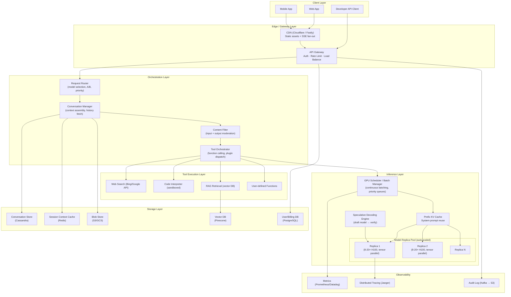
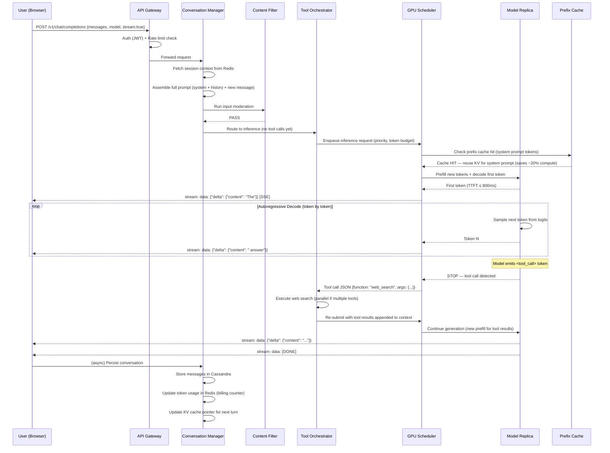

# HLD: LLM Serving System (ChatGPT / Claude Scale)

**Design Target:** Principal Engineer bar — Google / Meta / OpenAI / Anthropic  
**Scale:** 100M daily active users, 10M concurrent sessions, 1B+ tokens/day  
**Framework:** RESHADED  
**Scope:** End-to-end inference serving — not model training

---

## Table of Contents

1. [Requirements](#1-requirements)
2. [Estimation](#2-estimation)
3. [Storage Strategy](#3-storage-strategy)
4. [High-Level Design](#4-high-level-design)
5. [API Contracts](#5-api-contracts)
6. [Detail Deep Dives](#6-detail-deep-dives)
7. [Evaluate — Bottlenecks & Failure Modes](#7-evaluate--bottlenecks--failure-modes)
8. [Distinctive Features](#8-distinctive-features)
9. [Follow-Up Interviewer Questions](#9-follow-up-interviewer-questions)

---

## 1. Requirements

### Functional

| # | Requirement |
|---|-------------|
| F1 | User sends a text prompt; system returns a streaming text response |
| F2 | Multi-turn conversation context is maintained across messages in a session |
| F3 | System supports tool/function calling (web search, code execution, retrieval) |
| F4 | Response generation is streamed token-by-token (not batch return) |
| F5 | System supports multimodal input (text + images; PDF/code in future) |
| F6 | Users can regenerate, edit, branch conversation history |
| F7 | Conversations are persisted and searchable per user |
| F8 | API access for developers (OpenAI-compatible REST + SSE) |
| F9 | Usage accounting — tokens in / tokens out per request for billing |

### Non-Functional

| # | Requirement | Target |
|---|-------------|--------|
| NF1 | **Time to First Token (TTFT)** | ≤ 800ms P95 |
| NF2 | **Inter-token latency** (streaming throughput) | ≥ 20 tokens/sec perceived |
| NF3 | **Availability** | 99.95% (≈ 22 min/month downtime) |
| NF4 | **Consistency** | Session context strongly consistent within a session; eventual across replicas |
| NF5 | **Throughput** | 10M active concurrent sessions; 50k requests/sec |
| NF6 | **Cost efficiency** | GPU utilization ≥ 65% (A100/H100 clusters are expensive) |
| NF7 | **Security** | Prompt injection defense, content filtering, PII scrubbing |
| NF8 | **Compliance** | GDPR data deletion, conversation audit logs |

### Out of Scope

- Model training / fine-tuning infrastructure
- RLHF / feedback collection pipeline (separate system)
- Model weights storage and versioning

---

## 2. Estimation

### Traffic

```
DAU                    = 100M users
Avg sessions/user/day  = 3
Avg messages/session   = 10
Total messages/day     = 100M × 3 × 10 = 3B messages/day
Peak traffic           = 3B / 86,400 × 5× peak factor ≈ 170k req/sec peak
                         (practical: 50k sustained, bursts to 150k)
```

### Token Volume

```
Avg tokens per prompt  = 200 tokens (context + user message)
Avg tokens per response= 500 tokens
Token ratio in:out     ≈ 1:2.5 (output is expensive — requires autoregressive generation)

Input tokens/day       = 3B × 200 = 600B tokens/day
Output tokens/day      = 3B × 500 = 1.5T tokens/day
Total tokens/day       = ~2.1T tokens/day
```

### GPU Compute Requirements

```
GPT-4-class model      ≈ 1.7T parameters (estimated), served in FP8/INT4
H100 GPU memory        = 80 GB
Model sharding         = ~20 H100s per model replica (tensor + pipeline parallel)
Tokens/sec per H100    ≈ 2,000-4,000 tokens/sec (output, 70B-class model)
Tokens/sec per H100    ≈ 500-1,000 tokens/sec (output, 1T+ model)

To serve 1.5T output tokens/day:
  = 1.5T / 86,400 = 17.4M tokens/sec sustained
  At 1,000 tok/sec/H100 → 17,400 H100s just for inference
  With 65% utilization → ~27,000 H100s (ballpark; OpenAI reportedly uses 10k-30k A100s)
```

### Storage

```
Avg conversation size  = 200 msgs × 500 tokens × 4 bytes = ~400 KB raw
  (stored as compressed JSON → ~80 KB)
3 years retention      = 100M users × 80 KB = 8 PB conversation store
Context cache (KV)     = 50k concurrent sessions × 200K context tokens × 2 bytes (KV FP16)
                       ≈ 50k × 400MB ≈ 20 PB (cannot hold all in GPU memory — hence prefix caching)
```

### Bandwidth

```
Streaming output       = 50k req/sec × 20 tokens/sec × 5 bytes/token = 5 GB/s outbound
Input payloads         = 50k req/sec × 200 tokens × 4 bytes = 40 MB/s inbound
```

---

## 3. Storage Strategy

### Data Stores

| Store | Technology | Purpose | Why |
|-------|-----------|---------|-----|
| **Conversation Store** | Cassandra / DynamoDB | Persist all messages per user | Write-heavy, append-only, high availability; no complex joins needed |
| **Session Context Cache** | Redis Cluster | Hot session context for active conversations | Sub-millisecond lookup; 24h TTL; KV cache offload pointer |
| **KV Cache Store** (prefix cache) | GPU HBM + NVMe SSD tier | Reuse computed attention keys/values for repeated prefixes | Avoids recomputing system prompt tokens on every request; 10× cost saving |
| **User Profile / Preferences** | PostgreSQL (RDS) | Account data, billing, rate limits | Relational, ACID needed for billing |
| **Blob Store** | S3 / GCS | Multimodal inputs (images, files), exported conversations | Cheap durable object storage |
| **Vector Store** | Pinecone / Weaviate | RAG retrieval, memory search | ANN search over user long-term memory or enterprise knowledge bases |
| **Audit Log** | Kafka → S3 (Iceberg) | GDPR-compliant audit trail of all requests | Immutable append-only; queryable via Athena/BigQuery |

### Data Model — Conversation

```
conversations
  conversation_id   UUID        PK
  user_id           UUID        FK → users
  title             TEXT
  created_at        TIMESTAMP
  updated_at        TIMESTAMP
  model_id          TEXT        (e.g., "gpt-4o", "claude-3.5-sonnet")
  metadata          JSONB

messages
  message_id        UUID        PK
  conversation_id   UUID        FK → conversations  (partition key in Cassandra)
  role              ENUM        (user | assistant | system | tool)
  content           TEXT        (or JSONB for multimodal)
  tokens_in         INT
  tokens_out        INT
  latency_ms        INT
  created_at        TIMESTAMP
  tool_calls        JSONB       (nullable)
  tool_results      JSONB       (nullable)
```

---

## 4. High-Level Design

### Architecture Overview



### Request Flow (Happy Path — Streaming Chat)



---

## 5. API Contracts

### Chat Completions (OpenAI-compatible)

```http
POST /v1/chat/completions
Authorization: Bearer <API_KEY>
Content-Type: application/json

{
  "model": "gpt-4o",
  "messages": [
    {"role": "system",  "content": "You are a helpful assistant."},
    {"role": "user",    "content": "Explain quantum entanglement."},
    {"role": "assistant","content": "Quantum entanglement is..."},
    {"role": "user",    "content": "Give me an analogy."}
  ],
  "stream": true,
  "max_tokens": 1024,
  "temperature": 0.7,
  "tools": [
    {
      "type": "function",
      "function": {
        "name": "web_search",
        "description": "Search the web for current information",
        "parameters": {
          "type": "object",
          "properties": {
            "query": {"type": "string"}
          },
          "required": ["query"]
        }
      }
    }
  ]
}
```

**SSE Streaming Response:**
```
data: {"id":"chatcmpl-abc","object":"chat.completion.chunk","choices":[{"delta":{"role":"assistant"},"index":0}]}

data: {"id":"chatcmpl-abc","choices":[{"delta":{"content":"Think"},"index":0}]}

data: {"id":"chatcmpl-abc","choices":[{"delta":{"content":" of it"},"index":0}]}

data: {"id":"chatcmpl-abc","choices":[{"finish_reason":"stop","delta":{}},"usage":{"prompt_tokens":312,"completion_tokens":480,"total_tokens":792}}]}

data: [DONE]
```

### Conversation Management API

```http
GET  /v1/conversations                   # List user conversations (paginated)
GET  /v1/conversations/{id}              # Get conversation with messages
POST /v1/conversations                   # Create new conversation
DELETE /v1/conversations/{id}            # Delete conversation (GDPR)
PATCH /v1/conversations/{id}/messages/{msg_id}  # Edit a message (branching)
```

### Internal APIs

```
GPU Scheduler gRPC:
  rpc Enqueue(InferenceRequest) returns (stream Token);
  rpc GetQueueDepth() returns (QueueStats);
  rpc Preempt(request_id) returns (Ack);

Content Filter gRPC:
  rpc CheckInput(Prompt) returns (ModerationResult);  // < 50ms SLA
  rpc CheckOutput(TokenBatch) returns (ModerationResult);
```

---

## 6. Detail Deep Dives

### 6.1 LLM Inference Internals — The Two Phases

Every LLM request has two fundamentally different phases with different compute characteristics:

```
┌─────────────────────────────────────────────────────────────┐
│  PREFILL PHASE                                              │
│  ─────────────────────────────────────────────────────────  │
│  • Process ALL input tokens in PARALLEL (one forward pass)  │
│  • Compute-bound: uses full GPU matrix multiplication       │
│  • Duration: scales linearly with context length            │
│  • Output: KV cache for all input tokens + first logit      │
│  • 1000-token prompt on H100 ≈ 30-50ms                     │
│                                                             │
│  DECODE PHASE (autoregressive)                             │
│  ─────────────────────────────────────────────────────────  │
│  • Generate tokens ONE AT A TIME                            │
│  • Memory-bandwidth-bound (reads entire model weights each  │
│    token — not compute-bound until batch size >> 1)         │
│  • Output: 1 token per forward pass                         │
│  • 500-token response on H100 ≈ 5-15 seconds               │
│  • KEY OPTIMIZATION TARGET: batching multiple decodes       │
└─────────────────────────────────────────────────────────────┘
```

**Why this matters architecturally:**
- TTFT is dominated by prefill → optimize with prefix caching
- Throughput is dominated by decode → optimize with continuous batching
- Long context = expensive prefill (quadratic attention) → use Flash Attention, ring attention

### 6.2 Continuous Batching (Key Insight for Interviews)

**Naive approach (static batching):** Wait until N requests arrive, process together, return all. Problem: users submitting short prompts wait for long-prompt users.

**Continuous batching (used by vLLM, TensorRT-LLM):**

```
Time →
Req A: [PREFILL][D][D][D][D][D][D][D][DONE]
Req B:         [PREFILL][D][D][DONE]
Req C:                [PREFILL][D][D][D][D][D][D][D][DONE]
Req D:                        [PREFILL][D][D][D][D][DONE]

Each iteration (decode step), the scheduler decides which requests
to include in the SAME GPU kernel call. Finished sequences are
immediately replaced by new prefill requests.

GPU Utilization: Static batching ≈ 30-50%, Continuous ≈ 65-80%
```

### 6.3 KV Cache and Prefix Caching

**The problem:** Every request resends the same system prompt (e.g., "You are a helpful assistant... [500 tokens]"). Recomputing its KV cache wastes GPU cycles.

**Prefix caching (RadixAttention / paged KV cache):**

```
System Prompt:  "You are a helpful assistant. Today is June 2025..."
                ↓ hash(tokens) = 0xABCD1234
                ↓ stored in GPU HBM / NVMe prefix cache

Request 1: [CACHED system prompt KV] + [user message 1 prefill] → decode
Request 2: [CACHED system prompt KV] + [user message 2 prefill] → decode
Request 3: [CACHED system prompt KV] + [user message 3 prefill] → decode

Cache hit rate for system prompt: 90%+
Cost saving: ~10-30% on GPU compute (system prompts = 20-40% of context)
```

**Paged Attention (vLLM):**
- KV cache stored in fixed-size "pages" (like virtual memory)
- Sequences can share physical KV cache blocks for common prefixes
- Eliminates KV cache fragmentation → 2-4× more requests per GPU

### 6.4 GPU Scheduling & Priority Queues

```
Incoming Requests
        │
        ▼
┌───────────────────────────────────┐
│         Request Classifier        │
│  ┌────────────┐  ┌─────────────┐  │
│  │ Latency-   │  │ Throughput- │  │
│  │ Sensitive  │  │ Optimized   │  │
│  │ (API, Chat)│  │ (Batch/API) │  │
│  └─────┬──────┘  └──────┬──────┘  │
└────────┼────────────────┼─────────┘
         │                │
         ▼                ▼
   Priority Queue    FIFO Queue
   (SLA ≤ 800ms)    (best effort)
         │                │
         └────────┬────────┘
                  ▼
          GPU Scheduler
          (Continuous Batching)
                  │
          ┌───────┴────────┐
          ▼                ▼
     Model Replica 1  Model Replica N
```

**Preemption policy:** When a priority request arrives and all GPUs are busy, the scheduler can preempt a low-priority long-running decode request (swap its KV cache to NVMe) and restart it later.

### 6.5 Model Parallelism (How 1T-parameter models fit)

A 1T-parameter model at FP8 precision = ~1 TB of weights. One H100 = 80 GB. You need 13+ GPUs just for weights.

**Three parallelism strategies (typically combined):**

| Strategy | Split | What crosses GPU boundary | When to use |
|----------|-------|--------------------------|-------------|
| **Tensor Parallel** | Split weight matrices horizontally | Activation tensors (every layer) | Within a node (NVLink: 600 GB/s) |
| **Pipeline Parallel** | Split model layers across GPUs | Activations between stages | Across nodes (InfiniBand: 400 Gb/s) |
| **Sequence Parallel** | Split long sequences across GPUs | Attention outputs | Very long context (>100K tokens) |

**Typical H100 cluster layout for 70B model:**
```
8× H100 (NVLink) = 1 tensor-parallel group = 1 model replica
Serving: 4 replicas = 32× H100 per availability zone
```

**For a 1T+ model (GPT-4 class, estimated):**
```
8× tensor parallel × 8× pipeline parallel = 64 H100s per replica
```

### 6.6 Tool Calling — Agentic Loop

```
                    ┌─────────────────────────────────┐
                    │         Tool Orchestrator        │
                    └──────────────┬──────────────────┘
                                   │
User message ──────────────────►  LLM
                                   │
               ┌───────────────────▼────────────────────────┐
               │  Does response contain <tool_call>?         │
               └───────────────────┬────────────────────────┘
                                   │
                    Yes ───────────┤
                                   ▼
                    Parse tool_name + arguments
                                   │
               ┌───────────────────▼─────────────────────────┐
               │  Execute tool (with timeout + sandbox)       │
               │  • web_search: 2s timeout, rate-limited      │
               │  • code_exec: 10s timeout, gVisor sandbox    │
               │  • rag_retrieve: 200ms timeout               │
               └───────────────────┬─────────────────────────┘
                                   │
               Append tool_result to context
                                   │
               ──────────────────► LLM (again)
                                   │
               ┌───────────────────▼────────────────────────┐
               │  Final response (no tool call) → stream    │
               └────────────────────────────────────────────┘

Max iterations: 5-10 (prevent infinite loops)
Total added latency: 1-5 seconds per tool call
```

### 6.7 Content Filtering (Input + Output)

Two-pass moderation:

```
Input filter (before inference):
  - Regex + keyword blocklist (< 1ms)
  - Small classifier model (BERT-class, 50ms, GPU-shared)
  - Jailbreak detection heuristics
  → Block → return 400 with policy message

Output filter (during streaming):
  - Run in parallel with decode (low latency cost)
  - Buffer last N tokens to detect partial violations at sentence boundary
  - Hard stop + truncate if violation detected mid-stream
  → Log for human review
```

### 6.8 Session Context Assembly

**The problem:** Multi-turn chat means each message must include all prior history. Context grows with conversation length and eventually hits the model's context window limit (128K-2M tokens).

**Context window management strategies:**

```
Strategy 1: Sliding window
  Keep last N messages within token budget
  Simple, loses early context — bad for long tasks

Strategy 2: Conversation summarization
  When context > 80% of window, summarize older turns
  LLM call to compress → latency cost, information loss

Strategy 3: Importance-weighted pruning
  Score each message turn by relevance to current query
  Keep top-K turns (using embeddings + cosine similarity)
  Best quality, highest compute cost

Strategy 4: Memory + RAG hybrid (OpenAI Memory / MemGPT)
  Key facts extracted and stored in vector DB
  Retrieved at query time and injected into system prompt
  Effectively unlimited "memory" without blowing context
```

---

## 7. Evaluate — Bottlenecks & Failure Modes

### Bottlenecks

| # | Bottleneck | Impact | Mitigation |
|---|-----------|--------|------------|
| B1 | **GPU memory bandwidth** (decode phase) | Low token throughput; expensive | Speculative decoding (2-3× speedup), quantization (FP8/INT4), MLA attention |
| B2 | **Prefill latency for long context** | High TTFT for RAG-heavy, code prompts | Flash Attention 3, chunked prefill, prefix caching |
| B3 | **KV cache GPU memory exhaustion** | OOM errors under high concurrency | Paged Attention, KV offload to NVMe, context length limits |
| B4 | **Tool call round-trips** | +1-5s latency per tool | Parallel tool dispatch, predictive tool pre-fetching |
| B5 | **Cold start for new model replicas** | 5-10 min to load 70B model into GPU | Keep warm pool, checkpoint to /dev/shm, P2P weight loading |
| B6 | **Context assembly latency (Redis)** | +50-100ms for long histories | Compress stored messages, lazy-load older turns |
| B7 | **Content filter latency** | Adds ~50ms before inference starts | Run filter model co-located on inference GPU (time-shared) |

### Failure Modes & Mitigation

| Failure | Impact | Mitigation |
|---------|--------|------------|
| **Single GPU failure mid-decode** | Request fails, partial response lost | Checkpoint-restart with KV state; client-side retry with idempotency key |
| **Entire model replica down** | 1/N capacity drop | Health-check + drain; scheduler re-routes; auto-scale adds new replica |
| **Cascade failure (all replicas overloaded)** | p99 latency explosion | Load shedding (drop lowest-priority requests); circuit breaker to queuing layer |
| **Redis session cache eviction** | Context lost → incorrect continuation | Fall back to Cassandra (slower); log context-loss event; user-facing error |
| **Tool execution timeout / failure** | Broken agentic loop | Retry with exponential backoff; gracefully degrade (respond without tool result) |
| **Model generating harmful output** | Brand/legal risk | Output filter + automatic truncation; shadow log for RLHF re-training |
| **Context window overflow** | Model truncation artifacts | Pre-validate token budget; trim context deterministically before dispatch |
| **Network partition (multi-region)** | Region failover | Active-active deployment; conversation state replicated via Cassandra multi-DC; sticky session routing |

### SLA Failure Budget Analysis

```
Target: 99.95% availability = 22 min/month downtime budget

Risk contributors:
  - Deployment / rolling restart:  ~5 min/month
  - GPU hardware failure:          ~5 min/month (with N+2 redundancy)
  - Dependency failures (Redis):   ~5 min/month
  - Unknown / cascade:             ~7 min/month

→ Meets budget if redundancy holds.
   Without N+2 GPU redundancy: single region failure = 10-30 min MTTR → breaks SLA
```

---

## 8. Distinctive Features

### 8.1 Speculative Decoding

Use a small "draft" model (7B params) to speculatively generate K tokens ahead, then verify with the large model in one forward pass:

```
Draft model generates: ["The", "answer", "is", "42", "."]  (5 tokens)
Large model verifies all 5 in ONE forward pass (same cost as 1 token!)
  → Accept ["The", "answer", "is", "42"] (first mismatch at ".")
  → Large model corrects "." → "because"

Net speedup: 2-3× on tokens accepted per unit time
Cost: Negligible (draft model 7B vs. serving model 1T)
Real-world use: Google Gemini, DeepMind AlphaCode 2
```

### 8.2 Flash Attention (Memory-Efficient Attention)

Standard attention is O(N²) memory (stores N×N attention matrix). For 128K context:
```
N = 128,000 tokens
Attention matrix = 128K × 128K × 2 bytes = 32 GB per layer
With 80 layers → 2.5 TB — impossible even on H100

Flash Attention: O(N) memory by tiling computation in SRAM
  → Never materializes full N×N matrix
  → 2-4× speedup in attention computation
  → Enables 128K-2M context windows
```

### 8.3 Multi-Query Attention (MQA) / Grouped-Query Attention (GQA)

In standard Multi-Head Attention:
```
Heads = 96, KV heads = 96 → KV cache = 96 × 128D × 2 bytes × sequence_len
At 128K context, 70B model → KV cache = 128 GB per request (impossible)
```

**GQA (used in LLaMA 3, Gemma, Mistral):**
```
Query heads = 32, KV heads = 8 (4× fewer)
KV cache shrinks 4× → fits more requests in GPU memory
Quality loss: negligible (0.1-0.2% benchmark drop)
```

### 8.4 Global Rate Limiting with Redis + Token Bucket

```
Key: rate:{user_id}:{minute}
Algorithm: Token bucket with Redis INCR + EXPIRE

On each request:
  tokens_used = INCRBY rate:{user_id}:{minute} {input_tokens}
  if tokens_used > TIER_LIMIT:
    return 429 Too Many Requests (Retry-After: seconds_until_next_minute)
  SET EXPIRE if first request in window

Tier limits (example):
  Free:    40K tokens/minute
  Pro:     200K tokens/minute
  API Tier 1: 1M tokens/minute
  API Tier 5: 30M tokens/minute
```

### 8.5 Observability — Key Metrics

```
Golden signals for LLM serving:

Latency:
  - TTFT P50/P95/P99 (user-perceived responsiveness)
  - Inter-token latency P50/P95 (streaming feel)
  - Tool execution latency by tool name

Traffic:
  - Requests per second by model
  - Tokens per second (input/output separately)
  - Active sessions, queue depth

Errors:
  - Content filter rejection rate (input/output)
  - Timeout rate (prefill/decode separately)
  - Tool failure rate by tool type

Saturation:
  - GPU memory utilization per replica
  - KV cache hit rate (prefix cache efficiency)
  - GPU SM utilization (< 30% = memory-bound, expected in decode)
  - Queue wait time (leading indicator of overload)
```

---

## 9. Follow-Up Interviewer Questions

### Q1: "How would you handle a 10× traffic spike during a viral event?"

**Principal answer:**
- **Pre-provision burst capacity** via spot GPU instances (AWS p4de / Google TPU v5e) with model weights pre-loaded in shared memory
- **Load shed gracefully**: degrade to smaller/faster models (GPT-4o mini instead of GPT-4o) for free-tier users; communicate via response headers
- **Increase batch sizes** during spike (sacrifice per-request TTFT for throughput)
- **Circuit break upstream dependencies** (disable non-critical RAG retrieval)
- **Estimated ramp time**: 5-10 min for a warm standby replica pool; 30-60 min for cold-start from scratch — your warm pool sizing is what defines your burst SLA

### Q2: "How would you support 1M-token context windows?"

**Principal answer:**
Ring Attention (sequence parallelism) distributes the attention computation across GPUs:
- Sequence split across 8 GPUs → each GPU handles 125K tokens
- GPUs rotate KV chunks in a ring pattern (each GPU computes attention for local Q vs. all K/V blocks)
- NVLink bandwidth (600 GB/s) makes this feasible within a single node
- **Additional challenge**: KV cache for 1M context = 1M × 128 heads × 128D × 2 bytes = 4 GB per layer × 80 layers = 320 GB just for KV cache per request → need sliding window attention or aggressive KV compression (KVQuant, PyramidKV)

### Q3: "How do you ensure consistency in multi-turn conversations across data centers?"

**Principal answer:**
- **Sticky sessions**: Route all requests in a conversation to the same regional cluster (geo-hash of conversation_id). Minimizes cross-DC reads.
- **Strong consistency within session**: Redis session cache with replication, Cassandra LOCAL_QUORUM for reads
- **Cross-DC replication**: Cassandra multi-DC async replication (eventually consistent for archival). If the primary region fails, conversation history is replicated but the in-flight KV cache is lost → client must re-send full context or accept a context-loss event
- **KV cache is not replicated** (too large, GPU-specific): treat it as ephemeral optimization, not durability requirement. Worst case: re-prefill the context (extra 100-500ms, not a correctness issue)

---

## Trade-Off Summary

| Decision | Chosen | Alternative | Why |
|----------|--------|-------------|-----|
| Streaming via SSE | SSE (Server-Sent Events) | WebSocket | SSE is simpler, HTTP/2 multiplexed, sufficient for unidirectional token stream; WS adds overhead for bidirectional not needed here |
| Conversation storage | Cassandra | PostgreSQL | Write-heavy append-only workload; 8 PB scale; no cross-conversation joins needed; Cassandra's ring model = no single point of failure |
| Context cache | Redis | In-process memory | Context must survive inference worker restarts; shared across load-balanced workers; Redis Cluster scales horizontally |
| Inference framework | vLLM / TensorRT-LLM | Triton + naive batching | Continuous batching + Paged Attention = 2-4× better GPU utilization; open ecosystem |
| Rate limiting | Token-bucket (token-count based) | Request-count based | Tokens are the actual cost unit; request-count favors adversarial long prompts |
| Multi-turn context | Assembled server-side | Client sends full history | Prevents client tampering with context; enables server-side compression/truncation; reduces payload size (client only sends new message) |

---

*Calibrated to: Principal Engineer interview at OpenAI / Google DeepMind / Anthropic / Meta FAIR*  
*Last updated: 2026-06*
