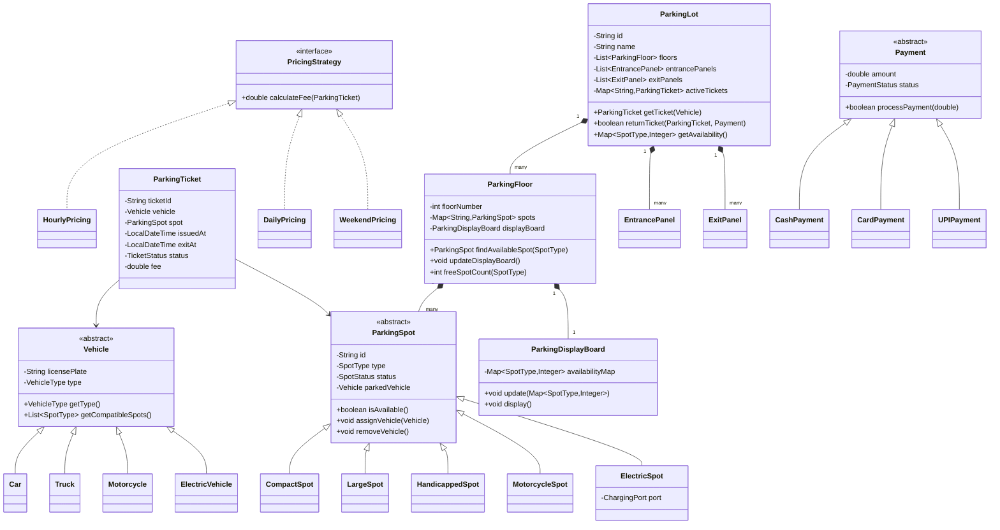

# LLD: Parking Lot

## 1. Requirements

### Functional
- Parking lot has multiple floors; each floor has multiple spots
- Spot types: Compact, Large, Handicapped, Motorcycle, Electric
- Vehicle types: Car, Truck, Motorcycle, Electric Vehicle
- Issue parking ticket on entry; compute fee on exit
- Multiple entry/exit panels
- Display available spots per floor/type
- Support hourly, daily, and monthly pricing strategies
- Reserve a specific spot in advance

### Non-Functional
- Thread-safe spot assignment (concurrent entries)
- Fee calculation must be extensible without modifying existing code
- Support for multiple payment methods: cash, card, UPI

### Out of Scope
- Vehicle tracking cameras, ANPR
- Multi-lot management

---

## 2. Core Entities (Noun Extraction)

`ParkingLot`, `ParkingFloor`, `ParkingSpot`, `Vehicle`, `ParkingTicket`, `EntrancePanel`, `ExitPanel`, `ParkingDisplayBoard`, `Payment`, `PricingStrategy`

---

## 3. Class Diagram



---

## 4. Design Patterns

| Pattern | Where Applied | Why |
|---------|--------------|-----|
| **Strategy** | `PricingStrategy` | Swap fee calculation without changing `ParkingLot` |
| **Factory Method** | `SpotFactory`, `VehicleFactory` | Decouple creation of spot/vehicle types |
| **Singleton** | `ParkingLot` | Single instance manages global state |
| **Observer** | `ParkingDisplayBoard` | Floors notify board when spot status changes |
| **State** | `ParkingSpot.status`, `ParkingTicket.status` | Explicit state transitions (AVAILABLE → OCCUPIED → RESERVED) |

---

## 5. Java Implementation

```java
// ─── Enums ──────────────────────────────────────────────────────────────────

public enum SpotType { COMPACT, LARGE, HANDICAPPED, MOTORCYCLE, ELECTRIC }
public enum VehicleType { CAR, TRUCK, MOTORCYCLE, ELECTRIC }
public enum SpotStatus { AVAILABLE, OCCUPIED, RESERVED, OUT_OF_SERVICE }
public enum TicketStatus { ACTIVE, PAID, LOST }
public enum PaymentStatus { PENDING, COMPLETED, FAILED, REFUNDED }

// ─── Vehicle Hierarchy ──────────────────────────────────────────────────────

public abstract class Vehicle {
    protected final String licensePlate;
    protected final VehicleType type;

    protected Vehicle(String licensePlate, VehicleType type) {
        this.licensePlate = licensePlate;
        this.type = type;
    }

    public abstract List<SpotType> getCompatibleSpots();
    public VehicleType getType() { return type; }
    public String getLicensePlate() { return licensePlate; }
}

public class Car extends Vehicle {
    public Car(String licensePlate) { super(licensePlate, VehicleType.CAR); }

    @Override
    public List<SpotType> getCompatibleSpots() {
        return List.of(SpotType.COMPACT, SpotType.LARGE);
    }
}

public class Motorcycle extends Vehicle {
    public Motorcycle(String licensePlate) { super(licensePlate, VehicleType.MOTORCYCLE); }

    @Override
    public List<SpotType> getCompatibleSpots() {
        return List.of(SpotType.MOTORCYCLE, SpotType.COMPACT);
    }
}

public class Truck extends Vehicle {
    public Truck(String licensePlate) { super(licensePlate, VehicleType.TRUCK); }

    @Override
    public List<SpotType> getCompatibleSpots() {
        return List.of(SpotType.LARGE);
    }
}

// ─── Parking Spot Hierarchy ─────────────────────────────────────────────────

public abstract class ParkingSpot {
    protected final String id;
    protected final SpotType type;
    protected volatile SpotStatus status;
    protected Vehicle parkedVehicle;

    protected ParkingSpot(String id, SpotType type) {
        this.id = id;
        this.type = type;
        this.status = SpotStatus.AVAILABLE;
    }

    public synchronized boolean isAvailable() {
        return status == SpotStatus.AVAILABLE;
    }

    public synchronized void assignVehicle(Vehicle vehicle) {
        if (!isAvailable()) throw new IllegalStateException("Spot " + id + " is not available");
        this.parkedVehicle = vehicle;
        this.status = SpotStatus.OCCUPIED;
    }

    public synchronized void removeVehicle() {
        this.parkedVehicle = null;
        this.status = SpotStatus.AVAILABLE;
    }

    public SpotType getType() { return type; }
    public String getId() { return id; }
    public SpotStatus getStatus() { return status; }
}

public class CompactSpot extends ParkingSpot {
    public CompactSpot(String id) { super(id, SpotType.COMPACT); }
}

public class LargeSpot extends ParkingSpot {
    public LargeSpot(String id) { super(id, SpotType.LARGE); }
}

public class ElectricSpot extends ParkingSpot {
    private boolean chargingPortFree = true;

    public ElectricSpot(String id) { super(id, SpotType.ELECTRIC); }

    public synchronized boolean isChargingAvailable() { return chargingPortFree; }
}

// ─── Pricing Strategy ───────────────────────────────────────────────────────

public interface PricingStrategy {
    double calculateFee(ParkingTicket ticket);
}

public class HourlyPricing implements PricingStrategy {
    private final Map<SpotType, Double> ratesPerHour;

    public HourlyPricing(Map<SpotType, Double> ratesPerHour) {
        this.ratesPerHour = ratesPerHour;
    }

    @Override
    public double calculateFee(ParkingTicket ticket) {
        long minutes = Duration.between(ticket.getIssuedAt(), LocalDateTime.now()).toMinutes();
        long hours = Math.max(1, (minutes + 59) / 60); // ceil to next hour
        double rate = ratesPerHour.getOrDefault(ticket.getSpot().getType(), 2.0);
        return hours * rate;
    }
}

public class DailyPricing implements PricingStrategy {
    private final double dailyRate;

    public DailyPricing(double dailyRate) { this.dailyRate = dailyRate; }

    @Override
    public double calculateFee(ParkingTicket ticket) {
        long minutes = Duration.between(ticket.getIssuedAt(), LocalDateTime.now()).toMinutes();
        long days = Math.max(1, (minutes + 1439) / 1440);
        return days * dailyRate;
    }
}

// ─── Parking Ticket ──────────────────────────────────────────────────────────

public class ParkingTicket {
    private final String ticketId;
    private final Vehicle vehicle;
    private final ParkingSpot spot;
    private final LocalDateTime issuedAt;
    private LocalDateTime exitAt;
    private TicketStatus status;
    private double fee;

    public ParkingTicket(Vehicle vehicle, ParkingSpot spot) {
        this.ticketId = UUID.randomUUID().toString();
        this.vehicle = vehicle;
        this.spot = spot;
        this.issuedAt = LocalDateTime.now();
        this.status = TicketStatus.ACTIVE;
    }

    public void markPaid(double fee) {
        this.fee = fee;
        this.exitAt = LocalDateTime.now();
        this.status = TicketStatus.PAID;
    }

    // getters...
    public String getTicketId() { return ticketId; }
    public Vehicle getVehicle() { return vehicle; }
    public ParkingSpot getSpot() { return spot; }
    public LocalDateTime getIssuedAt() { return issuedAt; }
    public TicketStatus getStatus() { return status; }
}

// ─── Parking Floor ───────────────────────────────────────────────────────────

public class ParkingFloor {
    private final int floorNumber;
    private final Map<String, ParkingSpot> spots = new ConcurrentHashMap<>();
    private final ParkingDisplayBoard displayBoard;

    public ParkingFloor(int floorNumber) {
        this.floorNumber = floorNumber;
        this.displayBoard = new ParkingDisplayBoard(floorNumber);
    }

    public void addSpot(ParkingSpot spot) {
        spots.put(spot.getId(), spot);
    }

    public Optional<ParkingSpot> findAvailableSpot(SpotType type) {
        return spots.values().stream()
            .filter(s -> s.getType() == type && s.isAvailable())
            .findFirst();
    }

    public Map<SpotType, Long> getAvailability() {
        return spots.values().stream()
            .filter(ParkingSpot::isAvailable)
            .collect(Collectors.groupingBy(ParkingSpot::getType, Collectors.counting()));
    }

    public int getFloorNumber() { return floorNumber; }
}

// ─── Parking Lot (Singleton) ─────────────────────────────────────────────────

public class ParkingLot {
    private static volatile ParkingLot instance;

    private final String id;
    private final String name;
    private final List<ParkingFloor> floors = new ArrayList<>();
    private final Map<String, ParkingTicket> activeTickets = new ConcurrentHashMap<>();
    private PricingStrategy pricingStrategy;

    private ParkingLot(String id, String name, PricingStrategy pricingStrategy) {
        this.id = id;
        this.name = name;
        this.pricingStrategy = pricingStrategy;
    }

    public static ParkingLot getInstance(String id, String name, PricingStrategy strategy) {
        if (instance == null) {
            synchronized (ParkingLot.class) {
                if (instance == null) {
                    instance = new ParkingLot(id, name, strategy);
                }
            }
        }
        return instance;
    }

    public ParkingTicket getTicket(Vehicle vehicle) {
        for (SpotType spotType : vehicle.getCompatibleSpots()) {
            for (ParkingFloor floor : floors) {
                Optional<ParkingSpot> spot = floor.findAvailableSpot(spotType);
                if (spot.isPresent()) {
                    ParkingSpot s = spot.get();
                    s.assignVehicle(vehicle);
                    ParkingTicket ticket = new ParkingTicket(vehicle, s);
                    activeTickets.put(ticket.getTicketId(), ticket);
                    return ticket;
                }
            }
        }
        throw new ParkingLotFullException("No available spot for vehicle type: " + vehicle.getType());
    }

    public double returnTicket(String ticketId, Payment payment) {
        ParkingTicket ticket = activeTickets.get(ticketId);
        if (ticket == null) throw new IllegalArgumentException("Invalid ticket: " + ticketId);
        if (ticket.getStatus() != TicketStatus.ACTIVE) throw new IllegalStateException("Ticket already processed");

        double fee = pricingStrategy.calculateFee(ticket);
        payment.processPayment(fee);
        ticket.markPaid(fee);
        ticket.getSpot().removeVehicle();
        activeTickets.remove(ticketId);
        return fee;
    }

    public void addFloor(ParkingFloor floor) { floors.add(floor); }
    public void setPricingStrategy(PricingStrategy strategy) { this.pricingStrategy = strategy; }

    public Map<SpotType, Long> getAvailability() {
        return floors.stream()
            .flatMap(f -> f.getAvailability().entrySet().stream())
            .collect(Collectors.toMap(Map.Entry::getKey, Map.Entry::getValue, Long::sum));
    }
}

// ─── Payment Hierarchy ───────────────────────────────────────────────────────

public abstract class Payment {
    protected double amount;
    protected PaymentStatus status = PaymentStatus.PENDING;

    public abstract boolean processPayment(double amount);
    public PaymentStatus getStatus() { return status; }
}

public class CashPayment extends Payment {
    private final double cashTendered;

    public CashPayment(double cashTendered) { this.cashTendered = cashTendered; }

    @Override
    public boolean processPayment(double amount) {
        if (cashTendered < amount) {
            status = PaymentStatus.FAILED;
            return false;
        }
        this.amount = amount;
        status = PaymentStatus.COMPLETED;
        return true;
    }
}
```

---

## 6. SOLID Analysis

| Principle | Assessment |
|-----------|-----------|
| **SRP** | `ParkingLot` orchestrates but doesn't calculate fees or manage payments — each class owns one concern |
| **OCP** | New vehicle types extend `Vehicle`; new pricing extends `PricingStrategy` — no modification needed |
| **LSP** | All `ParkingSpot` subtypes are substitutable; `ElectricSpot` adds behavior, doesn't violate base contract |
| **ISP** | `PricingStrategy` is minimal; `Payment` doesn't expose irrelevant methods |
| **DIP** | `ParkingLot` depends on `PricingStrategy` interface, not `HourlyPricing` concrete class |

---

## 7. Concurrency Considerations

- `ParkingSpot.assignVehicle()` is `synchronized` — prevents double-assignment under concurrent entries
- `activeTickets` uses `ConcurrentHashMap` — safe concurrent reads/writes
- `ParkingLot` uses double-checked locking for singleton
- Floor-level spot search is eventually consistent — acceptable for display boards, not for assignment

---

## 8. Extensibility

| Future Requirement | How to Add |
|--------------------|-----------|
| Monthly subscription passes | New `MonthlyPassTicket` extending `ParkingTicket` |
| Dynamic surge pricing | Composite `PricingStrategy` combining `HourlyPricing` + `SurgePricing` |
| EV charging fee | Override `ElectricSpot.assignVehicle()` to register charging session |
| Spot reservation API | Add `ReserveSpot` use case; change `SpotStatus` to `RESERVED` |
| Multi-lot management | `ParkingNetwork` aggregating multiple `ParkingLot` instances |

---

## 9. FAANG Interview Tips

- **Start with the actors**: Customer enters, Customer exits, Admin configures — map each to use cases
- **Spot compatibility matrix**: A Car fits COMPACT + LARGE; a Truck fits only LARGE — encode in `Vehicle.getCompatibleSpots()`
- **Concurrency is the trap**: Interviewers will ask "what if two cars enter simultaneously for the last spot?" — answer: synchronized `assignVehicle()`
- **Don't forget the display board** — it's an Observer candidate that many candidates miss
- **Pricing strategy wins points**: Hard-coding hourly rates is a red flag; Strategy pattern shows extensibility thinking
- **Follow-up: How would you handle 10,000 entries/second?** — Distributed lock per spot (Redis), shard by floor, async ticket issuance
