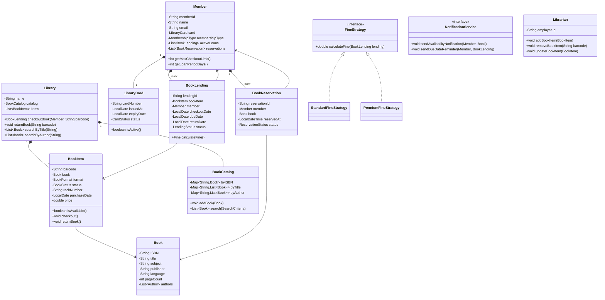

# LLD: Library Management System

## 1. Requirements

### Functional
- Members can search catalog (by title, author, subject, publication date)
- Members can check out and return books
- System tracks due dates and computes fines for late returns
- Members can reserve books currently checked out
- Librarians can add/remove/update book inventory
- Members can have multiple membership types (Standard, Premium)
- Book notifications when a reserved book becomes available
- Barcode-based book identification

### Non-Functional
- Support 50,000+ book catalog
- Multiple concurrent checkouts
- Fine calculation extensible per membership type

### Out of Scope
- Digital/e-book lending, inter-library loans

---

## 2. Core Entities

`Library`, `BookItem`, `Book`, `BookCatalog`, `Member`, `LibraryCard`, `Librarian`, `BookLending`, `Fine`, `BookReservation`, `Notification`

---

## 3. Class Diagram



---

## 4. Design Patterns

| Pattern | Where Applied | Why |
|---------|--------------|-----|
| **Strategy** | `FineStrategy` | Different fine rules per membership type without conditionals |
| **Observer** | `NotificationService` | Notify waiting members when a returned book matches their reservation |
| **Template Method** | `BookLending.calculateFine()` | Common fine logic with hook for membership-specific rates |
| **Factory** | `LendingFactory` | Creates `BookLending` with correct loan period per membership type |
| **Repository** | `BookCatalog` | Abstracts search/storage from business logic |

---

## 5. Java Implementation

```java
// ─── Enums ──────────────────────────────────────────────────────────────────

public enum BookStatus { AVAILABLE, RESERVED, LOANED, LOST }
public enum BookFormat { HARDCOVER, PAPERBACK, AUDIO, DIGITAL, MAGAZINE }
public enum MembershipType { STANDARD, PREMIUM }
public enum LendingStatus { ACTIVE, RETURNED, OVERDUE, LOST }
public enum ReservationStatus { WAITING, PENDING, COMPLETED, CANCELLED }

// ─── Book Domain ─────────────────────────────────────────────────────────────

public class Author {
    private final String name;
    private final String description;
    // constructor + getters
}

public class Book {
    private final String isbn;
    private final String title;
    private final String subject;
    private final String publisher;
    private final List<Author> authors;

    // Full constructor, getters
    public String getIsbn() { return isbn; }
    public String getTitle() { return title; }
    public List<Author> getAuthors() { return Collections.unmodifiableList(authors); }
}

public class BookItem {
    private final String barcode;
    private final Book book;
    private final BookFormat format;
    private volatile BookStatus status;
    private final String rackNumber;

    public BookItem(String barcode, Book book, BookFormat format, String rackNumber) {
        this.barcode = barcode;
        this.book = book;
        this.format = format;
        this.rackNumber = rackNumber;
        this.status = BookStatus.AVAILABLE;
    }

    public synchronized boolean isAvailable() {
        return status == BookStatus.AVAILABLE;
    }

    public synchronized void checkout() {
        if (status != BookStatus.AVAILABLE && status != BookStatus.RESERVED) {
            throw new BookNotAvailableException("Book " + barcode + " is not available");
        }
        status = BookStatus.LOANED;
    }

    public synchronized void returnBook() {
        status = BookStatus.AVAILABLE;
    }

    public String getBarcode() { return barcode; }
    public Book getBook() { return book; }
    public BookStatus getStatus() { return status; }
}

// ─── Member ──────────────────────────────────────────────────────────────────

public class LibraryCard {
    private final String cardNumber;
    private final LocalDate issuedAt;
    private final LocalDate expiryDate;
    private boolean active;

    public boolean isActive() {
        return active && LocalDate.now().isBefore(expiryDate);
    }
}

public class Member {
    private final String memberId;
    private final String name;
    private final String email;
    private final LibraryCard card;
    private final MembershipType membershipType;
    private final List<BookLending> activeLoans = new ArrayList<>();
    private final List<BookReservation> reservations = new ArrayList<>();

    public Member(String memberId, String name, String email,
                  LibraryCard card, MembershipType type) {
        this.memberId = memberId;
        this.name = name;
        this.email = email;
        this.card = card;
        this.membershipType = type;
    }

    public int getMaxCheckoutLimit() {
        return membershipType == MembershipType.PREMIUM ? 10 : 5;
    }

    public int getLoanPeriodDays() {
        return membershipType == MembershipType.PREMIUM ? 30 : 14;
    }

    public boolean canCheckout() {
        return card.isActive() && activeLoans.size() < getMaxCheckoutLimit();
    }

    public void addLoan(BookLending lending) { activeLoans.add(lending); }
    public void removeLoan(BookLending lending) { activeLoans.remove(lending); }
    public MembershipType getMembershipType() { return membershipType; }
    public String getMemberId() { return memberId; }
    public String getEmail() { return email; }
    public String getName() { return name; }
}

// ─── Fine Strategy ────────────────────────────────────────────────────────────

public interface FineStrategy {
    double calculateFine(BookLending lending);
}

public class StandardFineStrategy implements FineStrategy {
    private static final double RATE_PER_DAY = 0.50;
    private static final double MAX_FINE = 25.0;

    @Override
    public double calculateFine(BookLending lending) {
        if (lending.getReturnDate() == null || !lending.isOverdue()) return 0.0;
        long overdueDays = ChronoUnit.DAYS.between(lending.getDueDate(), lending.getReturnDate());
        return Math.min(overdueDays * RATE_PER_DAY, MAX_FINE);
    }
}

public class PremiumFineStrategy implements FineStrategy {
    private static final double RATE_PER_DAY = 0.25;
    private static final double MAX_FINE = 10.0;

    @Override
    public double calculateFine(BookLending lending) {
        if (lending.getReturnDate() == null || !lending.isOverdue()) return 0.0;
        long overdueDays = ChronoUnit.DAYS.between(lending.getDueDate(), lending.getReturnDate());
        return Math.min(overdueDays * RATE_PER_DAY, MAX_FINE);
    }
}

// ─── Book Lending ─────────────────────────────────────────────────────────────

public class BookLending {
    private final String lendingId;
    private final BookItem bookItem;
    private final Member member;
    private final LocalDate checkoutDate;
    private final LocalDate dueDate;
    private LocalDate returnDate;
    private LendingStatus status;
    private final FineStrategy fineStrategy;

    public BookLending(BookItem bookItem, Member member, FineStrategy fineStrategy) {
        this.lendingId = UUID.randomUUID().toString();
        this.bookItem = bookItem;
        this.member = member;
        this.checkoutDate = LocalDate.now();
        this.dueDate = checkoutDate.plusDays(member.getLoanPeriodDays());
        this.status = LendingStatus.ACTIVE;
        this.fineStrategy = fineStrategy;
    }

    public void returnBook() {
        this.returnDate = LocalDate.now();
        this.status = isOverdue() ? LendingStatus.OVERDUE : LendingStatus.RETURNED;
    }

    public boolean isOverdue() {
        LocalDate checkDate = returnDate != null ? returnDate : LocalDate.now();
        return checkDate.isAfter(dueDate);
    }

    public double calculateFine() {
        return fineStrategy.calculateFine(this);
    }

    public LocalDate getDueDate() { return dueDate; }
    public LocalDate getReturnDate() { return returnDate; }
    public BookItem getBookItem() { return bookItem; }
    public Member getMember() { return member; }
    public LendingStatus getStatus() { return status; }
}

// ─── Book Reservation ────────────────────────────────────────────────────────

public class BookReservation {
    private final String reservationId;
    private final Member member;
    private final Book book;
    private final LocalDateTime reservedAt;
    private ReservationStatus status;

    public BookReservation(Member member, Book book) {
        this.reservationId = UUID.randomUUID().toString();
        this.member = member;
        this.book = book;
        this.reservedAt = LocalDateTime.now();
        this.status = ReservationStatus.WAITING;
    }

    public void fulfil() { status = ReservationStatus.COMPLETED; }
    public void cancel() { status = ReservationStatus.CANCELLED; }
    public Member getMember() { return member; }
    public Book getBook() { return book; }
    public ReservationStatus getStatus() { return status; }
}

// ─── Notification Service ────────────────────────────────────────────────────

public interface NotificationService {
    void sendAvailabilityNotification(Member member, Book book);
    void sendDueDateReminder(Member member, BookLending lending);
}

public class EmailNotificationService implements NotificationService {
    @Override
    public void sendAvailabilityNotification(Member member, Book book) {
        System.out.printf("Email to %s: Book '%s' is now available%n",
            member.getEmail(), book.getTitle());
    }

    @Override
    public void sendDueDateReminder(Member member, BookLending lending) {
        System.out.printf("Email to %s: Return '%s' by %s%n",
            member.getEmail(), lending.getBookItem().getBook().getTitle(), lending.getDueDate());
    }
}

// ─── Book Catalog ────────────────────────────────────────────────────────────

public class BookCatalog {
    private final Map<String, Book> byISBN = new HashMap<>();
    private final Map<String, List<Book>> byTitle = new TreeMap<>(String.CASE_INSENSITIVE_ORDER);
    private final Map<String, List<Book>> byAuthor = new TreeMap<>(String.CASE_INSENSITIVE_ORDER);

    public void addBook(Book book) {
        byISBN.put(book.getIsbn(), book);
        byTitle.computeIfAbsent(book.getTitle(), k -> new ArrayList<>()).add(book);
        book.getAuthors().forEach(a ->
            byAuthor.computeIfAbsent(a.getName(), k -> new ArrayList<>()).add(book));
    }

    public List<Book> searchByTitle(String title) {
        return byTitle.getOrDefault(title, Collections.emptyList());
    }

    public List<Book> searchByAuthor(String author) {
        return byAuthor.entrySet().stream()
            .filter(e -> e.getKey().toLowerCase().contains(author.toLowerCase()))
            .flatMap(e -> e.getValue().stream())
            .collect(Collectors.toList());
    }

    public Optional<Book> findByISBN(String isbn) {
        return Optional.ofNullable(byISBN.get(isbn));
    }
}

// ─── Library (Orchestrator) ───────────────────────────────────────────────────

public class Library {
    private final String name;
    private final BookCatalog catalog = new BookCatalog();
    private final Map<String, BookItem> items = new ConcurrentHashMap<>();
    private final Map<String, List<BookReservation>> reservationQueue = new ConcurrentHashMap<>();
    private final NotificationService notificationService;
    private final Map<MembershipType, FineStrategy> fineStrategies;

    public Library(String name, NotificationService notificationService) {
        this.name = name;
        this.notificationService = notificationService;
        this.fineStrategies = Map.of(
            MembershipType.STANDARD, new StandardFineStrategy(),
            MembershipType.PREMIUM, new PremiumFineStrategy()
        );
    }

    public BookLending checkoutBook(Member member, String barcode) {
        if (!member.canCheckout()) {
            throw new CheckoutLimitExceededException("Member " + member.getMemberId() + " cannot checkout more books");
        }
        BookItem item = items.get(barcode);
        if (item == null) throw new BookNotFoundException("Barcode not found: " + barcode);
        if (!item.isAvailable()) throw new BookNotAvailableException("Book is not available");

        item.checkout();
        FineStrategy strategy = fineStrategies.get(member.getMembershipType());
        BookLending lending = new BookLending(item, member, strategy);
        member.addLoan(lending);
        return lending;
    }

    public double returnBook(String barcode) {
        BookItem item = items.get(barcode);
        if (item == null) throw new BookNotFoundException("Barcode not found: " + barcode);

        item.returnBook();

        // Notify waiting reservations
        List<BookReservation> queue = reservationQueue.get(item.getBook().getIsbn());
        if (queue != null && !queue.isEmpty()) {
            BookReservation next = queue.stream()
                .filter(r -> r.getStatus() == ReservationStatus.WAITING)
                .findFirst().orElse(null);
            if (next != null) {
                notificationService.sendAvailabilityNotification(next.getMember(), item.getBook());
            }
        }

        return 0.0; // Fine calculation delegated to lending
    }

    public BookReservation reserveBook(Member member, String isbn) {
        Book book = catalog.findByISBN(isbn)
            .orElseThrow(() -> new BookNotFoundException("ISBN not found: " + isbn));
        BookReservation reservation = new BookReservation(member, book);
        reservationQueue.computeIfAbsent(isbn, k -> new ArrayList<>()).add(reservation);
        return reservation;
    }

    public void addBookItem(BookItem item) {
        items.put(item.getBarcode(), item);
        catalog.addBook(item.getBook());
    }

    public List<Book> searchByTitle(String title) { return catalog.searchByTitle(title); }
    public List<Book> searchByAuthor(String author) { return catalog.searchByAuthor(author); }
}
```

---

## 6. SOLID Analysis

| Principle | Assessment |
|-----------|-----------|
| **SRP** | `BookLending` handles loan lifecycle; `BookCatalog` handles search; `Library` orchestrates — no god class |
| **OCP** | Adding `EliteMembership` adds a new `FineStrategy` subclass — zero existing changes |
| **LSP** | All `FineStrategy` implementations fulfill the contract — no surprise behavior |
| **ISP** | `NotificationService` has only two targeted methods; `FineStrategy` has exactly one |
| **DIP** | `Library` depends on `FineStrategy` and `NotificationService` interfaces injected at construction |

---

## 7. Extensibility

| Future Requirement | How to Add |
|--------------------|-----------|
| Digital/e-book lending | `DigitalBookItem extends BookItem` with download link and DRM |
| Inter-library loan | `InterLibraryLoanService` composing multiple `Library` instances |
| Automated reminders | `ScheduledNotificationJob` calling `NotificationService.sendDueDateReminder()` |
| Fine waiver for first offense | Decorator on `FineStrategy` that checks waiver eligibility |
| Search by subject/tag | Add index to `BookCatalog`; no change to `Library` |

---

## 8. FAANG Interview Tips

- **Clarify**: Can a member check out the same book twice? (No.) Can a member have multiple reservations? (Yes, for different books.)
- **Key constraint**: `Member.canCheckout()` must be atomic — check + checkout in a synchronized block or transactional service
- **Fine calculation placement**: Don't put fine logic in `Library` — put it in `BookLending` via Strategy; keeps `Library` clean
- **Observer for notifications**: Many candidates use a direct call — show you know it should be event-driven
- **Follow-up**: "How would you handle 1M members?" → Shard by member ID, use read replicas for catalog search, cache popular books
