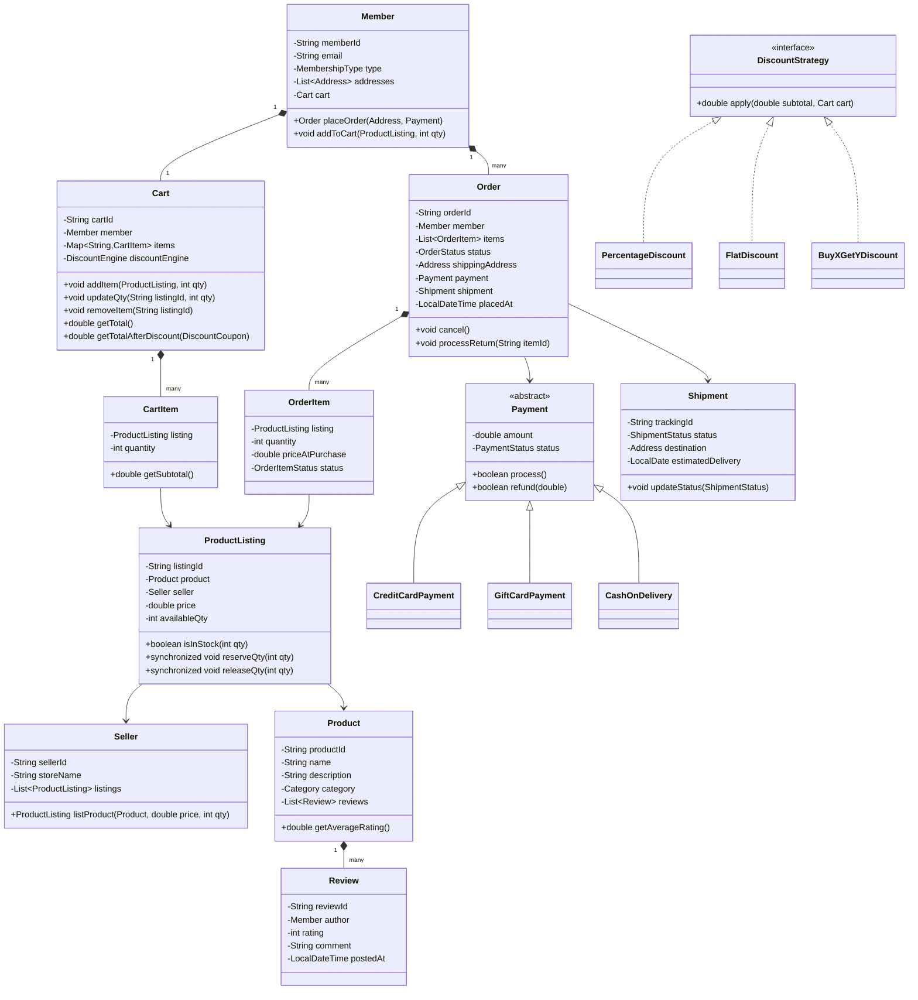

# LLD: Online Shopping System (Amazon)

## 1. Requirements

### Functional
- Members browse and search product catalog (by name, category, price range)
- Add items to cart, modify quantities, remove items
- Place orders with multiple items
- Multiple payment methods: credit card, gift card, COD
- Order fulfillment: processing → shipped → delivered → returned
- Product reviews and ratings
- Seller can list products with inventory
- Shipping address management
- Discount coupons and promotions

### Non-Functional
- Inventory consistency — no overselling
- Order idempotency — re-submitting same cart doesn't create duplicate order
- Extensible discount engine

### Out of Scope
- Recommendation engine, A/B testing, logistics routing

---

## 2. Core Entities

`Member`, `Product`, `ProductListing`, `Cart`, `CartItem`, `Order`, `OrderItem`, `Payment`, `Shipment`, `Address`, `Review`, `Seller`, `DiscountCoupon`

---

## 3. Class Diagram



---

## 4. Design Patterns

| Pattern | Where Applied | Why |
|---------|--------------|-----|
| **Strategy** | `DiscountStrategy` | Plug different discount algorithms without conditionals |
| **Decorator** | `DiscountEngine` | Stack multiple discounts (% off + flat off + loyalty points) |
| **Observer** | `OrderStatusNotifier` | Notify member on every order status transition |
| **State** | `Order.status` | Explicit valid transitions: PENDING → PROCESSING → SHIPPED → DELIVERED |
| **Factory** | `PaymentFactory` | Instantiate payment by type without exposing concrete classes |
| **Chain of Responsibility** | `DiscountEngine` | Apply coupon → loyalty discount → seasonal offer in sequence |

---

## 5. Java Implementation

```java
// ─── Enums ──────────────────────────────────────────────────────────────────

public enum OrderStatus {
    PENDING, PROCESSING, SHIPPED, OUT_FOR_DELIVERY, DELIVERED, CANCELLED, RETURNED
}
public enum PaymentStatus { PENDING, COMPLETED, FAILED, REFUNDED }
public enum ShipmentStatus { PREPARING, DISPATCHED, IN_TRANSIT, OUT_FOR_DELIVERY, DELIVERED, RETURNED }

// ─── Product Domain ──────────────────────────────────────────────────────────

public class Product {
    private final String productId;
    private final String name;
    private final String description;
    private final Category category;
    private final List<Review> reviews = new ArrayList<>();

    public double getAverageRating() {
        return reviews.stream()
            .mapToInt(Review::getRating)
            .average()
            .orElse(0.0);
    }
    // constructor + getters
}

public class ProductListing {
    private final String listingId;
    private final Product product;
    private final Seller seller;
    private double price;
    private int availableQty;

    public synchronized boolean isInStock(int qty) {
        return availableQty >= qty;
    }

    public synchronized void reserveQty(int qty) {
        if (availableQty < qty) {
            throw new OutOfStockException("Insufficient inventory for listing " + listingId);
        }
        availableQty -= qty;
    }

    public synchronized void releaseQty(int qty) {
        availableQty += qty;
    }

    public String getListingId() { return listingId; }
    public Product getProduct() { return product; }
    public double getPrice() { return price; }
}

// ─── Cart ────────────────────────────────────────────────────────────────────

public class CartItem {
    private final ProductListing listing;
    private int quantity;

    public CartItem(ProductListing listing, int quantity) {
        this.listing = listing;
        this.quantity = quantity;
    }

    public double getSubtotal() { return listing.getPrice() * quantity; }
    public ProductListing getListing() { return listing; }
    public int getQuantity() { return quantity; }
    public void setQuantity(int quantity) { this.quantity = quantity; }
}

public class Cart {
    private final String cartId;
    private final Member member;
    private final Map<String, CartItem> items = new LinkedHashMap<>();

    public void addItem(ProductListing listing, int qty) {
        if (qty <= 0) throw new IllegalArgumentException("Quantity must be positive");
        items.merge(listing.getListingId(),
            new CartItem(listing, qty),
            (existing, newItem) -> {
                existing.setQuantity(existing.getQuantity() + qty);
                return existing;
            });
    }

    public void updateQty(String listingId, int qty) {
        if (qty <= 0) { removeItem(listingId); return; }
        CartItem item = items.get(listingId);
        if (item == null) throw new ItemNotFoundException("Item not in cart: " + listingId);
        item.setQuantity(qty);
    }

    public void removeItem(String listingId) { items.remove(listingId); }

    public double getTotal() {
        return items.values().stream().mapToDouble(CartItem::getSubtotal).sum();
    }

    public Map<String, CartItem> getItems() { return Collections.unmodifiableMap(items); }
    public boolean isEmpty() { return items.isEmpty(); }
    public void clear() { items.clear(); }
}

// ─── Discount Engine ─────────────────────────────────────────────────────────

public interface DiscountStrategy {
    double apply(double subtotal, Cart cart);
    String getDescription();
}

public class PercentageDiscount implements DiscountStrategy {
    private final double percent;

    public PercentageDiscount(double percent) { this.percent = percent; }

    @Override
    public double apply(double subtotal, Cart cart) {
        return subtotal * (1 - percent / 100);
    }

    @Override
    public String getDescription() { return percent + "% off"; }
}

public class FlatDiscount implements DiscountStrategy {
    private final double amount;

    public FlatDiscount(double amount) { this.amount = amount; }

    @Override
    public double apply(double subtotal, Cart cart) {
        return Math.max(0, subtotal - amount);
    }

    @Override
    public String getDescription() { return "$" + amount + " off"; }
}

public class DiscountEngine {
    private final List<DiscountStrategy> strategies = new ArrayList<>();

    public DiscountEngine add(DiscountStrategy strategy) {
        strategies.add(strategy);
        return this;
    }

    public double applyAll(Cart cart) {
        double total = cart.getTotal();
        for (DiscountStrategy strategy : strategies) {
            total = strategy.apply(total, cart);
        }
        return total;
    }
}

// ─── Order ────────────────────────────────────────────────────────────────────

public class OrderItem {
    private final String orderItemId;
    private final ProductListing listing;
    private final int quantity;
    private final double priceAtPurchase;
    private OrderItemStatus status;

    public OrderItem(ProductListing listing, int quantity) {
        this.orderItemId = UUID.randomUUID().toString();
        this.listing = listing;
        this.quantity = quantity;
        this.priceAtPurchase = listing.getPrice();
        this.status = OrderItemStatus.ORDERED;
    }

    public double getSubtotal() { return priceAtPurchase * quantity; }
}

public class Order {
    private final String orderId;
    private final Member member;
    private final List<OrderItem> items;
    private OrderStatus status;
    private final Address shippingAddress;
    private final Payment payment;
    private Shipment shipment;
    private final LocalDateTime placedAt;
    private final List<OrderStatusListener> listeners = new ArrayList<>();

    public Order(Member member, List<OrderItem> items, Address address, Payment payment) {
        this.orderId = UUID.randomUUID().toString();
        this.member = member;
        this.items = new ArrayList<>(items);
        this.shippingAddress = address;
        this.payment = payment;
        this.placedAt = LocalDateTime.now();
        this.status = OrderStatus.PENDING;
    }

    public void updateStatus(OrderStatus newStatus) {
        validateTransition(this.status, newStatus);
        this.status = newStatus;
        listeners.forEach(l -> l.onStatusChange(this, newStatus));
    }

    private void validateTransition(OrderStatus from, OrderStatus to) {
        Map<OrderStatus, Set<OrderStatus>> allowed = Map.of(
            OrderStatus.PENDING, Set.of(OrderStatus.PROCESSING, OrderStatus.CANCELLED),
            OrderStatus.PROCESSING, Set.of(OrderStatus.SHIPPED, OrderStatus.CANCELLED),
            OrderStatus.SHIPPED, Set.of(OrderStatus.OUT_FOR_DELIVERY),
            OrderStatus.OUT_FOR_DELIVERY, Set.of(OrderStatus.DELIVERED),
            OrderStatus.DELIVERED, Set.of(OrderStatus.RETURNED)
        );
        if (!allowed.getOrDefault(from, Set.of()).contains(to)) {
            throw new IllegalStateException("Cannot transition from " + from + " to " + to);
        }
    }

    public void cancel() {
        updateStatus(OrderStatus.CANCELLED);
        items.forEach(item -> item.getListing().releaseQty(item.getQuantity()));
    }

    public void addListener(OrderStatusListener listener) { listeners.add(listener); }
    public String getOrderId() { return orderId; }
    public OrderStatus getStatus() { return status; }
}

// ─── Payment Factory ──────────────────────────────────────────────────────────

public abstract class Payment {
    protected double amount;
    protected PaymentStatus status = PaymentStatus.PENDING;

    public abstract boolean process();
    public abstract boolean refund(double amount);
    public PaymentStatus getStatus() { return status; }
}

public class CreditCardPayment extends Payment {
    private final String cardToken; // tokenized, never raw card number

    public CreditCardPayment(String cardToken, double amount) {
        this.cardToken = cardToken;
        this.amount = amount;
    }

    @Override
    public boolean process() {
        // Call payment gateway
        status = PaymentStatus.COMPLETED;
        return true;
    }

    @Override
    public boolean refund(double amount) {
        status = PaymentStatus.REFUNDED;
        return true;
    }
}

public class GiftCardPayment extends Payment {
    private final String cardCode;
    private double balance;

    @Override
    public boolean process() {
        if (balance < amount) { status = PaymentStatus.FAILED; return false; }
        balance -= amount;
        status = PaymentStatus.COMPLETED;
        return true;
    }

    @Override
    public boolean refund(double amount) {
        balance += amount;
        status = PaymentStatus.REFUNDED;
        return true;
    }
}

// ─── Order Service (Orchestrator) ────────────────────────────────────────────

public class OrderService {
    private final NotificationService notificationService;
    private final InventoryService inventoryService;

    public Order placeOrder(Member member, Cart cart, Address address,
                            Payment payment, DiscountCoupon coupon) {
        if (cart.isEmpty()) throw new EmptyCartException("Cannot place order with empty cart");

        // Reserve inventory atomically
        List<OrderItem> orderItems = new ArrayList<>();
        try {
            for (CartItem cartItem : cart.getItems().values()) {
                cartItem.getListing().reserveQty(cartItem.getQuantity());
                orderItems.add(new OrderItem(cartItem.getListing(), cartItem.getQuantity()));
            }
        } catch (OutOfStockException e) {
            // Release already-reserved items on partial failure
            orderItems.forEach(oi -> oi.getListing().releaseQty(oi.getQuantity()));
            throw e;
        }

        // Process payment
        if (!payment.process()) {
            orderItems.forEach(oi -> oi.getListing().releaseQty(oi.getQuantity()));
            throw new PaymentFailedException("Payment processing failed");
        }

        Order order = new Order(member, orderItems, address, payment);
        order.addListener((o, s) -> notificationService.sendOrderUpdate(member, o));
        order.updateStatus(OrderStatus.PROCESSING);
        cart.clear();
        return order;
    }
}
```

---

## 6. SOLID Analysis

| Principle | Assessment |
|-----------|-----------|
| **SRP** | `Cart` manages cart state; `OrderService` orchestrates checkout; `Order` manages lifecycle |
| **OCP** | New payment types extend `Payment`; new discounts implement `DiscountStrategy` |
| **LSP** | All `Payment` subtypes fulfill the contract — `GiftCardPayment` can substitute `CreditCardPayment` |
| **ISP** | `OrderStatusListener` is a single-method interface; no fat interfaces |
| **DIP** | `OrderService` depends on `NotificationService` and `InventoryService` abstractions |

---

## 7. Concurrency / Consistency

- **Inventory reservation is the critical section**: `ProductListing.reserveQty()` is `synchronized`
- **Rollback on partial failure**: If item 3 of 5 is out of stock, release items 1 and 2
- **Idempotency**: Order ID is generated deterministically from cart ID + timestamp; re-submission detected
- **At scale**: Replace `synchronized` with Redis distributed locks per listing ID

---

## 8. Extensibility

| Future Requirement | How to Add |
|--------------------|-----------|
| Wishlist | `Wishlist` similar to `Cart` but no inventory reservation |
| Subscription boxes | `SubscriptionOrder` extending `Order` with recurring schedule |
| Flash sale pricing | `FlashSaleDecorator` on `ProductListing.getPrice()` |
| Return window enforcement | `ReturnPolicy` strategy checked in `Order.processReturn()` |
| Split payment | Composite `Payment` delegating to multiple sub-payments |

---

## 9. FAANG Interview Tips

- **Amazon-specific**: Emphasize inventory consistency — overselling is a P0 issue for Amazon
- **State machine for Order**: Always draw the state transition diagram before coding
- **Don't put pricing in Product**: Pricing belongs in `ProductListing` (same product, different sellers, different prices)
- **Gift card vs credit card**: Both implement `Payment` but have different refund semantics — show polymorphism
- **Follow-up: Flash sale with 100K concurrent buyers?** → Optimistic locking on inventory, queue-based reservation, Redis Lua scripts for atomic decrement
