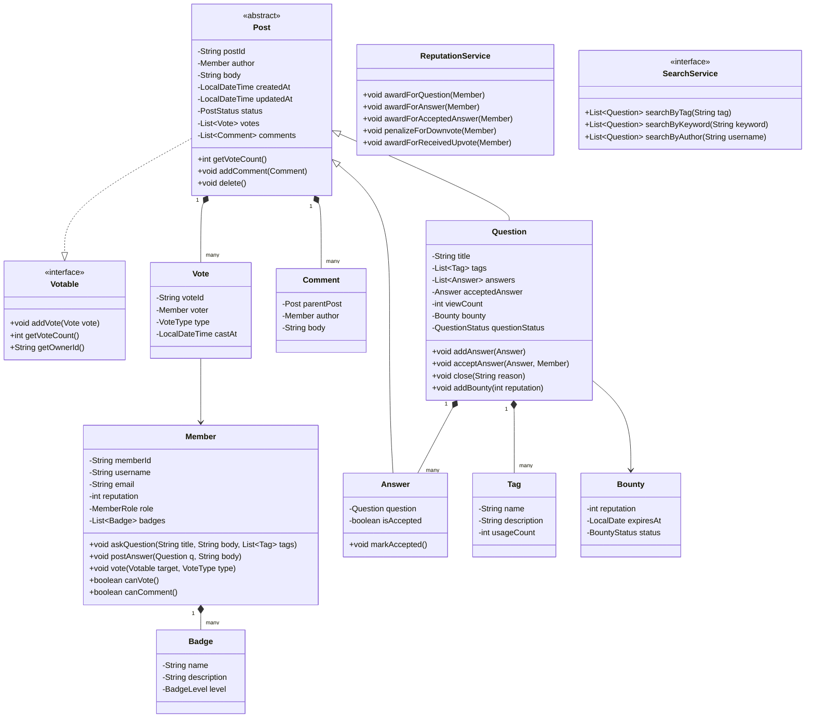

# LLD: Stack Overflow

## 1. Requirements

### Functional
- Members post Questions, add Answers, post Comments
- Upvote / downvote Questions and Answers
- Tag Questions with keywords; search by tag, keyword, author
- Mark an Answer as Accepted by the question owner
- Reputation system: posting, voting, accepting answers earns/costs reputation
- Members earn Badges based on activity milestones
- Moderators can close/reopen questions, delete content
- Bounty system: offer reputation for unanswered questions

### Non-Functional
- Voting must be idempotent (no double-voting)
- Reputation changes are eventually consistent
- Search must be extensible (full-text, tag-based, popularity)

### Out of Scope
- Real-time collaboration, inline code execution

---

## 2. Core Entities

`Member`, `Question`, `Answer`, `Comment`, `Tag`, `Vote`, `Badge`, `Reputation`, `Bounty`, `SearchService`

---

## 3. Class Diagram



---

## 4. Design Patterns

| Pattern | Where Applied | Why |
|---------|--------------|-----|
| **Decorator** | `ReputationDecorator` | Wrap voting to apply reputation side-effects |
| **Observer** | `BadgeService` | Listen to reputation events to award badges |
| **Strategy** | `SearchService` | Swap full-text, tag-based, or Elasticsearch strategy |
| **Template Method** | `Post.delete()` | Common delete logic; `Question.delete()` also deletes answers |
| **Command** | `VoteCommand` | Encapsulate vote for undo (retract vote) |

---

## 5. Java Implementation

```java
// ─── Enums ──────────────────────────────────────────────────────────────────

public enum VoteType { UPVOTE, DOWNVOTE }
public enum MemberRole { MEMBER, MODERATOR, ADMIN }
public enum PostStatus { ACTIVE, DELETED, FLAGGED }
public enum QuestionStatus { OPEN, CLOSED, DUPLICATE, ON_HOLD }
public enum BadgeLevel { BRONZE, SILVER, GOLD }

// ─── Votable Interface ────────────────────────────────────────────────────────

public interface Votable {
    void addVote(Vote vote);
    int getVoteCount();
    String getOwnerId();
}

// ─── Post (Abstract) ─────────────────────────────────────────────────────────

public abstract class Post implements Votable {
    protected final String postId;
    protected final Member author;
    protected String body;
    protected LocalDateTime createdAt;
    protected LocalDateTime updatedAt;
    protected PostStatus status;
    protected final List<Vote> votes = new ArrayList<>();
    protected final List<Comment> comments = new ArrayList<>();
    // tracks who voted to prevent double-voting
    protected final Set<String> voterIds = new HashSet<>();

    protected Post(Member author, String body) {
        this.postId = UUID.randomUUID().toString();
        this.author = author;
        this.body = body;
        this.createdAt = LocalDateTime.now();
        this.status = PostStatus.ACTIVE;
    }

    @Override
    public synchronized void addVote(Vote vote) {
        if (vote.getVoter().getMemberId().equals(author.getMemberId())) {
            throw new IllegalArgumentException("Cannot vote on your own post");
        }
        if (voterIds.contains(vote.getVoter().getMemberId())) {
            throw new DuplicateVoteException("Already voted on this post");
        }
        votes.add(vote);
        voterIds.add(vote.getVoter().getMemberId());
    }

    @Override
    public int getVoteCount() {
        return (int) votes.stream()
            .mapToLong(v -> v.getType() == VoteType.UPVOTE ? 1 : -1)
            .sum();
    }

    @Override
    public String getOwnerId() { return author.getMemberId(); }

    public void addComment(Comment comment) { comments.add(comment); }
    public void delete() { this.status = PostStatus.DELETED; }
    public String getPostId() { return postId; }
    public Member getAuthor() { return author; }
}

// ─── Question ─────────────────────────────────────────────────────────────────

public class Question extends Post {
    private final String title;
    private final List<Tag> tags;
    private final List<Answer> answers = new ArrayList<>();
    private Answer acceptedAnswer;
    private int viewCount;
    private QuestionStatus questionStatus;
    private Bounty bounty;

    public Question(Member author, String title, String body, List<Tag> tags) {
        super(author, body);
        this.title = title;
        this.tags = new ArrayList<>(tags);
        this.questionStatus = QuestionStatus.OPEN;
    }

    public void addAnswer(Answer answer) {
        if (questionStatus != QuestionStatus.OPEN) {
            throw new IllegalStateException("Cannot answer a closed question");
        }
        answers.add(answer);
    }

    public void acceptAnswer(Answer answer, Member acceptingMember) {
        if (!acceptingMember.getMemberId().equals(author.getMemberId())) {
            throw new UnauthorizedException("Only question author can accept answers");
        }
        if (!answers.contains(answer)) {
            throw new IllegalArgumentException("Answer does not belong to this question");
        }
        if (this.acceptedAnswer != null) {
            this.acceptedAnswer.unmarkAccepted();
        }
        answer.markAccepted();
        this.acceptedAnswer = answer;
    }

    public void close(String reason) {
        this.questionStatus = QuestionStatus.CLOSED;
    }

    public void addBounty(int reputationPoints) {
        this.bounty = new Bounty(reputationPoints);
    }

    public void incrementViewCount() { viewCount++; }
    public String getTitle() { return title; }
    public List<Tag> getTags() { return Collections.unmodifiableList(tags); }
    public List<Answer> getAnswers() { return Collections.unmodifiableList(answers); }
    public QuestionStatus getQuestionStatus() { return questionStatus; }
}

// ─── Answer ──────────────────────────────────────────────────────────────────

public class Answer extends Post {
    private final Question question;
    private boolean accepted;

    public Answer(Member author, String body, Question question) {
        super(author, body);
        this.question = question;
    }

    public void markAccepted() { this.accepted = true; }
    public void unmarkAccepted() { this.accepted = false; }
    public boolean isAccepted() { return accepted; }
    public Question getQuestion() { return question; }
}

// ─── Vote ─────────────────────────────────────────────────────────────────────

public class Vote {
    private final String voteId;
    private final Member voter;
    private final VoteType type;
    private final LocalDateTime castAt;

    public Vote(Member voter, VoteType type) {
        this.voteId = UUID.randomUUID().toString();
        this.voter = voter;
        this.type = type;
        this.castAt = LocalDateTime.now();
    }

    public Member getVoter() { return voter; }
    public VoteType getType() { return type; }
}

// ─── Reputation Service ───────────────────────────────────────────────────────

public class ReputationService {
    private static final int QUESTION_UPVOTE = 5;
    private static final int ANSWER_UPVOTE = 10;
    private static final int ANSWER_ACCEPTED = 15;
    private static final int DOWNVOTE_PENALTY = -2;
    private static final int DOWNVOTE_VOTER_PENALTY = -1;

    private final List<ReputationEventListener> listeners = new ArrayList<>();

    public void processVote(Votable target, Vote vote, Member targetOwner) {
        int delta = 0;
        if (target instanceof Question) {
            delta = vote.getType() == VoteType.UPVOTE ? QUESTION_UPVOTE : DOWNVOTE_PENALTY;
        } else if (target instanceof Answer) {
            delta = vote.getType() == VoteType.UPVOTE ? ANSWER_UPVOTE : DOWNVOTE_PENALTY;
            if (vote.getType() == VoteType.DOWNVOTE) {
                vote.getVoter().adjustReputation(DOWNVOTE_VOTER_PENALTY);
            }
        }
        targetOwner.adjustReputation(delta);
        listeners.forEach(l -> l.onReputationChange(targetOwner, delta));
    }

    public void processAcceptedAnswer(Answer answer) {
        answer.getAuthor().adjustReputation(ANSWER_ACCEPTED);
        answer.getQuestion().getAuthor().adjustReputation(2); // questioner gets 2 for accepting
    }

    public void addListener(ReputationEventListener listener) { listeners.add(listener); }
}

// ─── Badge Service (Observer) ─────────────────────────────────────────────────

public interface ReputationEventListener {
    void onReputationChange(Member member, int delta);
}

public class BadgeService implements ReputationEventListener {
    private final Map<String, Badge> badgeRegistry;

    @Override
    public void onReputationChange(Member member, int delta) {
        checkAndAwardBadges(member);
    }

    private void checkAndAwardBadges(Member member) {
        if (member.getReputation() >= 100 && !member.hasBadge("Teacher")) {
            member.awardBadge(badgeRegistry.get("Teacher"));
        }
        if (member.getReputation() >= 500 && !member.hasBadge("Enthusiast")) {
            member.awardBadge(badgeRegistry.get("Enthusiast"));
        }
    }
}

// ─── Member ──────────────────────────────────────────────────────────────────

public class Member {
    private final String memberId;
    private final String username;
    private final String email;
    private int reputation;
    private MemberRole role;
    private final List<Badge> badges = new ArrayList<>();
    private final Set<String> badgeNames = new HashSet<>();

    public Member(String memberId, String username, String email) {
        this.memberId = memberId;
        this.username = username;
        this.email = email;
        this.reputation = 1; // starting reputation
        this.role = MemberRole.MEMBER;
    }

    public boolean canVote() { return reputation >= 15; }
    public boolean canComment() { return reputation >= 50; }
    public boolean canDownvote() { return reputation >= 125; }
    public boolean isModerator() { return role == MemberRole.MODERATOR || role == MemberRole.ADMIN; }

    public void adjustReputation(int delta) {
        this.reputation = Math.max(1, reputation + delta); // floor at 1
    }

    public void awardBadge(Badge badge) {
        if (badgeNames.add(badge.getName())) {
            badges.add(badge);
        }
    }

    public boolean hasBadge(String name) { return badgeNames.contains(name); }
    public int getReputation() { return reputation; }
    public String getMemberId() { return memberId; }
    public String getUsername() { return username; }
}

// ─── Tag ─────────────────────────────────────────────────────────────────────

public class Tag {
    private final String name;
    private final String description;
    private int usageCount;

    public Tag(String name, String description) {
        this.name = name;
        this.description = description;
    }

    public void incrementUsage() { usageCount++; }
    public String getName() { return name; }
}

// ─── Search Service ───────────────────────────────────────────────────────────

public interface SearchService {
    List<Question> searchByTag(String tagName);
    List<Question> searchByKeyword(String keyword);
    List<Question> searchByAuthor(String username);
}

public class InMemorySearchService implements SearchService {
    private final List<Question> questions;

    public InMemorySearchService(List<Question> questions) {
        this.questions = questions;
    }

    @Override
    public List<Question> searchByTag(String tagName) {
        return questions.stream()
            .filter(q -> q.getTags().stream().anyMatch(t -> t.getName().equalsIgnoreCase(tagName)))
            .collect(Collectors.toList());
    }

    @Override
    public List<Question> searchByKeyword(String keyword) {
        String lower = keyword.toLowerCase();
        return questions.stream()
            .filter(q -> q.getTitle().toLowerCase().contains(lower) ||
                         q.body.toLowerCase().contains(lower))
            .collect(Collectors.toList());
    }

    @Override
    public List<Question> searchByAuthor(String username) {
        return questions.stream()
            .filter(q -> q.getAuthor().getUsername().equalsIgnoreCase(username))
            .collect(Collectors.toList());
    }
}
```

---

## 6. SOLID Analysis

| Principle | Assessment |
|-----------|-----------|
| **SRP** | `ReputationService` handles reputation; `BadgeService` handles badges; `Post` handles content |
| **OCP** | New badge rules add to `BadgeService`; new vote types extend without modifying `Post` |
| **LSP** | `Question` and `Answer` are substitutable as `Post` and `Votable` |
| **ISP** | `Votable` has only the methods needed for voting; `ReputationEventListener` is single-method |
| **DIP** | `ReputationService` depends on `ReputationEventListener` interface; not `BadgeService` directly |

---

## 7. Extensibility

| Future Requirement | How to Add |
|--------------------|-----------|
| Real-time notifications | `NotificationListener implements ReputationEventListener` |
| Tag synonyms/merging | `TagAlias` entity in `Tag`; `TagMergeService` |
| Duplicate question detection | `DuplicateDetectionService` using ML or text similarity |
| Scheduled reputation audits | `ReputationAuditJob` recalculating periodically |

---

## 8. FAANG Interview Tips

- **Double-voting prevention**: The `voterIds` set in `Post` is the simplest solution; at scale use a `votes` table with composite key `(voter_id, post_id)`
- **Reputation is not ACID**: Show you understand eventually consistent reputation vs. strictly consistent inventory
- **Moderator actions as Commands**: Closing, locking, merging questions are `Command` objects — supports undo and audit log
- **Tag-based search**: Point out that full text search would use Elasticsearch in production — `SearchService` interface makes this swap easy
- **Follow-up: 10M questions in search?** → Lucene/Elasticsearch with tag-based index sharding; cache hot tag results in Redis
