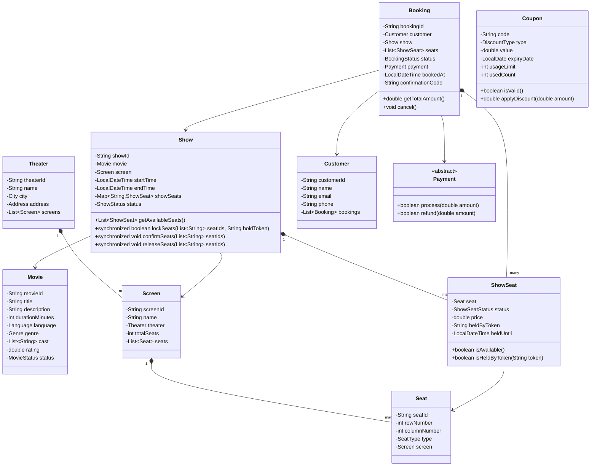

# LLD: Movie Ticket Booking System (BookMyShow)

## 1. Requirements

### Functional
- Search movies by title, genre, language, city
- View shows (movie + theater + time) with seat availability
- Book tickets: select seats, make payment, receive confirmation
- Cancel booking with refund policy
- Support multiple seat types: REGULAR, PREMIUM, VIP
- Seat selection UI: show seat map with real-time availability
- Multiple payment methods
- Discount codes and offers
- Notifications: booking confirmation, cancellation

### Non-Functional
- No two users can book the same seat for the same show (strong consistency required)
- Show seat availability in real time
- Handle flash booking for popular movies (high concurrency)

### Out of Scope
- Movie recommendations, loyalty programs beyond discounts

---

## 2. Core Entities

`Movie`, `Theater`, `Screen`, `Show`, `Seat`, `ShowSeat`, `Booking`, `Payment`, `Coupon`, `Customer`, `City`

---

## 3. Class Diagram



---

## 4. Design Patterns

| Pattern | Where Applied | Why |
|---------|--------------|-----|
| **State** | `ShowSeat.status` | AVAILABLE → HELD → BOOKED; timed holds for reservation window |
| **Strategy** | Pricing per `SeatType` | VIP seats priced differently; surge pricing on weekends |
| **Factory** | `BookingFactory` | Creates booking with seat locks, price calculation, and payment in sequence |
| **Observer** | `BookingEventPublisher` | Notify notification service on booking/cancellation events |
| **Template Method** | `Booking.cancel()` | Common cancellation; hook for computing refund per policy |

---

## 5. Java Implementation

```java
// ─── Enums ──────────────────────────────────────────────────────────────────

public enum SeatType { REGULAR, PREMIUM, VIP }
public enum ShowSeatStatus { AVAILABLE, HELD, BOOKED, BLOCKED }
public enum BookingStatus { INITIATED, CONFIRMED, CANCELLED, REFUNDED }
public enum ShowStatus { SCHEDULED, RUNNING, DONE, CANCELLED }
public enum DiscountType { PERCENTAGE, FLAT }

// ─── Movie ────────────────────────────────────────────────────────────────────

public class Movie {
    private final String movieId;
    private final String title;
    private final int durationMinutes;
    private final String language;
    private final String genre;
    private MovieStatus status;

    // constructor + getters
}

// ─── Theater / Screen / Seat ──────────────────────────────────────────────────

public class Seat {
    private final String seatId;
    private final int rowNumber;
    private final int columnNumber;
    private final SeatType type;

    public Seat(String seatId, int row, int col, SeatType type) {
        this.seatId = seatId;
        this.rowNumber = row;
        this.columnNumber = col;
        this.type = type;
    }

    public String getSeatId() { return seatId; }
    public SeatType getType() { return type; }
    public String getLabel() { return (char)('A' + rowNumber - 1) + String.valueOf(columnNumber); }
}

// ─── ShowSeat (State Machine) ────────────────────────────────────────────────

public class ShowSeat {
    private final Seat seat;
    private volatile ShowSeatStatus status;
    private final double price;
    private String heldByToken;
    private LocalDateTime heldUntil;

    private static final Duration HOLD_DURATION = Duration.ofMinutes(10);

    public ShowSeat(Seat seat, double price) {
        this.seat = seat;
        this.price = price;
        this.status = ShowSeatStatus.AVAILABLE;
    }

    public synchronized boolean isAvailable() {
        if (status == ShowSeatStatus.HELD && LocalDateTime.now().isAfter(heldUntil)) {
            // hold expired — auto-release
            status = ShowSeatStatus.AVAILABLE;
            heldByToken = null;
        }
        return status == ShowSeatStatus.AVAILABLE;
    }

    public synchronized void hold(String token) {
        if (!isAvailable()) throw new SeatNotAvailableException("Seat " + seat.getSeatId() + " not available");
        status = ShowSeatStatus.HELD;
        heldByToken = token;
        heldUntil = LocalDateTime.now().plus(HOLD_DURATION);
    }

    public synchronized void confirm(String token) {
        if (status != ShowSeatStatus.HELD || !token.equals(heldByToken)) {
            throw new InvalidSeatHoldException("Hold expired or wrong token for seat " + seat.getSeatId());
        }
        status = ShowSeatStatus.BOOKED;
        heldByToken = null;
    }

    public synchronized void release() {
        status = ShowSeatStatus.AVAILABLE;
        heldByToken = null;
    }

    public Seat getSeat() { return seat; }
    public double getPrice() { return price; }
    public ShowSeatStatus getStatus() { return status; }
}

// ─── Show ─────────────────────────────────────────────────────────────────────

public class Show {
    private final String showId;
    private final Movie movie;
    private final Screen screen;
    private final LocalDateTime startTime;
    private final Map<String, ShowSeat> showSeats = new ConcurrentHashMap<>();

    public Show(String showId, Movie movie, Screen screen, LocalDateTime startTime,
                Map<SeatType, Double> pricing) {
        this.showId = showId;
        this.movie = movie;
        this.screen = screen;
        this.startTime = startTime;
        for (Seat seat : screen.getSeats()) {
            double price = pricing.getOrDefault(seat.getType(), 200.0);
            showSeats.put(seat.getSeatId(), new ShowSeat(seat, price));
        }
    }

    public List<ShowSeat> lockSeats(List<String> seatIds, String holdToken) {
        List<ShowSeat> lockedSeats = new ArrayList<>();
        List<ShowSeat> toRelease = new ArrayList<>();
        try {
            for (String seatId : seatIds) {
                ShowSeat ss = showSeats.get(seatId);
                if (ss == null) throw new SeatNotFoundException("Seat not found: " + seatId);
                ss.hold(holdToken);
                lockedSeats.add(ss);
                toRelease.add(ss);
            }
            toRelease.clear(); // all succeeded
            return lockedSeats;
        } catch (Exception e) {
            toRelease.forEach(ShowSeat::release); // rollback
            throw e;
        }
    }

    public void confirmSeats(List<String> seatIds, String holdToken) {
        seatIds.forEach(id -> showSeats.get(id).confirm(holdToken));
    }

    public void releaseSeats(List<String> seatIds) {
        seatIds.forEach(id -> showSeats.get(id).release());
    }

    public List<ShowSeat> getAvailableSeats() {
        return showSeats.values().stream()
            .filter(ShowSeat::isAvailable)
            .collect(Collectors.toList());
    }

    public String getShowId() { return showId; }
    public Movie getMovie() { return movie; }
}

// ─── Coupon ───────────────────────────────────────────────────────────────────

public class Coupon {
    private final String code;
    private final DiscountType type;
    private final double value;
    private final LocalDate expiryDate;
    private final int usageLimit;
    private int usedCount;

    public boolean isValid() {
        return LocalDate.now().isBefore(expiryDate) && usedCount < usageLimit;
    }

    public double applyDiscount(double amount) {
        if (!isValid()) return amount;
        usedCount++;
        return type == DiscountType.PERCENTAGE
            ? amount * (1 - value / 100)
            : Math.max(0, amount - value);
    }
}

// ─── Booking ──────────────────────────────────────────────────────────────────

public class Booking {
    private final String bookingId;
    private final Customer customer;
    private final Show show;
    private final List<ShowSeat> seats;
    private BookingStatus status;
    private Payment payment;
    private final LocalDateTime bookedAt;
    private final String holdToken;

    public Booking(Customer customer, Show show, List<ShowSeat> seats, String holdToken) {
        this.bookingId = UUID.randomUUID().toString();
        this.customer = customer;
        this.show = show;
        this.seats = new ArrayList<>(seats);
        this.holdToken = holdToken;
        this.bookedAt = LocalDateTime.now();
        this.status = BookingStatus.INITIATED;
    }

    public double getTotalAmount() {
        return seats.stream().mapToDouble(ShowSeat::getPrice).sum();
    }

    public void confirm(Payment payment) {
        show.confirmSeats(seats.stream().map(s -> s.getSeat().getSeatId()).collect(Collectors.toList()),
                          holdToken);
        this.payment = payment;
        this.status = BookingStatus.CONFIRMED;
    }

    public void cancel() {
        if (status != BookingStatus.CONFIRMED) throw new IllegalStateException("Cannot cancel non-confirmed booking");
        show.releaseSeats(seats.stream().map(s -> s.getSeat().getSeatId()).collect(Collectors.toList()));
        payment.refund(getTotalAmount());
        this.status = BookingStatus.CANCELLED;
    }

    public String getBookingId() { return bookingId; }
    public BookingStatus getStatus() { return status; }
}

// ─── Booking Service (Orchestrator) ─────────────────────────────────────────

public class BookingService {
    private final Map<String, Show> shows = new ConcurrentHashMap<>();

    public Booking initiateBooking(Customer customer, String showId, List<String> seatIds) {
        Show show = shows.get(showId);
        if (show == null) throw new ShowNotFoundException("Show not found: " + showId);

        String holdToken = UUID.randomUUID().toString();
        List<ShowSeat> lockedSeats = show.lockSeats(seatIds, holdToken);
        return new Booking(customer, show, lockedSeats, holdToken);
    }

    public void confirmBooking(Booking booking, Payment payment, Coupon coupon) {
        double amount = booking.getTotalAmount();
        if (coupon != null) amount = coupon.applyDiscount(amount);
        payment.process(amount);
        booking.confirm(payment);
    }
}
```

---

## 6. SOLID Analysis

| Principle | Assessment |
|-----------|-----------|
| **SRP** | `ShowSeat` manages its own state; `Booking` manages booking lifecycle; `BookingService` orchestrates |
| **OCP** | New seat types or pricing rules extend without modifying `Show` |
| **LSP** | `ShowSeat.isAvailable()` correctly handles both AVAILABLE and expired HELD states |
| **ISP** | Clean interfaces for `Payment`; no fat interfaces |
| **DIP** | `BookingService` depends on `Payment` abstraction |

---

## 7. Concurrency — The Critical Section

- **Hold-then-confirm** pattern: seats are HELD (not BOOKED) during payment — prevents long locks
- `ShowSeat.hold()` is `synchronized` — prevents TOCTOU race conditions
- `lockSeats()` uses all-or-nothing rollback — no partial booking state
- **At scale**: Use Redis with `SETNX` for distributed seat holds with TTL; Lua scripts for atomic multi-seat lock

---

## 8. Extensibility

| Future Requirement | How to Add |
|--------------------|-----------|
| Group booking | `GroupBooking extends Booking` with group discount |
| Seat preference (aisle/window) | Filter `getAvailableSeats()` by `Seat.columnPosition` |
| Surge pricing | `PricingStrategy` injected into `Show` |
| Waitlist for sold-out show | `Waitlist` queue; notify on cancellation |

---

## 9. FAANG Interview Tips

- **The concurrency question always comes**: "What if two users click the same seat?" → Hold-then-confirm pattern; explain the 10-minute TTL
- **Timed holds are key insight**: Don't book immediately — hold the seat, collect payment, then confirm. This mirrors Ticketmaster/BookMyShow behavior
- **Separate ShowSeat from Seat**: `Seat` is physical; `ShowSeat` is per-show status — many candidates conflate these
- **Don't forget coupon validation**: Check `isValid()` before applying; prevent race on `usedCount` with atomic increment
- **Follow-up: Millions of users for a blockbuster release?** → Virtual queue, Redis-based seat reservation, read-through cache for seat map, pre-warm at show listing time
