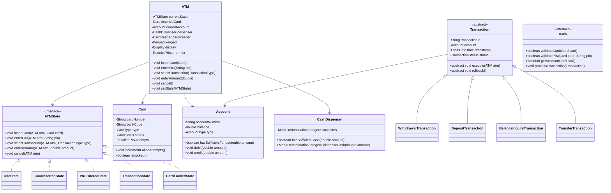

# LLD: ATM

## 1. Requirements

### Functional
- Insert card → validate PIN → select transaction → execute → eject card
- Transactions: Balance Inquiry, Withdrawal, Deposit, Transfer, Change PIN
- Validate card and PIN against bank backend
- Dispense cash from multiple denomination cassettes
- Print transaction receipt
- Lock card after N failed PIN attempts
- Handle network timeout gracefully
- Support multiple banks (interoperability)

### Non-Functional
- State transitions must be explicit and safe (no invalid operations in wrong state)
- Cash dispensing must be atomic — either full amount or reject
- Thread-safe (one user session at a time per ATM)

### Out of Scope
- ATM network routing, HSM hardware, EMV chip processing internals

---

## 2. Core Entities

`ATM`, `Card`, `Account`, `ATMState`, `Transaction`, `CashDispenser`, `CardReader`, `Keypad`, `Display`, `ReceiptPrinter`, `Bank`

---

## 3. Class Diagram



---

## 4. Design Patterns

| Pattern | Where Applied | Why |
|---------|--------------|-----|
| **State** | `ATMState` hierarchy | Explicit valid operations per state; prevents invalid transitions |
| **Command** | `Transaction` hierarchy | Encapsulate each transaction; support rollback |
| **Singleton** | `ATM` per machine | One session at a time per physical ATM |
| **Strategy** | `CashDispensingStrategy` | Greedy vs. exact-change dispensing algorithms |
| **Facade** | `ATM` class itself | Simplifies interaction; client calls `atm.insertCard()`, not individual hardware components |

---

## 5. Java Implementation

```java
// ─── Enums ──────────────────────────────────────────────────────────────────

public enum TransactionType { BALANCE_INQUIRY, WITHDRAWAL, DEPOSIT, TRANSFER, CHANGE_PIN }
public enum TransactionStatus { PENDING, COMPLETED, FAILED, ROLLED_BACK }
public enum CardStatus { ACTIVE, LOCKED, EXPIRED, BLOCKED }
public enum Denomination { FIFTY(50), HUNDRED(100), FIVEHUNDRED(500), THOUSAND(1000);
    final int value;
    Denomination(int v) { this.value = v; }
}

// ─── ATM State Interface ──────────────────────────────────────────────────────

public interface ATMState {
    void insertCard(ATM atm, Card card);
    void enterPIN(ATM atm, String pin);
    void selectTransaction(ATM atm, TransactionType type);
    void enterAmount(ATM atm, double amount);
    void cancel(ATM atm);
}

// ─── Idle State ───────────────────────────────────────────────────────────────

public class IdleState implements ATMState {
    @Override
    public void insertCard(ATM atm, Card card) {
        if (card.isLocked()) {
            atm.getDisplay().show("Card is locked. Please contact your bank.");
            return;
        }
        atm.setInsertedCard(card);
        atm.getDisplay().show("Please enter your PIN");
        atm.setState(new CardInsertedState());
    }

    @Override
    public void enterPIN(ATM atm, String pin) {
        atm.getDisplay().show("Please insert your card first");
    }

    @Override
    public void selectTransaction(ATM atm, TransactionType type) {
        atm.getDisplay().show("Please insert your card first");
    }

    @Override
    public void enterAmount(ATM atm, double amount) {
        atm.getDisplay().show("Please insert your card first");
    }

    @Override
    public void cancel(ATM atm) {
        atm.getDisplay().show("No active session");
    }
}

// ─── Card Inserted State ──────────────────────────────────────────────────────

public class CardInsertedState implements ATMState {
    private static final int MAX_PIN_ATTEMPTS = 3;

    @Override
    public void insertCard(ATM atm, Card card) {
        atm.getDisplay().show("Card already inserted");
    }

    @Override
    public void enterPIN(ATM atm, String pin) {
        Card card = atm.getInsertedCard();
        Bank bank = atm.getBank();

        if (bank.validatePIN(card, pin)) {
            Account account = bank.getAccount(card);
            atm.setCurrentAccount(account);
            atm.getDisplay().show("PIN correct. Select transaction:");
            atm.setState(new PINEnteredState());
        } else {
            card.incrementFailedAttempts();
            if (card.getFailedAttempts() >= MAX_PIN_ATTEMPTS) {
                card.lock();
                atm.getDisplay().show("Card locked after 3 failed attempts");
                atm.setState(new CardLockedState());
            } else {
                int remaining = MAX_PIN_ATTEMPTS - card.getFailedAttempts();
                atm.getDisplay().show("Incorrect PIN. " + remaining + " attempts remaining.");
            }
        }
    }

    @Override
    public void cancel(ATM atm) {
        atm.ejectCard();
        atm.setState(new IdleState());
    }

    // other methods throw IllegalStateException
    @Override
    public void selectTransaction(ATM atm, TransactionType type) { throw new InvalidOperationException(); }
    @Override
    public void enterAmount(ATM atm, double amount) { throw new InvalidOperationException(); }
}

// ─── PIN Entered State ────────────────────────────────────────────────────────

public class PINEnteredState implements ATMState {
    @Override
    public void selectTransaction(ATM atm, TransactionType type) {
        atm.setSelectedTransactionType(type);
        switch (type) {
            case BALANCE_INQUIRY:
                new BalanceInquiryTransaction(atm.getCurrentAccount()).execute(atm);
                break;
            case WITHDRAWAL:
            case DEPOSIT:
            case TRANSFER:
                atm.getDisplay().show("Enter amount:");
                atm.setState(new TransactionState(type));
                break;
        }
    }

    @Override
    public void cancel(ATM atm) {
        atm.ejectCard();
        atm.setState(new IdleState());
    }

    @Override
    public void insertCard(ATM atm, Card card) { throw new InvalidOperationException(); }
    @Override
    public void enterPIN(ATM atm, String pin) { throw new InvalidOperationException(); }
    @Override
    public void enterAmount(ATM atm, double amount) { throw new InvalidOperationException(); }
}

// ─── Transaction State ────────────────────────────────────────────────────────

public class TransactionState implements ATMState {
    private final TransactionType type;

    public TransactionState(TransactionType type) { this.type = type; }

    @Override
    public void enterAmount(ATM atm, double amount) {
        Transaction transaction = TransactionFactory.create(type, atm.getCurrentAccount(), amount);
        try {
            transaction.execute(atm);
            atm.getPrinter().printReceipt(transaction);
            atm.getDisplay().show("Transaction successful. Take your receipt.");
        } catch (InsufficientFundsException e) {
            atm.getDisplay().show("Insufficient funds");
        } catch (InsufficientCashException e) {
            atm.getDisplay().show("ATM cannot dispense this amount. Try a smaller amount.");
        }
        atm.setState(new PINEnteredState()); // allow another transaction
    }

    @Override
    public void cancel(ATM atm) {
        atm.ejectCard();
        atm.setState(new IdleState());
    }

    @Override
    public void insertCard(ATM atm, Card card) { throw new InvalidOperationException(); }
    @Override
    public void enterPIN(ATM atm, String pin) { throw new InvalidOperationException(); }
    @Override
    public void selectTransaction(ATM atm, TransactionType type) { throw new InvalidOperationException(); }
}

// ─── Transactions ─────────────────────────────────────────────────────────────

public abstract class Transaction {
    protected final String transactionId;
    protected final Account account;
    protected final LocalDateTime timestamp;
    protected TransactionStatus status;
    protected double amount;

    protected Transaction(Account account, double amount) {
        this.transactionId = UUID.randomUUID().toString();
        this.account = account;
        this.amount = amount;
        this.timestamp = LocalDateTime.now();
        this.status = TransactionStatus.PENDING;
    }

    public abstract void execute(ATM atm);
    public abstract void rollback();
}

public class WithdrawalTransaction extends Transaction {
    public WithdrawalTransaction(Account account, double amount) {
        super(account, amount);
    }

    @Override
    public void execute(ATM atm) {
        if (!account.hasSufficientFunds(amount)) {
            throw new InsufficientFundsException("Balance: " + account.getBalance());
        }
        if (!atm.getDispenser().hasSufficientCash(amount)) {
            throw new InsufficientCashException("ATM has insufficient cash");
        }
        account.debit(amount);
        atm.getDispenser().dispenseCash(amount);
        status = TransactionStatus.COMPLETED;
    }

    @Override
    public void rollback() {
        if (status == TransactionStatus.COMPLETED) {
            account.credit(amount);
            status = TransactionStatus.ROLLED_BACK;
        }
    }
}

public class BalanceInquiryTransaction extends Transaction {
    public BalanceInquiryTransaction(Account account) {
        super(account, 0);
    }

    @Override
    public void execute(ATM atm) {
        atm.getDisplay().show("Available Balance: $" + account.getBalance());
        status = TransactionStatus.COMPLETED;
    }

    @Override
    public void rollback() { /* No-op — read-only */ }
}

// ─── Cash Dispenser ────────────────────────────────────────────────────────────

public class CashDispenser {
    private final Map<Denomination, Integer> cassettes = new EnumMap<>(Denomination.class);

    public CashDispenser() {
        cassettes.put(Denomination.THOUSAND, 100);
        cassettes.put(Denomination.FIVEHUNDRED, 200);
        cassettes.put(Denomination.HUNDRED, 500);
        cassettes.put(Denomination.FIFTY, 500);
    }

    public boolean hasSufficientCash(double amount) {
        return cassettes.entrySet().stream()
            .mapToDouble(e -> e.getKey().value * e.getValue())
            .sum() >= amount;
    }

    public synchronized Map<Denomination, Integer> dispenseCash(double amount) {
        Map<Denomination, Integer> dispensed = new EnumMap<>(Denomination.class);
        double remaining = amount;
        // Greedy from largest denomination
        for (Denomination denom : new Denomination[]{
                Denomination.THOUSAND, Denomination.FIVEHUNDRED,
                Denomination.HUNDRED, Denomination.FIFTY}) {
            int available = cassettes.getOrDefault(denom, 0);
            int needed = (int)(remaining / denom.value);
            int used = Math.min(needed, available);
            if (used > 0) {
                dispensed.put(denom, used);
                cassettes.put(denom, available - used);
                remaining -= used * denom.value;
            }
        }
        if (remaining > 0.01) {
            // rollback cassette state
            dispensed.forEach((d, count) -> cassettes.merge(d, count, Integer::sum));
            throw new InsufficientCashException("Cannot make exact change for: " + amount);
        }
        return dispensed;
    }
}

// ─── ATM ──────────────────────────────────────────────────────────────────────

public class ATM {
    private ATMState currentState;
    private Card insertedCard;
    private Account currentAccount;
    private TransactionType selectedTransactionType;
    private final CashDispenser dispenser;
    private final Display display;
    private final ReceiptPrinter printer;
    private final Bank bank;

    public ATM(CashDispenser dispenser, Display display, ReceiptPrinter printer, Bank bank) {
        this.dispenser = dispenser;
        this.display = display;
        this.printer = printer;
        this.bank = bank;
        this.currentState = new IdleState();
    }

    public void insertCard(Card card) { currentState.insertCard(this, card); }
    public void enterPIN(String pin) { currentState.enterPIN(this, pin); }
    public void selectTransaction(TransactionType type) { currentState.selectTransaction(this, type); }
    public void enterAmount(double amount) { currentState.enterAmount(this, amount); }
    public void cancel() { currentState.cancel(this); }
    public void ejectCard() { insertedCard = null; currentAccount = null; }

    // setters/getters for state transitions
    public void setState(ATMState state) { this.currentState = state; }
    public void setInsertedCard(Card card) { this.insertedCard = card; }
    public void setCurrentAccount(Account account) { this.currentAccount = account; }
    public Card getInsertedCard() { return insertedCard; }
    public Account getCurrentAccount() { return currentAccount; }
    public CashDispenser getDispenser() { return dispenser; }
    public Display getDisplay() { return display; }
    public ReceiptPrinter getPrinter() { return printer; }
    public Bank getBank() { return bank; }
}
```

---

## 6. SOLID Analysis

| Principle | Assessment |
|-----------|-----------|
| **SRP** | Each state handles its specific operations; `CashDispenser` handles only cash; `ATM` orchestrates |
| **OCP** | New transaction type: add `ChangePINTransaction` + handle in `PINEnteredState.selectTransaction()` |
| **LSP** | All `ATMState` implementations are substitutable; `ATM` doesn't know which state is active |
| **ISP** | `ATMState` is minimal — all methods are needed; `Bank` interface keeps external boundary clean |
| **DIP** | `ATM` depends on `ATMState` interface; `Bank` is an interface (not a concrete bank) |

---

## 7. Extensibility

| Future Requirement | How to Add |
|--------------------|-----------|
| Contactless/NFC | New `CardReader` strategy; `NfcCardReader` |
| 2FA via OTP | New `OTPEnteredState` inserted between `CardInsertedState` and `PINEnteredState` |
| Multi-currency | `CurrencyConverter` in `WithdrawalTransaction` |
| ATM health monitoring | Observer on state transitions; publish to monitoring system |

---

## 8. FAANG Interview Tips

- **State pattern is THE answer**: Any interviewer who asks ATM expects you to draw the state machine first. States: Idle → CardInserted → PINEntered → TransactionInProgress → Done
- **Invalid operations**: Show how State pattern naturally prevents "withdraw without card" — throw `InvalidOperationException` in default state
- **Cash dispensing is a greedy algorithm**: Explain the denomination selection; mention it fails on non-representable amounts (e.g., $30 with only $50 notes)
- **Thread safety**: One session at a time per ATM; the `ATM` object is effectively single-threaded per customer session
- **Follow-up: Distributed ATM fleet?** → Central bank service with connection pooling; local cassette state; retry on network timeout with idempotency tokens on transactions
