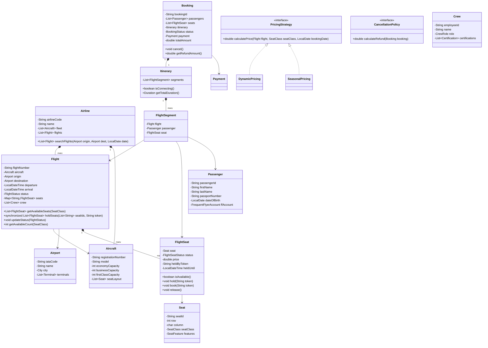

# LLD: Airline Management System

## 1. Requirements

### Functional
- Search flights by origin, destination, date; filter by airline, stops, price
- Book flights: select seats, add passengers, make payment
- Cancel booking with refund based on cancellation policy
- Seat classes: Economy, Business, First Class
- Flight statuses: Scheduled, On-time, Delayed, Cancelled, Boarding, Departed, Landed
- Crew assignment to flights
- Baggage allowance per booking class
- Frequent flyer miles accrual
- Flight notifications: delays, gate changes

### Non-Functional
- No seat double-booking (concurrent reservation safety)
- Extensible pricing (dynamic, seasonal, class-based)
- Audit log for all booking operations

### Out of Scope
- Baggage tracking systems, in-flight entertainment, ATC

---

## 2. Core Entities

`Airline`, `Flight`, `Aircraft`, `Seat`, `FlightSeat`, `Passenger`, `Booking`, `Itinerary`, `Payment`, `Crew`, `Airport`, `Route`

---

## 3. Class Diagram



---

## 4. Design Patterns

| Pattern | Where Applied | Why |
|---------|--------------|-----|
| **Strategy** | `PricingStrategy`, `CancellationPolicy` | Swap algorithms without modifying `Flight` or `Booking` |
| **Observer** | `FlightStatusObserver` | Notify passengers/crew/gate systems on status changes |
| **Factory** | `BookingFactory` | Creates `Booking` with correct pricing, seat locks, and passenger validation |
| **Composite** | `Itinerary` + `FlightSegment` | Treat single-leg and multi-leg trips uniformly |
| **State** | `Flight.status`, `FlightSeat.status` | Explicit, safe state transitions |

---

## 5. Java Implementation

```java
// ─── Enums ──────────────────────────────────────────────────────────────────

public enum SeatClass { ECONOMY, BUSINESS, FIRST_CLASS }
public enum FlightSeatStatus { AVAILABLE, HELD, BOOKED, BLOCKED }
public enum FlightStatus { SCHEDULED, ON_TIME, DELAYED, BOARDING, DEPARTED, LANDED, CANCELLED }
public enum BookingStatus { PENDING, CONFIRMED, CANCELLED, REFUNDED }
public enum CrewRole { CAPTAIN, FIRST_OFFICER, FLIGHT_ATTENDANT, PURSER }

// ─── Airport ──────────────────────────────────────────────────────────────────

public class Airport {
    private final String iataCode;
    private final String name;
    private final String city;

    public Airport(String iataCode, String name, String city) {
        this.iataCode = iataCode;
        this.name = name;
        this.city = city;
    }

    public String getIataCode() { return iataCode; }
    @Override
    public boolean equals(Object o) {
        if (!(o instanceof Airport)) return false;
        return iataCode.equals(((Airport) o).iataCode);
    }
    @Override
    public int hashCode() { return iataCode.hashCode(); }
}

// ─── Seat / FlightSeat ────────────────────────────────────────────────────────

public class Seat {
    private final String seatId;
    private final int row;
    private final char column;
    private final SeatClass seatClass;

    public Seat(String seatId, int row, char column, SeatClass seatClass) {
        this.seatId = seatId;
        this.row = row;
        this.column = column;
        this.seatClass = seatClass;
    }

    public String getSeatLabel() { return row + String.valueOf(column); }
    public SeatClass getSeatClass() { return seatClass; }
    public String getSeatId() { return seatId; }
}

public class FlightSeat {
    private final Seat seat;
    private volatile FlightSeatStatus status;
    private double price;
    private String heldByToken;
    private LocalDateTime heldUntil;
    private static final Duration HOLD_TTL = Duration.ofMinutes(15);

    public FlightSeat(Seat seat, double price) {
        this.seat = seat;
        this.price = price;
        this.status = FlightSeatStatus.AVAILABLE;
    }

    public synchronized boolean isAvailable() {
        if (status == FlightSeatStatus.HELD && LocalDateTime.now().isAfter(heldUntil)) {
            status = FlightSeatStatus.AVAILABLE;
            heldByToken = null;
        }
        return status == FlightSeatStatus.AVAILABLE;
    }

    public synchronized void hold(String token) {
        if (!isAvailable()) throw new SeatNotAvailableException(seat.getSeatId());
        status = FlightSeatStatus.HELD;
        heldByToken = token;
        heldUntil = LocalDateTime.now().plus(HOLD_TTL);
    }

    public synchronized void book(String token) {
        if (status != FlightSeatStatus.HELD || !token.equals(heldByToken)) {
            throw new InvalidSeatHoldException(seat.getSeatId());
        }
        status = FlightSeatStatus.BOOKED;
        heldByToken = null;
    }

    public synchronized void release() {
        status = FlightSeatStatus.AVAILABLE;
        heldByToken = null;
    }

    public Seat getSeat() { return seat; }
    public double getPrice() { return price; }
    public SeatClass getSeatClass() { return seat.getSeatClass(); }
}

// ─── Frequent Flyer ────────────────────────────────────────────────────────────

public class FrequentFlyerAccount {
    private final String ffNumber;
    private int miles;
    private TierStatus tier;

    public void accrueMiles(int miles) {
        this.miles += miles;
        updateTier();
    }

    private void updateTier() {
        if (miles >= 100000) tier = TierStatus.PLATINUM;
        else if (miles >= 50000) tier = TierStatus.GOLD;
        else if (miles >= 25000) tier = TierStatus.SILVER;
    }

    public int getMiles() { return miles; }
    public TierStatus getTier() { return tier; }
}

// ─── Passenger ────────────────────────────────────────────────────────────────

public class Passenger {
    private final String passengerId;
    private final String firstName;
    private final String lastName;
    private final String passportNumber;
    private final LocalDate dateOfBirth;
    private FrequentFlyerAccount ffAccount;

    public String getFullName() { return firstName + " " + lastName; }
    public boolean isMinor() { return Period.between(dateOfBirth, LocalDate.now()).getYears() < 18; }
}

// ─── Flight ───────────────────────────────────────────────────────────────────

public class Flight {
    private final String flightNumber;
    private final Aircraft aircraft;
    private final Airport origin;
    private final Airport destination;
    private final LocalDateTime departure;
    private final LocalDateTime arrival;
    private volatile FlightStatus status;
    private final Map<String, FlightSeat> seats = new ConcurrentHashMap<>();
    private final List<FlightStatusListener> listeners = new ArrayList<>();

    public Flight(String flightNumber, Aircraft aircraft, Airport origin, Airport destination,
                  LocalDateTime departure, LocalDateTime arrival) {
        this.flightNumber = flightNumber;
        this.aircraft = aircraft;
        this.origin = origin;
        this.destination = destination;
        this.departure = departure;
        this.arrival = arrival;
        this.status = FlightStatus.SCHEDULED;
        initializeSeats(aircraft);
    }

    private void initializeSeats(Aircraft aircraft) {
        for (Seat seat : aircraft.getSeatLayout()) {
            double basePrice = getBasePrice(seat.getSeatClass());
            seats.put(seat.getSeatId(), new FlightSeat(seat, basePrice));
        }
    }

    private double getBasePrice(SeatClass seatClass) {
        return switch (seatClass) {
            case ECONOMY -> 150.0;
            case BUSINESS -> 600.0;
            case FIRST_CLASS -> 1500.0;
        };
    }

    public List<FlightSeat> getAvailableSeats(SeatClass seatClass) {
        return seats.values().stream()
            .filter(fs -> fs.getSeatClass() == seatClass && fs.isAvailable())
            .sorted(Comparator.comparing(fs -> fs.getSeat().getSeatLabel()))
            .collect(Collectors.toList());
    }

    public List<FlightSeat> holdSeats(List<String> seatIds, String token) {
        List<FlightSeat> held = new ArrayList<>();
        try {
            for (String seatId : seatIds) {
                FlightSeat fs = seats.get(seatId);
                if (fs == null) throw new SeatNotFoundException(seatId);
                fs.hold(token);
                held.add(fs);
            }
            return held;
        } catch (Exception e) {
            held.forEach(FlightSeat::release);
            throw e;
        }
    }

    public void updateStatus(FlightStatus newStatus) {
        this.status = newStatus;
        listeners.forEach(l -> l.onFlightStatusChange(this, newStatus));
    }

    public void addStatusListener(FlightStatusListener listener) { listeners.add(listener); }

    public int getAvailableCount(SeatClass seatClass) {
        return (int) seats.values().stream()
            .filter(fs -> fs.getSeatClass() == seatClass && fs.isAvailable())
            .count();
    }

    public Duration getFlightDuration() { return Duration.between(departure, arrival); }
    public String getFlightNumber() { return flightNumber; }
    public Airport getOrigin() { return origin; }
    public Airport getDestination() { return destination; }
    public FlightStatus getStatus() { return status; }
}

// ─── Cancellation Policy ─────────────────────────────────────────────────────

public interface CancellationPolicy {
    double calculateRefund(Booking booking);
}

public class StandardCancellationPolicy implements CancellationPolicy {
    @Override
    public double calculateRefund(Booking booking) {
        long hoursUntilDeparture = ChronoUnit.HOURS.between(
            LocalDateTime.now(),
            booking.getItinerary().getFirstSegment().getFlight().getDeparture()
        );
        if (hoursUntilDeparture >= 72) return booking.getTotalAmount() * 0.90; // 10% fee
        if (hoursUntilDeparture >= 24) return booking.getTotalAmount() * 0.50; // 50% fee
        return 0; // no refund within 24 hours
    }
}

// ─── Booking ──────────────────────────────────────────────────────────────────

public class Booking {
    private final String bookingId;
    private final List<Passenger> passengers;
    private final List<FlightSeat> seats;
    private final Itinerary itinerary;
    private BookingStatus status;
    private final Payment payment;
    private final double totalAmount;
    private final CancellationPolicy cancellationPolicy;
    private final String holdToken;

    public Booking(List<Passenger> passengers, List<FlightSeat> seats,
                   Itinerary itinerary, Payment payment, double amount,
                   CancellationPolicy policy, String holdToken) {
        this.bookingId = UUID.randomUUID().toString();
        this.passengers = new ArrayList<>(passengers);
        this.seats = new ArrayList<>(seats);
        this.itinerary = itinerary;
        this.payment = payment;
        this.totalAmount = amount;
        this.cancellationPolicy = policy;
        this.holdToken = holdToken;
        this.status = BookingStatus.CONFIRMED;
    }

    public void cancel() {
        if (status != BookingStatus.CONFIRMED) throw new IllegalStateException("Cannot cancel " + status);
        double refund = cancellationPolicy.calculateRefund(this);
        seats.forEach(FlightSeat::release);
        if (refund > 0) payment.refund(refund);
        status = BookingStatus.CANCELLED;
    }

    public Itinerary getItinerary() { return itinerary; }
    public double getTotalAmount() { return totalAmount; }
    public BookingStatus getStatus() { return status; }
}

// ─── Pricing Strategy ────────────────────────────────────────────────────────

public interface PricingStrategy {
    double calculatePrice(Flight flight, SeatClass seatClass, LocalDate bookingDate);
}

public class DynamicPricing implements PricingStrategy {
    @Override
    public double calculatePrice(Flight flight, SeatClass seatClass, LocalDate bookingDate) {
        double basePrice = flight.getAvailableCount(seatClass) > 50 ? 1.0 : 1.5;
        long daysUntilDeparture = ChronoUnit.DAYS.between(bookingDate,
            flight.getDeparture().toLocalDate());
        double urgencyMultiplier = daysUntilDeparture < 7 ? 1.4 : daysUntilDeparture < 30 ? 1.2 : 1.0;
        return basePrice * urgencyMultiplier * getSeatClassMultiplier(seatClass);
    }

    private double getSeatClassMultiplier(SeatClass sc) {
        return switch (sc) {
            case ECONOMY -> 1.0;
            case BUSINESS -> 3.5;
            case FIRST_CLASS -> 8.0;
        };
    }
}
```

---

## 6. SOLID Analysis

| Principle | Assessment |
|-----------|-----------|
| **SRP** | `Flight` manages seats and status; `Booking` manages booking lifecycle; `PricingStrategy` owns pricing |
| **OCP** | New cancellation policy implements `CancellationPolicy`; new pricing implements `PricingStrategy` |
| **LSP** | `DynamicPricing` and `SeasonalPricing` are interchangeable `PricingStrategy` implementations |
| **ISP** | `FlightStatusListener` is single-method; `CancellationPolicy` has one focused method |
| **DIP** | `Booking` depends on `CancellationPolicy` interface; `Flight` depends on `FlightStatusListener` interface |

---

## 7. Extensibility

| Future Requirement | How to Add |
|--------------------|-----------|
| Connecting flights | `Itinerary` already supports multiple `FlightSegment` — just add segments |
| Upgrade request | New `UpgradeRequest` entity; `BookingService.requestUpgrade()` checks availability |
| Codeshare flights | `CodeshareFlightAdapter` wrapping partner airline's `Flight` |
| Flight alerts (delays) | `NotificationListener implements FlightStatusListener` |
| Baggage tracking | `Baggage` entity linked to `BookingItem`; separate tracking service |

---

## 8. FAANG Interview Tips

- **Separate Seat from FlightSeat**: Physical seat is the same; availability is per-flight
- **Cancellation policy**: Always ask in clarification — "What's the refund policy?" Different airlines have different rules → Strategy pattern
- **Multi-leg itinerary**: Many candidates only model single flights — show Composite/multi-segment awareness
- **Frequent flyer**: Miles accrual is a natural Observer event on booking confirmation
- **Follow-up: 1M bookings/day?** → Seat inventory as Redis sorted sets per flight; booking service as event-driven saga; read model for search (Elasticsearch); write model for booking (relational DB with row-level locks)
