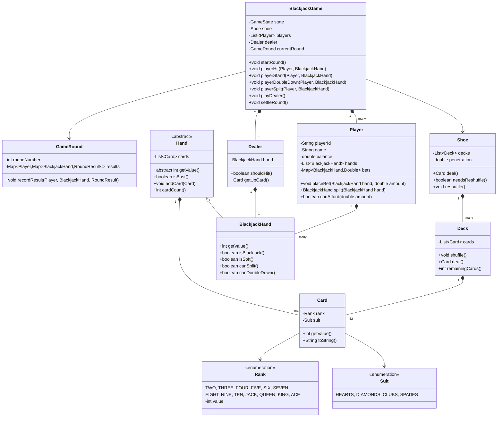

# LLD: Blackjack and a Deck of Cards

## 1. Requirements

### Functional
- Standard 52-card deck (Rank × Suit); support multiple decks (shoe)
- Players: one or more human players + dealer
- Game flow: deal → players act (hit/stand/double-down/split/surrender) → dealer plays → settle bets
- Blackjack (Ace + 10-value) pays 3:2
- Dealer stands on soft 17
- Ace counts as 1 or 11 (whichever benefits the hand)
- Betting with chips; player balance tracking
- Split: if two cards of same rank, split into two hands
- Insurance: when dealer shows Ace

### Non-Functional
- Game state machine must be explicit and correct
- Deck shuffling must be fair (Fisher-Yates)
- Extensible to add Baccarat, Poker (reuse Card/Deck)

### Out of Scope
- Multiplayer networking, card counting detection, RNG auditing

---

## 2. Core Entities

`Card`, `Suit`, `Rank`, `Deck`, `Shoe`, `Hand`, `BlackjackHand`, `Player`, `Dealer`, `BlackjackGame`, `Bet`, `GameRound`

---

## 3. Class Diagram



---

## 4. Design Patterns

| Pattern | Where Applied | Why |
|---------|--------------|-----|
| **Strategy** | `DealerStrategy` | Dealer's hit/stand rule (soft 17 vs hard 17) is configurable |
| **Factory** | `DeckFactory` | Creates standard decks; extensible to create Canasta/Pinochle decks |
| **Composite** | `Shoe` containing multiple `Deck` objects | Treat multi-deck shoe uniformly as a card source |
| **State** | `BlackjackGame.state` | BETTING → DEALING → PLAYER_ACTIONS → DEALER_PLAYS → SETTLING |
| **Observer** | `GameEventListener` | Broadcast game events (deal, bust, blackjack) to UI/logging |
| **Iterator** | `Shoe` implements card iteration | Standard traversal over multiple decks |

---

## 5. Java Implementation

```java
// ─── Enums ──────────────────────────────────────────────────────────────────

public enum Suit {
    HEARTS("♥"), DIAMONDS("♦"), CLUBS("♣"), SPADES("♠");
    private final String symbol;
    Suit(String symbol) { this.symbol = symbol; }
    public String getSymbol() { return symbol; }
}

public enum Rank {
    TWO(2), THREE(3), FOUR(4), FIVE(5), SIX(6), SEVEN(7),
    EIGHT(8), NINE(9), TEN(10), JACK(10), QUEEN(10), KING(10), ACE(11);

    private final int value;
    Rank(int value) { this.value = value; }
    public int getValue() { return value; }
}

public enum GameState { WAITING, BETTING, DEALING, PLAYER_ACTIONS, DEALER_PLAYS, SETTLING }
public enum RoundResult { WIN, LOSE, PUSH, BLACKJACK, BUST }

// ─── Card ─────────────────────────────────────────────────────────────────────

public class Card {
    private final Rank rank;
    private final Suit suit;
    private boolean faceDown;

    public Card(Rank rank, Suit suit) {
        this.rank = rank;
        this.suit = suit;
        this.faceDown = false;
    }

    public int getValue() { return rank.getValue(); }
    public Rank getRank() { return rank; }
    public Suit getSuit() { return suit; }
    public boolean isFaceDown() { return faceDown; }
    public void flip() { faceDown = !faceDown; }

    @Override
    public String toString() {
        return faceDown ? "[??]" : rank.name() + suit.getSymbol();
    }
}

// ─── Deck ─────────────────────────────────────────────────────────────────────

public class Deck {
    private final List<Card> cards;

    public Deck() {
        cards = new ArrayList<>(52);
        for (Suit suit : Suit.values()) {
            for (Rank rank : Rank.values()) {
                cards.add(new Card(rank, suit));
            }
        }
    }

    public void shuffle() {
        Collections.shuffle(cards, new SecureRandom()); // Fisher-Yates via Collections.shuffle
    }

    public Card deal() {
        if (cards.isEmpty()) throw new DeckEmptyException("Deck is empty");
        return cards.remove(cards.size() - 1);
    }

    public int remainingCards() { return cards.size(); }
}

// ─── Shoe (Multiple Decks) ────────────────────────────────────────────────────

public class Shoe {
    private final List<Card> cards = new ArrayList<>();
    private final int deckCount;
    private final double penetration; // reshuffle when this fraction used

    public Shoe(int deckCount, double penetration) {
        this.deckCount = deckCount;
        this.penetration = penetration;
        buildAndShuffle();
    }

    private void buildAndShuffle() {
        cards.clear();
        for (int i = 0; i < deckCount; i++) {
            Deck deck = new Deck();
            deck.shuffle();
            for (int j = 0; j < 52; j++) {
                cards.add(deck.deal());
            }
        }
        Collections.shuffle(cards, new SecureRandom());
    }

    public Card deal() {
        if (needsReshuffle()) buildAndShuffle();
        if (cards.isEmpty()) throw new ShoeEmptyException("Shoe is empty");
        return cards.remove(cards.size() - 1);
    }

    public boolean needsReshuffle() {
        return cards.size() < deckCount * 52 * (1 - penetration);
    }

    public int remainingCards() { return cards.size(); }
}

// ─── Hand ─────────────────────────────────────────────────────────────────────

public abstract class Hand {
    protected final List<Card> cards = new ArrayList<>();

    public void addCard(Card card) { cards.add(card); }
    public abstract int getValue();
    public boolean isBust() { return getValue() > 21; }
    public int cardCount() { return cards.size(); }
    public List<Card> getCards() { return Collections.unmodifiableList(cards); }
}

public class BlackjackHand extends Hand {
    @Override
    public int getValue() {
        int total = 0;
        int aceCount = 0;

        for (Card card : cards) {
            if (card.isFaceDown()) continue;
            total += card.getValue();
            if (card.getRank() == Rank.ACE) aceCount++;
        }

        // Each Ace initially counted as 11; reduce by 10 to avoid bust
        while (total > 21 && aceCount > 0) {
            total -= 10;
            aceCount--;
        }

        return total;
    }

    public boolean isBlackjack() {
        return cardCount() == 2 && getValue() == 21;
    }

    public boolean isSoft() {
        // Soft hand: Ace counted as 11
        int total = cards.stream().filter(c -> !c.isFaceDown()).mapToInt(Card::getValue).sum();
        boolean hasAce = cards.stream().anyMatch(c -> c.getRank() == Rank.ACE && !c.isFaceDown());
        return hasAce && total != getValue(); // difference means Ace is 11
    }

    public boolean canSplit() {
        return cardCount() == 2 &&
               cards.get(0).getRank() == cards.get(1).getRank();
    }

    public boolean canDoubleDown() {
        return cardCount() == 2;
    }
}

// ─── Dealer Strategy ─────────────────────────────────────────────────────────

public interface DealerStrategy {
    boolean shouldHit(BlackjackHand hand);
}

public class StandOnSoft17 implements DealerStrategy {
    @Override
    public boolean shouldHit(BlackjackHand hand) {
        // Hit on hard 16 or less; stand on 17 (including soft 17)
        return hand.getValue() < 17;
    }
}

public class HitOnSoft17 implements DealerStrategy {
    @Override
    public boolean shouldHit(BlackjackHand hand) {
        // Hit on soft 17 in some casino variants
        return hand.getValue() < 17 || (hand.getValue() == 17 && hand.isSoft());
    }
}

// ─── Dealer ───────────────────────────────────────────────────────────────────

public class Dealer {
    private BlackjackHand hand;
    private final DealerStrategy strategy;

    public Dealer(DealerStrategy strategy) {
        this.strategy = strategy;
        this.hand = new BlackjackHand();
    }

    public void receiveCard(Card card) { hand.addCard(card); }

    public boolean shouldHit() { return strategy.shouldHit(hand); }

    public Card getUpCard() {
        return hand.getCards().stream()
            .filter(c -> !c.isFaceDown())
            .findFirst()
            .orElseThrow(() -> new IllegalStateException("No face-up card"));
    }

    public BlackjackHand getHand() { return hand; }
    public void resetHand() { hand = new BlackjackHand(); }
}

// ─── Player ───────────────────────────────────────────────────────────────────

public class Player {
    private final String playerId;
    private final String name;
    private double balance;
    private final List<BlackjackHand> hands = new ArrayList<>();
    private final Map<BlackjackHand, Double> bets = new HashMap<>();

    public Player(String playerId, String name, double initialBalance) {
        this.playerId = playerId;
        this.name = name;
        this.balance = initialBalance;
    }

    public BlackjackHand startHand(double betAmount) {
        if (betAmount > balance) throw new InsufficientBalanceException("Insufficient balance");
        BlackjackHand hand = new BlackjackHand();
        hands.add(hand);
        bets.put(hand, betAmount);
        balance -= betAmount;
        return hand;
    }

    public BlackjackHand split(BlackjackHand hand) {
        if (!hand.canSplit()) throw new IllegalStateException("Hand cannot be split");
        double betAmount = bets.get(hand);
        if (betAmount > balance) throw new InsufficientBalanceException("Cannot afford split");

        // Remove second card from original hand
        Card splitCard = hand.getCards().get(1);
        // Note: In production, Hand would expose removeLastCard()
        BlackjackHand newHand = new BlackjackHand();
        newHand.addCard(splitCard);
        hands.add(newHand);
        bets.put(newHand, betAmount);
        balance -= betAmount;
        return newHand;
    }

    public void doubleDown(BlackjackHand hand) {
        double bet = bets.get(hand);
        if (bet > balance) throw new InsufficientBalanceException("Cannot afford double down");
        bets.put(hand, bet * 2);
        balance -= bet;
    }

    public void receiveWinnings(double amount) { balance += amount; }

    public double getBet(BlackjackHand hand) { return bets.getOrDefault(hand, 0.0); }
    public List<BlackjackHand> getHands() { return Collections.unmodifiableList(hands); }
    public void resetHands() { hands.clear(); bets.clear(); }
    public double getBalance() { return balance; }
    public String getName() { return name; }
}

// ─── Blackjack Game ───────────────────────────────────────────────────────────

public class BlackjackGame {
    private GameState state;
    private final Shoe shoe;
    private final List<Player> players;
    private final Dealer dealer;

    public BlackjackGame(int decks, List<Player> players, DealerStrategy dealerStrategy) {
        this.shoe = new Shoe(decks, 0.75);
        this.players = new ArrayList<>(players);
        this.dealer = new Dealer(dealerStrategy);
        this.state = GameState.WAITING;
    }

    public void startRound(Map<Player, Double> bets) {
        validateState(GameState.WAITING);
        state = GameState.BETTING;

        // Initialize hands
        Map<Player, BlackjackHand> playerHands = new HashMap<>();
        bets.forEach((player, bet) -> playerHands.put(player, player.startHand(bet)));

        // Initial deal: 2 cards each, dealer's second card face-down
        state = GameState.DEALING;
        playerHands.values().forEach(h -> h.addCard(shoe.deal()));
        dealer.receiveCard(shoe.deal());
        playerHands.values().forEach(h -> h.addCard(shoe.deal()));
        Card holeCard = shoe.deal();
        holeCard.flip(); // face-down
        dealer.receiveCard(holeCard);

        state = GameState.PLAYER_ACTIONS;
    }

    public void playerHit(Player player, BlackjackHand hand) {
        validateState(GameState.PLAYER_ACTIONS);
        hand.addCard(shoe.deal());
        // If bust, hand is done automatically
    }

    public void playerStand(Player player, BlackjackHand hand) {
        validateState(GameState.PLAYER_ACTIONS);
        // No action needed — player is done with this hand
    }

    public void playerDoubleDown(Player player, BlackjackHand hand) {
        validateState(GameState.PLAYER_ACTIONS);
        player.doubleDown(hand);
        hand.addCard(shoe.deal()); // Exactly one more card
        // Hand is now done
    }

    public void playDealer() {
        validateState(GameState.DEALER_PLAYS);
        // Reveal hole card
        dealer.getHand().getCards().stream()
            .filter(Card::isFaceDown)
            .forEach(Card::flip);

        // Dealer hits until strategy says stand
        while (dealer.shouldHit() && !dealer.getHand().isBust()) {
            dealer.receiveCard(shoe.deal());
        }
        state = GameState.SETTLING;
    }

    public Map<Player, Map<BlackjackHand, RoundResult>> settleRound() {
        validateState(GameState.SETTLING);
        Map<Player, Map<BlackjackHand, RoundResult>> results = new HashMap<>();
        int dealerValue = dealer.getHand().getValue();
        boolean dealerBust = dealer.getHand().isBust();
        boolean dealerBlackjack = dealer.getHand().isBlackjack();

        for (Player player : players) {
            Map<BlackjackHand, RoundResult> handResults = new HashMap<>();
            for (BlackjackHand hand : player.getHands()) {
                RoundResult result = determineResult(hand, dealerValue, dealerBust, dealerBlackjack);
                handResults.put(hand, result);
                payOut(player, hand, result);
            }
            results.put(player, handResults);
            player.resetHands();
        }

        dealer.resetHand();
        state = GameState.WAITING;
        return results;
    }

    private RoundResult determineResult(BlackjackHand playerHand, int dealerValue,
                                         boolean dealerBust, boolean dealerBlackjack) {
        if (playerHand.isBust()) return RoundResult.BUST;
        if (playerHand.isBlackjack() && !dealerBlackjack) return RoundResult.BLACKJACK;
        if (playerHand.isBlackjack() && dealerBlackjack) return RoundResult.PUSH;
        if (dealerBust) return RoundResult.WIN;
        int playerValue = playerHand.getValue();
        if (playerValue > dealerValue) return RoundResult.WIN;
        if (playerValue < dealerValue) return RoundResult.LOSE;
        return RoundResult.PUSH;
    }

    private void payOut(Player player, BlackjackHand hand, RoundResult result) {
        double bet = player.getBet(hand);
        switch (result) {
            case BLACKJACK -> player.receiveWinnings(bet * 2.5); // 3:2 payout
            case WIN -> player.receiveWinnings(bet * 2);          // 1:1 payout
            case PUSH -> player.receiveWinnings(bet);             // Return bet
            case BUST, LOSE -> {}                                  // Bet lost
        }
    }

    private void validateState(GameState expected) {
        if (state != expected) {
            throw new IllegalStateException("Expected state " + expected + " but was " + state);
        }
    }
}
```

---

## 6. SOLID Analysis

| Principle | Assessment |
|-----------|-----------|
| **SRP** | `BlackjackHand` calculates hand value; `Dealer` applies strategy; `BlackjackGame` orchestrates |
| **OCP** | New game variant: extend `Hand`, provide new `DealerStrategy` — no existing class changes |
| **LSP** | Any `DealerStrategy` can replace another without changing `Dealer` behavior |
| **ISP** | `DealerStrategy` is single-method; game events are granular |
| **DIP** | `Dealer` depends on `DealerStrategy` interface |

---

## 7. Key Algorithms

- **Hand value**: Iterate cards, sum values, reduce Ace from 11→1 while over 21
- **Deck shuffling**: `Collections.shuffle(cards, new SecureRandom())` — cryptographically random Fisher-Yates
- **Shoe penetration**: Reshuffle when fewer than (1-penetration)×totalCards remain — prevents card counting

---

## 8. FAANG Interview Tips

- **Ace counting is the tricky part**: Show the greedy reduction loop — "while total > 21 and aceCount > 0, subtract 10"
- **Soft vs hard hand**: `isSoft()` matters for dealer's soft-17 rule — show you know the distinction
- **Factory for decks**: `Deck` creates 52 cards — show you know Factory Method here
- **Don't hardcode dealer rules**: `DealerStrategy` shows OCP thinking — many casinos have different soft-17 rules
- **Extensibility follow-up**: "How would you reuse Card/Deck for Poker?" → `Hand` is abstract; `PokerHand extends Hand` with its own `getValue()` and `compareTo()`
