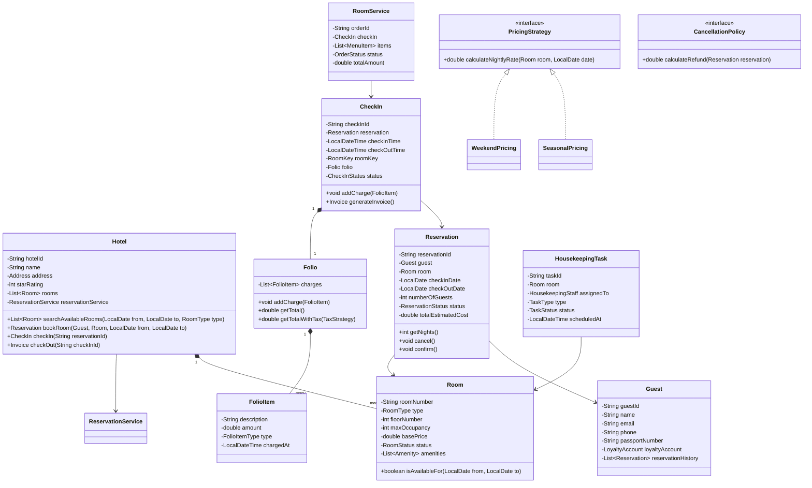

# LLD: Hotel Management System

## 1. Requirements

### Functional
- Search available rooms by dates, room type, occupancy
- Book rooms: reserve → check-in → check-out
- Room types: Single, Double, Suite, Presidential
- Services: housekeeping requests, room service orders, spa bookings
- Billing: room charges + service charges; invoice on checkout
- Guest profile with loyalty points
- Housekeeping schedule management
- Receptionist can assign specific rooms
- Cancellation with policy-based refund

### Non-Functional
- No double-booking of same room for overlapping dates
- Service charges auto-added to guest folio
- Extensible billing (taxes, seasonal pricing)

### Out of Scope
- Revenue management systems, OTA integration, channel management

---

## 2. Core Entities

`Hotel`, `Room`, `Reservation`, `Guest`, `CheckIn`, `RoomService`, `HousekeepingTask`, `Invoice`, `Payment`, `RoomKey`

---

## 3. Class Diagram



---

## 4. Design Patterns

| Pattern | Where Applied | Why |
|---------|--------------|-----|
| **Strategy** | `PricingStrategy`, `CancellationPolicy` | Configurable pricing and refund rules |
| **Observer** | `HousekeepingNotifier` | Notify housekeeping when guest checks out |
| **Factory** | `RoomFactory` | Create rooms with correct amenities per type |
| **Decorator** | `TaxDecorator` on `Folio` | Add tax calculation without modifying `Folio` |
| **Template Method** | `CheckIn.generateInvoice()` | Common invoice structure; hook for loyalty points |

---

## 5. Java Implementation

```java
// ─── Enums ──────────────────────────────────────────────────────────────────

public enum RoomType { SINGLE, DOUBLE, SUITE, PRESIDENTIAL }
public enum RoomStatus { AVAILABLE, OCCUPIED, RESERVED, MAINTENANCE, HOUSEKEEPING }
public enum ReservationStatus { PENDING, CONFIRMED, CHECKED_IN, COMPLETED, CANCELLED }
public enum CheckInStatus { ACTIVE, CHECKED_OUT }
public enum FolioItemType { ROOM_CHARGE, ROOM_SERVICE, SPA, MINIBAR, PHONE, LAUNDRY, OTHER }

// ─── Room ─────────────────────────────────────────────────────────────────────

public class Room {
    private final String roomNumber;
    private final RoomType type;
    private final int floorNumber;
    private final int maxOccupancy;
    private double basePrice;
    private volatile RoomStatus status;
    private final List<String> amenities;

    public Room(String roomNumber, RoomType type, int floor, int maxOccupancy, double basePrice) {
        this.roomNumber = roomNumber;
        this.type = type;
        this.floorNumber = floor;
        this.maxOccupancy = maxOccupancy;
        this.basePrice = basePrice;
        this.status = RoomStatus.AVAILABLE;
        this.amenities = new ArrayList<>();
    }

    public boolean isAvailable() { return status == RoomStatus.AVAILABLE; }

    public String getRoomNumber() { return roomNumber; }
    public RoomType getType() { return type; }
    public double getBasePrice() { return basePrice; }
    public RoomStatus getStatus() { return status; }
    public void setStatus(RoomStatus status) { this.status = status; }
}

// ─── Pricing Strategy ────────────────────────────────────────────────────────

public interface PricingStrategy {
    double calculateNightlyRate(Room room, LocalDate date);
}

public class SeasonalPricing implements PricingStrategy {
    @Override
    public double calculateNightlyRate(Room room, LocalDate date) {
        double rate = room.getBasePrice();
        int month = date.getMonthValue();
        // Peak season: June–August, December
        if ((month >= 6 && month <= 8) || month == 12) {
            rate *= 1.3;
        }
        return rate;
    }
}

public class WeekendPricing implements PricingStrategy {
    private final PricingStrategy base;

    public WeekendPricing(PricingStrategy base) { this.base = base; }

    @Override
    public double calculateNightlyRate(Room room, LocalDate date) {
        double rate = base.calculateNightlyRate(room, date);
        DayOfWeek day = date.getDayOfWeek();
        if (day == DayOfWeek.FRIDAY || day == DayOfWeek.SATURDAY) {
            rate *= 1.15;
        }
        return rate;
    }
}

// ─── Loyalty Account ────────────────────────────────────────────────────────

public class LoyaltyAccount {
    private final String accountNumber;
    private int points;
    private LoyaltyTier tier;

    public void addPoints(int points) {
        this.points += points;
        updateTier();
    }

    public boolean redeemPoints(int points) {
        if (this.points < points) return false;
        this.points -= points;
        return true;
    }

    private void updateTier() {
        if (points >= 50000) tier = LoyaltyTier.PLATINUM;
        else if (points >= 20000) tier = LoyaltyTier.GOLD;
        else if (points >= 5000) tier = LoyaltyTier.SILVER;
        else tier = LoyaltyTier.BRONZE;
    }

    public int getPoints() { return points; }
    public LoyaltyTier getTier() { return tier; }
}

// ─── Guest ────────────────────────────────────────────────────────────────────

public class Guest {
    private final String guestId;
    private final String name;
    private final String email;
    private final String phone;
    private LoyaltyAccount loyaltyAccount;

    public Guest(String guestId, String name, String email, String phone) {
        this.guestId = guestId;
        this.name = name;
        this.email = email;
        this.phone = phone;
        this.loyaltyAccount = new LoyaltyAccount();
    }

    public String getGuestId() { return guestId; }
    public String getName() { return name; }
    public LoyaltyAccount getLoyaltyAccount() { return loyaltyAccount; }
}

// ─── Folio ────────────────────────────────────────────────────────────────────

public class FolioItem {
    private final String description;
    private final double amount;
    private final FolioItemType type;
    private final LocalDateTime chargedAt;

    public FolioItem(String description, double amount, FolioItemType type) {
        this.description = description;
        this.amount = amount;
        this.type = type;
        this.chargedAt = LocalDateTime.now();
    }

    public double getAmount() { return amount; }
    public FolioItemType getType() { return type; }
    public String getDescription() { return description; }
}

public class Folio {
    private final List<FolioItem> charges = new ArrayList<>();

    public void addCharge(FolioItem item) { charges.add(item); }

    public double getSubtotal() {
        return charges.stream().mapToDouble(FolioItem::getAmount).sum();
    }

    public double getTotalWithTax(double taxRate) {
        return getSubtotal() * (1 + taxRate);
    }

    public List<FolioItem> getCharges() { return Collections.unmodifiableList(charges); }
}

// ─── Reservation ─────────────────────────────────────────────────────────────

public class Reservation {
    private final String reservationId;
    private final Guest guest;
    private final Room room;
    private final LocalDate checkInDate;
    private final LocalDate checkOutDate;
    private ReservationStatus status;
    private double estimatedTotal;

    public Reservation(Guest guest, Room room, LocalDate checkIn, LocalDate checkOut) {
        this.reservationId = UUID.randomUUID().toString();
        this.guest = guest;
        this.room = room;
        this.checkInDate = checkIn;
        this.checkOutDate = checkOut;
        this.status = ReservationStatus.CONFIRMED;
    }

    public int getNights() {
        return (int) ChronoUnit.DAYS.between(checkInDate, checkOutDate);
    }

    public void cancel(CancellationPolicy policy) {
        if (status != ReservationStatus.CONFIRMED) {
            throw new IllegalStateException("Cannot cancel reservation in state: " + status);
        }
        status = ReservationStatus.CANCELLED;
    }

    public LocalDate getCheckInDate() { return checkInDate; }
    public LocalDate getCheckOutDate() { return checkOutDate; }
    public Guest getGuest() { return guest; }
    public Room getRoom() { return room; }
    public ReservationStatus getStatus() { return status; }
    public void setStatus(ReservationStatus status) { this.status = status; }
    public String getReservationId() { return reservationId; }
}

// ─── CheckIn ──────────────────────────────────────────────────────────────────

public class CheckIn {
    private final String checkInId;
    private final Reservation reservation;
    private final LocalDateTime checkInTime;
    private LocalDateTime checkOutTime;
    private final Folio folio;
    private CheckInStatus status;

    public CheckIn(Reservation reservation) {
        this.checkInId = UUID.randomUUID().toString();
        this.reservation = reservation;
        this.checkInTime = LocalDateTime.now();
        this.folio = new Folio();
        this.status = CheckInStatus.ACTIVE;
    }

    public void addCharge(FolioItem item) { folio.addCharge(item); }

    public Invoice generateInvoice(double taxRate) {
        if (status != CheckInStatus.ACTIVE) throw new IllegalStateException("Already checked out");
        checkOutTime = LocalDateTime.now();
        status = CheckInStatus.CHECKED_OUT;
        reservation.setStatus(ReservationStatus.COMPLETED);
        reservation.getRoom().setStatus(RoomStatus.HOUSEKEEPING);

        // Accrue loyalty points: 1 point per $1 spent
        double subtotal = folio.getSubtotal();
        int points = (int) subtotal;
        reservation.getGuest().getLoyaltyAccount().addPoints(points);

        return new Invoice(this, folio.getCharges(), subtotal, taxRate);
    }

    public Folio getFolio() { return folio; }
    public Reservation getReservation() { return reservation; }
    public String getCheckInId() { return checkInId; }
}

// ─── Invoice ──────────────────────────────────────────────────────────────────

public class Invoice {
    private final String invoiceId;
    private final CheckIn checkIn;
    private final List<FolioItem> lineItems;
    private final double subtotal;
    private final double taxRate;
    private final LocalDateTime generatedAt;

    public Invoice(CheckIn checkIn, List<FolioItem> lineItems, double subtotal, double taxRate) {
        this.invoiceId = UUID.randomUUID().toString();
        this.checkIn = checkIn;
        this.lineItems = new ArrayList<>(lineItems);
        this.subtotal = subtotal;
        this.taxRate = taxRate;
        this.generatedAt = LocalDateTime.now();
    }

    public double getTotal() { return subtotal * (1 + taxRate); }
    public double getSubtotal() { return subtotal; }
    public double getTaxAmount() { return subtotal * taxRate; }
}

// ─── Cancellation Policy ─────────────────────────────────────────────────────

public interface CancellationPolicy {
    double calculateRefund(Reservation reservation);
}

public class FlexibleCancellationPolicy implements CancellationPolicy {
    @Override
    public double calculateRefund(Reservation reservation) {
        long daysUntilCheckIn = ChronoUnit.DAYS.between(LocalDate.now(), reservation.getCheckInDate());
        if (daysUntilCheckIn >= 2) return reservation.getEstimatedTotal(); // full refund
        if (daysUntilCheckIn == 1) return reservation.getEstimatedTotal() * 0.5;
        return 0; // same-day: no refund
    }
}

// ─── Reservation Service ──────────────────────────────────────────────────────

public class ReservationService {
    private final Map<String, Reservation> reservations = new ConcurrentHashMap<>();
    private final Map<String, Set<String>> roomBookings = new ConcurrentHashMap<>(); // roomNumber -> reservationIds
    private final PricingStrategy pricingStrategy;

    public ReservationService(PricingStrategy pricingStrategy) {
        this.pricingStrategy = pricingStrategy;
    }

    public synchronized Reservation book(Guest guest, Room room,
                                          LocalDate checkIn, LocalDate checkOut) {
        if (!isRoomAvailable(room, checkIn, checkOut)) {
            throw new RoomNotAvailableException("Room " + room.getRoomNumber() + " not available for dates");
        }

        // Calculate total
        double total = checkIn.datesUntil(checkOut)
            .mapToDouble(date -> pricingStrategy.calculateNightlyRate(room, date))
            .sum();

        Reservation reservation = new Reservation(guest, room, checkIn, checkOut);
        reservation.setEstimatedTotal(total);
        reservations.put(reservation.getReservationId(), reservation);
        roomBookings.computeIfAbsent(room.getRoomNumber(), k -> new HashSet<>())
                    .add(reservation.getReservationId());
        return reservation;
    }

    private boolean isRoomAvailable(Room room, LocalDate from, LocalDate to) {
        Set<String> resIds = roomBookings.getOrDefault(room.getRoomNumber(), Set.of());
        return resIds.stream()
            .map(reservations::get)
            .filter(r -> r.getStatus() == ReservationStatus.CONFIRMED)
            .noneMatch(r -> overlaps(r.getCheckInDate(), r.getCheckOutDate(), from, to));
    }

    private boolean overlaps(LocalDate r1Start, LocalDate r1End, LocalDate r2Start, LocalDate r2End) {
        return r1Start.isBefore(r2End) && r1End.isAfter(r2Start);
    }
}
```

---

## 6. SOLID Analysis

| Principle | Assessment |
|-----------|-----------|
| **SRP** | `Folio` tracks charges; `ReservationService` handles booking logic; `CheckIn` manages stay lifecycle |
| **OCP** | New pricing rule: implement `PricingStrategy`; new tax: wrap folio with `TaxDecorator` |
| **LSP** | `WeekendPricing` wraps (Decorator) `SeasonalPricing` — they're interchangeable |
| **ISP** | `CancellationPolicy` is focused; `PricingStrategy` is minimal |
| **DIP** | `ReservationService` injects `PricingStrategy`; `Hotel` depends on `ReservationService` abstraction |

---

## 7. Extensibility

| Future Requirement | How to Add |
|--------------------|-----------|
| Online check-in | `OnlineCheckIn` extending `CheckIn`; add virtual key issuance |
| Group booking | `GroupReservation` aggregating multiple `Reservation` objects |
| Dynamic minimum stay | `MinimumStayRule` composing with `PricingStrategy` |
| Housekeeping scheduling | `HousekeepingTask` created when room status → HOUSEKEEPING (Observer) |

---

## 8. FAANG Interview Tips

- **Overlap detection**: `r1Start < r2End AND r1End > r2Start` — memorize this; wrong overlap logic is a common bug
- **Folio pattern**: Many candidates miss the concept of an ongoing "bill" during a stay — `Folio` with `FolioItem` is the hotel industry standard
- **State progression**: Available → Reserved → Occupied → Housekeeping → Available — draw this explicitly
- **Concurrent booking**: `synchronized` on `book()` prevents double-booking; at scale use row-level DB locking or Redis SETNX
- **Follow-up: 1000-room hotel, 1M online searches/day?** → Cache room availability in Redis, invalidate on booking; use read replicas for search
