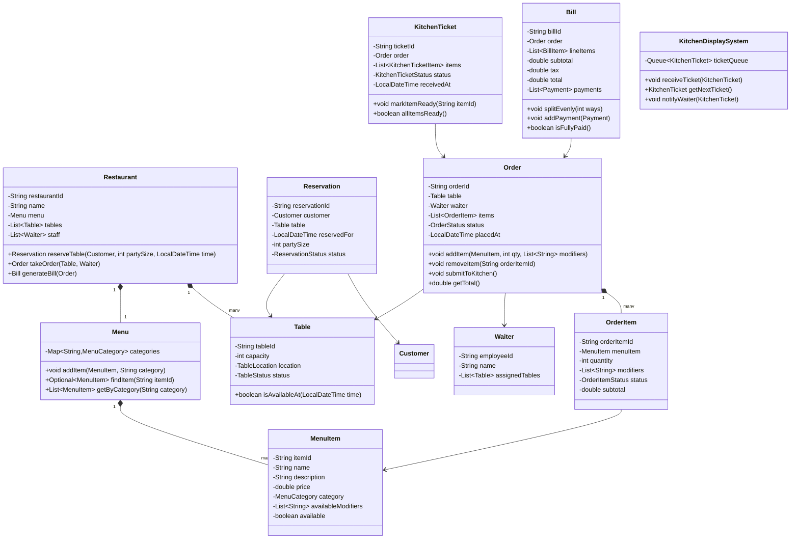

# LLD: Restaurant Management System

## 1. Requirements

### Functional
- Customers can make table reservations (walk-in or advance)
- Waitstaff takes orders; kitchen receives order tickets
- Menu: categories, items, modifiers (extra cheese, no onion), combos
- Order lifecycle: placed → kitchen-received → in-preparation → ready → served → billed
- Multiple payment methods; split bill support
- Kitchen Display System (KDS): orders queued by priority
- Manager can update menu, assign tables, view reports
- Table management: track available/occupied/reserved tables

### Non-Functional
- Order modifications before kitchen confirms
- Extensible notification (KDS, waiter pager)
- Multi-restaurant chain support

### Out of Scope
- Delivery, loyalty programs, inventory management

---

## 2. Core Entities

`Restaurant`, `Table`, `Reservation`, `Menu`, `MenuItem`, `Order`, `OrderItem`, `KitchenTicket`, `Bill`, `Waiter`, `Chef`

---

## 3. Class Diagram



---

## 4. Design Patterns

| Pattern | Where Applied | Why |
|---------|--------------|-----|
| **Command** | `OrderItem` | Each order item is a command; supports cancellation before kitchen confirmation |
| **Observer** | `KitchenDisplaySystem` | Notified when order is submitted; waitstaff notified when order is ready |
| **State** | `Order.status`, `KitchenTicket.status` | Explicit lifecycle transitions |
| **Strategy** | `BillSplitStrategy` | Even split, custom split, per-item split |
| **Builder** | `OrderBuilder` | Complex order construction with validation |
| **Composite** | `ComboMenuItem` | Combos composed of individual `MenuItem` objects |

---

## 5. Java Implementation

```java
// ─── Enums ──────────────────────────────────────────────────────────────────

public enum TableStatus { AVAILABLE, OCCUPIED, RESERVED, CLEANING }
public enum OrderStatus { DRAFT, SUBMITTED, IN_PREPARATION, PARTIALLY_READY, READY, SERVED, BILLED }
public enum KitchenTicketStatus { RECEIVED, IN_PROGRESS, READY, DELIVERED }
public enum OrderItemStatus { PENDING, IN_PREPARATION, READY, SERVED }
public enum ReservationStatus { CONFIRMED, SEATED, COMPLETED, CANCELLED }

// ─── Menu ─────────────────────────────────────────────────────────────────────

public class MenuCategory {
    private final String name;
    private final List<MenuItem> items = new ArrayList<>();

    public MenuCategory(String name) { this.name = name; }
    public void addItem(MenuItem item) { items.add(item); }
    public List<MenuItem> getItems() { return Collections.unmodifiableList(items); }
    public String getName() { return name; }
}

public class MenuItem {
    private final String itemId;
    private final String name;
    private final double price;
    private final String category;
    private final List<String> availableModifiers;
    private boolean available;

    public MenuItem(String itemId, String name, double price, String category) {
        this.itemId = itemId;
        this.name = name;
        this.price = price;
        this.category = category;
        this.availableModifiers = new ArrayList<>();
        this.available = true;
    }

    public boolean isAvailable() { return available; }
    public void setAvailable(boolean available) { this.available = available; }
    public String getItemId() { return itemId; }
    public String getName() { return name; }
    public double getPrice() { return price; }
    public List<String> getAvailableModifiers() { return Collections.unmodifiableList(availableModifiers); }
}

public class ComboMenuItem extends MenuItem {
    private final List<MenuItem> components;
    private final double discount;

    public ComboMenuItem(String itemId, String name, List<MenuItem> components, double discount) {
        super(itemId, name, calculateComboPrice(components, discount), "COMBO");
        this.components = new ArrayList<>(components);
        this.discount = discount;
    }

    private static double calculateComboPrice(List<MenuItem> components, double discount) {
        double sum = components.stream().mapToDouble(MenuItem::getPrice).sum();
        return sum * (1 - discount);
    }

    public List<MenuItem> getComponents() { return Collections.unmodifiableList(components); }
}

public class Menu {
    private final Map<String, MenuCategory> categories = new LinkedHashMap<>();

    public void addCategory(String name) {
        categories.put(name, new MenuCategory(name));
    }

    public void addItem(MenuItem item, String category) {
        categories.computeIfAbsent(category, MenuCategory::new).addItem(item);
    }

    public Optional<MenuItem> findItem(String itemId) {
        return categories.values().stream()
            .flatMap(c -> c.getItems().stream())
            .filter(i -> i.getItemId().equals(itemId))
            .findFirst();
    }

    public List<MenuItem> getByCategory(String category) {
        MenuCategory cat = categories.get(category);
        return cat == null ? Collections.emptyList() : cat.getItems();
    }
}

// ─── Table ────────────────────────────────────────────────────────────────────

public class Table {
    private final String tableId;
    private final int capacity;
    private volatile TableStatus status;

    public Table(String tableId, int capacity) {
        this.tableId = tableId;
        this.capacity = capacity;
        this.status = TableStatus.AVAILABLE;
    }

    public boolean isAvailable() { return status == TableStatus.AVAILABLE; }
    public void occupy() { status = TableStatus.OCCUPIED; }
    public void free() { status = TableStatus.AVAILABLE; }
    public void reserve() { status = TableStatus.RESERVED; }

    public String getTableId() { return tableId; }
    public int getCapacity() { return capacity; }
    public TableStatus getStatus() { return status; }
}

// ─── Order ────────────────────────────────────────────────────────────────────

public class OrderItem {
    private final String orderItemId;
    private final MenuItem menuItem;
    private int quantity;
    private final List<String> modifiers;
    private OrderItemStatus status;

    public OrderItem(MenuItem menuItem, int quantity, List<String> modifiers) {
        this.orderItemId = UUID.randomUUID().toString();
        this.menuItem = menuItem;
        this.quantity = quantity;
        this.modifiers = new ArrayList<>(modifiers);
        this.status = OrderItemStatus.PENDING;
    }

    public double getSubtotal() { return menuItem.getPrice() * quantity; }
    public void markReady() { status = OrderItemStatus.READY; }
    public void markServed() { status = OrderItemStatus.SERVED; }

    public String getOrderItemId() { return orderItemId; }
    public MenuItem getMenuItem() { return menuItem; }
    public int getQuantity() { return quantity; }
    public List<String> getModifiers() { return Collections.unmodifiableList(modifiers); }
    public OrderItemStatus getStatus() { return status; }
}

public class Order {
    private final String orderId;
    private final Table table;
    private final Waiter waiter;
    private final List<OrderItem> items = new ArrayList<>();
    private OrderStatus status;
    private final LocalDateTime placedAt;
    private final List<OrderEventListener> listeners = new ArrayList<>();

    public Order(Table table, Waiter waiter) {
        this.orderId = UUID.randomUUID().toString();
        this.table = table;
        this.waiter = waiter;
        this.placedAt = LocalDateTime.now();
        this.status = OrderStatus.DRAFT;
    }

    public void addItem(MenuItem item, int qty, List<String> modifiers) {
        if (status != OrderStatus.DRAFT) {
            throw new IllegalStateException("Cannot add items after order is submitted");
        }
        if (!item.isAvailable()) {
            throw new MenuItemUnavailableException(item.getName() + " is not available");
        }
        items.add(new OrderItem(item, qty, modifiers));
    }

    public void removeItem(String orderItemId) {
        if (status != OrderStatus.DRAFT) {
            throw new IllegalStateException("Cannot remove items after order is submitted");
        }
        items.removeIf(i -> i.getOrderItemId().equals(orderItemId));
    }

    public void submit() {
        if (status != OrderStatus.DRAFT) throw new IllegalStateException("Order already submitted");
        if (items.isEmpty()) throw new IllegalStateException("Cannot submit empty order");
        status = OrderStatus.SUBMITTED;
        listeners.forEach(l -> l.onOrderSubmitted(this));
    }

    public void updateStatus(OrderStatus newStatus) {
        this.status = newStatus;
        listeners.forEach(l -> l.onStatusChange(this, newStatus));
    }

    public double getTotal() {
        return items.stream().mapToDouble(OrderItem::getSubtotal).sum();
    }

    public void addListener(OrderEventListener listener) { listeners.add(listener); }
    public String getOrderId() { return orderId; }
    public Table getTable() { return table; }
    public List<OrderItem> getItems() { return Collections.unmodifiableList(items); }
    public OrderStatus getStatus() { return status; }
}

// ─── Kitchen Display System (Observer) ───────────────────────────────────────

public interface OrderEventListener {
    void onOrderSubmitted(Order order);
    void onStatusChange(Order order, OrderStatus newStatus);
}

public class KitchenTicket {
    private final String ticketId;
    private final Order order;
    private KitchenTicketStatus status;
    private final LocalDateTime receivedAt;
    private final Map<String, OrderItemStatus> itemStatuses = new LinkedHashMap<>();

    public KitchenTicket(Order order) {
        this.ticketId = UUID.randomUUID().toString();
        this.order = order;
        this.status = KitchenTicketStatus.RECEIVED;
        this.receivedAt = LocalDateTime.now();
        order.getItems().forEach(i -> itemStatuses.put(i.getOrderItemId(), OrderItemStatus.PENDING));
    }

    public void markItemReady(String orderItemId) {
        itemStatuses.put(orderItemId, OrderItemStatus.READY);
        if (allItemsReady()) {
            status = KitchenTicketStatus.READY;
        } else {
            status = KitchenTicketStatus.IN_PROGRESS;
        }
    }

    public boolean allItemsReady() {
        return itemStatuses.values().stream().allMatch(s -> s == OrderItemStatus.READY);
    }

    public String getTicketId() { return ticketId; }
    public Order getOrder() { return order; }
    public KitchenTicketStatus getStatus() { return status; }
}

public class KitchenDisplaySystem implements OrderEventListener {
    private final Queue<KitchenTicket> ticketQueue = new LinkedBlockingQueue<>();
    private final List<KitchenReadyListener> readyListeners = new ArrayList<>();

    @Override
    public void onOrderSubmitted(Order order) {
        KitchenTicket ticket = new KitchenTicket(order);
        ticketQueue.offer(ticket);
        System.out.println("KDS: New ticket received for table " + order.getTable().getTableId());
    }

    @Override
    public void onStatusChange(Order order, OrderStatus newStatus) {
        // React to status changes if needed
    }

    public KitchenTicket getNextTicket() {
        return ticketQueue.poll();
    }

    public void markTicketReady(String ticketId, String orderItemId) {
        ticketQueue.stream()
            .filter(t -> t.getTicketId().equals(ticketId))
            .findFirst()
            .ifPresent(t -> {
                t.markItemReady(orderItemId);
                if (t.allItemsReady()) {
                    readyListeners.forEach(l -> l.onOrderReady(t.getOrder()));
                }
            });
    }
}

// ─── Bill ─────────────────────────────────────────────────────────────────────

public interface BillSplitStrategy {
    List<Double> split(double total, int parties);
}

public class EvenSplitStrategy implements BillSplitStrategy {
    @Override
    public List<Double> split(double total, int parties) {
        double perPerson = Math.round(total / parties * 100.0) / 100.0;
        List<Double> splits = new ArrayList<>(Collections.nCopies(parties, perPerson));
        // Adjust for rounding
        double diff = total - splits.stream().mapToDouble(Double::doubleValue).sum();
        splits.set(0, splits.get(0) + diff);
        return splits;
    }
}

public class Bill {
    private final String billId;
    private final Order order;
    private final double subtotal;
    private final double taxRate;
    private final List<Payment> payments = new ArrayList<>();

    public Bill(Order order, double taxRate) {
        this.billId = UUID.randomUUID().toString();
        this.order = order;
        this.subtotal = order.getTotal();
        this.taxRate = taxRate;
    }

    public double getTotal() { return subtotal * (1 + taxRate); }
    public double getPaidAmount() { return payments.stream().mapToDouble(Payment::getAmount).sum(); }
    public double getOutstandingAmount() { return Math.max(0, getTotal() - getPaidAmount()); }
    public boolean isFullyPaid() { return getPaidAmount() >= getTotal() - 0.01; }

    public void addPayment(Payment payment) {
        if (isFullyPaid()) throw new IllegalStateException("Bill already fully paid");
        payments.add(payment);
    }

    public String getBillId() { return billId; }
}
```

---

## 6. SOLID Analysis

| Principle | Assessment |
|-----------|-----------|
| **SRP** | `Order` manages order lifecycle; `KitchenDisplaySystem` handles kitchen routing; `Bill` handles billing |
| **OCP** | New split strategy implements `BillSplitStrategy`; new notification implements `OrderEventListener` |
| **LSP** | `ComboMenuItem extends MenuItem` — price calculation is overridden correctly; substitutable |
| **ISP** | `OrderEventListener` has focused methods; `BillSplitStrategy` has one method |
| **DIP** | `Order` fires events to `OrderEventListener` interface — not directly to KDS |

---

## 7. Extensibility

| Future Requirement | How to Add |
|--------------------|-----------|
| Online ordering | `OnlineOrder extends Order` with delivery address |
| Allergen warnings | `AllergenChecker` validates `OrderItem.modifiers` against guest profile |
| Kitchen station routing | `KitchenRouter` strategy splits ticket by station (grill, fryer, pastry) |
| Inventory deduction | Observer on `KitchenTicket.markItemReady()` → reduce stock |
| POS integration | `POSAdapter` wrapping `Order` for legacy POS systems |

---

## 8. FAANG Interview Tips

- **Command for OrderItem**: Show that adding/removing items before submission is the modification window — after submission, it's immutable
- **Observer for KDS**: Many candidates call KDS directly from `Order.submit()` — show the decoupled observer approach
- **Combo handling**: `ComboMenuItem extends MenuItem` — the caller doesn't need to know it's a combo
- **Bill splitting**: Always mention split-bill as an edge case; it's common in restaurant systems
- **Follow-up: Chain of 500 restaurants?** → `Restaurant` aggregated under `RestaurantChain`; centralized menu management; location-specific pricing via `PricingStrategy`
