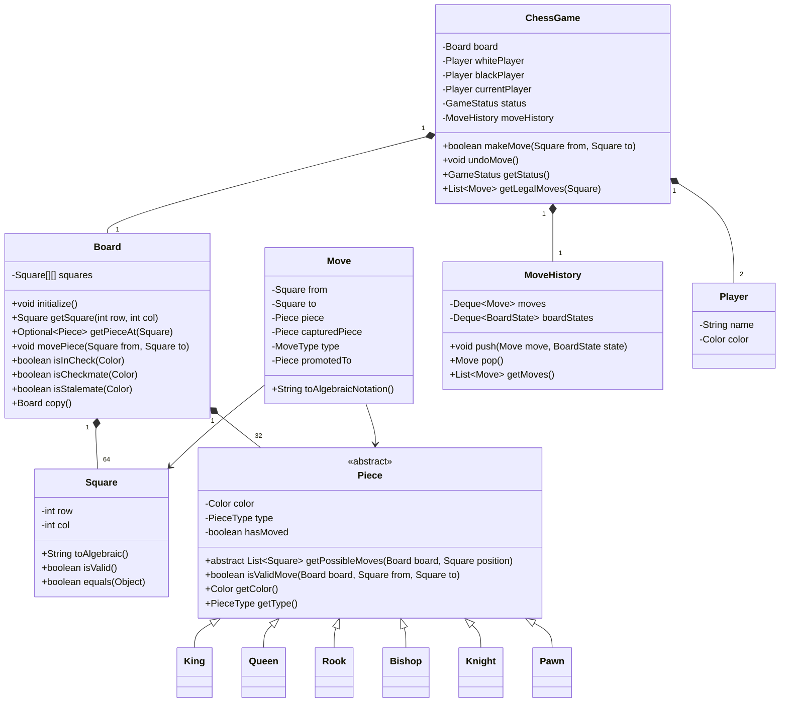

# LLD: Chess

## 1. Requirements

### Functional
- Standard 8×8 board with all chess pieces (King, Queen, Rook, Bishop, Knight, Pawn)
- Two players (White and Black); White moves first
- Validate all legal moves including special moves: castling, en passant, pawn promotion
- Detect check, checkmate, and stalemate
- Turn management: alternating between players
- Move history with algebraic notation
- Undo last move (for practice mode)
- Game states: ACTIVE, CHECK, CHECKMATE, STALEMATE, DRAW, RESIGNED

### Non-Functional
- Move validation must be fast (microseconds per move)
- Board state must be immutable during validation
- Extensible: add Chess960, blindfold mode

### Out of Scope
- AI opponent, online multiplayer, timer/clock

---

## 2. Core Entities

`ChessGame`, `Board`, `Square`, `Piece`, `Move`, `Player`, `MoveHistory`, `GameStatus`

---

## 3. Class Diagram



---

## 4. Design Patterns

| Pattern | Where Applied | Why |
|---------|--------------|-----|
| **Strategy** | `Piece.getPossibleMoves()` | Each piece type has its own movement algorithm |
| **Command** | `Move` | Encapsulates a move; supports undo via stored board state |
| **Memento** | `BoardState` | Snapshot board before each move for undo |
| **State** | `ChessGame.status` | ACTIVE → CHECK → CHECKMATE/STALEMATE |
| **Composite** | Board aggregating all pieces | Board provides uniform API over all squares/pieces |

---

## 5. Java Implementation

```java
// ─── Enums ──────────────────────────────────────────────────────────────────

public enum Color { WHITE, BLACK;
    public Color opposite() { return this == WHITE ? BLACK : WHITE; }
}
public enum PieceType { KING, QUEEN, ROOK, BISHOP, KNIGHT, PAWN }
public enum MoveType { NORMAL, CAPTURE, CASTLING_KINGSIDE, CASTLING_QUEENSIDE,
                       EN_PASSANT, PAWN_PROMOTION, PAWN_DOUBLE_ADVANCE }
public enum GameStatus { ACTIVE, CHECK, CHECKMATE, STALEMATE, DRAW, RESIGNED }

// ─── Square ───────────────────────────────────────────────────────────────────

public class Square {
    public final int row; // 0-7 (rank 1-8)
    public final int col; // 0-7 (file a-h)

    public Square(int row, int col) {
        this.row = row;
        this.col = col;
    }

    public boolean isValid() {
        return row >= 0 && row < 8 && col >= 0 && col < 8;
    }

    public Square offset(int dr, int dc) {
        return new Square(row + dr, col + dc);
    }

    public String toAlgebraic() {
        return String.valueOf((char)('a' + col)) + (row + 1);
    }

    @Override
    public boolean equals(Object o) {
        if (!(o instanceof Square)) return false;
        Square s = (Square) o;
        return row == s.row && col == s.col;
    }

    @Override
    public int hashCode() { return Objects.hash(row, col); }

    @Override
    public String toString() { return toAlgebraic(); }
}

// ─── Piece Hierarchy ─────────────────────────────────────────────────────────

public abstract class Piece {
    protected final Color color;
    protected final PieceType type;
    protected boolean hasMoved;

    protected Piece(Color color, PieceType type) {
        this.color = color;
        this.type = type;
    }

    public abstract List<Square> getPossibleMoves(Board board, Square position);

    public boolean isValidMove(Board board, Square from, Square to) {
        if (!to.isValid()) return false;
        Optional<Piece> target = board.getPieceAt(to);
        if (target.isPresent() && target.get().getColor() == this.color) return false;
        if (!getPossibleMoves(board, from).contains(to)) return false;

        // Check: move must not leave own king in check
        Board simulated = board.copy();
        simulated.movePiece(from, to);
        return !simulated.isInCheck(this.color);
    }

    protected List<Square> getSlidingMoves(Board board, Square pos, int[][] directions) {
        List<Square> moves = new ArrayList<>();
        for (int[] dir : directions) {
            Square current = pos.offset(dir[0], dir[1]);
            while (current.isValid()) {
                Optional<Piece> occupant = board.getPieceAt(current);
                if (occupant.isPresent()) {
                    if (occupant.get().getColor() != this.color) {
                        moves.add(current); // capture
                    }
                    break; // blocked
                }
                moves.add(current);
                current = current.offset(dir[0], dir[1]);
            }
        }
        return moves;
    }

    public Color getColor() { return color; }
    public PieceType getType() { return type; }
    public boolean hasMoved() { return hasMoved; }
    public void setHasMoved(boolean moved) { this.hasMoved = moved; }
    public abstract Piece copy();
}

public class Rook extends Piece {
    public Rook(Color color) { super(color, PieceType.ROOK); }

    @Override
    public List<Square> getPossibleMoves(Board board, Square position) {
        int[][] directions = {{1,0},{-1,0},{0,1},{0,-1}};
        return getSlidingMoves(board, position, directions);
    }

    @Override
    public Piece copy() {
        Rook copy = new Rook(color);
        copy.hasMoved = this.hasMoved;
        return copy;
    }
}

public class Bishop extends Piece {
    public Bishop(Color color) { super(color, PieceType.BISHOP); }

    @Override
    public List<Square> getPossibleMoves(Board board, Square position) {
        int[][] directions = {{1,1},{1,-1},{-1,1},{-1,-1}};
        return getSlidingMoves(board, position, directions);
    }

    @Override
    public Piece copy() { Bishop copy = new Bishop(color); copy.hasMoved = hasMoved; return copy; }
}

public class Queen extends Piece {
    public Queen(Color color) { super(color, PieceType.QUEEN); }

    @Override
    public List<Square> getPossibleMoves(Board board, Square position) {
        int[][] directions = {{1,0},{-1,0},{0,1},{0,-1},{1,1},{1,-1},{-1,1},{-1,-1}};
        return getSlidingMoves(board, position, directions);
    }

    @Override
    public Piece copy() { Queen copy = new Queen(color); copy.hasMoved = hasMoved; return copy; }
}

public class Knight extends Piece {
    public Knight(Color color) { super(color, PieceType.KNIGHT); }

    @Override
    public List<Square> getPossibleMoves(Board board, Square position) {
        int[][] offsets = {{2,1},{2,-1},{-2,1},{-2,-1},{1,2},{1,-2},{-1,2},{-1,-2}};
        List<Square> moves = new ArrayList<>();
        for (int[] off : offsets) {
            Square target = position.offset(off[0], off[1]);
            if (target.isValid()) {
                Optional<Piece> occupant = board.getPieceAt(target);
                if (occupant.isEmpty() || occupant.get().getColor() != this.color) {
                    moves.add(target);
                }
            }
        }
        return moves;
    }

    @Override
    public Piece copy() { Knight copy = new Knight(color); copy.hasMoved = hasMoved; return copy; }
}

public class King extends Piece {
    public King(Color color) { super(color, PieceType.KING); }

    @Override
    public List<Square> getPossibleMoves(Board board, Square position) {
        List<Square> moves = new ArrayList<>();
        for (int dr = -1; dr <= 1; dr++) {
            for (int dc = -1; dc <= 1; dc++) {
                if (dr == 0 && dc == 0) continue;
                Square target = position.offset(dr, dc);
                if (target.isValid()) {
                    Optional<Piece> occupant = board.getPieceAt(target);
                    if (occupant.isEmpty() || occupant.get().getColor() != color) {
                        moves.add(target);
                    }
                }
            }
        }
        // Castling
        if (!hasMoved && !board.isInCheck(color)) {
            addCastlingMoves(board, position, moves);
        }
        return moves;
    }

    private void addCastlingMoves(Board board, Square kingPos, List<Square> moves) {
        // Kingside castling
        Square rookPos = new Square(kingPos.row, 7);
        Optional<Piece> rook = board.getPieceAt(rookPos);
        if (rook.isPresent() && rook.get().getType() == PieceType.ROOK && !rook.get().hasMoved()) {
            // Check squares between king and rook are empty
            if (board.getPieceAt(new Square(kingPos.row, 5)).isEmpty() &&
                board.getPieceAt(new Square(kingPos.row, 6)).isEmpty()) {
                moves.add(new Square(kingPos.row, 6)); // King moves to g-file
            }
        }
        // Queenside castling
        Square qRookPos = new Square(kingPos.row, 0);
        Optional<Piece> qRook = board.getPieceAt(qRookPos);
        if (qRook.isPresent() && qRook.get().getType() == PieceType.ROOK && !qRook.get().hasMoved()) {
            if (board.getPieceAt(new Square(kingPos.row, 1)).isEmpty() &&
                board.getPieceAt(new Square(kingPos.row, 2)).isEmpty() &&
                board.getPieceAt(new Square(kingPos.row, 3)).isEmpty()) {
                moves.add(new Square(kingPos.row, 2)); // King moves to c-file
            }
        }
    }

    @Override
    public Piece copy() { King copy = new King(color); copy.hasMoved = hasMoved; return copy; }
}

public class Pawn extends Piece {
    private Square enPassantTarget; // set by game after double advance

    public Pawn(Color color) { super(color, PieceType.PAWN); }

    @Override
    public List<Square> getPossibleMoves(Board board, Square position) {
        List<Square> moves = new ArrayList<>();
        int direction = (color == Color.WHITE) ? 1 : -1;
        int startRow = (color == Color.WHITE) ? 1 : 6;

        // Forward move
        Square oneAhead = position.offset(direction, 0);
        if (oneAhead.isValid() && board.getPieceAt(oneAhead).isEmpty()) {
            moves.add(oneAhead);
            // Double advance from starting position
            Square twoAhead = position.offset(direction * 2, 0);
            if (position.row == startRow && board.getPieceAt(twoAhead).isEmpty()) {
                moves.add(twoAhead);
            }
        }

        // Diagonal captures
        for (int dc : new int[]{-1, 1}) {
            Square diag = position.offset(direction, dc);
            if (diag.isValid()) {
                Optional<Piece> target = board.getPieceAt(diag);
                if (target.isPresent() && target.get().getColor() != color) {
                    moves.add(diag);
                }
                // En passant
                if (diag.equals(board.getEnPassantTarget())) {
                    moves.add(diag);
                }
            }
        }
        return moves;
    }

    public boolean isPromotionMove(Square to) {
        return (color == Color.WHITE && to.row == 7) ||
               (color == Color.BLACK && to.row == 0);
    }

    @Override
    public Piece copy() { Pawn copy = new Pawn(color); copy.hasMoved = hasMoved; return copy; }
}

// ─── Board ────────────────────────────────────────────────────────────────────

public class Board {
    private final Piece[][] grid = new Piece[8][8];
    private Square enPassantTarget;

    public void initialize() {
        // Place pawns
        for (int col = 0; col < 8; col++) {
            grid[1][col] = new Pawn(Color.WHITE);
            grid[6][col] = new Pawn(Color.BLACK);
        }
        // Place back ranks
        PieceType[] backRank = {PieceType.ROOK, PieceType.KNIGHT, PieceType.BISHOP,
                                 PieceType.QUEEN, PieceType.KING, PieceType.BISHOP,
                                 PieceType.KNIGHT, PieceType.ROOK};
        for (int col = 0; col < 8; col++) {
            grid[0][col] = createPiece(Color.WHITE, backRank[col]);
            grid[7][col] = createPiece(Color.BLACK, backRank[col]);
        }
    }

    private Piece createPiece(Color color, PieceType type) {
        return switch (type) {
            case ROOK -> new Rook(color);
            case KNIGHT -> new Knight(color);
            case BISHOP -> new Bishop(color);
            case QUEEN -> new Queen(color);
            case KING -> new King(color);
            case PAWN -> new Pawn(color);
        };
    }

    public Optional<Piece> getPieceAt(Square s) {
        if (!s.isValid()) return Optional.empty();
        return Optional.ofNullable(grid[s.row][s.col]);
    }

    public void movePiece(Square from, Square to) {
        Piece piece = grid[from.row][from.col];
        grid[to.row][to.col] = piece;
        grid[from.row][from.col] = null;
        if (piece != null) piece.setHasMoved(true);
    }

    public Square findKing(Color color) {
        for (int r = 0; r < 8; r++) {
            for (int c = 0; c < 8; c++) {
                Piece p = grid[r][c];
                if (p != null && p.getType() == PieceType.KING && p.getColor() == color) {
                    return new Square(r, c);
                }
            }
        }
        throw new IllegalStateException("King not found for color " + color);
    }

    public boolean isInCheck(Color color) {
        Square kingPos = findKing(color);
        Color opponent = color.opposite();
        for (int r = 0; r < 8; r++) {
            for (int c = 0; c < 8; c++) {
                Piece p = grid[r][c];
                if (p != null && p.getColor() == opponent) {
                    if (p.getPossibleMoves(this, new Square(r, c)).contains(kingPos)) {
                        return true;
                    }
                }
            }
        }
        return false;
    }

    public boolean isCheckmate(Color color) {
        if (!isInCheck(color)) return false;
        return getAllLegalMoves(color).isEmpty();
    }

    public boolean isStalemate(Color color) {
        if (isInCheck(color)) return false;
        return getAllLegalMoves(color).isEmpty();
    }

    private List<Move> getAllLegalMoves(Color color) {
        List<Move> legalMoves = new ArrayList<>();
        for (int r = 0; r < 8; r++) {
            for (int c = 0; c < 8; c++) {
                Piece p = grid[r][c];
                if (p != null && p.getColor() == color) {
                    Square from = new Square(r, c);
                    for (Square to : p.getPossibleMoves(this, from)) {
                        Board simulated = this.copy();
                        simulated.movePiece(from, to);
                        if (!simulated.isInCheck(color)) {
                            legalMoves.add(new Move(from, to, p, getPieceAt(to).orElse(null)));
                        }
                    }
                }
            }
        }
        return legalMoves;
    }

    public Board copy() {
        Board copy = new Board();
        for (int r = 0; r < 8; r++) {
            for (int c = 0; c < 8; c++) {
                copy.grid[r][c] = grid[r][c] != null ? grid[r][c].copy() : null;
            }
        }
        copy.enPassantTarget = this.enPassantTarget;
        return copy;
    }

    public Square getEnPassantTarget() { return enPassantTarget; }
    public void setEnPassantTarget(Square target) { this.enPassantTarget = target; }
}

// ─── Chess Game ───────────────────────────────────────────────────────────────

public class ChessGame {
    private final Board board;
    private final Player whitePlayer;
    private final Player blackPlayer;
    private Player currentPlayer;
    private GameStatus status;
    private final Deque<Move> moveHistory = new ArrayDeque<>();
    private final Deque<Piece[][]> boardHistory = new ArrayDeque<>();

    public ChessGame(Player white, Player black) {
        this.whitePlayer = white;
        this.blackPlayer = black;
        this.board = new Board();
        this.board.initialize();
        this.currentPlayer = white;
        this.status = GameStatus.ACTIVE;
    }

    public boolean makeMove(Square from, Square to, PieceType promotionChoice) {
        if (status == GameStatus.CHECKMATE || status == GameStatus.STALEMATE) {
            throw new GameOverException("Game is over");
        }

        Optional<Piece> pieceOpt = board.getPieceAt(from);
        if (pieceOpt.isEmpty()) throw new IllegalMoveException("No piece at " + from);

        Piece piece = pieceOpt.get();
        if (piece.getColor() != currentPlayer.getColor()) {
            throw new IllegalMoveException("Not your piece");
        }

        if (!piece.isValidMove(board, from, to)) {
            throw new IllegalMoveException("Illegal move: " + from + " -> " + to);
        }

        // Save board state for undo
        boardHistory.push(captureBoard());

        Piece captured = board.getPieceAt(to).orElse(null);
        board.movePiece(from, to);

        // Handle pawn promotion
        if (piece.getType() == PieceType.PAWN && ((Pawn) piece).isPromotionMove(to)) {
            // Default to Queen if no choice given
        }

        // Update en passant target
        if (piece.getType() == PieceType.PAWN && Math.abs(to.row - from.row) == 2) {
            board.setEnPassantTarget(from.offset((to.row - from.row) / 2, 0));
        } else {
            board.setEnPassantTarget(null);
        }

        Move move = new Move(from, to, piece, captured, MoveType.NORMAL);
        moveHistory.push(move);

        // Switch player
        currentPlayer = (currentPlayer == whitePlayer) ? blackPlayer : whitePlayer;

        // Update game status
        updateStatus();
        return true;
    }

    private void updateStatus() {
        Color nextColor = currentPlayer.getColor();
        if (board.isCheckmate(nextColor)) {
            status = GameStatus.CHECKMATE;
        } else if (board.isStalemate(nextColor)) {
            status = GameStatus.STALEMATE;
        } else if (board.isInCheck(nextColor)) {
            status = GameStatus.CHECK;
        } else {
            status = GameStatus.ACTIVE;
        }
    }

    public void undoMove() {
        if (moveHistory.isEmpty()) throw new IllegalStateException("No moves to undo");
        moveHistory.pop();
        // Restore board state (full Memento restore)
        Piece[][] savedState = boardHistory.pop();
        // Apply savedState back to board
        currentPlayer = (currentPlayer == whitePlayer) ? blackPlayer : whitePlayer;
        updateStatus();
    }

    private Piece[][] captureBoard() {
        // Deep copy of board state
        Piece[][] snapshot = new Piece[8][8];
        // (implementation stores board grid copy)
        return snapshot;
    }

    public GameStatus getStatus() { return status; }
    public Player getCurrentPlayer() { return currentPlayer; }
}
```

---

## 6. SOLID Analysis

| Principle | Assessment |
|-----------|-----------|
| **SRP** | Each `Piece` subclass owns its movement logic; `Board` manages spatial state; `ChessGame` manages game rules |
| **OCP** | New piece variant (e.g., Fairy chess Archbishop) extends `Piece` — no board changes |
| **LSP** | All `Piece` subtypes fulfill the `getPossibleMoves()` + `isValidMove()` contract |
| **ISP** | `Piece` interface is cohesive — every method is needed for every piece |
| **DIP** | `ChessGame` depends on `Board` and `Piece` abstractions, not concrete pieces |

---

## 7. Key Algorithms

- **Check detection**: For each opponent piece, check if its `getPossibleMoves()` includes the king's square
- **Legal move generation**: Simulate move on a board copy, then verify king is not in check
- **Castling validity**: King hasn't moved + Rook hasn't moved + squares between are empty + king doesn't pass through check
- **En passant**: Triggered only on the very next move after a pawn double-advance

---

## 8. FAANG Interview Tips

- **Start with the board and pieces**: Define `Board`, `Square`, `Piece` hierarchy before anything else
- **Check validation is the key challenge**: Naive approach (simulate every move) is O(n²) but acceptable for chess
- **Special moves are your differentiator**: Mention castling, en passant, and pawn promotion even if you don't implement them — shows domain knowledge
- **Memento for undo**: Classic application — interviewers love it
- **Follow-up: AI opponent?** → Minimax with alpha-beta pruning; position evaluation function → separate `AIStrategy` implementing `MoveSelectionStrategy`
