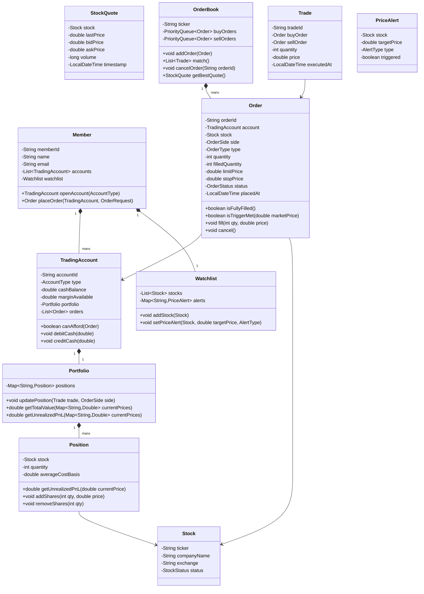

# LLD: Online Stock Brokerage System

## 1. Requirements

### Functional
- Members can create trading accounts and manage portfolio
- Search stocks by ticker symbol; view real-time quotes
- Place orders: Market, Limit, Stop-Loss, Stop-Limit
- Order lifecycle: placed → pending → partially filled → filled → cancelled
- Support Buy and Sell sides
- Portfolio tracking: current positions, P&L, transaction history
- Watchlist management
- Notifications on order execution, price alerts
- Multiple account types: Cash, Margin

### Non-Functional
- Order matching must be thread-safe (no duplicate fills)
- Price feed updates in real-time
- Audit trail for all orders (regulatory requirement)
- Extensible order types

### Out of Scope
- Actual exchange connectivity, FIX protocol, clearing/settlement

---

## 2. Core Entities

`Member`, `TradingAccount`, `Stock`, `StockQuote`, `Order`, `OrderBook`, `Trade`, `Portfolio`, `Position`, `Watchlist`

---

## 3. Class Diagram



---

## 4. Design Patterns

| Pattern | Where Applied | Why |
|---------|--------------|-----|
| **Strategy** | `OrderMatchingStrategy` | Price-time priority vs. pro-rata matching |
| **Observer** | `PriceAlertNotifier`, `OrderStatusNotifier` | Decouple order fills from notifications |
| **Command** | `Order` | Encapsulates order request; supports cancel |
| **Factory** | `OrderFactory` | Creates Market/Limit/Stop orders without exposing constructors |
| **State** | `Order.status` | PENDING → PARTIALLY_FILLED → FILLED / CANCELLED |

---

## 5. Java Implementation

```java
// ─── Enums ──────────────────────────────────────────────────────────────────

public enum OrderSide { BUY, SELL }
public enum OrderType { MARKET, LIMIT, STOP_LOSS, STOP_LIMIT }
public enum OrderStatus { PENDING, PARTIALLY_FILLED, FILLED, CANCELLED, REJECTED }
public enum AccountType { CASH, MARGIN }
public enum AlertType { ABOVE, BELOW }

// ─── Stock & Quote ────────────────────────────────────────────────────────────

public class Stock {
    private final String ticker;
    private final String companyName;
    private final String exchange;

    public Stock(String ticker, String companyName, String exchange) {
        this.ticker = ticker;
        this.companyName = companyName;
        this.exchange = exchange;
    }

    public String getTicker() { return ticker; }
}

public class StockQuote {
    private final Stock stock;
    private volatile double lastPrice;
    private volatile double bidPrice;
    private volatile double askPrice;
    private volatile long volume;
    private volatile LocalDateTime timestamp;

    public StockQuote(Stock stock, double lastPrice) {
        this.stock = stock;
        this.lastPrice = lastPrice;
        this.timestamp = LocalDateTime.now();
    }

    public void update(double last, double bid, double ask, long vol) {
        this.lastPrice = last;
        this.bidPrice = bid;
        this.askPrice = ask;
        this.volume = vol;
        this.timestamp = LocalDateTime.now();
    }

    public double getLastPrice() { return lastPrice; }
    public Stock getStock() { return stock; }
}

// ─── Order ────────────────────────────────────────────────────────────────────

public class Order {
    private final String orderId;
    private final TradingAccount account;
    private final Stock stock;
    private final OrderSide side;
    private final OrderType type;
    private final int quantity;
    private int filledQuantity;
    private final double limitPrice;  // 0 for MARKET
    private final double stopPrice;   // 0 for non-stop
    private volatile OrderStatus status;
    private final LocalDateTime placedAt;
    private final List<Trade> executions = new ArrayList<>();

    private Order(Builder builder) {
        this.orderId = UUID.randomUUID().toString();
        this.account = builder.account;
        this.stock = builder.stock;
        this.side = builder.side;
        this.type = builder.type;
        this.quantity = builder.quantity;
        this.limitPrice = builder.limitPrice;
        this.stopPrice = builder.stopPrice;
        this.status = OrderStatus.PENDING;
        this.placedAt = LocalDateTime.now();
    }

    public synchronized void fill(int qty, double price) {
        if (status == OrderStatus.CANCELLED) throw new IllegalStateException("Cannot fill cancelled order");
        filledQuantity += qty;
        if (filledQuantity >= quantity) {
            status = OrderStatus.FILLED;
        } else {
            status = OrderStatus.PARTIALLY_FILLED;
        }
    }

    public synchronized void cancel() {
        if (status == OrderStatus.FILLED) throw new IllegalStateException("Cannot cancel filled order");
        status = OrderStatus.CANCELLED;
    }

    public boolean isFullyFilled() { return filledQuantity >= quantity; }
    public int getRemainingQuantity() { return quantity - filledQuantity; }

    public boolean isTriggerMet(double marketPrice) {
        return switch (type) {
            case MARKET -> true;
            case LIMIT -> side == OrderSide.BUY ? marketPrice <= limitPrice : marketPrice >= limitPrice;
            case STOP_LOSS -> side == OrderSide.BUY ? marketPrice >= stopPrice : marketPrice <= stopPrice;
            case STOP_LIMIT -> side == OrderSide.BUY
                ? marketPrice >= stopPrice && marketPrice <= limitPrice
                : marketPrice <= stopPrice && marketPrice >= limitPrice;
        };
    }

    public String getOrderId() { return orderId; }
    public OrderSide getSide() { return side; }
    public OrderType getType() { return type; }
    public double getLimitPrice() { return limitPrice; }
    public int getQuantity() { return quantity; }
    public OrderStatus getStatus() { return status; }
    public Stock getStock() { return stock; }
    public TradingAccount getAccount() { return account; }

    // Builder
    public static class Builder {
        private TradingAccount account;
        private Stock stock;
        private OrderSide side;
        private OrderType type = OrderType.MARKET;
        private int quantity;
        private double limitPrice;
        private double stopPrice;

        public Builder account(TradingAccount a) { this.account = a; return this; }
        public Builder stock(Stock s) { this.stock = s; return this; }
        public Builder side(OrderSide s) { this.side = s; return this; }
        public Builder type(OrderType t) { this.type = t; return this; }
        public Builder quantity(int q) { this.quantity = q; return this; }
        public Builder limitPrice(double p) { this.limitPrice = p; return this; }
        public Builder stopPrice(double p) { this.stopPrice = p; return this; }
        public Order build() {
            if (account == null || stock == null || side == null || quantity <= 0) {
                throw new IllegalArgumentException("Missing required order fields");
            }
            return new Order(this);
        }
    }
}

// ─── Order Book (Price-Time Priority) ────────────────────────────────────────

public class OrderBook {
    private final String ticker;
    // Buy orders: highest price first (bids)
    private final PriorityQueue<Order> buyOrders = new PriorityQueue<>(
        Comparator.comparingDouble(Order::getLimitPrice).reversed()
            .thenComparing(Order::getOrderId) // time priority by UUID order
    );
    // Sell orders: lowest price first (asks)
    private final PriorityQueue<Order> sellOrders = new PriorityQueue<>(
        Comparator.comparingDouble(Order::getLimitPrice)
            .thenComparing(Order::getOrderId)
    );
    private final List<OrderBookListener> listeners = new ArrayList<>();

    public OrderBook(String ticker) { this.ticker = ticker; }

    public synchronized void addOrder(Order order) {
        if (order.getSide() == OrderSide.BUY) {
            buyOrders.offer(order);
        } else {
            sellOrders.offer(order);
        }
        List<Trade> trades = match();
        trades.forEach(t -> listeners.forEach(l -> l.onTrade(t)));
    }

    public synchronized List<Trade> match() {
        List<Trade> trades = new ArrayList<>();
        while (!buyOrders.isEmpty() && !sellOrders.isEmpty()) {
            Order best_buy = buyOrders.peek();
            Order best_sell = sellOrders.peek();

            // For market orders or when buy >= sell price
            boolean canMatch = (best_buy.getType() == OrderType.MARKET ||
                                best_sell.getType() == OrderType.MARKET ||
                                best_buy.getLimitPrice() >= best_sell.getLimitPrice());

            if (!canMatch) break;

            // Execution price: seller's price (or midpoint in practice)
            double execPrice = best_sell.getType() == OrderType.MARKET
                ? best_buy.getLimitPrice()
                : best_sell.getLimitPrice();

            int execQty = Math.min(best_buy.getRemainingQuantity(), best_sell.getRemainingQuantity());

            best_buy.fill(execQty, execPrice);
            best_sell.fill(execQty, execPrice);

            Trade trade = new Trade(best_buy, best_sell, execQty, execPrice);
            trades.add(trade);

            if (best_buy.isFullyFilled()) buyOrders.poll();
            if (best_sell.isFullyFilled()) sellOrders.poll();
        }
        return trades;
    }

    public synchronized void cancelOrder(String orderId) {
        buyOrders.removeIf(o -> o.getOrderId().equals(orderId) && o.cancel() == null);
        sellOrders.removeIf(o -> o.getOrderId().equals(orderId) && o.cancel() == null);
    }

    public void addListener(OrderBookListener listener) { listeners.add(listener); }
}

// ─── Trade ────────────────────────────────────────────────────────────────────

public class Trade {
    private final String tradeId;
    private final Order buyOrder;
    private final Order sellOrder;
    private final int quantity;
    private final double price;
    private final LocalDateTime executedAt;

    public Trade(Order buyOrder, Order sellOrder, int quantity, double price) {
        this.tradeId = UUID.randomUUID().toString();
        this.buyOrder = buyOrder;
        this.sellOrder = sellOrder;
        this.quantity = quantity;
        this.price = price;
        this.executedAt = LocalDateTime.now();
    }

    public Order getBuyOrder() { return buyOrder; }
    public Order getSellOrder() { return sellOrder; }
    public int getQuantity() { return quantity; }
    public double getPrice() { return price; }
}

// ─── Portfolio / Position ─────────────────────────────────────────────────────

public class Position {
    private final Stock stock;
    private int quantity;
    private double totalCostBasis;

    public Position(Stock stock) {
        this.stock = stock;
    }

    public void addShares(int qty, double price) {
        totalCostBasis += qty * price;
        quantity += qty;
    }

    public void removeShares(int qty) {
        if (qty > quantity) throw new IllegalArgumentException("Cannot sell more than owned");
        double avgCost = getAverageCostBasis();
        totalCostBasis -= qty * avgCost;
        quantity -= qty;
    }

    public double getAverageCostBasis() {
        return quantity == 0 ? 0 : totalCostBasis / quantity;
    }

    public double getUnrealizedPnL(double currentPrice) {
        return (currentPrice - getAverageCostBasis()) * quantity;
    }

    public int getQuantity() { return quantity; }
    public Stock getStock() { return stock; }
}

public class Portfolio {
    private final Map<String, Position> positions = new ConcurrentHashMap<>();

    public void updatePosition(Trade trade, OrderSide side, TradingAccount account) {
        String ticker = trade.getBuyOrder().getStock().getTicker();
        positions.computeIfAbsent(ticker, k -> new Position(trade.getBuyOrder().getStock()));
        Position pos = positions.get(ticker);

        if (side == OrderSide.BUY) {
            pos.addShares(trade.getQuantity(), trade.getPrice());
            account.debitCash(trade.getQuantity() * trade.getPrice());
        } else {
            pos.removeShares(trade.getQuantity());
            account.creditCash(trade.getQuantity() * trade.getPrice());
        }
    }

    public double getTotalValue(Map<String, Double> currentPrices) {
        return positions.values().stream()
            .filter(p -> p.getQuantity() > 0)
            .mapToDouble(p -> p.getQuantity() * currentPrices.getOrDefault(p.getStock().getTicker(), 0.0))
            .sum();
    }

    public Map<String, Position> getPositions() { return Collections.unmodifiableMap(positions); }
}

// ─── Observer: Price Alert ────────────────────────────────────────────────────

public interface OrderBookListener {
    void onTrade(Trade trade);
}

public class PriceAlertService implements OrderBookListener {
    private final Map<String, List<PriceAlert>> alerts = new ConcurrentHashMap<>();

    @Override
    public void onTrade(Trade trade) {
        double price = trade.getPrice();
        String ticker = trade.getBuyOrder().getStock().getTicker();
        List<PriceAlert> stockAlerts = alerts.getOrDefault(ticker, Collections.emptyList());
        stockAlerts.stream()
            .filter(a -> !a.isTriggered() && a.isConditionMet(price))
            .forEach(a -> {
                a.trigger();
                notifyMember(a, price);
            });
    }

    private void notifyMember(PriceAlert alert, double price) {
        System.out.printf("ALERT: %s hit target price %.2f (current: %.2f)%n",
            alert.getStock().getTicker(), alert.getTargetPrice(), price);
    }
}
```

---

## 6. SOLID Analysis

| Principle | Assessment |
|-----------|-----------|
| **SRP** | `OrderBook` matches orders; `Portfolio` tracks positions; `Trade` records executions |
| **OCP** | New order type implements `isTriggerMet()` extension; new matching strategy via `OrderMatchingStrategy` |
| **LSP** | All `Order` types fulfill the same `fill()`/`cancel()` contract |
| **ISP** | `OrderBookListener` is minimal; `PriceAlertService` only implements what it needs |
| **DIP** | `OrderBook` fires events through `OrderBookListener` interface |

---

## 7. Concurrency

- `OrderBook.addOrder()` and `match()` are `synchronized` — order matching is single-threaded per stock
- `Order.fill()` is `synchronized` — prevents double-fill on partial fills
- `Portfolio` uses `ConcurrentHashMap` — concurrent position updates
- At scale: one `OrderBook` instance per stock; shard by ticker; use actor model (Akka) per book

---

## 8. Extensibility

| Future Requirement | How to Add |
|--------------------|-----------|
| Options/futures | `OptionsContract extends Stock`; new order type |
| Pre/after-hours trading | `TradingSession` with `isActive()` check in `OrderBook` |
| Short selling | `Position.quantity` can be negative; margin check in `TradingAccount` |
| Tax lot selection | `TaxLotStrategy` (FIFO, LIFO, SpecificLot) on `Position.removeShares()` |

---

## 9. FAANG Interview Tips

- **Order matching is the core**: Draw the price-time priority queue structure — highest bid vs. lowest ask
- **Order types are nuanced**: STOP vs. LIMIT vs. STOP_LIMIT — show you know the difference
- **Partial fills**: Most candidates forget to handle `PARTIALLY_FILLED` status — show it
- **Concurrent order book**: The `synchronized` on `match()` is simple but correct; mention actor model for scale
- **Follow-up: NYSE scale (10M orders/day)?** → One order book process per stock; LMAX Disruptor ring buffer for lock-free order processing; event sourcing for audit trail
