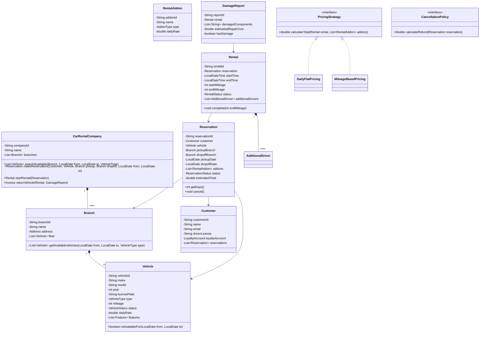

# LLD: Car Rental System

## 1. Requirements

### Functional
- Search available vehicles at a branch by dates, vehicle type, and features
- Reserve / rent / return a vehicle
- Vehicle types: Economy, Compact, SUV, Luxury, Van, Truck
- Pricing: base rate + optional add-ons (GPS, child seat, insurance)
- Damage assessment at return
- Multiple pickup/drop-off locations (one-way rental)
- Member loyalty program: points per rental
- Cancel reservation with penalty policy

### Non-Functional
- No double-booking of same vehicle for overlapping dates
- Extensible pricing: mileage-based, time-based, daily flat
- Audit trail for all rental transactions

### Out of Scope
- Vehicle maintenance scheduling, driver's license validation API

---

## 2. Core Entities

`CarRentalCompany`, `Branch`, `Vehicle`, `Reservation`, `Rental`, `Customer`, `Payment`, `AdditionalDriver`, `RentalAddon`, `DamageReport`

---

## 3. Class Diagram



---

## 4. Design Patterns

| Pattern | Where Applied | Why |
|---------|--------------|-----|
| **Strategy** | `PricingStrategy`, `CancellationPolicy` | Configurable pricing and refund rules |
| **Decorator** | `AddonPricingDecorator` | Stack add-on costs on top of base vehicle price |
| **Factory** | `VehicleFactory` | Create vehicle with correct features per type |
| **Observer** | `LoyaltyPointsService` | Earn points on rental completion |
| **Builder** | `ReservationBuilder` | Complex reservation construction with optional addons |

---

## 5. Java Implementation

```java
// ─── Enums ──────────────────────────────────────────────────────────────────

public enum VehicleType { ECONOMY, COMPACT, MID_SIZE, SUV, LUXURY, VAN, TRUCK }
public enum VehicleStatus { AVAILABLE, RENTED, RESERVED, MAINTENANCE }
public enum ReservationStatus { PENDING, CONFIRMED, ACTIVE, COMPLETED, CANCELLED }
public enum RentalStatus { ACTIVE, COMPLETED, LATE_RETURN }
public enum AddonType { GPS, CHILD_SEAT, INSURANCE_BASIC, INSURANCE_COMPREHENSIVE, ROADSIDE_ASSISTANCE }

// ─── Vehicle ──────────────────────────────────────────────────────────────────

public class Vehicle {
    private final String vehicleId;
    private final String make;
    private final String model;
    private final int year;
    private final String licensePlate;
    private final VehicleType type;
    private int mileage;
    private volatile VehicleStatus status;
    private double dailyRate;

    public Vehicle(String vehicleId, String make, String model, int year,
                   String plate, VehicleType type, double dailyRate) {
        this.vehicleId = vehicleId;
        this.make = make;
        this.model = model;
        this.year = year;
        this.licensePlate = plate;
        this.type = type;
        this.dailyRate = dailyRate;
        this.status = VehicleStatus.AVAILABLE;
    }

    public boolean isAvailable() { return status == VehicleStatus.AVAILABLE; }
    public void reserve() { status = VehicleStatus.RESERVED; }
    public void rent() { status = VehicleStatus.RENTED; }
    public void returnToFleet() { status = VehicleStatus.AVAILABLE; }

    public String getVehicleId() { return vehicleId; }
    public VehicleType getType() { return type; }
    public double getDailyRate() { return dailyRate; }
    public int getMileage() { return mileage; }
    public void updateMileage(int newMileage) { this.mileage = newMileage; }
    public String getLicensePlate() { return licensePlate; }
}

// ─── Rental Addon ─────────────────────────────────────────────────────────────

public class RentalAddon {
    private final String addonId;
    private final String name;
    private final AddonType type;
    private final double dailyRate;

    public RentalAddon(String addonId, String name, AddonType type, double dailyRate) {
        this.addonId = addonId;
        this.name = name;
        this.type = type;
        this.dailyRate = dailyRate;
    }

    public double getDailyRate() { return dailyRate; }
    public AddonType getType() { return type; }
    public String getName() { return name; }
}

// ─── Pricing Strategy ─────────────────────────────────────────────────────────

public interface PricingStrategy {
    double calculateTotal(Reservation reservation, List<RentalAddon> addons);
}

public class DailyFlatPricing implements PricingStrategy {
    @Override
    public double calculateTotal(Reservation reservation, List<RentalAddon> addons) {
        int days = reservation.getDays();
        double vehicleRate = reservation.getVehicle().getDailyRate() * days;
        double addonRate = addons.stream().mapToDouble(a -> a.getDailyRate() * days).sum();
        return vehicleRate + addonRate;
    }
}

public class MileageBasedPricing implements PricingStrategy {
    private final double ratePerMile;

    public MileageBasedPricing(double ratePerMile) { this.ratePerMile = ratePerMile; }

    @Override
    public double calculateTotal(Reservation reservation, List<RentalAddon> addons) {
        // Base: daily rate + per-mile charge (calculated at return)
        int days = reservation.getDays();
        return reservation.getVehicle().getDailyRate() * days;
        // Mileage surcharge applied at rental completion
    }

    public double calculateMileageSurcharge(int milesdriven) {
        return milesdriven * ratePerMile;
    }
}

// ─── Loyalty Account ─────────────────────────────────────────────────────────

public class LoyaltyAccount {
    private int points;
    private LoyaltyTier tier;

    public void addPoints(int points) {
        this.points += points;
        updateTier();
    }

    private void updateTier() {
        if (points >= 10000) tier = LoyaltyTier.PLATINUM;
        else if (points >= 5000) tier = LoyaltyTier.GOLD;
        else if (points >= 1000) tier = LoyaltyTier.SILVER;
        else tier = LoyaltyTier.BRONZE;
    }

    public int getPoints() { return points; }
}

// ─── Customer ─────────────────────────────────────────────────────────────────

public class Customer {
    private final String customerId;
    private final String name;
    private final String email;
    private final String driverLicense;
    private final LoyaltyAccount loyaltyAccount;

    public Customer(String customerId, String name, String email, String driverLicense) {
        this.customerId = customerId;
        this.name = name;
        this.email = email;
        this.driverLicense = driverLicense;
        this.loyaltyAccount = new LoyaltyAccount();
    }

    public String getCustomerId() { return customerId; }
    public LoyaltyAccount getLoyaltyAccount() { return loyaltyAccount; }
}

// ─── Reservation ─────────────────────────────────────────────────────────────

public class Reservation {
    private final String reservationId;
    private final Customer customer;
    private final Vehicle vehicle;
    private final Branch pickupBranch;
    private final Branch dropoffBranch;
    private final LocalDate pickupDate;
    private final LocalDate dropoffDate;
    private final List<RentalAddon> addons;
    private ReservationStatus status;
    private double estimatedTotal;

    public Reservation(Customer customer, Vehicle vehicle, Branch pickup, Branch dropoff,
                       LocalDate from, LocalDate to, List<RentalAddon> addons) {
        this.reservationId = UUID.randomUUID().toString();
        this.customer = customer;
        this.vehicle = vehicle;
        this.pickupBranch = pickup;
        this.dropoffBranch = dropoff;
        this.pickupDate = from;
        this.dropoffDate = to;
        this.addons = new ArrayList<>(addons);
        this.status = ReservationStatus.CONFIRMED;
        vehicle.reserve();
    }

    public int getDays() {
        return (int) ChronoUnit.DAYS.between(pickupDate, dropoffDate);
    }

    public void cancel(CancellationPolicy policy) {
        if (status != ReservationStatus.CONFIRMED) {
            throw new IllegalStateException("Cannot cancel reservation in state: " + status);
        }
        vehicle.returnToFleet();
        status = ReservationStatus.CANCELLED;
    }

    public String getReservationId() { return reservationId; }
    public Customer getCustomer() { return customer; }
    public Vehicle getVehicle() { return vehicle; }
    public LocalDate getPickupDate() { return pickupDate; }
    public LocalDate getDropoffDate() { return dropoffDate; }
    public List<RentalAddon> getAddons() { return Collections.unmodifiableList(addons); }
    public void setEstimatedTotal(double total) { this.estimatedTotal = total; }
    public void setStatus(ReservationStatus status) { this.status = status; }
}

// ─── Rental ───────────────────────────────────────────────────────────────────

public class AdditionalDriver {
    private final String name;
    private final String driverLicense;

    public AdditionalDriver(String name, String license) {
        this.name = name;
        this.driverLicense = license;
    }
}

public class Rental {
    private final String rentalId;
    private final Reservation reservation;
    private final LocalDateTime startTime;
    private LocalDateTime endTime;
    private final int startMileage;
    private int endMileage;
    private RentalStatus status;
    private final List<AdditionalDriver> additionalDrivers = new ArrayList<>();
    private final List<RentalEventListener> listeners = new ArrayList<>();

    public Rental(Reservation reservation, int startMileage) {
        this.rentalId = UUID.randomUUID().toString();
        this.reservation = reservation;
        this.startMileage = startMileage;
        this.startTime = LocalDateTime.now();
        this.status = RentalStatus.ACTIVE;
        reservation.getVehicle().rent();
        reservation.setStatus(ReservationStatus.ACTIVE);
    }

    public void complete(int endMileage) {
        this.endMileage = endMileage;
        this.endTime = LocalDateTime.now();
        this.status = RentalStatus.COMPLETED;
        reservation.getVehicle().updateMileage(endMileage);
        reservation.getVehicle().returnToFleet();
        reservation.setStatus(ReservationStatus.COMPLETED);
        listeners.forEach(l -> l.onRentalCompleted(this));
    }

    public int getMilesDriven() { return endMileage - startMileage; }
    public Duration getActualDuration() { return Duration.between(startTime, endTime); }
    public String getRentalId() { return rentalId; }
    public Reservation getReservation() { return reservation; }
    public void addListener(RentalEventListener listener) { listeners.add(listener); }
}

// ─── Damage Report ────────────────────────────────────────────────────────────

public class DamageReport {
    private final String reportId;
    private final Rental rental;
    private final List<String> damagedComponents;
    private final double estimatedRepairCost;

    public DamageReport(Rental rental, List<String> components, double cost) {
        this.reportId = UUID.randomUUID().toString();
        this.rental = rental;
        this.damagedComponents = new ArrayList<>(components);
        this.estimatedRepairCost = cost;
    }

    public boolean hasDamage() { return !damagedComponents.isEmpty(); }
    public double getEstimatedRepairCost() { return estimatedRepairCost; }
}

// ─── Branch ───────────────────────────────────────────────────────────────────

public class Branch {
    private final String branchId;
    private final String name;
    private final List<Vehicle> fleet = new ArrayList<>();
    private final Map<String, Set<String>> vehicleReservations = new ConcurrentHashMap<>();

    public void addVehicle(Vehicle vehicle) { fleet.add(vehicle); }

    public List<Vehicle> getAvailableVehicles(LocalDate from, LocalDate to, VehicleType type) {
        return fleet.stream()
            .filter(v -> (type == null || v.getType() == type))
            .filter(v -> isVehicleAvailable(v, from, to))
            .collect(Collectors.toList());
    }

    private boolean isVehicleAvailable(Vehicle vehicle, LocalDate from, LocalDate to) {
        // In production: check against reservation database
        return vehicle.isAvailable();
    }

    public String getBranchId() { return branchId; }
    public String getName() { return name; }

    public Branch(String branchId, String name) {
        this.branchId = branchId;
        this.name = name;
    }
}

// ─── Car Rental Company (Orchestrator) ───────────────────────────────────────

public class CarRentalCompany {
    private final String companyId;
    private final String name;
    private final List<Branch> branches = new ArrayList<>();
    private final PricingStrategy pricingStrategy;
    private final Map<String, Reservation> reservations = new ConcurrentHashMap<>();
    private final Map<String, Rental> activeRentals = new ConcurrentHashMap<>();

    public CarRentalCompany(String companyId, String name, PricingStrategy pricing) {
        this.companyId = companyId;
        this.name = name;
        this.pricingStrategy = pricing;
    }

    public Reservation makeReservation(Customer customer, Vehicle vehicle,
                                        Branch pickup, Branch dropoff,
                                        LocalDate from, LocalDate to,
                                        List<RentalAddon> addons) {
        Reservation reservation = new Reservation(customer, vehicle, pickup, dropoff, from, to, addons);
        double total = pricingStrategy.calculateTotal(reservation, addons);
        reservation.setEstimatedTotal(total);
        reservations.put(reservation.getReservationId(), reservation);
        return reservation;
    }

    public Rental startRental(String reservationId, int startMileage) {
        Reservation res = reservations.get(reservationId);
        if (res == null) throw new ReservationNotFoundException(reservationId);
        if (res.getPickupDate().isAfter(LocalDate.now())) {
            throw new IllegalStateException("Pickup date not yet reached");
        }
        Rental rental = new Rental(res, startMileage);
        rental.addListener(r -> {
            // Award loyalty points: 1 point per dollar spent
            double finalCost = pricingStrategy.calculateTotal(res, res.getAddons());
            res.getCustomer().getLoyaltyAccount().addPoints((int) finalCost);
        });
        activeRentals.put(rental.getRentalId(), rental);
        return rental;
    }

    public Invoice returnVehicle(String rentalId, int endMileage, DamageReport damageReport) {
        Rental rental = activeRentals.get(rentalId);
        if (rental == null) throw new RentalNotFoundException(rentalId);
        rental.complete(endMileage);
        activeRentals.remove(rentalId);

        double rentalCost = pricingStrategy.calculateTotal(rental.getReservation(),
                                                            rental.getReservation().getAddons());
        double damageCost = damageReport != null ? damageReport.getEstimatedRepairCost() : 0;
        return new Invoice(rental, rentalCost, damageCost);
    }

    public void addBranch(Branch branch) { branches.add(branch); }
}

// ─── Cancellation Policy ─────────────────────────────────────────────────────

public interface CancellationPolicy {
    double calculateRefund(Reservation reservation);
}

public class StandardCancellationPolicy implements CancellationPolicy {
    @Override
    public double calculateRefund(Reservation reservation) {
        long hoursUntilPickup = ChronoUnit.HOURS.between(
            LocalDateTime.now(),
            reservation.getPickupDate().atStartOfDay()
        );
        if (hoursUntilPickup >= 48) return reservation.getEstimatedTotal();
        if (hoursUntilPickup >= 24) return reservation.getEstimatedTotal() * 0.5;
        return 0;
    }
}
```

---

## 6. SOLID Analysis

| Principle | Assessment |
|-----------|-----------|
| **SRP** | `Branch` manages fleet; `Reservation` manages booking; `Rental` manages active use |
| **OCP** | New add-on: add `RentalAddon` instance — no changes to pricing; new pricing: implement `PricingStrategy` |
| **LSP** | `MileageBasedPricing` substitutes for `DailyFlatPricing` — both fulfill the interface |
| **ISP** | `RentalEventListener` is single-method; `CancellationPolicy` is focused |
| **DIP** | `CarRentalCompany` depends on `PricingStrategy` and `CancellationPolicy` abstractions |

---

## 7. Extensibility

| Future Requirement | How to Add |
|--------------------|-----------|
| One-way rental fee | Surcharge in `DailyFlatPricing` if `pickupBranch != dropoffBranch` |
| Vehicle category upgrade | `UpgradePolicy` checks availability of next class |
| Fleet utilization reports | `RentalAnalyticsService` consuming `RentalEventListener` events |
| Insurance claim | `InsuranceClaim` entity linked to `DamageReport` |

---

## 8. FAANG Interview Tips

- **Overlap check for availability**: Same as Hotel — `r1Start < r2End AND r1End > r2Start`
- **Addons are decoration**: `RentalAddon` list + pricing strategy naturally models the Decorator-like composition
- **One-way rental is a key business rule**: Mention it — interviewers at Avis/Enterprise-type problems love this
- **Damage report at return**: Many candidates forget this; it triggers additional charges from insurance coverage level
- **Follow-up: Fleet of 100,000 vehicles globally?** → Sharded by geo-region; eventually consistent fleet availability; strong consistency only at reservation creation (distributed lock per vehicle per date range)
