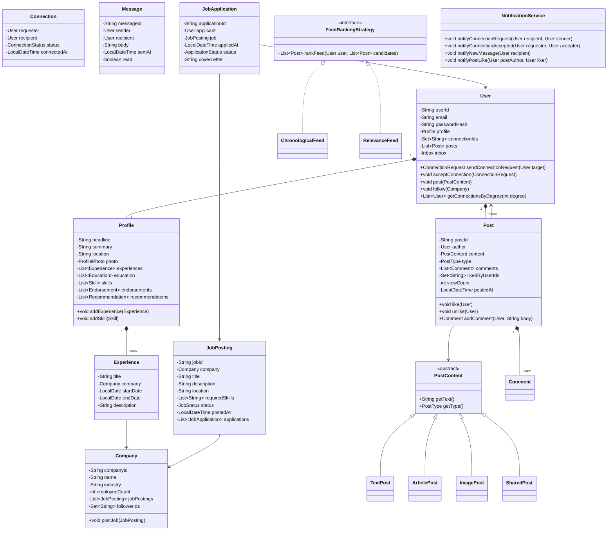

# LLD: LinkedIn

## 1. Requirements

### Functional
- User profiles: name, headline, summary, experience, education, skills
- Connection requests: send, accept, reject, withdraw; 1st/2nd/3rd degree connections
- Messaging between connections
- Job postings: companies post jobs; users apply
- Feed: posts, articles, shares, likes, comments
- Company pages: employees, followers, job listings
- Search: people by name/skill, jobs by title/location/company
- Endorsements and recommendations
- Notifications: connection requests, messages, mentions

### Non-Functional
- Connection degree computation (BFS up to 3rd degree)
- Feed ranking extensible (relevance, recency)
- Extensible post types (text, image, article, poll)

### Out of Scope
- Premium features, Sales Navigator, advertising platform

---

## 2. Core Entities

`User`, `Profile`, `Connection`, `Message`, `Post`, `Company`, `JobPosting`, `JobApplication`, `Group`, `Notification`

---

## 3. Class Diagram



---

## 4. Design Patterns

| Pattern | Where Applied | Why |
|---------|--------------|-----|
| **Observer** | `NotificationService` | Decouple connection/like/message events from notification delivery |
| **Strategy** | `FeedRankingStrategy` | Swap chronological vs. ML relevance ranking |
| **Composite** | `PostContent` hierarchy | Treat text/image/article posts uniformly |
| **Iterator** | `ConnectionGraph.BFS()` | Traverse connection graph by degree |
| **Proxy** | `PrivacyProxy` | Control profile visibility based on connection degree |

---

## 5. Java Implementation

```java
// ─── Enums ──────────────────────────────────────────────────────────────────

public enum ConnectionStatus { PENDING, ACCEPTED, REJECTED, WITHDRAWN }
public enum PostType { TEXT, ARTICLE, IMAGE, VIDEO, POLL, SHARED }
public enum JobStatus { OPEN, CLOSED, PAUSED }
public enum ApplicationStatus { APPLIED, REVIEWED, INTERVIEWING, OFFERED, REJECTED }

// ─── Profile ──────────────────────────────────────────────────────────────────

public class Skill {
    private final String name;
    private int endorsementCount;

    public Skill(String name) { this.name = name; }
    public void addEndorsement() { endorsementCount++; }
    public String getName() { return name; }
    public int getEndorsementCount() { return endorsementCount; }
}

public class Experience {
    private final String title;
    private final String companyName;
    private final LocalDate startDate;
    private final LocalDate endDate; // null = current
    private final String description;

    public Experience(String title, String companyName, LocalDate start, LocalDate end, String desc) {
        this.title = title;
        this.companyName = companyName;
        this.startDate = start;
        this.endDate = end;
        this.description = desc;
    }

    public boolean isCurrent() { return endDate == null; }
}

public class Profile {
    private String headline;
    private String summary;
    private String location;
    private final List<Experience> experiences = new ArrayList<>();
    private final List<Skill> skills = new ArrayList<>();
    private final Map<String, Skill> skillMap = new HashMap<>();

    public void setHeadline(String headline) { this.headline = headline; }
    public void setSummary(String summary) { this.summary = summary; }

    public void addExperience(Experience exp) { experiences.add(exp); }

    public void addSkill(String skillName) {
        if (!skillMap.containsKey(skillName.toLowerCase())) {
            Skill skill = new Skill(skillName);
            skills.add(skill);
            skillMap.put(skillName.toLowerCase(), skill);
        }
    }

    public boolean endorseSkill(String skillName) {
        Skill skill = skillMap.get(skillName.toLowerCase());
        if (skill != null) { skill.addEndorsement(); return true; }
        return false;
    }

    public String getHeadline() { return headline; }
    public List<Skill> getSkills() { return Collections.unmodifiableList(skills); }
}

// ─── Post ─────────────────────────────────────────────────────────────────────

public abstract class PostContent {
    public abstract PostType getType();
    public abstract String getPreviewText();
}

public class TextPost extends PostContent {
    private final String text;
    public TextPost(String text) { this.text = text; }
    @Override public PostType getType() { return PostType.TEXT; }
    @Override public String getPreviewText() { return text.substring(0, Math.min(text.length(), 200)); }
}

public class ArticlePost extends PostContent {
    private final String title;
    private final String body;
    private final String thumbnailUrl;

    public ArticlePost(String title, String body, String thumbnailUrl) {
        this.title = title;
        this.body = body;
        this.thumbnailUrl = thumbnailUrl;
    }
    @Override public PostType getType() { return PostType.ARTICLE; }
    @Override public String getPreviewText() { return title; }
}

public class Comment {
    private final String commentId;
    private final User author;
    private final String body;
    private final LocalDateTime postedAt;
    private final List<Comment> replies = new ArrayList<>();

    public Comment(User author, String body) {
        this.commentId = UUID.randomUUID().toString();
        this.author = author;
        this.body = body;
        this.postedAt = LocalDateTime.now();
    }

    public Comment reply(User author, String body) {
        Comment reply = new Comment(author, body);
        replies.add(reply);
        return reply;
    }

    public List<Comment> getReplies() { return Collections.unmodifiableList(replies); }
}

public class Post {
    private final String postId;
    private final User author;
    private final PostContent content;
    private final List<Comment> comments = new ArrayList<>();
    private final Set<String> likedByUserIds = new HashSet<>();
    private int viewCount;
    private final LocalDateTime postedAt;
    private final List<PostEventListener> listeners = new ArrayList<>();

    public Post(User author, PostContent content) {
        this.postId = UUID.randomUUID().toString();
        this.author = author;
        this.content = content;
        this.postedAt = LocalDateTime.now();
    }

    public synchronized void like(User user) {
        if (likedByUserIds.add(user.getUserId())) {
            listeners.forEach(l -> l.onLike(this, user));
        }
    }

    public synchronized void unlike(User user) {
        likedByUserIds.remove(user.getUserId());
    }

    public Comment addComment(User user, String body) {
        Comment comment = new Comment(user, body);
        comments.add(comment);
        return comment;
    }

    public void incrementViewCount() { viewCount++; }
    public int getLikeCount() { return likedByUserIds.size(); }
    public String getPostId() { return postId; }
    public User getAuthor() { return author; }
    public PostContent getContent() { return content; }
    public LocalDateTime getPostedAt() { return postedAt; }
    public void addListener(PostEventListener listener) { listeners.add(listener); }
}

// ─── Connection Request ───────────────────────────────────────────────────────

public class ConnectionRequest {
    private final String requestId;
    private final User requester;
    private final User recipient;
    private ConnectionStatus status;
    private final LocalDateTime sentAt;
    private String message;

    public ConnectionRequest(User requester, User recipient) {
        this.requestId = UUID.randomUUID().toString();
        this.requester = requester;
        this.recipient = recipient;
        this.status = ConnectionStatus.PENDING;
        this.sentAt = LocalDateTime.now();
    }

    public void accept() { status = ConnectionStatus.ACCEPTED; }
    public void reject() { status = ConnectionStatus.REJECTED; }
    public void withdraw() { status = ConnectionStatus.WITHDRAWN; }

    public User getRequester() { return requester; }
    public User getRecipient() { return recipient; }
    public ConnectionStatus getStatus() { return status; }
}

// ─── User ─────────────────────────────────────────────────────────────────────

public class User {
    private final String userId;
    private final String email;
    private final Profile profile;
    private final Set<String> connectionIds = new HashSet<>();
    private final Map<String, ConnectionRequest> pendingRequests = new ConcurrentHashMap<>();
    private final List<Post> posts = new ArrayList<>();
    private final Set<String> followingCompanyIds = new HashSet<>();

    public User(String userId, String email) {
        this.userId = userId;
        this.email = email;
        this.profile = new Profile();
    }

    public ConnectionRequest sendConnectionRequest(User target) {
        if (connectionIds.contains(target.getUserId())) {
            throw new AlreadyConnectedException("Already connected to " + target.getUserId());
        }
        ConnectionRequest request = new ConnectionRequest(this, target);
        pendingRequests.put(request.getRequestId(), request);
        return request;
    }

    public void acceptConnection(ConnectionRequest request) {
        if (!request.getRecipient().getUserId().equals(this.userId)) {
            throw new UnauthorizedException("Not the recipient of this request");
        }
        request.accept();
        connectionIds.add(request.getRequester().getUserId());
        request.getRequester().connectionIds.add(this.userId);
    }

    public Post createPost(PostContent content) {
        Post post = new Post(this, content);
        posts.add(post);
        return post;
    }

    public void followCompany(Company company) {
        followingCompanyIds.add(company.getCompanyId());
    }

    public Set<String> getConnectionIds() { return Collections.unmodifiableSet(connectionIds); }
    public String getUserId() { return userId; }
    public Profile getProfile() { return profile; }
    public List<Post> getPosts() { return Collections.unmodifiableList(posts); }
}

// ─── Connection Graph (BFS for degree) ────────────────────────────────────────

public class ConnectionGraph {
    private final Map<String, User> users;

    public ConnectionGraph(Map<String, User> users) { this.users = users; }

    public int getDegreeOfConnection(User from, User to) {
        if (from.getUserId().equals(to.getUserId())) return 0;

        Set<String> visited = new HashSet<>();
        Queue<String> queue = new LinkedList<>();
        queue.offer(from.getUserId());
        visited.add(from.getUserId());
        int degree = 0;

        while (!queue.isEmpty()) {
            int size = queue.size();
            degree++;
            if (degree > 3) return -1; // Not within 3 degrees

            for (int i = 0; i < size; i++) {
                String currentId = queue.poll();
                User current = users.get(currentId);
                for (String connId : current.getConnectionIds()) {
                    if (connId.equals(to.getUserId())) return degree;
                    if (!visited.contains(connId)) {
                        visited.add(connId);
                        queue.offer(connId);
                    }
                }
            }
        }
        return -1;
    }

    public List<User> getConnectionsByDegree(User user, int maxDegree) {
        Set<String> visited = new HashSet<>();
        Map<String, Integer> degreeMap = new HashMap<>();
        Queue<String> queue = new LinkedList<>();
        queue.offer(user.getUserId());
        visited.add(user.getUserId());
        degreeMap.put(user.getUserId(), 0);

        while (!queue.isEmpty()) {
            String currentId = queue.poll();
            int currentDegree = degreeMap.get(currentId);
            if (currentDegree >= maxDegree) continue;

            User current = users.get(currentId);
            for (String connId : current.getConnectionIds()) {
                if (!visited.contains(connId)) {
                    visited.add(connId);
                    degreeMap.put(connId, currentDegree + 1);
                    queue.offer(connId);
                }
            }
        }

        return degreeMap.entrySet().stream()
            .filter(e -> e.getValue() > 0 && e.getValue() <= maxDegree)
            .map(e -> users.get(e.getKey()))
            .collect(Collectors.toList());
    }
}

// ─── Feed Ranking Strategy ────────────────────────────────────────────────────

public interface FeedRankingStrategy {
    List<Post> rankFeed(User user, List<Post> candidates);
}

public class ChronologicalFeed implements FeedRankingStrategy {
    @Override
    public List<Post> rankFeed(User user, List<Post> candidates) {
        return candidates.stream()
            .sorted(Comparator.comparing(Post::getPostedAt).reversed())
            .collect(Collectors.toList());
    }
}

public class RelevanceFeed implements FeedRankingStrategy {
    @Override
    public List<Post> rankFeed(User user, List<Post> candidates) {
        return candidates.stream()
            .sorted(Comparator.comparingDouble(p -> -scorePost(user, (Post) p))
                .thenComparing((Post p) -> p.getPostedAt()).reversed())
            .collect(Collectors.toList());
    }

    private double scorePost(User user, Post post) {
        double score = 0;
        // 1st degree connection: high weight
        if (user.getConnectionIds().contains(post.getAuthor().getUserId())) score += 10;
        // Recency (exponential decay over 24h)
        long hoursOld = ChronoUnit.HOURS.between(post.getPostedAt(), LocalDateTime.now());
        score += Math.exp(-hoursOld / 24.0) * 5;
        // Engagement
        score += post.getLikeCount() * 0.1;
        return score;
    }
}

// ─── Job Posting ──────────────────────────────────────────────────────────────

public class JobPosting {
    private final String jobId;
    private final Company company;
    private final String title;
    private final String location;
    private final List<String> requiredSkills;
    private JobStatus status;
    private final List<JobApplication> applications = new ArrayList<>();

    public JobPosting(Company company, String title, String location, List<String> skills) {
        this.jobId = UUID.randomUUID().toString();
        this.company = company;
        this.title = title;
        this.location = location;
        this.requiredSkills = new ArrayList<>(skills);
        this.status = JobStatus.OPEN;
    }

    public JobApplication apply(User applicant, String coverLetter) {
        if (status != JobStatus.OPEN) throw new IllegalStateException("Job is not open");
        JobApplication app = new JobApplication(applicant, this, coverLetter);
        applications.add(app);
        return app;
    }

    public String getJobId() { return jobId; }
    public String getTitle() { return title; }
    public List<String> getRequiredSkills() { return Collections.unmodifiableList(requiredSkills); }
}
```

---

## 6. SOLID Analysis

| Principle | Assessment |
|-----------|-----------|
| **SRP** | `User` manages connections; `Profile` manages professional info; `ConnectionGraph` manages graph traversal |
| **OCP** | New post type: extend `PostContent`; new feed algorithm: implement `FeedRankingStrategy` |
| **LSP** | `ArticlePost` and `TextPost` are substitutable as `PostContent` |
| **ISP** | `FeedRankingStrategy` is single-method; `PostEventListener` is focused |
| **DIP** | Feed service depends on `FeedRankingStrategy` interface |

---

## 7. Key Algorithms

- **BFS for connection degree**: Standard BFS up to depth 3; O(V+E) where V=connections, E=relationships
- **Feed ranking**: Weighted score = connection degree weight + recency decay + engagement count
- **Search by skill**: Inverted index from skill → [userId]; intersection for multi-skill search

---

## 8. FAANG Interview Tips

- **Connection degree via BFS**: Draw the graph traversal explicitly — this is the algorithmic heart of LinkedIn
- **Separate `User` from `Profile`**: `User` is an account; `Profile` is professional presentation — many candidates conflate these
- **Feed is a Strategy**: Don't hardcode chronological — show the ranking strategy is pluggable
- **Post types as Composite**: Treating text/image/article uniformly via `PostContent` is elegant
- **Follow-up: 1B users, 500M connections?** → Connection graph stored in graph DB (Neo4j) or adjacency list sharded by user ID; pre-computed 2nd-degree list cached in Redis; fan-out on write for feed (push model) vs fan-out on read for celebrities (pull model)
