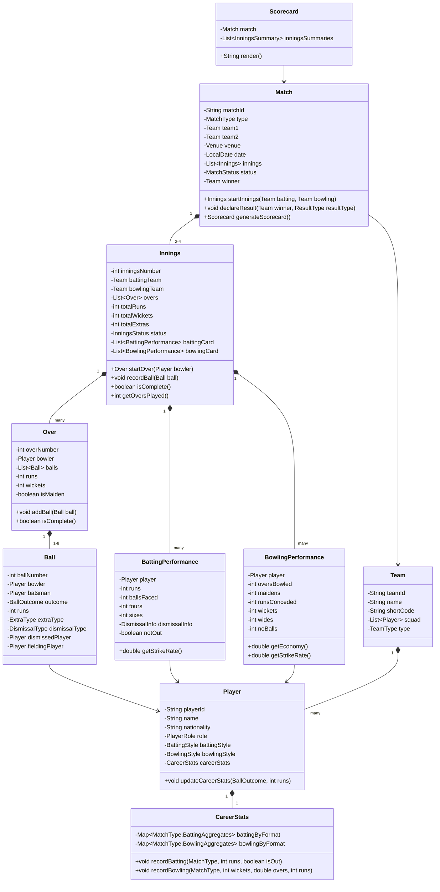

# LLD: Cricinfo (Cricket Information System)

## 1. Requirements

### Functional
- Track Teams, Players, and their stats
- Manage Matches: Test, ODI, T20; Innings, Overs, Balls
- Record ball-by-ball score: runs, wickets, extras (wide, no-ball, bye, leg-bye)
- Scorecard: batting (runs, balls, 4s, 6s, SR), bowling (overs, maidens, wickets, economy)
- Partnership records within innings
- Fall of wicket tracking
- Player career statistics aggregation
- Tournament management: series, groups, knockout stages
- Live commentary feed
- Search players, matches, teams

### Non-Functional
- Scorecard generation must be fast
- Stats aggregation extensible (new derived stats without reprocessing)
- Support multiple match formats

### Out of Scope
- Live streaming, DRS/Hawk-Eye integration, fantasy cricket

---

## 2. Core Entities

`Tournament`, `Series`, `Match`, `Innings`, `Over`, `Ball`, `Team`, `Player`, `BattingStats`, `BowlingStats`, `Scorecard`

---

## 3. Class Diagram



---

## 4. Design Patterns

| Pattern | Where Applied | Why |
|---------|--------------|-----|
| **Observer** | `CommentaryService`, `ScorecardUpdater` | React to each ball for live updates |
| **Strategy** | `MatchCompletionStrategy` | Test declaration vs. T20 wicket/over limit |
| **Composite** | `Scorecard` composing multiple innings | Render full match scorecard uniformly |
| **Factory** | `MatchFactory` | Create Match with correct rules per MatchType |
| **Visitor** | `StatsVisitor` | Compute different stats (economy, average) without modifying domain classes |

---

## 5. Java Implementation

```java
// ─── Enums ──────────────────────────────────────────────────────────────────

public enum MatchType { TEST, ODI, T20, T10 }
public enum MatchStatus { SCHEDULED, IN_PROGRESS, INNINGS_BREAK, COMPLETED, ABANDONED, TIED }
public enum InningsStatus { IN_PROGRESS, DECLARED, ALL_OUT, TARGET_REACHED, OVER_LIMIT }
public enum ExtraType { NONE, WIDE, NO_BALL, BYE, LEG_BYE }
public enum DismissalType { NONE, BOWLED, CAUGHT, LBW, RUN_OUT, STUMPED, HIT_WICKET, HANDLED_BALL }
public enum PlayerRole { BATSMAN, BOWLER, ALL_ROUNDER, WICKET_KEEPER }
public enum BattingStyle { RIGHT_HAND, LEFT_HAND }
public enum BowlingStyle { RIGHT_ARM_FAST, RIGHT_ARM_SPIN, LEFT_ARM_FAST, LEFT_ARM_SPIN }

// ─── Ball ─────────────────────────────────────────────────────────────────────

public class DismissalInfo {
    private final DismissalType type;
    private final Player bowler;
    private final Player fielder; // for caught/run-out

    public DismissalInfo(DismissalType type, Player bowler, Player fielder) {
        this.type = type;
        this.bowler = bowler;
        this.fielder = fielder;
    }

    public boolean creditsToBowler() {
        return type == DismissalType.BOWLED || type == DismissalType.LBW ||
               type == DismissalType.CAUGHT || type == DismissalType.STUMPED;
    }

    public DismissalType getType() { return type; }
}

public class Ball {
    private final int ballNumber;
    private final Player bowler;
    private final Player batsman;
    private final int runs;
    private final ExtraType extraType;
    private final DismissalInfo dismissalInfo;
    private final boolean isLegalDelivery;

    public Ball(int ballNumber, Player bowler, Player batsman, int runs,
                ExtraType extra, DismissalInfo dismissal) {
        this.ballNumber = ballNumber;
        this.bowler = bowler;
        this.batsman = batsman;
        this.runs = runs;
        this.extraType = extra;
        this.dismissalInfo = dismissal;
        this.isLegalDelivery = (extra != ExtraType.WIDE && extra != ExtraType.NO_BALL);
    }

    public boolean isWicket() {
        return dismissalInfo != null && dismissalInfo.getType() != DismissalType.NONE;
    }

    public boolean isExtra() { return extraType != ExtraType.NONE; }
    public boolean isBoundary() { return runs == 4 || runs == 6; }
    public int getRuns() { return runs; }
    public Player getBowler() { return bowler; }
    public Player getBatsman() { return batsman; }
    public ExtraType getExtraType() { return extraType; }
    public DismissalInfo getDismissalInfo() { return dismissalInfo; }
    public boolean isLegalDelivery() { return isLegalDelivery; }
}

// ─── Batting Performance ──────────────────────────────────────────────────────

public class BattingPerformance {
    private final Player player;
    private int runs;
    private int ballsFaced;
    private int fours;
    private int sixes;
    private boolean notOut;
    private DismissalInfo dismissalInfo;

    public BattingPerformance(Player player) {
        this.player = player;
        this.notOut = true;
    }

    public void recordBall(Ball ball) {
        if (ball.isLegalDelivery()) ballsFaced++;
        if (ball.getExtraType() == ExtraType.NONE || ball.getExtraType() == ExtraType.NO_BALL) {
            runs += ball.getRuns();
        }
        if (ball.getRuns() == 4) fours++;
        if (ball.getRuns() == 6) sixes++;
    }

    public void recordDismissal(DismissalInfo info) {
        this.notOut = false;
        this.dismissalInfo = info;
    }

    public double getStrikeRate() {
        return ballsFaced == 0 ? 0 : (runs * 100.0) / ballsFaced;
    }

    public Player getPlayer() { return player; }
    public int getRuns() { return runs; }
    public int getBallsFaced() { return ballsFaced; }
    public int getFours() { return fours; }
    public int getSixes() { return sixes; }
    public boolean isNotOut() { return notOut; }
    public DismissalInfo getDismissalInfo() { return dismissalInfo; }
}

// ─── Bowling Performance ──────────────────────────────────────────────────────

public class BowlingPerformance {
    private final Player player;
    private int legalBalls;
    private int maidens;
    private int runsConceded;
    private int wickets;
    private int wides;
    private int noBalls;

    public BowlingPerformance(Player player) { this.player = player; }

    public void recordBall(Ball ball) {
        if (ball.isLegalDelivery()) legalBalls++;
        if (ball.getExtraType() == ExtraType.WIDE) wides++;
        if (ball.getExtraType() == ExtraType.NO_BALL) noBalls++;
        runsConceded += ball.getRuns();
        if (ball.isWicket() && ball.getDismissalInfo().creditsToBowler()) wickets++;
    }

    public double getOvers() { return legalBalls / 6.0; }

    public double getEconomy() {
        double overs = getOvers();
        return overs == 0 ? 0 : runsConceded / overs;
    }

    public double getBowlingAverage() {
        return wickets == 0 ? Double.MAX_VALUE : (double) runsConceded / wickets;
    }

    public Player getPlayer() { return player; }
    public int getWickets() { return wickets; }
    public int getRunsConceded() { return runsConceded; }
    public int getLegalBalls() { return legalBalls; }
}

// ─── Over ─────────────────────────────────────────────────────────────────────

public class Over {
    private final int overNumber;
    private final Player bowler;
    private final List<Ball> balls = new ArrayList<>();
    private int legalDeliveries;
    private int totalRuns;
    private int wickets;

    public Over(int overNumber, Player bowler) {
        this.overNumber = overNumber;
        this.bowler = bowler;
    }

    public void addBall(Ball ball) {
        balls.add(ball);
        totalRuns += ball.getRuns();
        if (ball.isWicket()) wickets++;
        if (ball.isLegalDelivery()) legalDeliveries++;
    }

    public boolean isComplete() { return legalDeliveries >= 6; }

    public boolean isMaiden() {
        return isComplete() && balls.stream().allMatch(b -> b.getRuns() == 0 && !b.isExtra());
    }

    public int getOverNumber() { return overNumber; }
    public int getTotalRuns() { return totalRuns; }
    public int getWickets() { return wickets; }
    public Player getBowler() { return bowler; }
}

// ─── Innings ──────────────────────────────────────────────────────────────────

public class Innings {
    private final int inningsNumber;
    private final Team battingTeam;
    private final Team bowlingTeam;
    private final List<Over> overs = new ArrayList<>();
    private final Map<String, BattingPerformance> battingCard = new LinkedHashMap<>();
    private final Map<String, BowlingPerformance> bowlingCard = new HashMap<>();
    private int totalRuns;
    private int totalWickets;
    private int extras;
    private InningsStatus status;
    private final List<InningsEventListener> listeners = new ArrayList<>();
    private final int maxOvers; // 0 for unlimited (Test)

    public Innings(int inningsNumber, Team batting, Team bowling, int maxOvers) {
        this.inningsNumber = inningsNumber;
        this.battingTeam = batting;
        this.bowlingTeam = bowling;
        this.maxOvers = maxOvers;
        this.status = InningsStatus.IN_PROGRESS;
        // Initialize batting performances for squad
        batting.getSquad().forEach(p -> battingCard.put(p.getPlayerId(), new BattingPerformance(p)));
        bowling.getSquad().forEach(p -> bowlingCard.put(p.getPlayerId(), new BowlingPerformance(p)));
    }

    public Over startOver(Player bowler) {
        if (isComplete()) throw new IllegalStateException("Innings already complete");
        Over over = new Over(overs.size() + 1, bowler);
        overs.add(over);
        return over;
    }

    public void recordBall(Ball ball) {
        if (overs.isEmpty()) throw new IllegalStateException("No over in progress");
        Over currentOver = overs.get(overs.size() - 1);
        currentOver.addBall(ball);

        // Update batting card
        BattingPerformance batting = battingCard.get(ball.getBatsman().getPlayerId());
        if (batting != null) batting.recordBall(ball);

        // Update bowling card
        BowlingPerformance bowling = bowlingCard.get(ball.getBowler().getPlayerId());
        if (bowling != null) bowling.recordBall(ball);

        if (ball.getExtraType() == ExtraType.NONE || ball.getExtraType() == ExtraType.LEG_BYE ||
            ball.getExtraType() == ExtraType.BYE) {
            totalRuns += ball.getRuns();
        } else {
            totalRuns += ball.getRuns();
            extras++;
        }

        if (ball.isWicket()) {
            totalWickets++;
            batting.recordDismissal(ball.getDismissalInfo());
            checkCompletion();
        }

        if (currentOver.isComplete() && currentOver.isMaiden()) {
            bowling.recordBall(ball); // maiden tracking
        }

        listeners.forEach(l -> l.onBallRecorded(this, ball));
        checkCompletion();
    }

    private void checkCompletion() {
        if (totalWickets >= 10) {
            status = InningsStatus.ALL_OUT;
        } else if (maxOvers > 0 && getOversPlayed() >= maxOvers) {
            status = InningsStatus.OVER_LIMIT;
        }
    }

    public void declare() {
        status = InningsStatus.DECLARED;
    }

    public boolean isComplete() {
        return status != InningsStatus.IN_PROGRESS;
    }

    public int getOversPlayed() {
        if (overs.isEmpty()) return 0;
        Over last = overs.get(overs.size() - 1);
        return (overs.size() - 1) + (last.isComplete() ? 1 : 0);
    }

    public int getTotalRuns() { return totalRuns; }
    public int getTotalWickets() { return totalWickets; }
    public Team getBattingTeam() { return battingTeam; }
    public Map<String, BattingPerformance> getBattingCard() { return Collections.unmodifiableMap(battingCard); }
    public Map<String, BowlingPerformance> getBowlingCard() { return Collections.unmodifiableMap(bowlingCard); }
    public void addListener(InningsEventListener l) { listeners.add(l); }

    public String getSummary() {
        return battingTeam.getShortCode() + ": " + totalRuns + "/" + totalWickets +
               " (" + getOversPlayed() + " ov)";
    }
}

// ─── Match ────────────────────────────────────────────────────────────────────

public class Match {
    private final String matchId;
    private final MatchType type;
    private final Team team1;
    private final Team team2;
    private final LocalDate date;
    private final List<Innings> innings = new ArrayList<>();
    private MatchStatus status;
    private Team winner;
    private final int maxOversPerInnings;

    public Match(String matchId, MatchType type, Team team1, Team team2, LocalDate date) {
        this.matchId = matchId;
        this.type = type;
        this.team1 = team1;
        this.team2 = team2;
        this.date = date;
        this.status = MatchStatus.SCHEDULED;
        this.maxOversPerInnings = switch (type) {
            case T20 -> 20;
            case T10 -> 10;
            case ODI -> 50;
            case TEST -> 0; // unlimited
        };
    }

    public Innings startInnings(Team batting, Team bowling) {
        int maxInnings = (type == MatchType.TEST) ? 4 : 2;
        if (innings.size() >= maxInnings) throw new IllegalStateException("Maximum innings reached");
        Innings newInnings = new Innings(innings.size() + 1, batting, bowling, maxOversPerInnings);
        innings.add(newInnings);
        status = MatchStatus.IN_PROGRESS;
        return newInnings;
    }

    public Scorecard generateScorecard() {
        return new Scorecard(this, innings);
    }

    public void declareResult(Team winner) {
        this.winner = winner;
        this.status = MatchStatus.COMPLETED;
    }

    public MatchType getType() { return type; }
    public List<Innings> getInnings() { return Collections.unmodifiableList(innings); }
    public Team getTeam1() { return team1; }
    public Team getTeam2() { return team2; }
    public MatchStatus getStatus() { return status; }
}

// ─── Career Stats Aggregation ─────────────────────────────────────────────────

public class CareerStats {
    private final Map<MatchType, BattingAggregates> battingByFormat = new EnumMap<>(MatchType.class);
    private final Map<MatchType, BowlingAggregates> bowlingByFormat = new EnumMap<>(MatchType.class);

    public void recordBatting(MatchType format, int runs, boolean isOut) {
        battingByFormat.computeIfAbsent(format, k -> new BattingAggregates())
                       .record(runs, isOut);
    }

    public void recordBowling(MatchType format, int wickets, int ballsBowled, int runsConceded) {
        bowlingByFormat.computeIfAbsent(format, k -> new BowlingAggregates())
                       .record(wickets, ballsBowled, runsConceded);
    }

    public BattingAggregates getBattingStats(MatchType format) {
        return battingByFormat.getOrDefault(format, new BattingAggregates());
    }
}

public class BattingAggregates {
    private int matches, innings, notOuts, totalRuns, highScore, fifties, hundreds;

    public void record(int runs, boolean isOut) {
        innings++;
        if (!isOut) notOuts++;
        totalRuns += runs;
        if (runs > highScore) highScore = runs;
        if (runs >= 50 && runs < 100) fifties++;
        if (runs >= 100) hundreds++;
    }

    public double getAverage() {
        int outs = innings - notOuts;
        return outs == 0 ? Double.MAX_VALUE : (double) totalRuns / outs;
    }

    public int getTotalRuns() { return totalRuns; }
    public int getHighScore() { return highScore; }
}
```

---

## 6. SOLID Analysis

| Principle | Assessment |
|-----------|-----------|
| **SRP** | `Ball` records one delivery; `Over` manages over state; `Innings` aggregates; `CareerStats` aggregates across time |
| **OCP** | New stat metric: add to `BattingAggregates` or use `StatsVisitor` — no domain class changes |
| **LSP** | `BattingAggregates` and `BowlingAggregates` serve their own interfaces cleanly |
| **ISP** | `InningsEventListener` focused; `MatchCompletionStrategy` is one method |
| **DIP** | `Match` fires events through `InningsEventListener`; `Innings` doesn't know about commentary |

---

## 7. Extensibility

| Future Requirement | How to Add |
|--------------------|-----------|
| DRS/Review system | `ReviewDecision` entity; `Ball.isUnderReview()` flag |
| Fantasy points | `FantasyPointCalculator` as Observer on ball events |
| Historical records | `RecordTracker` as Observer updating highest partnerships, best bowling figures |
| Tournament bracket | `Tournament` → `Series` → `Match` Composite hierarchy |

---

## 8. FAANG Interview Tips

- **Ball-by-ball is the atomic event**: Everything derives from `Ball` — don't try to derive stats any other way
- **Two performance cards per innings**: `battingCard` (for batting team) and `bowlingCard` (for bowling team) — clearly separate
- **Legal deliveries vs. extras**: Wides and no-balls add to over count differently — show you know this
- **Career stats aggregation**: `CareerStats` with format-based maps avoids mixing Test/T20 numbers
- **Follow-up: Live scoring at 100 ball events/sec?** → Event streaming (Kafka); scorecards computed from event log (CQRS); Redis for live score pub/sub
