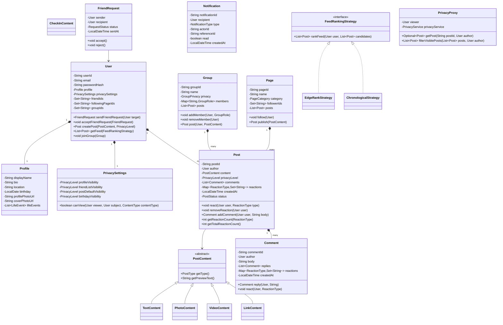

# LLD: Facebook / Social Network

## 1. Requirements

### Functional
- User profiles: name, bio, profile photo, cover photo, location
- Friendship: send request, accept, reject, unfriend; suggested friends
- News Feed: posts from friends and followed pages; timeline
- Post types: text, photo, video, link, life event, check-in
- Reactions: Like, Love, Haha, Wow, Sad, Angry (extensible)
- Comments and replies; comment reactions
- Groups: public, private, secret; admin/moderator roles
- Pages: follow, post, manage
- Privacy settings: Public, Friends, Friends of Friends, Custom, Only Me
- Notifications: friend requests, reactions, comments, mentions, birthdays
- Search: people, pages, groups, posts

### Non-Functional
- Privacy enforcement on every read (Proxy pattern)
- Feed ranking extensible (EdgeRank / ML-based)
- Notification fan-out for high-follower accounts must be async

### Out of Scope
- Ads system, Marketplace, Messenger protocol internals, Live Video infra

---

## 2. Core Entities

`User`, `Profile`, `Friendship`, `Post`, `Comment`, `Reaction`, `Group`, `Page`, `Event`, `Notification`, `FeedService`, `PrivacySettings`

---

## 3. Class Diagram



---

## 4. Design Patterns

| Pattern | Where Applied | Why |
|---------|--------------|-----|
| **Observer** | `NotificationService` | Decouple all social events from notification delivery |
| **Strategy** | `FeedRankingStrategy` | Swap EdgeRank, chronological, or ML-based feed |
| **Proxy** | `PrivacyProxy` | Enforce privacy rules on every content access |
| **Composite** | `PostContent` hierarchy | Treat text/photo/video posts uniformly |
| **Factory** | `NotificationFactory` | Build typed notifications without spreading creation logic |
| **Command** | `FriendRequest` | Encapsulate friend request; supports retract |

---

## 5. Java Implementation

```java
// ─── Enums ──────────────────────────────────────────────────────────────────

public enum PrivacyLevel { PUBLIC, FRIENDS, FRIENDS_OF_FRIENDS, ONLY_ME, CUSTOM }
public enum PostType { TEXT, PHOTO, VIDEO, LINK, LIFE_EVENT, CHECK_IN }
public enum ReactionType { LIKE, LOVE, HAHA, WOW, SAD, ANGRY }
public enum GroupPrivacy { PUBLIC, PRIVATE, SECRET }
public enum GroupRole { ADMIN, MODERATOR, MEMBER }
public enum RequestStatus { PENDING, ACCEPTED, REJECTED, WITHDRAWN }
public enum NotificationType {
    FRIEND_REQUEST, FRIEND_ACCEPTED, POST_REACTION, POST_COMMENT,
    COMMENT_REACTION, COMMENT_REPLY, MENTION, GROUP_INVITE, BIRTHDAY
}

// ─── Post Content Hierarchy ───────────────────────────────────────────────────

public abstract class PostContent {
    public abstract PostType getType();
    public abstract String getPreviewText();
}

public class TextContent extends PostContent {
    private final String text;
    public TextContent(String text) { this.text = text; }
    @Override public PostType getType() { return PostType.TEXT; }
    @Override public String getPreviewText() {
        return text.length() > 300 ? text.substring(0, 300) + "..." : text;
    }
}

public class PhotoContent extends PostContent {
    private final List<String> photoUrls;
    private final String caption;

    public PhotoContent(List<String> urls, String caption) {
        this.photoUrls = new ArrayList<>(urls);
        this.caption = caption;
    }
    @Override public PostType getType() { return PostType.PHOTO; }
    @Override public String getPreviewText() { return caption != null ? caption : "Photo"; }
    public List<String> getPhotoUrls() { return Collections.unmodifiableList(photoUrls); }
}

public class CheckInContent extends PostContent {
    private final String placeName;
    private final double latitude;
    private final double longitude;

    public CheckInContent(String placeName, double lat, double lon) {
        this.placeName = placeName;
        this.latitude = lat;
        this.longitude = lon;
    }
    @Override public PostType getType() { return PostType.CHECK_IN; }
    @Override public String getPreviewText() { return "at " + placeName; }
}

// ─── Comment ──────────────────────────────────────────────────────────────────

public class Comment {
    private final String commentId;
    private final User author;
    private String body;
    private final List<Comment> replies = new ArrayList<>();
    private final Map<ReactionType, Set<String>> reactions = new EnumMap<>(ReactionType.class);
    private final LocalDateTime createdAt;

    public Comment(User author, String body) {
        this.commentId = UUID.randomUUID().toString();
        this.author = author;
        this.body = body;
        this.createdAt = LocalDateTime.now();
    }

    public Comment reply(User author, String body) {
        Comment reply = new Comment(author, body);
        replies.add(reply);
        return reply;
    }

    public void react(User user, ReactionType type) {
        // Remove any existing reaction from this user
        reactions.values().forEach(s -> s.remove(user.getUserId()));
        reactions.computeIfAbsent(type, k -> new HashSet<>()).add(user.getUserId());
    }

    public int getReactionCount(ReactionType type) {
        return reactions.getOrDefault(type, Collections.emptySet()).size();
    }

    public String getCommentId() { return commentId; }
    public User getAuthor() { return author; }
    public String getBody() { return body; }
    public List<Comment> getReplies() { return Collections.unmodifiableList(replies); }
}

// ─── Post ─────────────────────────────────────────────────────────────────────

public class Post {
    private final String postId;
    private final User author;
    private final PostContent content;
    private final PrivacyLevel privacyLevel;
    private final List<Comment> comments = new ArrayList<>();
    private final Map<ReactionType, Set<String>> reactions = new EnumMap<>(ReactionType.class);
    private final LocalDateTime createdAt;
    private PostStatus status;
    private final List<PostEventListener> listeners = new ArrayList<>();
    private final Set<String> taggedUserIds = new HashSet<>();

    public Post(User author, PostContent content, PrivacyLevel privacy) {
        this.postId = UUID.randomUUID().toString();
        this.author = author;
        this.content = content;
        this.privacyLevel = privacy;
        this.createdAt = LocalDateTime.now();
        this.status = PostStatus.ACTIVE;
    }

    public synchronized void react(User user, ReactionType type) {
        // Remove existing reaction (user can only react once)
        boolean hadReaction = reactions.values().stream()
            .anyMatch(s -> s.remove(user.getUserId()));
        reactions.computeIfAbsent(type, k -> new HashSet<>()).add(user.getUserId());
        listeners.forEach(l -> l.onReaction(this, user, type));
    }

    public synchronized void removeReaction(User user) {
        reactions.values().forEach(s -> s.remove(user.getUserId()));
    }

    public Comment addComment(User user, String body) {
        Comment comment = new Comment(user, body);
        comments.add(comment);
        listeners.forEach(l -> l.onComment(this, user, comment));
        return comment;
    }

    public int getTotalReactionCount() {
        return reactions.values().stream().mapToInt(Set::size).sum();
    }

    public int getReactionCount(ReactionType type) {
        return reactions.getOrDefault(type, Collections.emptySet()).size();
    }

    public void addListener(PostEventListener l) { listeners.add(l); }
    public String getPostId() { return postId; }
    public User getAuthor() { return author; }
    public PostContent getContent() { return content; }
    public PrivacyLevel getPrivacyLevel() { return privacyLevel; }
    public LocalDateTime getCreatedAt() { return createdAt; }
    public List<Comment> getComments() { return Collections.unmodifiableList(comments); }
}

// ─── Privacy Settings ─────────────────────────────────────────────────────────

public class PrivacySettings {
    private PrivacyLevel defaultPostVisibility;
    private PrivacyLevel profileVisibility;
    private PrivacyLevel birthdayVisibility;

    public PrivacySettings() {
        this.defaultPostVisibility = PrivacyLevel.FRIENDS;
        this.profileVisibility = PrivacyLevel.PUBLIC;
        this.birthdayVisibility = PrivacyLevel.FRIENDS;
    }

    public PrivacyLevel getDefaultPostVisibility() { return defaultPostVisibility; }
    public void setDefaultPostVisibility(PrivacyLevel level) { this.defaultPostVisibility = level; }
}

// ─── Privacy Service (Proxy Logic) ────────────────────────────────────────────

public class PrivacyService {
    public boolean canViewPost(User viewer, Post post) {
        if (viewer.getUserId().equals(post.getAuthor().getUserId())) return true;
        return switch (post.getPrivacyLevel()) {
            case PUBLIC -> true;
            case FRIENDS -> viewer.getFriendIds().contains(post.getAuthor().getUserId());
            case FRIENDS_OF_FRIENDS -> areFriendsOfFriends(viewer, post.getAuthor());
            case ONLY_ME -> false;
            case CUSTOM -> checkCustomPrivacy(viewer, post);
        };
    }

    public boolean canViewProfile(User viewer, User subject) {
        PrivacyLevel level = subject.getPrivacySettings().getProfileVisibility();
        return switch (level) {
            case PUBLIC -> true;
            case FRIENDS -> viewer.getFriendIds().contains(subject.getUserId());
            case ONLY_ME -> viewer.getUserId().equals(subject.getUserId());
            default -> false;
        };
    }

    private boolean areFriendsOfFriends(User viewer, User subject) {
        // Check if viewer is friend of any friend of subject
        return subject.getFriendIds().stream()
            .anyMatch(friendId -> viewer.getFriendIds().contains(friendId));
    }

    private boolean checkCustomPrivacy(User viewer, Post post) {
        // Custom privacy logic
        return false;
    }
}

// ─── User ─────────────────────────────────────────────────────────────────────

public class User {
    private final String userId;
    private final String email;
    private final Profile profile;
    private final PrivacySettings privacySettings;
    private final Set<String> friendIds = new HashSet<>();
    private final Set<String> followingPageIds = new HashSet<>();
    private final Set<String> groupIds = new HashSet<>();
    private final List<Post> posts = new ArrayList<>();

    public User(String userId, String email) {
        this.userId = userId;
        this.email = email;
        this.profile = new Profile();
        this.privacySettings = new PrivacySettings();
    }

    public FriendRequest sendFriendRequest(User target) {
        if (friendIds.contains(target.getUserId())) {
            throw new AlreadyFriendsException("Already friends with " + target.getUserId());
        }
        return new FriendRequest(this, target);
    }

    public void acceptFriendRequest(FriendRequest request) {
        if (!request.getRecipient().getUserId().equals(this.userId)) {
            throw new UnauthorizedException("Not the recipient");
        }
        request.accept();
        this.friendIds.add(request.getSender().getUserId());
        request.getSender().friendIds.add(this.userId);
    }

    public Post createPost(PostContent content, PrivacyLevel privacy) {
        Post post = new Post(this, content, privacy);
        posts.add(post);
        return post;
    }

    public void followPage(Page page) {
        followingPageIds.add(page.getPageId());
        page.addFollower(userId);
    }

    public String getUserId() { return userId; }
    public Set<String> getFriendIds() { return Collections.unmodifiableSet(friendIds); }
    public List<Post> getPosts() { return Collections.unmodifiableList(posts); }
    public PrivacySettings getPrivacySettings() { return privacySettings; }
    public Profile getProfile() { return profile; }
}

// ─── Group ────────────────────────────────────────────────────────────────────

public class Group {
    private final String groupId;
    private final String name;
    private final GroupPrivacy privacy;
    private final Map<String, GroupRole> members = new HashMap<>();
    private final List<Post> posts = new ArrayList<>();

    public Group(String groupId, String name, GroupPrivacy privacy, User creator) {
        this.groupId = groupId;
        this.name = name;
        this.privacy = privacy;
        members.put(creator.getUserId(), GroupRole.ADMIN);
    }

    public void addMember(User user, GroupRole role) {
        if (privacy == GroupPrivacy.SECRET && !hasAdmin(user)) {
            throw new UnauthorizedException("Secret groups require admin invitation");
        }
        members.put(user.getUserId(), role);
    }

    public void removeMember(User user) {
        GroupRole role = members.get(user.getUserId());
        if (role == GroupRole.ADMIN && countAdmins() == 1) {
            throw new IllegalStateException("Cannot remove last admin");
        }
        members.remove(user.getUserId());
    }

    public Post post(User user, PostContent content) {
        if (!members.containsKey(user.getUserId())) {
            throw new UnauthorizedException("Not a group member");
        }
        Post post = new Post(user, content, PrivacyLevel.CUSTOM);
        posts.add(post);
        return post;
    }

    private boolean hasAdmin(User user) {
        return members.getOrDefault(user.getUserId(), null) == GroupRole.ADMIN;
    }

    private long countAdmins() {
        return members.values().stream().filter(r -> r == GroupRole.ADMIN).count();
    }

    public String getGroupId() { return groupId; }
    public GroupPrivacy getPrivacy() { return privacy; }
}

// ─── Notification ─────────────────────────────────────────────────────────────

public class Notification {
    private final String notificationId;
    private final User recipient;
    private final NotificationType type;
    private final String actorId;
    private final String referenceId;
    private boolean read;
    private final LocalDateTime createdAt;

    public Notification(User recipient, NotificationType type, String actorId, String referenceId) {
        this.notificationId = UUID.randomUUID().toString();
        this.recipient = recipient;
        this.type = type;
        this.actorId = actorId;
        this.referenceId = referenceId;
        this.createdAt = LocalDateTime.now();
        this.read = false;
    }

    public void markRead() { this.read = true; }
    public boolean isRead() { return read; }
    public NotificationType getType() { return type; }
    public User getRecipient() { return recipient; }
}

// ─── Feed Ranking Strategy ────────────────────────────────────────────────────

public interface FeedRankingStrategy {
    List<Post> rankFeed(User user, List<Post> candidates);
}

public class EdgeRankStrategy implements FeedRankingStrategy {
    // EdgeRank: Affinity × Weight × Time Decay

    @Override
    public List<Post> rankFeed(User user, List<Post> candidates) {
        return candidates.stream()
            .filter(p -> canSeePost(user, p))
            .sorted(Comparator.comparingDouble(p -> -calculateEdgeRankScore(user, (Post) p)))
            .collect(Collectors.toList());
    }

    private boolean canSeePost(User viewer, Post post) {
        // Privacy check happens here
        return true; // Simplified; real implementation uses PrivacyService
    }

    private double calculateEdgeRankScore(User user, Post post) {
        double affinity = computeAffinity(user, post.getAuthor()); // interaction history
        double weight = getTypeWeight(post.getContent().getType());
        double timeDecay = computeTimeDecay(post.getCreatedAt());
        return affinity * weight * timeDecay;
    }

    private double computeAffinity(User viewer, User author) {
        // In prod: ML model based on past interactions
        return viewer.getFriendIds().contains(author.getUserId()) ? 2.0 : 0.5;
    }

    private double getTypeWeight(PostType type) {
        return switch (type) {
            case VIDEO -> 3.0;
            case PHOTO -> 2.0;
            case TEXT -> 1.0;
            default -> 1.5;
        };
    }

    private double computeTimeDecay(LocalDateTime postedAt) {
        long hoursOld = ChronoUnit.HOURS.between(postedAt, LocalDateTime.now());
        return Math.exp(-hoursOld / 72.0); // decay over 3 days
    }
}

// ─── Notification Service (Observer) ─────────────────────────────────────────

public interface PostEventListener {
    void onReaction(Post post, User reactor, ReactionType type);
    void onComment(Post post, User commenter, Comment comment);
}

public class NotificationService implements PostEventListener {
    private final Map<String, List<Notification>> inbox = new ConcurrentHashMap<>();
    private final AsyncNotificationSender asyncSender;

    @Override
    public void onReaction(Post post, User reactor, ReactionType type) {
        if (!reactor.getUserId().equals(post.getAuthor().getUserId())) {
            Notification notif = new Notification(
                post.getAuthor(), NotificationType.POST_REACTION,
                reactor.getUserId(), post.getPostId()
            );
            deliver(notif);
        }
    }

    @Override
    public void onComment(Post post, User commenter, Comment comment) {
        Notification notif = new Notification(
            post.getAuthor(), NotificationType.POST_COMMENT,
            commenter.getUserId(), post.getPostId()
        );
        deliver(notif);
    }

    private void deliver(Notification notification) {
        inbox.computeIfAbsent(notification.getRecipient().getUserId(), k -> new ArrayList<>())
             .add(notification);
        // Fan-out to push notification system async
    }

    public List<Notification> getNotifications(String userId) {
        return Collections.unmodifiableList(inbox.getOrDefault(userId, Collections.emptyList()));
    }
}
```

---

## 6. SOLID Analysis

| Principle | Assessment |
|-----------|-----------|
| **SRP** | `PrivacyService` handles visibility; `NotificationService` handles alerts; `Post` manages content and reactions |
| **OCP** | New reaction type: add to `ReactionType` enum; new content type: extend `PostContent`; new notification: add to `NotificationType` |
| **LSP** | All `PostContent` subtypes are substitutable; all `FeedRankingStrategy` impls are interchangeable |
| **ISP** | `PostEventListener` has two focused methods; `FeedRankingStrategy` is single-method |
| **DIP** | Feed service depends on `FeedRankingStrategy` interface; `Post` fires events through `PostEventListener` |

---

## 7. Privacy Enforcement

The **Proxy pattern** is critical: every content read goes through `PrivacyService.canViewPost()`.

```
FeedService.getFeed(user)
    → collect candidate posts from friends + pages + groups
    → filter via PrivacyService.canViewPost(viewer, post)
    → rank via FeedRankingStrategy
    → return visible, ranked feed
```

Never expose raw post lists — always filter first.

---

## 8. Extensibility

| Future Requirement | How to Add |
|--------------------|-----------|
| Stories (24h posts) | `Story extends Post` with `expiresAt`; TTL-based cleanup job |
| Polls | `PollContent extends PostContent` with `options` and `votes` |
| Events | `Event` entity with RSVP; `EventPost` content type |
| Marketplace listing | `MarketplaceListing` separate from `Post`; same `PostContent` pattern |
| AI feed ranking | `MLFeedRankingStrategy` calling recommendation service — zero code change to `User` or `Post` |

---

## 9. FAANG Interview Tips

- **Privacy is the most important concern at Facebook**: Show `PrivacyService` as a Proxy on ALL content access
- **Reactions vs. simple likes**: Multiple reaction types per post — use `Map<ReactionType, Set<userId>>` not just an int
- **Feed is not just chronological**: EdgeRank = Affinity × Weight × TimeDecay — mention all three factors
- **Notification fan-out problem**: For a post by a page with 100M followers, you can't write to 100M notification records synchronously → Fan-out on read (pull model) for high-follower accounts
- **Groups privacy levels**: Secret group content must never appear in search or external feeds — enforce at PrivacyService level
- **Follow-up: Scale to 3B users?** → Posts stored in distributed object store; news feed pre-computed in Redis sorted sets (fan-out on write for normal users, fan-out on read for celebrities); CDN for media; privacy checks cached with user-level TTL
