# 17 — Pluggable Log Processing Pipeline

## Problem Statement

TechCorp operates a microservices platform serving 50M daily active users across 30+ services. The platform team receives a new request every week: *"We need to ingest from Kinesis"*, *"Route PII-containing logs through a redaction filter"*, *"Forward error logs to PagerDuty during incidents."*

Today, every new integration requires a core team code change, a review cycle, a deployment, and a regression test pass — a two-week lead time for what should be a configuration change. When a new output sink throws an uncaught exception at 3 AM, it cascades and takes down the entire pipeline.

**The core insight:** log processing has a fixed structure — *read events from a source → transform through a filter chain → write to one or more sinks* — but the implementations at each step change constantly. This is the canonical use case for a **plugin-based architecture**: separate the stable orchestration contract (interfaces) from the volatile implementations (plugins).

**Real-world parallels:**

| System | Plugin Model |
|---|---|
| Logstash (Elastic) | Input → Filter → Output, ~200 community plugins |
| Kafka Connect | Source Connector / Sink Connector, classpath SPI |
| Apache Camel | 300+ Components as separate JARs |
| Fluentd | Input, Parser, Filter, Output, Formatter plugins |

**Task:** Design a pluggable log processing pipeline where new integrations are added by dropping a JAR on the classpath — without modifying or redeploying the core framework.

---

## Scale Context

| Dimension | Value |
|---|---|
| Events / day | 200M |
| Peak throughput | ~5,000 events/sec |
| Teams onboarding | 12 (3 new/quarter) |
| Current integration surface | 8 input sources, 6 filter types, 10 output sinks |
| New plugin requests / quarter | ~15 |
| Integration lead time (before) | 14 days (code → PR → review → deploy) |
| Integration lead time (after) | 1 day (implement plugin → drop JAR → config change) |

---

## Functional Requirements

1. **Plugin types**: The system supports three plugin categories — Input (event source), Filter (event transformer), and Output (event sink)
2. **Plugin discovery**: Plugins are discovered automatically at startup from the classpath via Java SPI (`ServiceLoader`) — no framework configuration changes required
3. **Pipeline definition**: A pipeline is declared as: one Input plugin → an ordered list of Filter plugins → one or more Output plugins
4. **Filter chaining**: Filters execute in configured order; any filter may drop an event (return `Optional.empty()`) to terminate processing for that event
5. **Output fan-out**: An event that survives the filter chain is written to all configured outputs concurrently
6. **Plugin lifecycle**: Each plugin progresses through `configure → start → process → stop`; the framework manages this sequence
7. **Plugin metadata**: Each plugin self-declares its name, version, and type for registry indexing and conflict detection
8. **Manual registration**: Plugins can also be registered programmatically (for testing and embedded use)
9. **Error isolation**: A failing output plugin must not block other outputs or crash the pipeline
10. **Graceful shutdown**: On JVM shutdown, the pipeline stops accepting new events and calls `stop()` on all plugins

---

## Non-Functional Requirements

- **Framework overhead**: < 1 ms per event for orchestration (plugin execution time is not included)
- **Thread safety**: `PluginRegistry` must be safe for concurrent reads after initialization
- **Plugin isolation**: Exceptions inside a plugin are caught and logged; they never propagate to the framework
- **Zero-change extensibility**: New integrations require no framework source changes — only a new JAR and a config entry
- **Testability**: All plugins are interface-based; test pipelines inject mock plugins programmatically

---

## Out of Scope

- **Hot reload** — Dynamic class loading while the pipeline is running (requires OSGi or a custom `ClassLoader`)
- **Distributed coordination** — Multi-node pipeline scheduling (HLD / Kafka Streams territory)
- **Persistent plugin state** — Cross-restart state storage
- **Plugin sandboxing** — ClassLoader isolation per plugin (OSGi provides this for true multi-tenant environments)

---

## Core Entity Extraction

Nouns extracted from the problem domain and their roles:

| Entity | Role |
|---|---|
| `LogEvent` | Immutable unit of data flowing through the pipeline |
| `Plugin` | Base lifecycle contract for all pipeline extensions |
| `InputPlugin` | Extension point: reads events from an external source |
| `FilterPlugin` | Extension point: transforms or drops events |
| `OutputPlugin` | Extension point: writes events to an external sink |
| `AbstractPlugin` | Reusable lifecycle skeleton (Template Method) |
| `PluginRegistry` | Thread-safe catalog of all discovered and registered plugins |
| `PipelineConfig` | Declarative specification: which plugins, in which order, with which config |
| `PipelineExecutor` | Orchestrates plugin lifecycle and routes events through the pipeline |
| `PluginType` | Enum discriminator: `INPUT` / `FILTER` / `OUTPUT` |
| `NoOpFilterPlugin` | Null Object: pass-through filter for optional pipeline stages |
| `PluginException` | Checked exception for recoverable plugin failures |

---

## Class Diagram

```mermaid
classDiagram
    class Plugin {
        <<interface>>
        +name() String
        +version() String
        +type() PluginType
        +configure(Map) void
        +start() void
        +stop() void
    }
    class InputPlugin {
        <<interface>>
        +read(Consumer~LogEvent~) void
    }
    class FilterPlugin {
        <<interface>>
        +filter(LogEvent) Optional~LogEvent~
    }
    class OutputPlugin {
        <<interface>>
        +write(LogEvent) void
    }
    Plugin <|-- InputPlugin
    Plugin <|-- FilterPlugin
    Plugin <|-- OutputPlugin

    class AbstractPlugin {
        <<abstract>>
        +configure(Map) void
        #validateConfig(Map) void
        #doConfigure(Map) void
        #getRequired(Map, String) String
    }
    AbstractPlugin ..|> Plugin

    class LogEvent {
        -id: String
        -timestamp: long
        -level: String
        -source: String
        -message: String
        -fields: Map~String,String~
        +withField(String, String) LogEvent
        +toBuilder() Builder
        +builder()$ Builder
    }

    class PluginRegistry {
        -inputs: ConcurrentHashMap~String,InputPlugin~
        -filters: ConcurrentHashMap~String,FilterPlugin~
        -outputs: ConcurrentHashMap~String,OutputPlugin~
        +loadFromClasspath()$ PluginRegistry
        +register(Plugin) void
        +getInput(String) InputPlugin
        +getFilter(String) FilterPlugin
        +getOutput(String) OutputPlugin
    }
    class PipelineConfig {
        +inputPluginName: String
        +filterPluginNames: List~String~
        +outputPluginNames: List~String~
        +pluginConfigs: Map~String,Map~
        +configFor(String) Map
    }
    class PipelineExecutor {
        -registry: PluginRegistry
        -running: volatile boolean
        +execute(PipelineConfig) void
        -applyFilterChain(LogEvent, List) Optional~LogEvent~
        -fanOutToOutputs(LogEvent, List) void
        -configureAndStart(...) void
        -stopAll(...) void
    }
    PipelineExecutor --> PluginRegistry : resolves plugins from
    PipelineExecutor --> PipelineConfig : reads
    PipelineExecutor ..> LogEvent : routes

    class KafkaInputPlugin { -topic: String }
    class FileInputPlugin  { -filePath: Path }
    class FieldRedactionFilterPlugin { -fieldsToRedact: Set~String~ }
    class JsonParserFilterPlugin     { -mapper: ObjectMapper }
    class ElasticsearchOutputPlugin  { -host: String -indexName: String }
    class S3OutputPlugin             { -bucket: String -prefix: String }
    class NoOpFilterPlugin

    AbstractPlugin <|-- KafkaInputPlugin
    AbstractPlugin <|-- FileInputPlugin
    AbstractPlugin <|-- FieldRedactionFilterPlugin
    AbstractPlugin <|-- JsonParserFilterPlugin
    AbstractPlugin <|-- ElasticsearchOutputPlugin
    AbstractPlugin <|-- S3OutputPlugin

    KafkaInputPlugin              ..|> InputPlugin
    FileInputPlugin               ..|> InputPlugin
    FieldRedactionFilterPlugin    ..|> FilterPlugin
    JsonParserFilterPlugin        ..|> FilterPlugin
    NoOpFilterPlugin              ..|> FilterPlugin
    ElasticsearchOutputPlugin     ..|> OutputPlugin
    S3OutputPlugin                ..|> OutputPlugin

    PluginRegistry o-- InputPlugin
    PluginRegistry o-- FilterPlugin
    PluginRegistry o-- OutputPlugin
```



---

## Plugin Architecture Design

### Extension Points

Three narrow interfaces define the entire extension surface. Nothing else is pluggable.

```
EventSource ──► [InputPlugin]
                      │
                      ▼  LogEvent
                [FilterPlugin₁]──── drop? → discard
                      │
                      ▼  LogEvent
                [FilterPlugin₂]──── drop? → discard
                      │
                      ▼  LogEvent (survived filter chain)
           ┌──────────┼──────────┐
     [OutputPlugin A] │  [OutputPlugin B]  ← concurrent fan-out
                      │
                [OutputPlugin C]
```

### Plugin Lifecycle

The `PipelineExecutor` is the **only** class that drives plugin lifecycle. Plugins never call each other.

```
configure(Map<String,String>)  →  validate config, store settings
start()                        →  open connections, allocate resources
─── event processing loop ─────────────────────────────────
read / filter / write          →  per-event processing
─── shutdown signal ────────────────────────────────────────
stop()                         →  flush, close connections, release resources
```

### Java SPI — How Classpath Discovery Works

Plugins are discovered via `java.util.ServiceLoader` — no reflection, no `Class.forName`, no scanning.

**Plugin JAR structure** (e.g., `kafka-input-plugin.jar`):
```
META-INF/
  services/
    com.techcorp.pipeline.InputPlugin
      → com.techcorp.kafka.KafkaInputPlugin
```

**Framework side (one line):**
```java
ServiceLoader.load(InputPlugin.class).forEach(registry::register);
```

Adding a new integration = write a class, add a `META-INF/services/` file, drop the JAR, update the pipeline config. **Zero framework changes.**

---

## Full Java Implementation

```java
// ─────────────────────────────────────────────────────────────────
// DOMAIN OBJECT  (imports: java.util.*, java.util.Collections)
// ─────────────────────────────────────────────────────────────────

public final class LogEvent {
    private final String id;
    private final long   timestamp;
    private final String level;
    private final String source;
    private final String message;
    private final Map<String, String> fields;

    private LogEvent(Builder b) {
        this.id        = b.id;
        this.timestamp = b.timestamp;
        this.level     = b.level;
        this.source    = b.source;
        this.message   = b.message;
        this.fields    = Collections.unmodifiableMap(new HashMap<>(b.fields));
    }

    public String              getId()        { return id; }
    public long                getTimestamp() { return timestamp; }
    public String              getLevel()     { return level; }
    public String              getSource()    { return source; }
    public String              getMessage()   { return message; }
    public Map<String, String> getFields()    { return fields; }

    // Non-destructive field mutation — returns a new LogEvent
    public LogEvent withField(String key, String value) {
        return toBuilder().field(key, value).build();
    }

    public Builder toBuilder()            { return new Builder(this); }
    public static Builder builder()       { return new Builder(); }

    public static class Builder {
        private String id        = UUID.randomUUID().toString();
        private long   timestamp = System.currentTimeMillis();
        private String level     = "INFO";
        private String source    = "unknown";
        private String message   = "";
        private final Map<String, String> fields = new HashMap<>();

        Builder() {}
        Builder(LogEvent e) {
            this.id = e.id; this.timestamp = e.timestamp;
            this.level = e.level; this.source = e.source;
            this.message = e.message; this.fields.putAll(e.fields);
        }

        public Builder id(String id)           { this.id = id;           return this; }
        public Builder timestamp(long ts)      { this.timestamp = ts;    return this; }
        public Builder level(String level)     { this.level = level;     return this; }
        public Builder source(String source)   { this.source = source;   return this; }
        public Builder message(String message) { this.message = message; return this; }
        public Builder field(String k, String v){ this.fields.put(k, v); return this; }
        public LogEvent build()                { return new LogEvent(this); }
    }
}


// ─────────────────────────────────────────────────────────────────
// PLUGIN TYPE & EXCEPTIONS
// ─────────────────────────────────────────────────────────────────

public enum PluginType { INPUT, FILTER, OUTPUT }

public class PluginException extends Exception {
    public PluginException(String msg)                  { super(msg); }
    public PluginException(String msg, Throwable cause) { super(msg, cause); }
}

public class PluginConfigException extends PluginException {
    public PluginConfigException(String msg) { super(msg); }
}


// ─────────────────────────────────────────────────────────────────
// EXTENSION POINT INTERFACES
// ─────────────────────────────────────────────────────────────────

public interface Plugin {
    String     name();
    String     version();
    PluginType type();
    void configure(Map<String, String> config) throws PluginConfigException;
    void start()  throws PluginException;
    void stop();
}

public interface InputPlugin extends Plugin {
    /** Pull events from the source and push each into eventSink. */
    void read(Consumer<LogEvent> eventSink) throws PluginException;
}

public interface FilterPlugin extends Plugin {
    /** Return transformed event, or Optional.empty() to drop. */
    Optional<LogEvent> filter(LogEvent event);
}

public interface OutputPlugin extends Plugin {
    /** Write event to the destination. */
    void write(LogEvent event) throws PluginException;
}


// ─────────────────────────────────────────────────────────────────
// ABSTRACT BASE — Template Method Pattern
// ─────────────────────────────────────────────────────────────────

public abstract class AbstractPlugin implements Plugin {

    @Override
    public final void configure(Map<String, String> config) throws PluginConfigException {
        validateConfig(config);
        doConfigure(config);
    }

    /** Override to add custom validation before doConfigure runs. */
    protected void validateConfig(Map<String, String> config) throws PluginConfigException {}

    /** Subclasses implement their config-specific initialization here. */
    protected abstract void doConfigure(Map<String, String> config) throws PluginConfigException;

    /** Utility: fetch a required key or throw a descriptive exception. */
    protected String getRequired(Map<String, String> config, String key) throws PluginConfigException {
        String v = config.get(key);
        if (v == null || v.isBlank())
            throw new PluginConfigException("Plugin '" + name() + "' requires config key: " + key);
        return v;
    }

    @Override public void start() throws PluginException {}
    @Override public void stop()  {}
}


// ─────────────────────────────────────────────────────────────────
// PLUGIN REGISTRY
// ─────────────────────────────────────────────────────────────────

public class PluginRegistry {
    private final Map<String, InputPlugin>  inputs  = new ConcurrentHashMap<>();
    private final Map<String, FilterPlugin> filters = new ConcurrentHashMap<>();
    private final Map<String, OutputPlugin> outputs = new ConcurrentHashMap<>();

    /** Discovers all plugins registered via META-INF/services/ on the classpath. */
    public static PluginRegistry loadFromClasspath() {
        PluginRegistry registry = new PluginRegistry();
        ServiceLoader.load(InputPlugin.class) .forEach(registry::register);
        ServiceLoader.load(FilterPlugin.class).forEach(registry::register);
        ServiceLoader.load(OutputPlugin.class).forEach(registry::register);
        return registry;
    }

    public void register(Plugin plugin) {
        switch (plugin.type()) {
            case INPUT  -> inputs .put(plugin.name(), (InputPlugin)  plugin);
            case FILTER -> filters.put(plugin.name(), (FilterPlugin) plugin);
            case OUTPUT -> outputs.put(plugin.name(), (OutputPlugin) plugin);
        }
    }

    public InputPlugin  getInput (String name) { return require(inputs,  name, "input"); }
    public FilterPlugin getFilter(String name) { return require(filters, name, "filter"); }
    public OutputPlugin getOutput(String name) { return require(outputs, name, "output"); }

    private <T> T require(Map<String, T> map, String name, String type) {
        T plugin = map.get(name);
        if (plugin == null)
            throw new IllegalArgumentException("No " + type + " plugin registered: '" + name + "'");
        return plugin;
    }
}


// ─────────────────────────────────────────────────────────────────
// PIPELINE CONFIG
// ─────────────────────────────────────────────────────────────────

public class PipelineConfig {
    private final String              inputPluginName;
    private final List<String>        filterPluginNames;
    private final List<String>        outputPluginNames;
    private final Map<String, Map<String, String>> pluginConfigs;

    public PipelineConfig(String input,
                          List<String> filters,
                          List<String> outputs,
                          Map<String, Map<String, String>> pluginConfigs) {
        this.inputPluginName   = input;
        this.filterPluginNames = List.copyOf(filters);
        this.outputPluginNames = List.copyOf(outputs);
        this.pluginConfigs     = Map.copyOf(pluginConfigs);
    }

    public String       getInputPluginName()         { return inputPluginName; }
    public List<String> getFilterPluginNames()        { return filterPluginNames; }
    public List<String> getOutputPluginNames()        { return outputPluginNames; }
    public Map<String, String> configFor(String name) {
        return pluginConfigs.getOrDefault(name, Map.of());
    }
}


// ─────────────────────────────────────────────────────────────────
// PIPELINE EXECUTOR — Orchestration Core
// ─────────────────────────────────────────────────────────────────

public class PipelineExecutor {
    private final PluginRegistry registry;
    private volatile boolean     running = true;

    public PipelineExecutor(PluginRegistry registry) { this.registry = registry; }

    public void execute(PipelineConfig config) throws PluginException {
        InputPlugin        input       = registry.getInput(config.getInputPluginName());
        List<FilterPlugin> filterChain = config.getFilterPluginNames().stream()
                                             .map(registry::getFilter)
                                             .collect(Collectors.toList());
        List<OutputPlugin> outputs     = config.getOutputPluginNames().stream()
                                             .map(registry::getOutput)
                                             .collect(Collectors.toList());

        configureAndStart(input, filterChain, outputs, config);
        registerShutdownHook(input, filterChain, outputs);

        try {
            while (running) {
                input.read(event ->
                    applyFilterChain(event, filterChain)
                        .ifPresent(filtered -> fanOutToOutputs(filtered, outputs))
                );
            }
        } finally {
            stopAll(input, filterChain, outputs);
        }
    }

    // Chain of Responsibility: each filter can short-circuit by returning empty
    private Optional<LogEvent> applyFilterChain(LogEvent event, List<FilterPlugin> chain) {
        Optional<LogEvent> current = Optional.of(event);
        for (FilterPlugin filter : chain) {
            current = current.flatMap(filter::filter);
            if (current.isEmpty()) return Optional.empty();
        }
        return current;
    }

    // Observer fan-out: all outputs run concurrently; one failure does not block others
    private void fanOutToOutputs(LogEvent event, List<OutputPlugin> outputPlugins) {
        List<CompletableFuture<Void>> futures = outputPlugins.stream()
            .map(out -> CompletableFuture.runAsync(() -> {
                try {
                    out.write(event);
                } catch (Exception e) {
                    System.err.println("[WARN] Output '" + out.name() + "' failed: " + e.getMessage());
                }
            }))
            .collect(Collectors.toList());
        CompletableFuture.allOf(futures.toArray(new CompletableFuture[0])).join();
    }

    private void configureAndStart(InputPlugin input, List<FilterPlugin> filters,
                                   List<OutputPlugin> outputs, PipelineConfig cfg) throws PluginException {
        input.configure(cfg.configFor(input.name()));
        input.start();
        for (FilterPlugin f : filters) { f.configure(cfg.configFor(f.name())); f.start(); }
        for (OutputPlugin o : outputs) { o.configure(cfg.configFor(o.name())); o.start(); }
    }

    private void stopAll(InputPlugin input, List<FilterPlugin> filters, List<OutputPlugin> outputs) {
        input.stop();
        filters.forEach(Plugin::stop);
        outputs.forEach(Plugin::stop);
    }

    private void registerShutdownHook(InputPlugin input,
                                      List<FilterPlugin> filters, List<OutputPlugin> outputs) {
        Runtime.getRuntime().addShutdownHook(new Thread(() -> {
            running = false;
            stopAll(input, filters, outputs);
        }));
    }
}


// ─────────────────────────────────────────────────────────────────
// CONCRETE PLUGINS
// ─────────────────────────────────────────────────────────────────

// INPUT: Kafka Consumer
public class KafkaInputPlugin extends AbstractPlugin implements InputPlugin {
    private String topic;
    private String bootstrapServers;

    @Override public String name()     { return "kafka"; }
    @Override public String version()  { return "1.0.0"; }
    @Override public PluginType type() { return PluginType.INPUT; }

    @Override
    protected void doConfigure(Map<String, String> config) throws PluginConfigException {
        this.topic            = getRequired(config, "topic");
        this.bootstrapServers = config.getOrDefault("bootstrap.servers", "localhost:9092");
    }

    @Override
    public void read(Consumer<LogEvent> eventSink) throws PluginException {
        // Production: wraps KafkaConsumer.poll(); simplified here for clarity
        LogEvent event = LogEvent.builder()
            .source("kafka:" + topic)
            .message("{\"level\":\"WARN\",\"msg\":\"disk at 90%\",\"email\":\"ops@techcorp.com\"}")
            .build();
        eventSink.accept(event);
    }
}

// INPUT: Flat File (tail mode)
public class FileInputPlugin extends AbstractPlugin implements InputPlugin {
    private Path filePath;

    @Override public String name()     { return "file"; }
    @Override public String version()  { return "1.0.0"; }
    @Override public PluginType type() { return PluginType.INPUT; }

    @Override
    protected void doConfigure(Map<String, String> config) throws PluginConfigException {
        this.filePath = Path.of(getRequired(config, "path"));
    }

    @Override
    public void read(Consumer<LogEvent> eventSink) throws PluginException {
        try (BufferedReader reader = Files.newBufferedReader(filePath)) {
            String line;
            while ((line = reader.readLine()) != null) {
                eventSink.accept(LogEvent.builder()
                    .source("file:" + filePath.getFileName())
                    .message(line)
                    .build());
            }
        } catch (IOException e) {
            throw new PluginException("File read failed: " + filePath, e);
        }
    }
}

// FILTER: JSON Parser — parses message string into structured fields
public class JsonParserFilterPlugin extends AbstractPlugin implements FilterPlugin {
    private ObjectMapper mapper;

    @Override public String name()     { return "json-parser"; }
    @Override public String version()  { return "1.0.0"; }
    @Override public PluginType type() { return PluginType.FILTER; }

    @Override protected void doConfigure(Map<String, String> config) {}
    @Override public void start()      { this.mapper = new ObjectMapper(); }

    @Override
    public Optional<LogEvent> filter(LogEvent event) {
        try {
            JsonNode json = mapper.readTree(event.getMessage());
            LogEvent.Builder builder = event.toBuilder()
                .level(json.path("level").asText(event.getLevel()));
            json.fields().forEachRemaining(e -> builder.field(e.getKey(), e.getValue().asText()));
            return Optional.of(builder.build());
        } catch (JsonProcessingException e) {
            return Optional.of(event);   // pass through non-JSON events unchanged
        }
    }
}

// FILTER: PII Redaction — masks emails, card numbers, and configured field values
public class FieldRedactionFilterPlugin extends AbstractPlugin implements FilterPlugin {
    private Set<String> fieldsToRedact;
    private static final String  REDACTED     = "[REDACTED]";
    private static final Pattern CARD_PATTERN = Pattern.compile(
            "\\b\\d{4}[- ]?\\d{4}[- ]?\\d{4}[- ]?\\d{4}\\b");
    private static final Pattern EMAIL_PATTERN = Pattern.compile(
            "[a-zA-Z0-9._%+\\-]+@[a-zA-Z0-9.\\-]+\\.[a-zA-Z]{2,}");

    @Override public String name()     { return "field-redaction"; }
    @Override public String version()  { return "1.0.0"; }
    @Override public PluginType type() { return PluginType.FILTER; }

    @Override
    protected void doConfigure(Map<String, String> config) {
        String raw = config.getOrDefault("fields", "");
        this.fieldsToRedact = raw.isBlank() ? Set.of() : Set.of(raw.split(","));
    }

    @Override
    public Optional<LogEvent> filter(LogEvent event) {
        LogEvent result = event;
        for (String field : fieldsToRedact) {
            if (result.getFields().containsKey(field))
                result = result.withField(field, REDACTED);
        }
        String cleaned = CARD_PATTERN .matcher(result.getMessage()).replaceAll(REDACTED);
        cleaned        = EMAIL_PATTERN.matcher(cleaned)            .replaceAll(REDACTED);
        return Optional.of(result.toBuilder().message(cleaned).build());
    }
}

// OUTPUT: Elasticsearch
public class ElasticsearchOutputPlugin extends AbstractPlugin implements OutputPlugin {
    private String host;
    private String indexName;

    @Override public String name()     { return "elasticsearch"; }
    @Override public String version()  { return "1.0.0"; }
    @Override public PluginType type() { return PluginType.OUTPUT; }

    @Override
    protected void doConfigure(Map<String, String> config) {
        this.host      = config.getOrDefault("host",  "localhost:9200");
        this.indexName = config.getOrDefault("index", "logs");
    }

    @Override
    public void write(LogEvent event) throws PluginException {
        // Production: esClient.index(IndexRequest.of(r -> r.index(indexName).document(event)));
        System.out.printf("[ES → %s] id=%s level=%s msg=%s%n",
            indexName, event.getId(), event.getLevel(), event.getMessage());
    }
}

// OUTPUT: Amazon S3
public class S3OutputPlugin extends AbstractPlugin implements OutputPlugin {
    private String bucket;
    private String prefix;

    @Override public String name()     { return "s3"; }
    @Override public String version()  { return "1.0.0"; }
    @Override public PluginType type() { return PluginType.OUTPUT; }

    @Override
    protected void doConfigure(Map<String, String> config) throws PluginConfigException {
        this.bucket = getRequired(config, "bucket");
        this.prefix = config.getOrDefault("prefix", "logs/");
    }

    @Override
    public void write(LogEvent event) throws PluginException {
        String key = prefix + Instant.ofEpochMilli(event.getTimestamp()) + "/" + event.getId() + ".json";
        // Production: s3Client.putObject(PutObjectRequest.builder().bucket(bucket).key(key).build(), body);
        System.out.printf("[S3 → s3://%s/%s]%n", bucket, key);
    }
}

// FILTER: No-Op — Null Object pattern for optional pipeline stages
public class NoOpFilterPlugin implements FilterPlugin {
    @Override public String name()     { return "noop"; }
    @Override public String version()  { return "1.0.0"; }
    @Override public PluginType type() { return PluginType.FILTER; }
    @Override public void configure(Map<String, String> c) {}
    @Override public void start()      {}
    @Override public void stop()       {}
    @Override public Optional<LogEvent> filter(LogEvent event) { return Optional.of(event); }
}


// ─────────────────────────────────────────────────────────────────
// DEMO WIRE-UP
// ─────────────────────────────────────────────────────────────────

public class PipelineDemo {
    public static void main(String[] args) throws PluginException {
        // In production: PluginRegistry.loadFromClasspath() discovers plugins via SPI.
        // Here we register programmatically to show the API.
        PluginRegistry registry = new PluginRegistry();
        registry.register(new KafkaInputPlugin());
        registry.register(new JsonParserFilterPlugin());
        registry.register(new FieldRedactionFilterPlugin());
        registry.register(new ElasticsearchOutputPlugin());
        registry.register(new S3OutputPlugin());

        PipelineConfig config = new PipelineConfig(
            "kafka",
            List.of("json-parser", "field-redaction"),
            List.of("elasticsearch", "s3"),
            Map.of(
                "kafka",           Map.of("topic", "app-logs", "bootstrap.servers", "kafka:9092"),
                "field-redaction", Map.of("fields", "password,ssn"),
                "elasticsearch",   Map.of("host", "es:9200", "index", "prod-logs"),
                "s3",              Map.of("bucket", "techcorp-logs", "prefix", "prod/2024/")
            )
        );

        new PipelineExecutor(registry).execute(config);
    }
}
```

---

## SPI Registration — META-INF/services/

To ship a plugin as a self-contained JAR with auto-discovery, add service descriptor files to the plugin module's resources:

```
# kafka-input-plugin/src/main/resources/META-INF/services/
# File: com.techcorp.pipeline.InputPlugin
com.techcorp.kafka.KafkaInputPlugin


# redaction-filter-plugin/src/main/resources/META-INF/services/
# File: com.techcorp.pipeline.FilterPlugin
com.techcorp.filter.JsonParserFilterPlugin
com.techcorp.filter.FieldRedactionFilterPlugin


# elasticsearch-output-plugin/src/main/resources/META-INF/services/
# File: com.techcorp.pipeline.OutputPlugin
com.techcorp.output.ElasticsearchOutputPlugin
```

The JVM's `ServiceLoader` scans all JARs on the classpath for these files at startup. The framework discovers every plugin without knowing its class name in advance.

```
classpath
├── pipeline-core.jar          ← framework (Plugin, PluginRegistry, PipelineExecutor)
├── kafka-input-plugin.jar     ← dropped by Kafka team
├── redaction-filter-plugin.jar ← dropped by Security team
└── elasticsearch-output.jar   ← dropped by SRE team
```

---

## Design Patterns Applied

| Pattern | Applied Where | Why |
|---|---|---|
| **Strategy** | `InputPlugin`, `FilterPlugin`, `OutputPlugin` interfaces | Each plugin type encapsulates an interchangeable algorithm; the executor calls through the interface without knowing the implementation |
| **Chain of Responsibility** | `applyFilterChain()` in `PipelineExecutor` | Each filter decides to pass the event forward or drop it (short-circuit). The chain is assembled declaratively at runtime |
| **Template Method** | `AbstractPlugin.configure()` calls `validateConfig()` then `doConfigure()` | Enforces the lifecycle contract; subclasses customise only their plugin-specific logic |
| **Null Object** | `NoOpFilterPlugin` | Allows optional filter stages without null checks in the chain; default no-op is always safe to insert |
| **Service Locator (SPI)** | `PluginRegistry.loadFromClasspath()` via `ServiceLoader` | Decouples plugin discovery from plugin implementation; classpath-driven; type-safe unlike reflection |
| **Registry** | `PluginRegistry` with `ConcurrentHashMap` | Centralised O(1) plugin lookup by name; single place to detect name conflicts |
| **Observer (Fan-out)** | `fanOutToOutputs()` with `CompletableFuture` | Multiple output plugins independently observe each filtered event; one slow or failing output does not block others |
| **Immutable Value Object** | `LogEvent` with private constructor + Builder | Events are shared across the filter chain without defensive copies; thread-safe by construction |
| **Builder** | `LogEvent.Builder` with `toBuilder()` | Constructs complex immutable objects; `toBuilder()` enables non-destructive field mutations in filter plugins |

---

## SOLID Analysis

| Principle | Compliance | Evidence |
|---|---|---|
| **SRP** | ✅ | `KafkaInputPlugin` reads Kafka only. `FieldRedactionFilterPlugin` masks PII only. `PipelineExecutor` orchestrates only — it has no idea what any plugin does. |
| **OCP** | ✅ | Adding a Kinesis input, a GeoIP enrichment filter, or a PagerDuty output requires **zero changes** to the framework. Drop a JAR, update the config. |
| **LSP** | ✅ | Any `FilterPlugin` can substitute any other in the chain. `NoOpFilterPlugin` is a correct, legal substitute — it passes events through unchanged and satisfies the contract. |
| **ISP** | ✅ | Three narrow interfaces instead of one fat `Plugin` interface. A `FilterPlugin` implementation is never asked to implement `read()` or `write()`. |
| **DIP** | ✅ | `PipelineExecutor` depends on `InputPlugin`, `FilterPlugin`, `OutputPlugin` — all abstractions. It never imports `KafkaInputPlugin` or `S3OutputPlugin`. |

---

## Thread Safety & Concurrency Notes

| Concern | Design Decision | Rationale |
|---|---|---|
| Plugin registry reads | `ConcurrentHashMap` — populated once at startup, read-only during pipeline execution | No lock contention on the hot path |
| `LogEvent` immutability | `withField()` and `toBuilder()` return new instances — originals never mutate | Safe to pass the same `LogEvent` reference to multiple concurrent output threads |
| Output fan-out | `CompletableFuture.runAsync()` + `allOf(...).join()` | Outputs execute in parallel; the pipeline waits for all before pulling the next event |
| Pipeline shutdown | `volatile boolean running` — JVM shutdown hook flips it; main loop drains cleanly | `volatile` guarantees visibility without synchronisation overhead |
| Plugin lifecycle ordering | `configure → start → event loop → stop` is strictly single-threaded in `PipelineExecutor` | Eliminates race conditions in plugin initialisation |
| Failing output isolation | Each output wrapped in `try/catch` inside `CompletableFuture` | Exception in one output is logged; others continue unaffected |

---

## Extensibility Matrix

| New Requirement | How to Implement | Framework Changes |
|---|---|---|
| New input (AWS Kinesis) | Implement `KinesisInputPlugin extends AbstractPlugin implements InputPlugin` + add `META-INF/services/` entry | **None** |
| New filter (GeoIP enrichment) | Implement `GeoIpFilterPlugin extends AbstractPlugin implements FilterPlugin` | **None** |
| New output (Splunk HEC) | Implement `SplunkOutputPlugin extends AbstractPlugin implements OutputPlugin` | **None** |
| Filter that emits multiple events | Introduce `SplittingFilterPlugin` with `List<LogEvent> expand(LogEvent)` | New interface + executor update |
| Plugin name collision at startup | In `register()`, throw `IllegalStateException` if name already present | `PluginRegistry.register()` only |
| Async (non-blocking) output | `AsyncOutputPluginAdapter implements OutputPlugin` wraps any `OutputPlugin` with an internal bounded queue | No existing class changes (Decorator) |
| Per-plugin metrics (latency, error rate) | `MeteredPlugin` proxy wraps every plugin; records duration around each call | `PipelineExecutor.configureAndStart()` wraps plugins before storing |
| Plugin versioning | Add `version()` to conflict check in `register()`; reject mismatched versions | `PluginRegistry` only |

---

## FAANG Interview Tips

**1. Lead with the "why" before code**
> *"The problem demands plugin architecture because the integration surface changes weekly but the core stability is non-negotiable. That asymmetry — stable orchestration, volatile implementations — is the signal."*

**2. Know why SPI over reflection**
> `ServiceLoader` is type-safe, JVM-native, and respects the Java module system (JPMS). `Class.forName()` is stringly-typed, bypasses module visibility, and fails silently on typos. For public plugin APIs, SPI is the correct default.

**3. Defend the 3-interface design using ISP explicitly**
> One fat `Plugin` interface with `read()`, `filter()`, and `write()` violates ISP — every plugin stubs out two of three methods. Three narrow interfaces mean each class only implements what it actually does.

**4. Handle the "plugin name collision" follow-up**
> Two JARs on the classpath declare the same plugin name. Options: (a) fail-fast at startup with `IllegalStateException` — surface the conflict loudly; (b) last-registered wins, deterministic if the classpath is ordered; (c) versioned names (`kafka@1.0` vs `kafka@2.0`). Option (a) is correct for production — silent overrides create operational nightmares.

**5. Handle the "filter failure" follow-up**
> Current design: an exception inside `filter()` propagates up and the event is treated as a drop. Production-correct alternatives: (a) route failed events to a Dead Letter Queue output plugin; (b) configurable per-filter error policy (`ON_ERROR: DROP | PASS_THROUGH | DLQ`). DLQ is the right FAANG-level answer — it preserves observability.

**6. Chain of Responsibility vs. Decorator — know the distinction**
> Filter chain is Chain of Responsibility: each handler can short-circuit by returning `Optional.empty()`. Decorator assumes every layer always passes a transformed result forward. Here, the redaction filter may legitimately drop spam events — genuine CoR, not Decorator.

**7. Concurrency model trade-offs**
> Current model: single-threaded input loop, concurrent output fan-out. For 50k events/sec: (a) bounded `BlockingQueue` between input and filter stages (producer-consumer, natural backpressure), (b) parallel filter chains with `ForkJoinPool` per event, (c) reactive pipeline with Project Reactor `Flux.flatMap()`. Each trades simplicity for throughput — name the trade-off explicitly.

**8. Plugin sandboxing (principal engineer follow-up)**
> `ServiceLoader` shares the application `ClassLoader` — a plugin can access all framework classes. For true isolation: (a) OSGi provides a `ClassLoader` per bundle; (b) Java 9+ modules use `module-info.java` `requires` declarations. At FAANG scale, untrusted plugins typically run in separate JVM processes (Kafka Connect workers, Logstash process isolation) — the network/IPC boundary is the sandbox.

**9. Testing strategy**
> Unit-test each plugin in isolation with a synthetic `LogEvent`. Integration-test `PipelineExecutor` by registering test doubles programmatically — no SPI, no classpath magic. Contract-test: write a shared test suite that verifies any `FilterPlugin` satisfies the lifecycle contract (`configure → start → filter → stop` without exceptions). This is what Kafka Connect's `ConnectorTest` framework does.

**10. The principal engineer angle: this is a platform design problem**
> The real interview signal is recognising that the interface contract between the framework and plugins is a *public API* — it must be versioned, must have a compatibility promise, and its breaking changes must be communicated across teams. How do you deprecate `FilterPlugin.filter()` without breaking 15 external plugin JARs? Answer: `default` methods in the interface for additive changes; a new `FilterPlugin2 extends FilterPlugin` for breaking changes, with a documented migration window.

---

## Follow-Up Interview Questions

**Q1: The filter chain processes one event at a time. Scale to 50,000 events/sec.**

Introduce a `BlockingQueue<LogEvent>` between the input stage and the filter stage. The input thread enqueues events; a pool of N filter-chain worker threads dequeues and processes. The queue provides natural backpressure: if outputs are saturated, the queue fills, and the input slows down (blocking `put()`). For a non-blocking variant, replace the queue with Project Reactor's `Flux.flatMap()` with configurable concurrency.

```
Input thread  →  [BlockingQueue<LogEvent>]  →  Filter Worker 1
                                              →  Filter Worker 2
                                              →  Filter Worker N
                                                     │
                                              Fan-out to Outputs
```

**Q2: A plugin leaks a thread. How does your design detect and mitigate this?**

Current design: no detection. Mitigation options at increasing sophistication: (a) assign each plugin a named `ThreadGroup` and assert it is empty in `stop()`; (b) wrap plugin execution in a bounded `ExecutorService` — any thread the plugin spawns inside the executor is automatically managed; (c) in `PipelineExecutor.stopAll()`, use `ThreadMXBean.dumpAllThreads()` to log thread stacks and alert on plugin-named threads still running 5 seconds post-`stop()`.

**Q3: How do you version the `FilterPlugin` interface without breaking existing plugins?**

- **Additive changes**: Use `default` methods — new optional capabilities with safe default behaviour. Existing plugins compile and run unchanged.
- **Breaking changes**: Introduce `FilterPlugin2 extends FilterPlugin` with the new signature. Support both in `PipelineExecutor` via `instanceof` during a defined deprecation window (typically 2 major releases).
- **Governance**: Publish the plugin SDK as a versioned Maven artifact. Increment the minor version for new `default` methods, the major version for breaking interface changes. Announce deprecations 6 months in advance with a migration guide.
