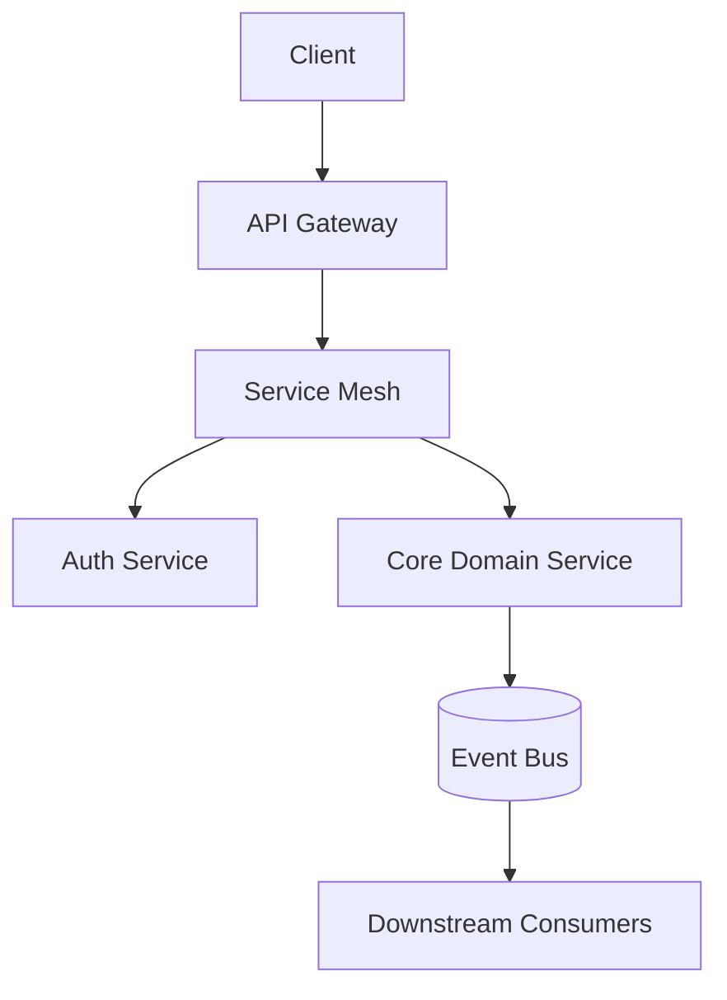

# Technical Vision Communication

## What Technical Vision Communication Is

A principal engineer doesn't just execute strategy — they author it. Technical vision communication is the skill of translating a multi-year technical direction into documents, narratives, and presentations that align engineers, product partners, and executives around a shared destination.

Three artifacts matter most:
1. **Engineering Strategy Doc** — the 2–3 year technical direction for a domain
2. **Technical Narrative** — the 5-minute story that explains where you're going and why
3. **Quarterly Technical Brief** — the recurring artifact that shows progress against vision

---

## The Engineering Strategy Document

The engineering strategy doc is the primary artifact of principal-level impact. It answers three questions: Where are we? Where should we be? How do we get there?

### Template

```markdown
# Engineering Strategy: [Domain Name]
**Author:** [Principal Engineer]
**Status:** Draft | RFC | Approved | Active
**Time horizon:** [2025–2027]
**Last updated:** YYYY-MM-DD

---

## Executive Summary (≤ 5 sentences)

[Current state of the domain, the gap vs. where we need to be,
the proposed direction, and the expected outcome. A VP should 
understand the full strategy from this paragraph alone.]

---

## 1. Current State Assessment

### What We Have
[Honest description of the current system, team, and processes]

### Strengths to Build On
- [Strength 1 — be specific]
- [Strength 2]

### Problems We Must Solve
| Problem | Business Impact | Technical Root Cause |
|---------|----------------|---------------------|
| [P1] | [Impact in business terms] | [Root cause] |
| [P2] | | |

### Technical Debt Inventory
| Item | Severity | Estimated Cost to Fix | Cost of Inaction |
|------|----------|----------------------|-----------------|
| [D1] | High | [N eng-weeks] | [Customer/eng impact per quarter] |
| [D2] | Med | | |

---

## 2. Target State (2–3 Year Horizon)

### Principles
[3–5 guiding principles for this domain — these constrain decisions]

1. **[Principle 1]:** [One-sentence rationale]
2. **[Principle 2]:**
3. **[Principle 3]:**

### What Success Looks Like

By end of [year], we will:
- [Outcome 1 — measurable, customer-facing or business-facing]
- [Outcome 2]
- [Outcome 3]

### Target Architecture (high-level)
[Mermaid diagram or prose description of the target state]



---

## 3. Gap Analysis

| Dimension | Today | Target | Gap |
|-----------|-------|--------|-----|
| Scale | 10k RPS | 100k RPS | 10x capacity |
| Deploy frequency | Weekly | Daily | CI/CD maturity |
| MTTR | 4 hours | < 30 min | Observability, runbooks |
| Team autonomy | Shared monolith | Independent deploys | Service boundaries |

---

## 4. Strategic Initiatives

Prioritized by impact × feasibility. Each initiative is a coherent unit of work that can be funded, staffed, and tracked.

### Initiative 1: [Name] — [Quarters: Q1–Q2 2025]
**Problem solved:** [Link to problem in current state]  
**Outcome:** [Measurable result]  
**Approach:** [1 paragraph]  
**Investment:** [Headcount, infra cost, opportunity cost]  
**Dependencies:** [Teams or systems that must move first]  
**Key risks:** [1–2 risks]

### Initiative 2: [Name] — [Q3–Q4 2025]
...

### Sequencing Rationale
[Why this order? What unlocks what? Diagram if helpful]

---

## 5. Investment Ask

| Initiative | Eng headcount | Duration | Infra cost/yr | Expected ROI |
|-----------|---------------|----------|---------------|-------------|
| [I1] | 3 SWE + 1 TL | 2 quarters | $50k | 40% reduction in on-call load |
| [I2] | 2 SWE | 1 quarter | $20k | 2x deploy frequency |
| **Total** | **6 SWE** | | **$70k** | |

---

## 6. What We're Not Doing (and Why)

[This section prevents scope creep and documents deliberate exclusions]

| Excluded item | Why excluded | When to revisit |
|---------------|-------------|----------------|
| [Item 1] | Too early; foundational work must come first | After Initiative 1 complete |
| [Item 2] | Owned by Platform team per [ADR-XXX] | N/A |

---

## 7. Risks and Dependencies

| Risk | Likelihood | Impact | Owner | Mitigation |
|------|-----------|--------|-------|-----------|
| [R1] | High | Critical | [Name] | [Plan] |

Cross-team dependencies:
- **[Team X]:** [What we need from them, by when]
- **[Team Y]:** [What we need from them, by when]

---

## 8. Metrics and Milestones

### Leading indicators (progress signals)
- [LI1]: Target [X] by [date]
- [LI2]: Target [X] by [date]

### Lagging indicators (outcome confirmation)
- [LAG1]: Target [X] by [date]

### Quarterly review checkpoints
| Quarter | Key milestone | Success signal |
|---------|--------------|----------------|
| Q1 2025 | [Milestone] | [Metric] |
| Q2 2025 | [Milestone] | [Metric] |

---

## Appendix
- [Link to ADRs referenced]
- [Link to related RFCs]
- [Link to data/metrics supporting current state]
```

---

## The 5-Minute Technical Narrative

Every principal engineer needs a crisp verbal version of their technical vision — for hallway conversations, skip-level meetings, and first-encounter briefings with new executives.

### Structure: Problem → Tension → Direction → Outcome

```
PROBLEM (30 seconds)
"Today, [system/domain] works like this: [current state].
The problem is [business consequence of the current state],
which is costing us [concrete impact: customer pain, revenue, reliability]."

TENSION (30 seconds)
"The reason this hasn't been solved is [honest diagnosis: 
org structure, accumulated debt, competing priorities, unclear ownership].
The cost of staying here is [specific cost that grows over time]."

DIRECTION (2 minutes)
"Our strategy is to [high-level direction in one sentence].
Concretely, this means [3 specific things we will do, in order].
The key trade-off we're making is [trade-off], because [rationale]."

OUTCOME (1 minute)
"When this is done, [team/product/customers] will be able to [capability].
We'll measure success by [1-2 metrics].
The first checkpoint is [milestone] in [timeframe]."

INVITATION (30 seconds)
"The biggest open question is [genuine open question].
I'm looking for [specific input: challenging assumptions, 
perspective on X, help with dependency Y]."
```

**Practice rule:** If you can't deliver this in 5 minutes, your vision isn't crisp enough yet.

---

## Quarterly Technical Brief

A lightweight, recurring artifact (1–2 pages) for your leadership chain. Not a steering committee update (which is project-focused) — this is a domain-level health and progress signal.

```markdown
# [Domain] Technical Brief — Q[N] [Year]

**Author:** [Principal Engineer]
**Audience:** VP Eng, Director, Peer PEs

## Headline
[One sentence: the most important thing to know about this domain this quarter]

## Progress vs. Strategy
| Initiative | Status | Key result | Next quarter |
|-----------|--------|------------|-------------|
| [I1] | ✅ Complete | [Result] | [Follow-on] |
| [I2] | 🟡 In progress | [Progress] | [Next milestone] |
| [I3] | 🔵 Not started | Planned for Q[N+1] | — |

## Health Indicators
| Metric | Q[N-1] | Q[N] | Trend | Target |
|--------|--------|------|-------|--------|
| Availability | 99.7% | 99.9% | ↑ | 99.95% |
| Deploy frequency | 2/week | 5/week | ↑ | Daily |
| P1 incidents | 3 | 1 | ↓ | 0 |
| Eng satisfaction (eNPS) | 32 | 41 | ↑ | > 40 |

## What I Learned This Quarter
[2-3 genuine insights — surprises, wrong bets, things that worked unexpectedly]

## Strategy Adjustments
[Anything changing from the original strategy doc, and why]

## Q[N+1] Focus
Top 3 priorities and the rationale for the ordering.
```

---

## Presenting Technical Vision to Executives

### The three mistakes principals make

**Mistake 1: Starting with the solution**  
Execs don't know why they should care yet. Start with business impact, not the architecture.

**Mistake 2: Defending the plan before hearing objections**  
Present, then invite challenge. Defensiveness signals insecurity; confidence invites collaboration.

**Mistake 3: Asking for resources before establishing trust in the diagnosis**  
The sequence is: problem → shared understanding → solution → investment ask. Skipping to the ask loses credibility.

### Exec presentation flow (30 min)

```
Min 0–3:   Why we're here (business problem, urgency, stakes)
Min 3–8:   Current state (honest, data-backed, no blame)
Min 8–15:  Proposed direction (3 initiatives, sequenced, trade-offs named)
Min 15–20: Investment and ROI (headcount, infra cost, outcome metrics)
Min 20–25: Open discussion (pre-wired objections you're ready for)
Min 25–30: Ask (specific, time-bounded, unambiguous)
```

**Preparation rule:** For every exec presentation, prepare answers to:
1. "Why not [obvious alternative]?"
2. "What happens if we do nothing?"
3. "Can we do this with fewer people?"
4. "What's the biggest thing that could go wrong?"

---

## FAANG Interview Application

**When you'll be asked about this:**
- "Tell me about a technical strategy you authored or drove"
- "How do you align a team around a multi-year technical vision?"
- "Describe a time you changed the technical direction of a team or organization"

**What they're evaluating:**
- Can you see 2–3 years ahead, not just the current sprint?
- Do you translate technical direction into business outcomes?
- Can you get a diverse set of stakeholders aligned around an uncertain future?
- Do you build strategies that survive contact with reality (i.e., do you revisit and adjust)?

**Principal-level signal:**
Senior engineers contribute to a strategy. Principal engineers author strategies, own them through execution, and update them when reality changes — because the goal is the outcome, not the original plan.
